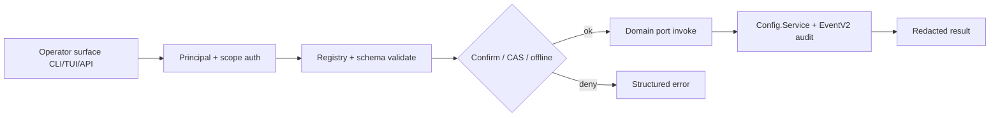
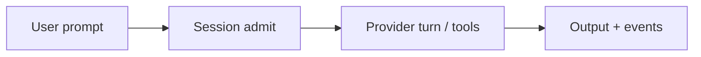

# OpenCode — Product Overview

Functional documentation for OpenCode from the user's point of view: what the
product does, who uses it, how the main flows run, and how we know it works.
Keep this in sync with feature specifications under `doc/arch/sdd/*/spec.md`.

## Overview

OpenCode is a local-first AI coding agent platform: sessions, tools, providers,
and project-scoped configuration run under native surfaces (TUI, CLI, and
internal APIs). **Setup and management are native-only** via the Feature 007
Operator Control Plane — not via LLM tools, MCP admin tools, plugins, or free-form
prompt commands. Domain features own runtime business logic; the operator plane
owns typed command/query dispatch, principals, scopes, CAS, secrets, and audit.

## Actors

- **Operator (local single-user, Phase 1)** — installs, configures, and manages
  OpenCode through Settings, palette, native slash (`/op.*`), CLI (`opencode op …`),
  and loopback HTTP/SDK. Principal kinds: `operator`, `system`, optional
  `manager-view` (read-only).
- **End user / agent session** — runs prompts and tools inside the execution
  envelope with read-only effective policy; cannot mutate admin config.
- **Domain services** — Smart routing, tasks/jobs, LangLock, OutputSpool, semantic
  retrieval, MCP client (Features 001–006, 008) register ports into the control plane.
- **External systems** — LLM providers, OTLP collectors, MCP servers, embedding
  endpoints — reached only under offline/SSRF policy and secret refs.

Multi-user directory, vault backends, and public remote operator API are **Phase 2**
(T092), not Phase 1 product claims.

## Main Flow

Primary management flow (Phase 1):

Primary runtime flow (data plane, not admin):

Admin slash is intercepted **before** prompt admission (zero tokens by default).

## Acceptance

Acceptance criteria live as prioritized scenarios in each feature `spec.md`.

- Management behaviors: Feature 007
  ([spec](../sdd/007-add-a-unified-native-operator-control-plane-for-all-opencode/spec.md),
  [reserved catalog](../sdd/007-add-a-unified-native-operator-control-plane-for-all-opencode/reserved-catalog-v1.md)).
- Domain behaviors: Features 001–006, 008 specs.
- A change to Main Flow management steps starts in Feature 007 artifacts, not ad-hoc code.
- Run `speckit validate` before completion; App/Desktop parity is Phase 2 (T090–T091).

## Observability

- **Metrics / traces** — operator dispatch labels are content-free (command_id,
  domain, surface, scope_kind, outcome, error_code, duration_ms, retry).
- **Logs** — structured, secret-free; audit detail in EventV2 (90 days).
- **Conventions** — `doc/arch/observability/observability.md`.
- **Smart routing lifecycle** — the routing decision state machine is modeled in
  [routing-decision statechart](../statecharts/routing-decision.md) (classify →
  hard gates → rank → persist → dispatch → validate → fallback).
- **Task process lifecycle** — the ten-state Process Table state machine is modeled
  in [task-lifecycle statechart](../statecharts/task-lifecycle.md) (created →
  queued → waiting/running → cancelling/completed/failed/zombie/unknown).
- **Scheduled job occurrence lifecycle** — the occurrence claim state machine is
  modeled in [job-occurrence statechart](../statecharts/job-occurrence.md) (due →
  claimed → admitted → executing → terminal, with misfire/overlap/reconciliation
  branches).
- **Lang Lock advisory validation lifecycle** — the post-write advisory
  validation state machine is modeled in
  [langlock-advisory statechart](../statecharts/langlock-advisory.md) (written →
  classified → detected → compliant/advisory_flagged/unknown, with
  acknowledge/suppress remediation branches; never a gate on the write).
- **OutputGroup channel lifecycle and settlement** — the content-plane
  channel state machine and its settlement seam to Feature 002 are modeled in
  [output-group statechart](../statecharts/output-group.md) (open → sealing →
  sealed/aborted/corrupt/expired/unknown, with committed-length crash
  reconciliation and the running → settling → terminal settlement flow).
- **Semantic model binding and index generation lifecycle** — the blue/green
  embedding/reranker binding cutover, the paired index-generation lifecycle,
  and the degradation-ladder overlay are modeled in
  [semantic-binding statechart](../statecharts/semantic-binding.md)
  (draft → staged → active → degraded/unavailable, with cutover-under-CAS
  activation, rollback, and the full_semantic ↔ catalog_lexical ↔
  fail_closed degradation ladder; never a silent model substitution).
- **MCP connection and resource subscription lifecycle** — the connection
  negotiate/record state machine with reconnect/backoff/resume and the
  paired resource-subscription machine are modeled in
  [mcp-connection statechart](../statecharts/mcp-connection.md)
  (configured → connecting → negotiating → recording → connected, with
  reconnecting/backoff/resume, the mcp_unavailable typed gap, and
  unsubscribed → subscribing → subscribed → unsubscribing, fail-closed on
  an unauthorized or capability-lost subscribe).

## Phase 2 deferred (explicit)

| Item                                  | Task | Why deferred from Phase 1                                 |
| ------------------------------------- | ---- | --------------------------------------------------------- |
| App Settings parity                   | T090 | Phase 1 delivers core + TUI + CLI + loopback API/SDK only |
| Desktop Settings parity               | T091 | Depends on App surface delivery                           |
| Multi-user / vault / non-loopback API | T092 | Requires new ADR; V1 is local single-user loopback        |
