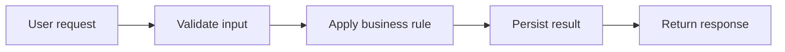

# opencode — Product Overview

Functional documentation for opencode, written from the user's point of
view: what the product does, who uses it, how the main flow runs, and how we
know it works. Keep this in sync with feature specifications under
`doc/arch/sdd/*/spec.md` (acceptance scenarios and requirements).

## Overview

opencode exists to <state the product's purpose in one sentence —
replace this placeholder>. Describe the problem it solves and the outcome a
user can expect. Keep this section high level; the details belong in the
per-feature specs.

## Actors

The people and systems that interact with opencode:

- **End user** — the primary human who uses the product to accomplish a goal.
- **Operator** — installs, configures, and runs the deployment.
- **External system** — any upstream or downstream service the product
  integrates with.

Replace these placeholders with the real actors for opencode.

## Main Flow

The primary end-to-end flow through opencode:

Replace the placeholder steps above with the product's real main flow.

## Acceptance

Acceptance criteria for opencode are expressed as prioritized acceptance
scenarios inside each feature specification under `doc/arch/sdd/*/spec.md`.

- Every user-visible behavior has matching acceptance scenarios in the owning
  feature `spec.md`.
- A change to the Main Flow above starts with a change to those specs, not to
  the code.
- Run `speckit validate` and feature scoring before implementation; executable
  Gherkin corpora may be reintroduced later by explicit feature decision.

## Observability

How we see opencode working in production:

- **Metrics** — user-visible health signals (request rate, error rate,
  latency) exported via OTLP.
- **Logs** — structured log events for the Main Flow's decisions, carrying
  trace context.
- **Tracing** — one trace per user request through the Main Flow, with
  request-scoped identifiers carried as span attributes.

Keep metric label sets bounded; the full conventions live in
`doc/arch/observability/observability.md`.
