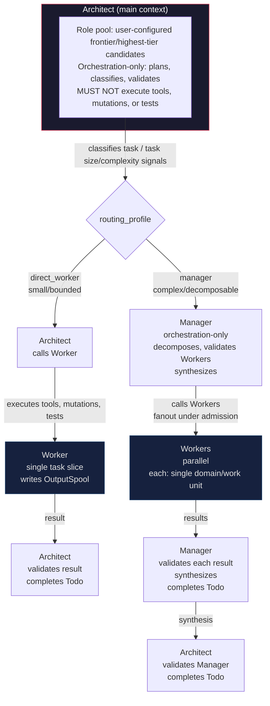
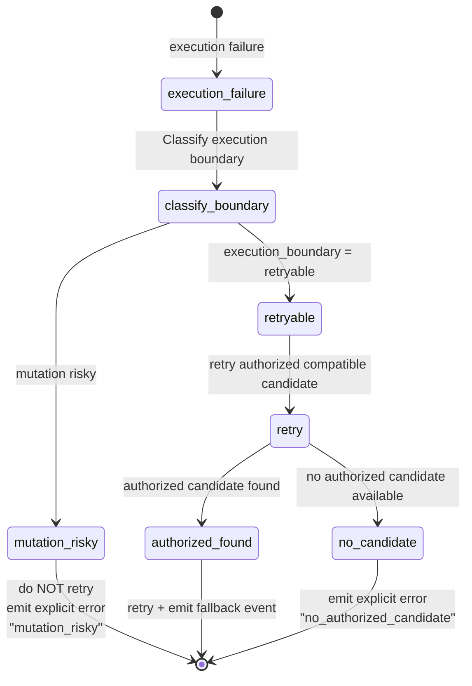

# Hierarchy Flow Diagrams: Smart Agent Routing (Feature 001)

Feature: [001 Smart Agent Routing and Telemetry Foundation](spec.md)

These diagrams describe the confirmed hierarchical adaptive routing model
(ADR-0002). They are architectural reference, not implementation detail.
Diagrams use Mermaid syntax as required by the repository convention.

---

## Hierarchy Roles and Depth



**Maximum depth: Architect → Manager → Worker (initial depth = 2)**
**Manager MUST NOT create Manager. Worker MUST NOT create Worker.**

---

## Routing Decision Pipeline

```mermaid
flowchart TD
    input[task_input] --> classifier[Classifier<br/>Architect role<br/>deterministic hard gates + structured evaluation signals:<br/>- domain count<br/>- independent units<br/>- mutation/risk<br/>- ambiguity<br/>- context size<br/>- expected tools<br/>- parallelism<br/>- security/migration<br/><br/>→ task_class<br/>→ routing_profile direct_worker | manager]
    classifier --> hard_gates[Hard Gates<br/>capability resolver<br/><br/>Per candidate × per dimension:<br/>- tool_call_present<br/>- max_calls_per_turn<br/>- same_turn_multi_call<br/>- serial_runner_exec<br/>- parallel_calls<br/>- continuation<br/>- multi_turn_cycles<br/><br/>→ authorized set<br/>→ rejection reasons]
    hard_gates --> decision_model[Decision Model<br/>if bypass not met<br/><br/>candidate pool = authorized set<br/>deterministic select from healthy pool<br/>no recursion]
    decision_model --> ranking[Ranking<br/><br/>deterministic scoring + tie-break<br/>two-stage:<br/>1. specialist agent<br/>2. executor model<br/>+ skills + efforts]
    ranking --> persist[Persist Decision<br/><br/>atomic commit<br/>id + version + catalog/policy versions<br/>immutable record]
    persist --> dispatch[Dispatch<br/><br/>routing_profile = direct_worker:<br/>Architect → Worker → Architect validate<br/><br/>routing_profile = manager:<br/>Architect → Manager → Workers<br/>→ Manager validate → Architect validate]
    dispatch --> outcome[outcome]
    outcome -->|success| complete[task.complete span]
    outcome -->|failure| fallback[fallback span]
```

---

## Fallback State Machine



---

## Context, Turn and Delegation Budget Flow

```mermaid
flowchart TB
    envelope[dispatch envelope<br/>max_turns<br/>max_context_tokens / max_context_bytes<br/>max_output_tokens / max_output_bytes<br/>max_workers fanout cap<br/>max_delegation_depth = 2<br/>retrieval_top_k / rerank_top_k<br/>max_skill_chunks / max_skill_tokens<br/>time_budget_ms / cost_budget_usd / token_budget<br/>retry_depth / validation_depth<br/>escalation_threshold]

    envelope --> per_turn[per turn<br/>increment turns_used<br/>track context_tokens / output_tokens]

    per_turn --> fanout[Manager fanout request<br/>→ admission controller<br/>grants: min(requested, max_workers, cost_budget, token_budget)]

    fanout --> budget_check{budget exceeded?}

    budget_check -->|yes| emit[emit: blocked | escalation | error<br/>do NOT silently truncate]
    budget_check -->|no| continue[continue]
    emit --> [*]

    per_turn --> validation[validation chain per level<br/>Worker result → Manager validate<br/>Manager synthesis → Architect validate<br/>low confidence/failure → escalate<br/>success → complete Architect Todo]
    continue --> validation
    validation --> [*]
```

---

## Telemetry Correlation Path

```mermaid
flowchart LR
    session[(session<br/>session_id in trace context<br/>not metric label)]
    turn[(turn<br/>turn_id in trace context<br/>not metric label)]

    session --> turn
    turn --> routing_eval[routing.evaluate span<br/>hard_gates span<br/>decision_model span if called<br/>rank span]

    routing_eval --> routing_event[routing.decision event EventV2<br/>decision_id, task_class, routing_profile<br/>hierarchy_role, budget_consumed]

    routing_event --> task_exec[task.execute span]

    task_exec --> llm[llm.request span<br/>input tokens, output tokens, TTFT<br/>tokens/s, cost, duration<br/>provider, model, variant, agent, skills<br/>all bounded cardinality]
    task_exec --> tool[tool.execute span per tool<br/>tool name, success/failure, duration<br/>no tool payload in metric labels]
    task_exec --> fb[fallback span if triggered]
    task_exec --> complete[task.complete span<br/>result: success | failure | blocked<br/>budget_exceeded | escalation]

    llm --> export[Export path async bounded<br/>local metrics store hot path<br/>OTLP export queue bounded capacity<br/>drop_policy if full<br/>batch_size export_timeout retry_budget<br/>queue_depth queue_capacity drop_reason metrics<br/>OTLP exporter async non-blocking<br/>metrics logs traces optional profiling]
```

---

## Todo Lifecycle (per Session)

```mermaid
flowchart TB
    create[goal-bearing Session created] --> init[Todo aggregate initialized<br/>exactly one per Session]
    init --> snapshot[non-empty snapshot required before dispatch<br/>at least one bounded item for simple tasks<br/>empty list cannot bypass gate]
    snapshot --> in_progress[exactly one item in_progress<br/>while work remains]
    in_progress --> dispatch[dispatch envelope<br/>TodoRef opaque reference<br/>TodoVersion CAS<br/>bounded authorized summary item count status summary<br/>NOT the full Todo content]

    dispatch --> gate{completion gate}

    gate -->|required items all completed?| gate_items[proceed]
    gate -->|not all completed| blocked[todo.completion_blocked<br/>Session/Task cannot terminate as completed]
    gate -->|version matches?| gate_version[proceed]
    gate -->|version mismatch| blocked
    gate -->|validation step present?| gate_valid[proceed]
    gate -->|validation missing| blocked

    gate_items --> [*]
    gate_version --> [*]
    gate_valid --> [*]
    blocked --> [*]

    gate_items -->|no| gate_items_no[blocked]
    gate_items_no --> [*]
```

**Worker completes → Worker Todo completed**
**Manager validates Workers + synthesizes → Manager Todo completed**
**Architect validates Manager/direct Worker → Architect Todo completed**

**parent NEVER completes child Todo**
**child completion NEVER auto-completes parent Todo**

---

## Open Parameters

These thresholds and weights are open clarification parameters that refine
the confirmed hierarchy decisions; they do not reopen them:

- **Classifier thresholds:** numeric values for domain count, independent work
  units, mutation/risk score, ambiguity, context size, expected tools,
  parallelism, security/migration/external effects that distinguish
  `direct_worker` from `manager` path.
- **Fanout defaults:** numeric defaults for `max_workers` per role/scope/task class.
- **Escalation thresholds:** evidence + numeric thresholds that force
  reclassification from direct Worker to Manager path.
- **Validation criteria:** acceptance criteria and confidence floors for
  Worker/Manager/Architect validation steps.
- **Budget defaults:** numeric defaults per scope/profile/role for all
  `BudgetPolicy` fields.
