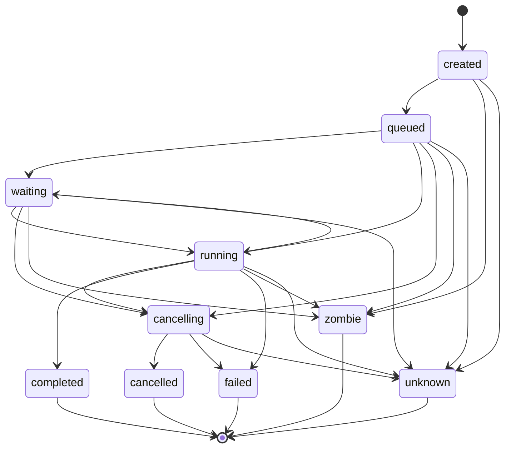

# Implementation Plan: Event-Driven Asynchronous Task Lifecycle Engine (Feature 002)

Feature: 002-build-an-event-driven-asynchronous-task-lifecycle-engine
Status target: planned (after this plan is complete)
Spec: [spec.md](spec.md) (status: clarified; 67 FRs and 26 clarification decisions C1–C26)
Research: [research.md](research.md)
Future ADR (required before implement): **Task Process Lifecycle and Operational Observation** (not created here)
Dependencies: [Feature 001 Smart Agent Routing and Telemetry](../001-define-one-cohesive-smart-agent-routing-and-opentelemetry/spec.md),
[ADR-0001 Telemetry Foundation](../../adr/0001-opentelemetry-telemetry-foundation.md) (proposed),
[ADR-0002 Core Smart Agent Routing](../../adr/0002-core-smart-agent-routing.md) (proposed),
[ADR-0003 Operator Control Plane](../../adr/0003-operator-control-plane-and-native-command-authority.md) (accepted, sole management authority),
[Feature 005 OutputSpool/ArtifactStore](../005-add-a-canonical-file-backed-outputspool-and-paged/spec.md) (content-plane settlement),
[Feature 007 Operator Control Plane](../007-add-a-unified-native-operator-control-plane-for-all-opencode/spec.md) (process/task command IDs).

---

## Overview

Feature 002 delivers one lifecycle-observation capability across five phases. Canonical
Task executors publish typed lifecycle events; a per-session Process Table projects
those events for operators, local Smart-Routing evidence, and OpenTelemetry. The
Process Table is read-only projection state — never an executor, scheduler, permission
authority, or second lifecycle.

The engine is a bounded projection and adaptation layer over the single EventV2
authority (C2). Every lifecycle event registers through `EventV2.define` in a
Feature-002-owned `packages/schema/src/lifecycle/*` module and publishes through the
existing `EventV2Bridge`, mirroring the Feature 001 routing-events pattern already wired
in `packages/opencode/src/event-v2-bridge.ts`. The Process Table subscribes through
`EventV2.Service`; it publishes nothing back (FR18).

- **Phase 1 — Schema and protocol foundation.** Lifecycle event envelopes, the 26-member
  event vocabulary, the Process Table row schema, live-usage provenance, and the typed
  observation API payloads. Additive schema/protocol modules; no runtime behavior change.
- **Phase 2 — Domain engine.** The ten-state Process Table machine (C7), the idempotent
  projection over EventV2 (C2, C6, C9), the per-scope token-bucket admission controller
  (C11), the shared bucketed watchdog and lease sweeper (C12), and versioned
  reconciliation with durable Sessions (C13).
- **Phase 3 — Application and adapters.** Effect Stream/PubSub observation streams with
  authorization and redaction before delivery (C14), the durable/live EventV2 adapter
  (C3, C4), Feature 007 `process.*`/`task.*` command implementations (C19), the
  single-owner handoff aggregate (C16), and the native root-tree cancel path (C17).
- **Phase 4 — Surfaces.** CLI `process`/`task` commands and the TUI direct-child process
  panel with hierarchy roles, validation status, live usage, and breadcrumb navigation
  (C22, FR58a).
- **Phase 5 — Tests.** Unit, integration, and end-to-end coverage of every acceptance
  scenario through the Feature 007 sandbox harness.

Management authority for every operator surface is Feature 007 (ADR-0003, accepted).
Feature 002 supplies typed domain query/command implementations and audit events only;
it never registers a parallel command registry (C19).

---

## Non-goals

- Implementing code during the plan phase.
- Introducing a second executor, runtime, SessionRunner, EventV2 system, lifecycle loop,
  or an RxJS Observable added solely for this feature (FR6, FR19, AC22).
- Treating the Process Table as a store of record, an event source, a scheduler, an
  admission authority, or a Todo editor (FR4, FR18, C11, C6).
- Owning the eight Feature 001 EventV2 definitions (`routing.decision`,
  `routing.fallback`, `hierarchy.dispatch`, `hierarchy.validation`,
  `hierarchy.escalation`, `capability.mismatch`, `todo.initialized`,
  `todo.completion_blocked`); Feature 002 consumes them read-only (C1).
- Owning Smart Routing classification, role-pool configuration, or validation acceptance
  criteria (Feature 001 / ADR-0002); Feature 002 projects hierarchy role, fanout, and
  validation state for observation only.
- Owning the Feature 005 content-plane seal/abort/settlement contract; Feature 002 owns
  lifecycle terminal status and projects bounded OutputRefs only (C20).
- Claiming `process_id` is an OS PID, promising remote kill, mutation rollback, exactly-once
  delivery, or global ordering (FR7, FR24, C17).
- Per-Task watchdog timers, an unbounded universal PubSub, or slow listeners in producer
  hot paths (C10, C12).
- Automatic retry or re-execution of effects after zombie/crash (FR40, C13).
- Distributed leases, fencing, placement, or a global scheduler (out of scope until a
  future distributed ADR).
- Fixing numeric admission ceilings, queue capacities, retention windows, watchdog
  cadence, coalescing intervals, or escalation timeouts — these resolve as provisional
  plan constants with named acceptance hooks and are finalized in the tasks phase (C10,
  C11, C12, C22).

---

## Technical Approach

### Architecture layers

```
Adapters (inbound)
  CLI opencode process|task ...        (Feature 007 thin adapters)
  TUI direct-child process panel + breadcrumb navigation
  Operator palette / native slash / App
        |
        v
Application (Feature 002 — packages/opencode/src/lifecycle/**)
  ObservationService     — observeSession | observeProcess | observeTree | observeGlobal
  Authorization          — visibility filter + redaction BEFORE delivery
  EventV2Adapter         — durable/live class mapping, one Definition per event
  HandoffPublisher       — single-owner handoff aggregate event
  RootCancelService      — native Ctrl+C root-tree cancel propagation
  Operator commands      — process.*/task.* typed domain impls (via Feature 007)
        |
        v
Domain (Feature 002 core — packages/core/src/lifecycle/**, zero framework deps)
  ProcessTable           — in-memory per-root/session projection, rebuilt via replay
  StateMachine           — the ten permitted Process states + transitions (C7)
  Projection             — idempotent projector keyed on id + (aggregateID, seq)
  AdmissionController     — per-scope token-bucket over measured capacity
  Capacity               — CPU/mem/provider/SQLite/event-queue/OTEL signals
  Watchdog               — single shared bucketed sweeper + in-memory lease
  Reconciliation         — versioned reconcile with durable Sessions
  LifecycleInstruments   — lifecycle spans/metrics extending Feature 001
        |
        v
Reused canonical points (existing — NOT re-implemented)
  EventV2 + EventV2Bridge   — single event authority + publish boundary
  SessionRunCoordinator     — per-key serialization, wake, interrupt (root cancel owner)
  SessionRunner / SessionExecution — execution
  BackgroundJob / TaskTool  — V1 process-local execution, V2 child sessions
  Permission / Policy       — authorization and redaction authority
  Feature 001 TelemetryInstruments + OTLP exporter — bounded async export
  Feature 001 routing/hierarchy events — consumed read-only for projection
```

Dependency rule: adapters → application → domain. Domain MUST NOT import TUI/CLI/HTTP
frameworks. The composition root wires concrete adapters. The projection and every
observer are forbidden from calling admission or execution APIs, mutating rows outside
event application, or acting as a scheduler (C11).

### Packages and modules (reuse first, no parallel authority)

| Concern | Existing location (reuse) | Feature 002 addition |
| ------- | ------------------------- | -------------------- |
| Event authority | `packages/schema/src/event.ts` (`EventV2.define`), `packages/core/src/event.ts` (`Service`, `readAggregate`, `allBounded`, `PublishOptions.commit`, `pruneDurable`) | Lifecycle `Definition`s registered through `EventV2.define`; no new bus |
| Publish boundary | `packages/opencode/src/event-v2-bridge.ts` (`publishRoutingEvent`, location attach) | `publishLifecycleEvent` on the same bridge (C1, C2) |
| Durable manifest | `packages/schema/src/durable-event-manifest.ts` (`Event.durable([...])`) | Lifecycle durable definitions joined into the `Durable` inventory (C5) |
| Executor / coordinator | `packages/core/src/session/run-coordinator.ts` (`active`/`run`/`wake`/`interrupt`) | Root-cancel via `interrupt`; sequence/attempt/generation ownership (C8, C17) |
| Task V1 / V2 | `packages/opencode/src/tool/task.ts`, `packages/core/src/background-job.ts`, `packages/core/src/session.ts` | Publish lifecycle events at existing seams; no independent TaskV2 (FR8) |
| Telemetry | `packages/core/src/observability/telemetry-instruments.ts`, `otlp.ts` (Feature 001) | New lifecycle spans/metrics reusing bounded-cardinality helpers (C18) |
| Routing evidence | Feature 001 local metrics store | Local validated lifecycle evidence with window/confidence/TTL (C18) |
| Permission | `packages/core/src/permission.ts`, `packages/opencode/src/permission/` | Visibility filter + redaction before subscription delivery (C14) |
| Operator registry | `packages/core/src/operator/**`, `packages/opencode/src/operator/**` (Feature 007) | Register `process.*`/`task.*` via Feature 007 ports (C19) |
| Todo | Feature 001 resolved Todo model | Lifecycle `todo.*` events, Process Table observation of ref/version/counts (C23–C25) |
| Schema / Protocol | `packages/schema`, `packages/protocol` | Lifecycle schema (novo), observation + command payloads (novo) |
| TUI | `packages/tui/src/routes/session/subagent-footer.tsx`, `dialog-subagent.tsx` | Direct-child process panel, breadcrumb, redacted activity (C22, FR58a) |
| CLI | `packages/cli`, `packages/opencode/src/cli` | `opencode process|task ...` commands via Feature 007 (C19) |

**New module tree target:**

```
packages/schema/src/lifecycle/                # novo — schema authority for the bus
  ids.ts             # TaskId, ProcessId, ParentProcessId, RootProcessId, RuntimeInstanceId, LeaseId, Sequence
  enums.ts           # ProcessState (10), CancelOutcome, TerminalReason, UsageProvenance, UsageSource, ActivityKind
  envelope.ts        # LifecycleEnvelope common fields (FR9)
  events.ts          # 26-member closed tagged union, one Struct per event (FR20)
  process-row.ts     # ProcessRow projection schema (FR26)
  usage.ts           # LiveUsage: provenance + source + monotonic elapsed (C21)
  observation.ts     # observeSession/Process/Tree/Global filter + result payloads (FR14)
  todo-events.ts     # todo.updated|completed|failed|cancelled|stale|rehydrated|handoff_attached (FR58m)
  index.ts           # barrel
packages/protocol/src/lifecycle/              # novo — typed transport contracts
  ports.ts           # ObservationPort, ProcessQueryPort
  commands.ts        # process.*/task.* command + query payloads (C19)
  index.ts
packages/core/src/lifecycle/                  # novo — framework-free domain engine
  event-bus.ts       # EventV2.define'd Definitions + publish adapter (C2, C3)
  projection.ts      # idempotent projector keyed on id + (aggregateID, seq) (C9)
  process-table.ts   # in-memory per-root/session projection rebuilt via replay (C6)
  state-machine.ts   # ten-state transition table (C7)
  admission/
    admission-controller.ts  # per-scope token-bucket, requested-vs-granted fanout (C11)
    token-bucket.ts
    capacity.ts              # measured CPU/mem/provider/SQLite/queue signals (FR2)
  watchdog.ts        # single shared bucketed sweeper + in-memory lease (C12)
  reconciliation.ts  # versioned reconcile with durable Sessions (C13)
  lifecycle-instruments.ts   # lifecycle spans/metrics extending Feature 001 (C18)
  index.ts
packages/opencode/src/lifecycle/              # novo — application + adapters
  observation-service.ts     # Effect Stream/PubSub observation, scoped finalizers (C14)
  authorization.ts           # Permission/Policy visibility + redaction before delivery (C14)
  eventv2-adapter.ts         # durable/live mapping per C4
  handoff.ts                 # single-owner handoff aggregate publish (C16)
  cancel.ts                  # root-tree Ctrl+C native cancel path (C17)
  index.ts
packages/opencode/src/event-v2-bridge.ts      # existing — extend: publishLifecycleEvent (C1, C2)
packages/opencode/src/operator/lifecycle/     # novo — Feature 007 process.*/task.* domain impls (C19)
packages/schema/src/durable-event-manifest.ts # existing — extend Durable inventory (C5)
packages/tui/src/routes/session/process-panel/ # novo — direct-child cards + breadcrumb (C22, FR58a)
packages/cli/src/**/process/**                 # novo — opencode process ... commands
packages/cli/src/**/task/**                    # novo — opencode task ... commands
```

CUE data-model companions mirror the schema modules under
`doc/arch/schemas/lifecycle/*.cue` (envelope, events, process-row, enums, ids, usage,
observation), following the Feature 001 `doc/arch/schemas/routing/*.cue` calisthenics
style: every entity field is a `#ValueObject` reference, each file carries a
`// DDD role:` header, and each definition file stays under the ten-definition warning
bound.

---

## Incremental slices

| Slice | Name | Delivers | Phase | Depends |
| ----- | ---- | -------- | ----- | ------- |
| S0 | Lifecycle identifiers + enums | `ids.ts`, `enums.ts`: `task_id`/`process_id`/parent/root/runtime-instance/lease VOs, ten-state enum, cancel-outcome, provenance/source, activity, terminal-reason | 1 | — |
| S1 | Event envelope | `envelope.ts`: typed event id, type, schema version, root/session/parent-session identity, task/process/parent-process/root-process identity, agent/actor kind, sequence, correlation/causation, visibility, timestamp, attempt/generation, redacted metadata, hierarchy role/depth/path/validation when active (FR9) | 1 | S0 |
| S2 | Event vocabulary | `events.ts`: 26-member closed tagged union, one Struct per event, distinct `extend`/`promote`/`steer`/`handoff` semantics (FR20, FR21) | 1 | S1 |
| S3 | Process Table row + usage | `process-row.ts` (FR26), `usage.ts` provenance/source/monotonic (C21) | 1 | S1 |
| S4 | Observation payloads | `observation.ts` filter/result payloads; `protocol/lifecycle/ports.ts` (FR14) | 1 | S2, S3 |
| S5 | EventV2 lifecycle bus | `core/lifecycle/event-bus.ts` `EventV2.define` Definitions; `publishLifecycleEvent` on the bridge; durable/live split per C4 (C2, C3, C4) | 2 | S2 |
| S6 | Idempotent projection | `projection.ts` keyed on id + (aggregateID, seq); duplicate/out-of-order/unknown anomalies observable; no invented terminal state (FR23, FR29, C9) | 2 | S5 |
| S7 | State machine + Process Table | `state-machine.ts` ten states/transitions (C7); `process-table.ts` per-root/session projection rebuilt by replaying the durable aggregate; bounded retention via `pruneDurable` (C6, C7) | 2 | S6 |
| S8 | Admission + token-bucket | `admission/**` per-scope token-bucket over global/root/session/child/provider/agent/tool/event-queue/OTEL/SQLite/token/cost budgets; requested-vs-granted fanout projected; hard ceilings; no unbounded queue (C11) | 2 | S7 |
| S9 | Watchdog + lease + reconciliation | `watchdog.ts` single shared bucketed sweeper, in-memory lease, `owner_lost`/`zombie_detected`/`unknown` without claiming provider stop; `reconciliation.ts` versioned reconcile, no auto-retry (C12, C13) | 2 | S7 |
| S10 | Observation streams | `observation-service.ts` Effect Stream/PubSub with scoped finalizers; `authorization.ts` visibility + redaction before delivery; sibling/cross-project leakage rejected (C14) | 3 | S7 |
| S11 | Handoff + cancel | `handoff.ts` single-owner durable handoff event to both projections; `cancel.ts` native root-tree Ctrl+C via `SessionRunCoordinator.interrupt`, descendant admission fencing (C16, C17) | 3 | S8, S10 |
| S12 | Terminal↔settlement seam | `settling`/`unknown`/`corrupt` lifecycle sub-states; terminal-not-settled until Feature 005 reports settlement; bounded OutputRef projection only (C20) | 3 | S7 |
| S13 | Operator commands | `operator/lifecycle/**` typed `process.*`/`task.*` domain impls + audit events registered via Feature 007; reserved IDs never registered by plugin/MCP/custom registries (C19) | 3 | S10, S11 |
| S14 | Lifecycle telemetry | `lifecycle-instruments.ts` lifecycle spans correlated with `task.execute`/`session.execution`/`llm.request`/`tool.execute`/`fallback`; active/started/completed/failed/cancelled/zombie counts, queue wait, TTFT, tokens/s, saturation; bounded labels; local evidence window/confidence/TTL for Smart Routing (C18) | 2–3 | S6, S8 |
| S15 | Todo lifecycle events | `todo-events.ts`; Process Table observes `todo_ref`/version/counts/consistency/outcome without mutation; completion-gate `todo.completion_blocked` consumed read-only from Feature 001; sibling isolation (C23–C25) | 2–3 | S6 |
| S16 | CLI + TUI surfaces | `cli/**/process/**`, `cli/**/task/**`; `tui/**/process-panel/**` direct-child cards, hierarchy role, validation status, redacted activity, live usage, breadcrumb, Esc/Ctrl+C semantics, screen-reader text (C22, FR58a) | 4 | S13 |
| S17 | Tests + validation | Unit (domain pure logic), integration (projection/admission/watchdog against sandbox stores), e2e (Feature 007 sandbox); content-free OTEL labels; cardinality audit (all acceptance scenarios) | 5 | all |

---

## Data model and persistence strategy

Entity definitions are finalized in the `data-model.md` companion and the
`doc/arch/schemas/lifecycle/*.cue` schemas. Persistence is deliberately minimal: the
Process Table is an in-memory projection, and durability is delegated to EventV2.

### Lifecycle event envelope (FR9)

Common fields carried by every event, all bounded and redacted (FR13):

```
event_id            # EventV2 evt_ id (assigned by EventV2, C8)
event_type          # one of the 26 vocabulary members
schema_version      # EventV2 durable.version for durable classes (C4)
root_session_id     # authorized root tree identity
session_id
parent_session_id
task_id             # logical Task
process_id          # observable attempt/execution — never an OS PID (FR7, C8)
parent_process_id
root_process_id
agent_kind          # architect | manager | worker | subagent | primary
actor_kind          # runtime | operator | executor
runtime_instance_id
sequence            # per-aggregate ordering; no global order (FR10, C8)
correlation_id
causation_id
visibility          # session | tree | global-privileged
timestamp
attempt
generation
metadata            # redacted; no prompts, results, tool payloads, paths, secrets
# When Smart hierarchical routing is active (reused verbatim from Feature 001, C15):
hierarchy_role      # architect | manager | worker
delegation_depth
delegation_path
fanout_requested
fanout_granted
validation_outcome  # passed | failed | low_confidence | escalated
decision_id         # from routing.decision
turn_id
```

### Durable versus live event classes (C4)

Durable events carry the EventV2 `durable {version, aggregate}` annotation and replay
through `readAggregate`: `admitted`, `parent_attached`, `process_created`, `started`,
`handoff`, `completed`, `failed`, `cancelled`, `zombie_detected`, `reconciled`,
`owner_lost`. Live events omit `durable` (no sequence, no replay): `queued`, `waiting`,
`promoted`, `extended`, `steer_requested`, `steer_accepted`, `steer_rejected`,
`turn_started`, `turn_ended`, `turn_failed`, `tool_called`, `tool_settled`,
`cancel_requested`, `cancelling`, `unknown`. Terminal events are never coalesced or
dropped (FR36, C5); only live progress/heartbeat events are sampling targets.

### Process Table row (FR26)

Each row retains parent/root relations, owner/runtime/scope, status/reason/timestamps,
attempt/generation/lease, agent/task class/profile/effort, provider/model/variant,
dependencies/children/pending inputs/steers, cancellation/exit/error,
token/cost/TTFT/stream/total duration, and trace/span IDs, subject to redaction and
authorization. When Smart hierarchical routing is active, the row additionally retains
hierarchy role, delegation depth/path, selected route path, requested-vs-granted fanout,
and validation state — projected with bounded labels, high-cardinality IDs excluded from
metric labels (FR26, C15). Prompts, complete results, tool payloads, personal paths, and
secrets stay outside rows by default (FR28).

### Persistence and rehydration (C6)

The Process Table is rebuilt on restart by replaying the EventV2 durable aggregate via
`EventV2.readAggregate` and reconciling against durable Sessions; it is never the source
from which events are reconstructed (FR4). New durable rows commit atomically with their
durable event through `EventV2.PublishOptions.commit(seq)`. Process-local `BackgroundJob`
and active-execution state stay process-local; after restart, rows without a live owner
project as `unknown`/`unreconciled` with no automatic effect retry (FR39, FR40, AC13).
Bounded retention prunes terminal rows through `EventV2.pruneDurable` with auditable
counts (FR27, AC15).

### Live usage schema (C21)

Live usage fields carry provenance (`estimated` | `reported`) and source (`provider` |
`runtime` | `local-estimate`). Missing live usage renders as an explicit unavailable
state — never zero, never fabricated. Provider-reported usage reconciles and replaces an
estimate at settlement; unknown token fields are never summed; tokens/s is valid only
from monotonic elapsed time and known token counts (FR55, AC25, AC26).

---

## API and command contracts

### Observation API (C14)

Read-only, over Effect Stream/PubSub with scoped finalizers. Authorization and redaction
run before delivery. An Observable never controls lifecycle state (FR16, FR17).

| Operation | Signature intent | Scope |
| --------- | ---------------- | ----- |
| `observeSession` | Stream of a single Session's lifecycle events | session |
| `observeProcess` | Stream of one process's attempt events | process |
| `observeTree` | Stream of an authorized root tree | root tree |
| `observeGlobal(filter)` | Privileged operational stream with redaction | global-privileged |

### Operator command surface (C19, registered via Feature 007)

Canonical dotted IDs owned by Feature 007 per ADR-0003; Feature 002 supplies typed
domain implementations and audit events only. Native slash intercepted before prompt
admission; zero provider/model calls, tokens, or cost by default; output not added to
Message/Part/context by default. Reserved IDs are never registered by plugin/MCP/custom
registries.

| Palette/slash ID | CLI | Description | Model calls | Cost |
| ---------------- | --- | ----------- | ----------- | ---- |
| `process.status` | `opencode process status <process-id>` | Redacted status, attempt, owner, model, timing, cost | 0 | 0 |
| `process.tree` | `opencode process tree [--root <id>]` | Authorized root/session process tree | 0 | 0 |
| `process.watch` | `opencode process watch <id>` | Live lifecycle stream over the observation API | 0 | 0 |
| `process.cancel` | `opencode process cancel <id>` | Native cancel request; publishes audit + lifecycle events | 0 | 0 |
| `process.steer` | `opencode process steer <id>` | Native steer request through canonical service | 0 | 0 |
| `process.handoff` | `opencode process handoff <src> <tgt>` | Native handoff through the single-owner coordinator | 0 | 0 |
| `task.status` | `opencode task status <task-id>` | Logical Task with its `process_id`/attempt/generation set | 0 | 0 |
| `task.tree` | `opencode task tree` | Task-to-process projection | 0 | 0 |
| `task.watch` | `opencode task watch <id>` | Live Task lifecycle stream | 0 | 0 |
| `task.cancel` | `opencode task cancel <id>` | Native cancel of a logical Task's active process | 0 | 0 |

Cancel, steer, and handoff require operator authorization, use native services, and
publish audit events; no action is performed by editing the Process Table or by an
observer (FR51, Security 4). Cancel outcomes are `requested`, `accepted`, `rejected`,
`unknown`, or `unconfirmed`; no remote kill, reversal, or mutation rollback is promised
(C17).

---

## State machines

### Process lifecycle (C7)

Ten states. `handoff` is an event, never a state. `completed`, `failed`, and `cancelled`
are absorbing except for bounded retention cleanup. Any non-terminal state transitions to
`zombie` or `unknown` on owner loss or reconciliation.



### Admission flow (C11)

```
process_created
  -> capacity.observe(global, root, session, child, provider, agent, tool,
                      event_queue, otel_queue, sqlite, token, cost)
  -> token_bucket.tryAcquire(scope)
     -> granted:   emit admitted -> queued
     -> partial:   emit admitted(fanout_granted < fanout_requested) -> queued
     -> rejected:  emit queued(waiting) or reject -> observable saturation
  -> after root cancel request: fence + quarantine new descendants (reject)
```

### Cancellation flow (C17)

```
first Ctrl+C (execution active in current root)
  -> RootCancelService.request(root_scope)
  -> SessionRunCoordinator.interrupt(root key) over Event Bus + Process Table
  -> descendants (visible + invisible): running/streaming -> cancelling
  -> outcome per node: cancelled | failed | unknown (remote effect may stay unknown)
second Ctrl+C within escalation window
  -> local abort of root scope (no remote-kill promise)
Esc -> dismiss | back | close-modal | navigation (never cancels a root tree)
```

---

## Security and threat boundaries

| Threat | Mitigation |
| ------ | ---------- |
| Observer mutating lifecycle state | Observables are read-only; control passes through native services; Process Table applies events only (FR16–FR18) |
| Cross-sibling / cross-project leakage | Authorization + visibility filter before delivery and projection; sibling leak is a failure (C14, AC3, AC4) |
| LLM/tool/MCP/prompt as lifecycle admin | Management is Feature 007 native operator-only; attempts rejected (FR50, AC18) |
| Secret / prompt / payload leakage | Default redaction from envelopes, rows, metrics, logs, traces; `inputLabel()` renderer-boundary risk allowlisted (FR13, FR28, C21) |
| Absolute path / URL in card activity | Allowlisted enum activity with workspace-relative or redacted paths (FR56, AC28) |
| High-cardinality metric labels | Bounded enums/buckets; IDs only in traces/logs; over-budget maps to `other` (C18, AC17) |
| Root cancel exceeding scope | Cancel uses canonical permission/lifecycle authority; never touches another root/project; no remote-kill claim (C17, Security 10) |
| Zombie/crash auto-retry of effects | No automatic retry or re-execution; unknown/unreconciled state instead (FR40, C13) |
| Parent editing child Todo | Parent observes ref/version/counts + bounded summary only; no child edits (C25, AC43) |
| Terminal event silently dropped | Terminal events durable + priority; never coalesced or dropped (C5, AC8) |
| Reserved operator ID hijack | Plugin/MCP/custom registries never register reserved `process.*`/`task.*` IDs (C19) |

---

## Rollback strategy

| Layer | Rollback |
| ----- | -------- |
| Lifecycle schema/protocol | Additive modules; removal restores prior behavior; no runtime coupling until Phase 2 wiring |
| EventV2 lifecycle Definitions | Definitions are additive to the inventory; unregistering removes projection input without affecting routing events |
| Process Table projection | In-memory; rebuilt from the durable aggregate; discarding it loses no source data (FR4, C6) |
| Admission controller | Token-bucket disabled falls back to existing coordinator behavior; ceilings are configurable |
| Watchdog | Single shared sweeper stopped independently; lease state is in-memory only (C12) |
| Observation streams | Scoped finalizers guarantee leak-free teardown on unsubscribe (C14, AC5) |
| Operator commands | Feature 007 atomic CAS rollback per command; audit retained |
| Terminal↔settlement | `settling`/`unknown`/`corrupt` sub-states preserve committed bytes; Feature 005 owns seal/abort (C20) |
| Root cancel | Cancel is a request, not a mutation; unacknowledged descendants surface as `unknown` |

---

## Isolation harness

Feature 002 operator surfaces and integration/e2e tests reuse the existing Feature 007
isolation harness. Hot-path domain logic (projection, state machine, admission,
watchdog) runs in-process with mock ports and mock EventV2 stores.

| Item | Value |
| ---- | ----- |
| Sandbox root | `.dev/opencode-operator/` (gitignored) |
| Env prefix | `OPENCODE_DEV_OPERATOR_=1`, `OPENCODE_CONFIG_DIR=.dev/opencode-operator/config` |
| Port | 14096 (loopback) |
| Wrapper | `scripts/dev/opencode-operator-sandbox` |
| Forbidden | `~/.config/opencode`, system service register, real OAuth, non-loopback bind |
| Proof tests | Default config paths and prod ports unchanged when the wrapper is unused |

---

## Testing matrix

| Layer | Scope | How |
| ----- | ----- | --- |
| Unit | StateMachine transitions, Projection idempotency, AdmissionController token-bucket, Watchdog sweep, Reconciliation, usage provenance/reconciliation, envelope redaction | Pure tests; deterministic; no I/O |
| Integration | Projection over EventV2 durable aggregate, replay/restart rebuild, admission under saturation, observation authorization + redaction, handoff single-event dual projection | Sandbox stores under `.dev/`; mock exporter |
| Contract | `process.*`/`task.*` IDs vs Feature 007 registry; observation payload schemas vs `protocol/lifecycle/**` | Spec-driven; specScopeGlobs enforced |
| E2E | CLI human + JSON; TUI direct-child panel; Ctrl+C root-tree cancel; Esc isolation; reconnect reconstruction | Feature 007 sandbox wrapper only |
| Telemetry | Lifecycle spans correlated with existing spans; bounded labels; local evidence window/confidence/TTL | Cardinality audit; no IDs as labels |

Acceptance coverage maps every scenario AC1–AC47 (including AC23a–AC23f) to a slice in
the traceability matrix in `spec.md`. Provisional numeric thresholds carry named
acceptance hooks (AC1, AC7, AC8, AC15, AC20, AC21) and are fixed in the tasks phase.

---

## Observability alignment

- Lifecycle spans reuse and correlate with the Feature 001 concept spans
  `task.execute`, `session.execution`, `llm.request`, `tool.execute`, `fallback`, adding
  `admission`, `queue.wait`, `cancel`, `handoff`, and `reconciliation` (C18).
- Metric labels reuse `packages/core/src/observability/telemetry-instruments.ts` bounded
  enums (`status`, `task_class`, `hierarchy_role`, `execution_boundary`) and
  `createCardinalityAllowlist`; over-budget values map to `other`.
- Lifecycle metrics: active/started/completed/failed/cancelled/zombie/unknown counts,
  queue wait, execution duration, TTFT, tokens/s, retry/fallback, queue depth/overflow,
  terminal preservation, subscriber lag, saturation (FR44).
- `task_id`/`session_id`/`process_id` appear only in traces/logs, never metric labels
  (C18, AC17). Prompts, paths, payloads, and secrets are excluded by default.
- OTLP export is asynchronous and bounded through the Feature 001 exporter and never
  blocks the event producer, Task, SessionRunner, or Process Table hot path (FR46).
- Smart Routing consumes local validated lifecycle evidence with window, confidence, and
  TTL from the local metrics store; it never queries a remote backend per Task (FR47,
  C18, AC16).
- Architect/Manager dispatch, validation, and escalation observations stay distinct from
  Worker start/completion events; hierarchy role, delegation path, fanout, and validation
  state project with bounded labels (FR48, C15).
- Todo events export only enums/counts/buckets; Todo content and item/session IDs are
  never metric labels (FR58m, AC47).

---

## Proposed specScopeGlobs (tasks/implement phase)

Narrow, file-exact globs applied to `doc/arch/speckit.toml` in the tasks phase.
Feature 001 and Feature 007 TOML paths are preserved unchanged; existing shared paths
(`packages/opencode/src/event-v2-bridge.ts`, `packages/schema/src/durable-event-manifest.ts`,
`packages/core/src/event.ts`, `packages/core/src/operator/**`,
`packages/opencode/src/operator/**`) already cover the reused seams and are not
duplicated. The plan-phase corpus lives under the always-derived
`doc/arch/sdd/002-.../**` scope and needs no glob addition.

```toml
specScopeGlobs = [
  # Feature 002 — Task Lifecycle Engine (novo implement paths).
  "packages/schema/src/lifecycle/**",
  "packages/protocol/src/lifecycle/**",
  "packages/core/src/lifecycle/**",
  "packages/opencode/src/lifecycle/**",
  "packages/opencode/src/operator/lifecycle/**",
  "packages/cli/src/**/process/**",
  "packages/cli/src/**/task/**",
  "packages/tui/src/routes/session/process-panel/**",
  "packages/schema/test/lifecycle/**",
  "packages/protocol/test/lifecycle/**",
  "packages/core/test/lifecycle/**",
  "packages/opencode/test/lifecycle/**",
  "packages/tui/test/**",
  # Existing shared paths extended (already in scope; listed for traceability):
  # "packages/opencode/src/event-v2-bridge.ts",
  # "packages/schema/src/durable-event-manifest.ts",
]
```

---

## Companion artifacts

| File | Purpose |
| ---- | ------- |
| [research.md](research.md) | Evidence base: EventV2 mechanics, durable manifest, coordinator lifecycle, Feature 001 events/instruments, alternatives considered |
| [spec.md](spec.md) | Feature specification (clarified, C1–C26) |
| `data-model.md` (novo) | Entity definitions: LifecycleEnvelope, ProcessRow, LiveUsage, AdmissionScope, observation payloads |
| `contracts/` (novo) | TypeScript port contracts: ObservationPort, ProcessQueryPort, command payloads, event schemas |
| `hierarchy-flow.md` (novo) | Diagram: lifecycle event flow across executor → EventV2 → Process Table → observers/OTEL |
| `doc/arch/schemas/lifecycle/*.cue` (novo) | CUE data-model mirrors, calisthenics-compliant per the routing exemplar |

---

## Implementation order (task groups preview)

Phase 1 (schema/protocol foundation, additive):

1. Lifecycle identifiers and enums (`ids.ts`, `enums.ts`).
2. Event envelope with hierarchy fields reused from Feature 001 (`envelope.ts`).
3. The 26-member event vocabulary with distinct extend/promote/steer/handoff (`events.ts`).
4. Process Table row and live-usage provenance schemas (`process-row.ts`, `usage.ts`).
5. Observation payloads and protocol ports (`observation.ts`, `protocol/lifecycle/**`).

Phase 2 (domain engine):

6. EventV2 lifecycle Definitions and `publishLifecycleEvent` on the bridge; durable/live split.
7. Idempotent projector keyed on id + (aggregateID, seq); anomaly surfacing.
8. Ten-state machine and per-root/session Process Table rebuilt via replay.
9. Per-scope token-bucket admission with requested-vs-granted fanout.
10. Shared bucketed watchdog, in-memory lease, versioned reconciliation.
11. Lifecycle telemetry spans/metrics reusing Feature 001 instruments.

Phase 3 (application + adapters):

12. Observation streams with authorization and redaction before delivery.
13. Single-owner handoff aggregate and native root-tree cancel path.
14. Terminal↔settlement sub-states with Feature 005.
15. Feature 007 `process.*`/`task.*` domain commands and audit events.
16. Todo lifecycle events and Process Table observation of ref/version/counts.

Phase 4 (surfaces):

17. CLI `process`/`task` commands.
18. TUI direct-child process panel with hierarchy roles, validation status, live usage,
    breadcrumb, and Esc/Ctrl+C semantics.

Phase 5 (tests):

19. Unit, integration, and e2e coverage of AC1–AC47; content-free OTEL labels; cardinality audit.

---

## Feature cross-dependencies

| Feature | Dependency | Interaction |
| ------- | ---------- | ----------- |
| 001 Smart Routing | Reads routing/hierarchy events read-only; reuses telemetry instruments and local evidence | S5, S14, S15 (C1, C15, C18) |
| 003 Scheduled Jobs | Cancelling an occurrence cancels that occurrence/process only, never the Job Definition | S11 (FR63, AC33) |
| 004 Lang Lock | Objective/item/handoff text follows Lang Lock; UI chrome does not | S15, S16 (FR58m) |
| 005 OutputSpool | Owns seal/abort/OutputRef/cursor/committed-byte/settlement; Feature 002 owns terminal status and bounded ref projection | S12 (C20) |
| 006 Milvus Semantic | Index-job lifecycle and budget/wake projection only; lifecycle authority stays Feature 002 | S7, S8 |
| 007 Operator Control Plane | Sole management authority for `process.*`/`task.*` command IDs, auth, audit | S13 (C19) |
| 008 MCP Tools | MCP call/task children, progress UI, standard cancel vs tasks/cancel; lifecycle authority stays Feature 002 | S11, S16 |

---

## Validation checklist (plan complete when)

- [x] EventV2 confirmed as the single event authority; lifecycle events registered
      through `EventV2.define` and published through the existing bridge (C2)
- [x] No second executor, runtime, SessionRunner, EventV2 system, lifecycle loop, or RxJS
      Observable introduced (FR6, FR19, AC22)
- [x] Process Table is a read-only in-memory projection rebuilt via replay; publishes
      nothing back (FR4, FR18, C6)
- [x] Ten-state machine with `handoff` as an event, absorbing terminal states (C7)
- [x] Idempotent projection keyed on id + (aggregateID, seq); no invented terminal state (C9)
- [x] Per-scope token-bucket admission with hard ceilings, requested-vs-granted fanout,
      no unbounded queue; no `maxAgents` without declared ownership (C11)
- [x] Single shared bucketed watchdog; in-memory lease; no per-Task timers; no auto-retry
      after zombie/crash (C12, C13)
- [x] Observation API over Effect Stream/PubSub with authorization + redaction before
      delivery; leak-free finalizers (C14)
- [x] Single-owner handoff aggregate; native root-tree Ctrl+C via coordinator; Esc never
      cancels; no remote-kill promise (C16, C17)
- [x] Feature 007 owns `process.*`/`task.*` command IDs; Feature 002 supplies domain
      impls + audit only; reserved IDs protected (C19)
- [x] Feature 005 owns settlement; Feature 002 owns terminal status; `settling`/`unknown`/
      `corrupt` sub-states (C20)
- [x] Live usage carries provenance/source; missing usage is explicit unavailable, never
      zero; settlement reconciliation deterministic (C21)
- [x] Telemetry reuses Feature 001 exporter and bounded-cardinality instruments; local
      evidence window/confidence/TTL for Smart Routing (C18)
- [x] Bounded queues with explicit overflow/drop/coalescing; terminal events never
      dropped (C5, C10)
- [x] Direct-child-only Session UI; grandchildren never flattened; breadcrumb preserves
      state (C22, FR58a)
- [x] Session-owned Todo lifecycle events observed without mutation; sibling isolation;
      parent observes ref/version/counts only (C23–C25)
- [x] Proposed specScopeGlobs listed for the tasks phase; Feature 001/007 paths preserved
- [x] Companion artifacts listed (`data-model.md`, `contracts/`, `hierarchy-flow.md`,
      `doc/arch/schemas/lifecycle/*.cue`)
- [x] Provisional numeric thresholds carry named acceptance hooks; finalized in tasks phase
