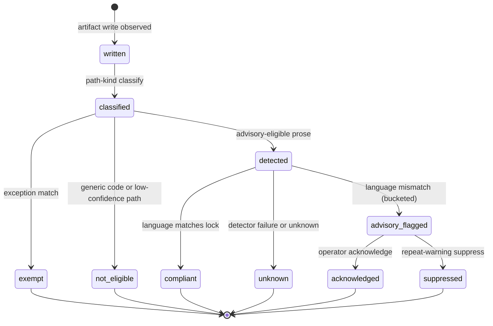
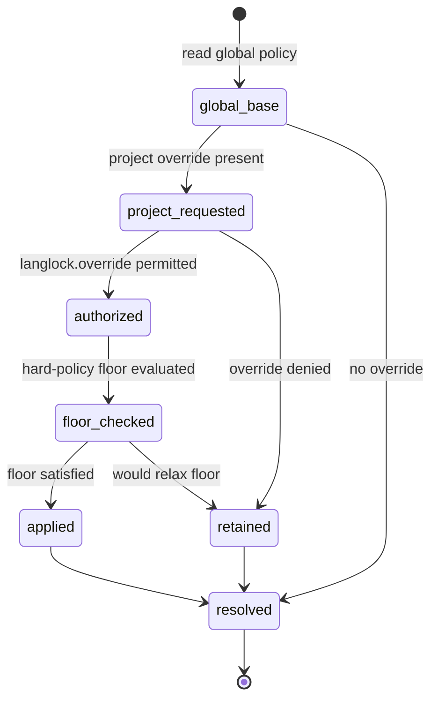

# Implementation Plan: Lang Lock — Configurable Artifact-Language Enforcement (Feature 004)

Feature: 004-add-lang-lock-to-enforce-a-configurable-artifact-language
Status target: planned (after this plan is complete)
Spec: [spec.md](spec.md) (status: planned; FR1–FR35 and clarification decisions C1–C16)
Research: [research.md](research.md)
Required ADR (now created): **[ADR-0005 Lang Lock Artifact-Language Policy and Progressive Enforcement](../../adr/0005-lang-lock-artifact-language-policy-and-progressive-enforcement.md)** (proposed)
Dependencies:
[Feature 001 Smart Agent Routing and Telemetry](../001-define-one-cohesive-smart-agent-routing-and-opentelemetry/spec.md) (hard gates, immutable execution envelope, telemetry cardinality patterns),
[Feature 002 Task Lifecycle Event Bus and Process Table](../002-build-an-event-driven-asynchronous-task-lifecycle-engine/spec.md) (EventV2 projection precedent, session-owned Todo, Task/subagent envelopes),
[Feature 003 Scheduled Jobs and Async Main-Context Notification](../003-add-persistent-bun-native-scheduled-jobs-with-event/spec.md) (scheduled/occurrence policy inheritance),
[Feature 005 OutputSpool/ArtifactStore](../005-add-a-canonical-file-backed-outputspool-and-paged/spec.md) (language tag/provenance on textual channels),
[Feature 007 Operator Control Plane](../007-add-a-unified-native-operator-control-plane-for-all-opencode/spec.md) (Config.Service, Permission/Policy, reserved `langlock.*` catalog),
[ADR-0001 Telemetry Foundation](../../adr/0001-opentelemetry-telemetry-foundation.md) (proposed),
[ADR-0002 Core Smart Agent Routing](../../adr/0002-core-smart-agent-routing.md) (proposed),
[ADR-0003 Operator Control Plane](../../adr/0003-operator-control-plane-and-native-command-authority.md) (accepted, sole management authority),
[ADR-0005 Lang Lock Policy and Progressive Enforcement](../../adr/0005-lang-lock-artifact-language-policy-and-progressive-enforcement.md) (proposed, required decision record).

---

## Overview

Feature 004 enforces a configured artifact language for new or modified
model-authored prose and internal instructions while preserving the
conversational, UI-locale, and product/docs i18n axes. It is enabled by default
as English (United States) (`en-US`) and uses progressive hybrid enforcement in
V1. It adds no second config store, event channel, operator bus, or translation
model call: policy rides the Feature 007 Config.Service authority, the effective
language is injected into V1/V2 system prompts and reapplied after
`experimental.chat.system.transform`, execution envelopes carry the tag/version,
audit and advisory-violation events register through `EventV2.define`, and
management flows through the reserved `langlock.*` catalog IDs owned by
Feature 007. Every decision follows ADR-0005 and the C1–C16 clarify resolutions.

- **Phase 1 — Schema and protocol foundation.** Language identity value objects
  (canonical BCP 47 tag, display name), the allowlist, scope/origin/enforcement
  enums, path-kind and confidence-bucket enums, detector-result and
  exception-category value objects, the policy/effective-config shapes, the
  `langlock.*` audit/advisory event vocabulary (C8), and the typed
  operator/query/detection payloads. Additive schema/protocol modules; no runtime
  behavior change.
- **Phase 2 — Domain policy and detection engine (`packages/core/src/langlock/**`).**
  Tag validation over `Intl.getCanonicalLocales` plus the allowlist, the
  global/project resolution and hard-policy-floor evaluator, the path-kind
  classifier and advisory-eligibility rules, the deterministic advisory detector
  contract, and the exception-manifest matcher. Framework-free, deterministic, no
  I/O in hot logic.
- **Phase 3 — Application and enforcement seams (`packages/opencode/src/langlock/**`).**
  Config.Service policy persistence, the immutable system-prompt injection
  reapplied after `experimental.chat.system.transform` (`request.ts`, `agent.ts`),
  the execution-envelope stamping for Task/subagent/write/edit/apply_patch/
  shell-commit contexts, the advisory post-write validation service, the
  content-free EventV2 audit/advisory projection, and the Feature 007 `langlock.*`
  operator domain port.
- **Phase 4 — Surfaces.** The Settings **Lang Lock** row (Artifact language,
  human/native names), CLI `opencode op langlock <op>` verbs, and the TUI Lang
  Lock panel, all thin adapters over the Feature 007 registry with
  registry-generated names.
- **Phase 5 — Tests.** Unit (pure domain), integration (policy
  resolution/injection/detection against sandbox stores), contract (`langlock.*`
  IDs vs Feature 007 catalog), and e2e through the Feature 007 sandbox harness,
  covering AC1–AC22.

Management authority for every operator surface is Feature 007 (ADR-0003,
accepted). Feature 004 supplies typed domain query/command implementations and
audit events only; it never registers a parallel command registry (C3).

---

## Non-goals

- Implementing code during the plan phase.
- A second config store, event channel, operator command bus, or translation
  authority beside Config.Service / EventV2 / Feature 007 (C2, C3, C8).
- Translating main-chat prose to the artifact language, or translating untouched
  repositories wholesale (Out of Scope, C1, C12).
- Strict language detection/blocking for generic source code in V1 (C5, C14).
- Making Lang Lock a model-controlled tool argument, or promising enforcement
  before generated bytes cross an OpenCode-observable boundary (C4).
- A separate translation-model call made solely to enforce the lock (C6, Out of
  Scope).
- Retrotranslating or whole-file rewriting mixed-language files to satisfy the
  lock (C12).
- Changing UI locale, product i18n, session title/compaction language, or
  conversational language when the artifact language changes (C1, C7).
- Exposing administration to LLMs, tools, MCP, plugins, or custom prompt commands
  (C3, C16).
- Fixing confidence thresholds, path-kind classifier internals, advisory-UX
  details, the mid-flight re-resolution rule, or strict-mode benchmarks —
  provisional plan constants with named acceptance hooks, finalized in the tasks
  phase (C5, C6, C11, C14).

---

## Technical Approach

### Architecture layers

```
Adapters (inbound)
  Settings "Lang Lock" row (Artifact language, human/native names)  (Feature 007)
  CLI  opencode op langlock status|show|set|reset                   (Feature 007 thin adapters)
  TUI  Lang Lock panel (effective policy, scope/origin, advisory history)
  Operator palette / native slash /op.langlock.<op> / App
        |
        v
Application (Feature 004 — packages/opencode/src/langlock/**)
  PolicyPersistence   — Config.Service langlock.* policy/config (global + project)
  InjectionService    — inject effective language into V1/V2 system prompts;
                        REAPPLY after experimental.chat.system.transform
  EnvelopeStamper     — tag/version/source/mode onto Task/subagent/write/edit/
                        apply_patch/shell-commit contexts (never a tool argument)
  AdvisoryValidator   — post-write advisory detection on confidently classified prose
  Audit/Events        — content-free EventV2 audit + advisory-violation projection
  Operator langlock domain — langlock.* typed command/query impls (via Feature 007)
        |
        v
Domain (Feature 004 core — packages/core/src/langlock/**, zero framework deps)
  TagValidation       — Intl.getCanonicalLocales + allowlist; canonical BCP 47
  PolicyResolution    — global base + project override; hard-policy-floor guard
  PathKindClassifier  — prose vs generic-code vs exempt path classification
  AdvisoryDetector    — deterministic language-signal contract; confidence bucket
  ExceptionMatcher    — operator-owned manifest match (i18n/vendor/legal/golden)
  LangLockInstruments — langlock.* spans/metrics extending Feature 001
        |
        v
Reused canonical points (existing — NOT re-implemented)
  Config.Service            — global/project merge + managed override (Feature 007)
  Permission / Policy        — langlock.override authorization (Feature 007)
  Reserved catalog           — langlock.status|show|set|reset (RESERVED_CATALOG_VERSION)
  request.ts / agent.ts      — system-array assembly + experimental.chat.system.transform
  EventV2 + EventV2Bridge     — single event authority + publish boundary
  Feature 002 Task envelope   — Task/subagent prompt + internal-return carrier
  Feature 002 Todo model      — session-owned Todo objective/item/progress/etc.
  Feature 005 OutputRef       — language tag/provenance on textual channels
  Feature 001 TelemetryInstruments + OTLP exporter — bounded async content-free export
```

Dependency rule: adapters -> application -> domain. Domain MUST NOT import
TUI/CLI/HTTP frameworks, EventV2, Config.Service, or the request/transform runtime
directly; it takes an allowlist port, a clock/entropy port, and a detector port
and returns decisions. The application layer owns the immutable injection and the
post-transform reapplication; enforcement metadata is native and is never a
model-controlled tool argument.

### Packages and modules (reuse first, no parallel authority)

| Concern | Existing location (reuse) | Feature 004 addition |
| ------- | ------------------------- | -------------------- |
| Policy/config persistence | `packages/opencode/src/config/config.ts` (global/project merge, managed override), Feature 007 Config.Service | `langlock.*` policy/config keys; no parallel store (C2) |
| Override authorization | `packages/core/src/permission.ts`, Feature 007 Permission/Policy | `langlock.override` gate; global hard-policy floor (C2, Security 1) |
| Reserved operator IDs | `packages/core/src/operator/catalog.ts` (`RESERVED_CATALOG_VERSION = 1.3.0`; `langlock` domain + `langlock.status|show|set|reset` already present) | Register typed `langlock.*` domain impls via Feature 007 ports; **no catalog bump required** (C3) |
| System-prompt assembly | `packages/opencode/src/session/prompt.ts`, `packages/opencode/src/session/llm/request.ts` (`experimental.chat.system.transform`), `packages/opencode/src/agent/agent.ts` | Inject effective language; **reapply after the transform** (C4, FR17, FR25) |
| Task/subagent envelope | Feature 002 `packages/opencode/src/tool/task.ts`, Task envelopes | Carry tag/version/source/mode; internal returns use the lock (C4, C10) |
| Write/edit/apply_patch/shell | `packages/opencode/src/tool/write.ts`, `apply_patch.ts`, `shell.ts` | Native immutable metadata on the write context; capability boundaries for heredoc/redirect/non-streaming/MCP (C4, FR19, FR23) |
| Event authority | `packages/schema/src/event.ts` (`EventV2.define`), `packages/core/src/event.ts` | `langlock.*` audit/advisory `Definition`s; no new bus (C8) |
| Publish boundary | `packages/opencode/src/event-v2-bridge.ts` | `publishLangLockEvent` on the same bridge (C8) |
| Todo | Feature 002 session-owned Todo model | Todo objective/item/progress/result/failure/handoff text follows the lock; Todo UI chrome does not (C10) |
| Output provenance | Feature 005 OutputRef/OutputGroup metadata | Attach Feature-005-owned tag/version/provenance; not recomputed (C9) |
| Telemetry | `packages/core/src/observability/telemetry-instruments.ts`, `otlp.ts` (Feature 001) | `langlock.*` spans/metrics reusing bounded-cardinality helpers; content-free (C8) |
| UI locale axis (untouched) | `packages/app/src/context/language.tsx`, `packages/desktop/src/renderer/i18n/index.ts` | Read-only reference; Lang Lock never mutates these (C1) |
| Schema / Protocol | `packages/schema`, `packages/protocol` | LangLock schema (novo), detection + command payloads (novo) |
| TUI / Settings | `packages/tui/src/**/operator/**`, `packages/tui/src/**/settings/**` | Lang Lock panel + Settings row (C13, FR31) |
| CLI | `packages/cli`, `packages/opencode/src/cli/cmd/op.ts` | `opencode op langlock <op>` verbs via Feature 007 (C3) |

**New module tree target:**

```
packages/schema/src/langlock/                  # novo — schema authority
  ids.ts             # LanguageTag (canonical BCP 47), DisplayName, PolicyVersion,
                     #   ConfigVersion, PolicyId value objects (FR1, FR4)
  enums.ts           # Scope (global|project|root|session), Origin, EnforcementMode
                     #   (advisory|strict-deferred), PathKind, ConfidenceBucket,
                     #   DetectorProvenance, RemediationStatus, ExceptionCategory,
                     #   Axis (ui|product|conversational|artifact) (FR2, FR7, FR16, FR21)
  allowlist.ts       # Initial 8 allowlisted tags + human/native DisplayName VOs (FR3)
  policy.ts          # LangLockPolicy: enabled, tag, scope, origin, policy version,
                     #   enforcement mode, hard-policy floor, override-authorized (FR5, FR7)
  effective.ts       # EffectiveConfig read model surfaced to the LLM (FR7, C4)
  detection.ts       # DetectorResult: provenance, confidence bucket, path kind,
                     #   policy version, remediation status — content-free (FR21, C5, C6)
  exception.ts       # ExceptionEntry: bounded type, authority, scope, result (FR14, C16)
  events.ts          # langlock.* audit + advisory closed vocabulary, one Struct per event (C8)
  index.ts
packages/protocol/src/langlock/                # novo — typed transport contracts
  ports.ts           # AllowlistPort, ClockPort, DetectorPort, PolicyQueryPort,
                     #   InjectionPort, EnvelopePort (application/domain boundary)
  commands.ts        # langlock.* command + query payloads (C3)
  index.ts
packages/core/src/langlock/                    # novo — framework-free domain engine
  tag-validation.ts  # Intl.getCanonicalLocales + allowlist; canonical tag (FR4, C13)
  policy-resolution.ts # global base + project override; hard-policy-floor guard (FR5, C2)
  path-kind.ts       # prose | generic-code | exempt classification (FR20, C5)
  advisory-detector.ts # deterministic language-signal contract; confidence bucket (C5, C6)
  exception-matcher.ts # operator-owned manifest match; untrusted requests denied (FR14, C16)
  langlock-instruments.ts # langlock.* spans/metrics extending Feature 001 (C8)
  index.ts
packages/opencode/src/langlock/                # novo — application + enforcement seams
  persistence.ts             # Config.Service langlock.* policy/config (global + project)
  injection-service.ts       # V1/V2 system-prompt injection; REAPPLY after transform (C4)
  envelope-stamper.ts        # tag/version/source/mode onto Task/subagent/write contexts (C4)
  advisory-validator.ts      # post-write advisory detection on classified prose (C5, C6)
  authorization.ts           # langlock.override Permission/Policy gate (C2)
  audit.ts                   # content-free EventV2 audit + advisory projection (C8)
  index.ts
packages/opencode/src/operator/langlock/       # novo — Feature 007 langlock.* domain impls (C3)
packages/opencode/src/event-v2-bridge.ts       # existing — extend: publishLangLockEvent (C8)
packages/opencode/src/session/llm/request.ts   # existing — reapply injection after transform (C4)
packages/opencode/src/agent/agent.ts           # existing — reapply injection after transform (C4)
packages/cli/src/**/langlock/                  # novo — opencode op langlock ... commands
packages/tui/src/**/operator/langlock/         # novo — Lang Lock panel
packages/tui/src/**/settings/                  # existing — Lang Lock Settings row (FR31)
doc/arch/schemas/langlock/*.cue                # novo — CUE mirrors (calisthenics-compliant)
```

CUE data-model companions mirror the schema modules under
`doc/arch/schemas/langlock/*.cue` (ids, enums, allowlist, policy, effective,
detection, exception, events), following the Feature 001/002/003 calisthenics
style: every entity field is a `#ValueObject` reference, each file carries a
`// DDD role:` header, snapshots and enums are `ValueObject` not `Entity`, each
entity keeps at most seven direct fields, and each file stays under the
ten-definition warning bound.

---

## Incremental slices

| Slice | Name | Delivers | Phase | Depends |
| ----- | ---- | -------- | ----- | ------- |
| S0 | Language identity + enums | `ids.ts`, `enums.ts`: LanguageTag/DisplayName/PolicyVersion/ConfigVersion VOs; scope, origin, enforcement-mode, path-kind, confidence-bucket, detector-provenance, remediation-status, exception-category, axis enums (FR1, FR2, FR4, FR7, FR16, FR21) | 1 | — |
| S1 | Allowlist + policy schema | `allowlist.ts` (8 initial tags + human/native names, FR3), `policy.ts` (enabled, tag, scope, origin, policy version, enforcement mode, hard-policy floor, override-authorized, FR5, FR7) | 1 | S0 |
| S2 | Effective config + detection result | `effective.ts` LLM read model (FR7, C4); `detection.ts` content-free DetectorResult (FR21, C5, C6) | 1 | S0 |
| S3 | Exception + event vocabulary | `exception.ts` bounded ExceptionEntry (FR14, C16); `events.ts` `langlock.*` audit + advisory closed vocabulary (C8) | 1 | S1, S2 |
| S4 | Protocol ports + payloads | `protocol/langlock/ports.ts`, `commands.ts`: allowlist/clock/detector/policy-query/injection/envelope ports and `langlock.*` command/query payloads (FR34, C3) | 1 | S2, S3 |
| S5 | Tag validation | `tag-validation.ts` canonical BCP 47 via `Intl.getCanonicalLocales` + allowlist; reject non-allowlisted; human/native display mapping (FR4, C13, AC3) | 2 | S1 |
| S6 | Policy resolution | `policy-resolution.ts` global base + project override; hard-policy-floor guard; unauthorized override rejected (FR5, C2, AC5, AC6) | 2 | S1, S5 |
| S7 | Path-kind classifier | `path-kind.ts` prose vs generic-code vs exempt; advisory-eligibility rules; generic code never advisory-blocked (FR20, C5, AC11) | 2 | S0 |
| S8 | Advisory detector | `advisory-detector.ts` deterministic language-signal contract; confidence bucket + provenance; unknown/failure never blocks hot paths (FR16, FR21, C5, C6, AC8, AC11) | 2 | S2, S7 |
| S9 | Exception matcher | `exception-matcher.ts` operator-owned manifest match (i18n/vendor/lockfile/legal/external/golden/exact); untrusted LLM/plugin/prompt requests denied (FR14, C16, AC9, AC10) | 2 | S3 |
| S10 | Policy persistence | `persistence.ts` Config.Service langlock.* policy/config (global + project); CAS/idempotency within the authority; managed override (FR5, C2, C15, AC5) | 3 | S6 |
| S11 | Immutable injection + reapply | `injection-service.ts` inject effective language into V1/V2 system prompts (`prompt.ts`) and REAPPLY after `experimental.chat.system.transform` (`request.ts`, `agent.ts`); state the conversational/artifact boundary + exemptions (FR17, FR25, C4, AC7, AC15) | 3 | S6, S10 |
| S12 | Envelope stamping | `envelope-stamper.ts` tag/version/source/mode onto Task/subagent/write/edit/apply_patch/shell-commit contexts; never a model-controlled tool argument; capability boundaries for heredoc/redirect/non-streaming/MCP (FR18, FR19, FR23, C4, AC4, AC18) | 3 | S11 |
| S13 | Advisory validation service | `advisory-validator.ts` post-write advisory detection on confidently classified prose; records provenance/bucket/path-kind/version/remediation; never gates the write (FR20, FR21, C5, C6, AC8) | 3 | S8, S12 |
| S14 | Override authorization | `authorization.ts` `langlock.override` Permission/Policy gate; session/user/LLM/agent/plugin/MCP/custom-command mutation prohibited (FR6, C2, Security 1, AC5, AC6) | 3 | S10 |
| S15 | LangLock event bus + audit | `langlock.*` `EventV2.define` Definitions; `publishLangLockEvent` on the bridge; content-free audit + advisory-violation projection reusing Feature 002 posture (FR27, C8, AC14) | 2–3 | S3 |
| S16 | Operator langlock domain | `operator/langlock/**` typed `langlock.status|show|set|reset` command/query impls + audit events via Feature 007; reserved-ID collision rejection; LLM reads effective policy but never invokes admin (FR31–FR35, C3, AC13) | 3 | S14, S15 |
| S17 | LangLock telemetry | `langlock-instruments.ts` `langlock.resolve|inject|stamp|detect|audit` spans; bounded-label metrics; async bounded content-free export (Observability, C8, AC14) | 2–3 | S8, S15 |
| S18 | Settings + CLI + TUI surfaces | Settings **Lang Lock** row (Artifact language, human/native names, FR31); `cli/**/langlock/**` `opencode op langlock <op>`; `tui/**/operator/langlock/**` panel; registry-generated names; redacted/versioned output (FR31–FR33, C3, C13, AC3) | 4 | S16 |
| S19 | Feature 005 provenance seam | Attach Feature-005-owned tag/version/provenance to textual OutputRef metadata read from the trusted envelope; not recomputed (FR30, C9, AC14) | 3 | S12 |
| S20 | Tests + validation | Unit (tag/resolution/path-kind/detector/exception), integration (persistence/injection/reapply/detection under sandbox stores), contract (`langlock.*` vs Feature 007 catalog), e2e through the Feature 007 sandbox (all AC1–AC22) | 5 | all |

---

## Data model and persistence strategy

Entity definitions are finalized in the `data-model.md` companion and the
`doc/arch/schemas/langlock/*.cue` schemas. Durability is single-authority:
**Lang Lock policy/config** persists in the Feature 007 Config.Service authority
(global base plus permission-gated project override), while **audit and
advisory-violation records** are EventV2 projections. No shape is a second store
of record beside these two canonical authorities.

### Lang Lock policy (FR5, FR7, C2)

Persisted in Config.Service under the `langlock.*` keys: enabled state, canonical
BCP 47 tag, display name, scope, source/origin, policy version, enforcement mode,
hard-policy floor, and override-authorized state. Global configuration is the
base authority; a project override applies only when `langlock.override` is
authorized and never relaxes the global hard-policy floor. Mutations are atomic
within Config.Service with version/CAS and idempotency; the effective read model
surfaced to the LLM carries no content and no administrative capability (FR35).

### Effective config read model (FR7, C4)

The immutable read model exposes enabled state, canonical tag, display name,
scope, source/origin, policy version, enforcement mode, and authorized-override
state — never file text, prompt, or path. It is stamped into the execution
envelope at start and is immutable for that execution (C11).

### Detector result (FR21, C5, C6)

Advisory detection records only detector provenance, confidence bucket, path
kind, policy version, and remediation status — content-free. Unknown/failure is a
recorded outcome that never blocks the prompt, execution, or tool hot path.
Generic source code is never blocked by the detector in V1.

### Exception entry (FR14, C16)

Operator-owned, schema-validated, and allowlisted before use: bounded exception
type, authority, scope, and result — no content. i18n resources,
vendor/generated files, lockfiles, legal text, external schemas/contracts, and
golden/exact fixtures are matched by the manifest; untrusted LLM/plugin/prompt
requests cannot create exemptions.

### Long-running policy-change capture (C11)

A lock change captures the effective tag and policy version into the execution
envelope at start; background, resumed, replayed, parent/child, and scheduled
executions preserve the start-time version. The change applies to subsequent
executions. The precise mid-flight re-resolution rule is a provisional plan
constant with acceptance hook AC12.

---

## API and command contracts

### Detection and query ports (C4, C5)

The domain exposes typed ports; the application layer owns the runtime seams.
Injection and envelope stamping are native and immutable; the LLM never receives
a mutable enforcement argument.

| Port operation | Signature intent | Scope |
| -------------- | ---------------- | ----- |
| `InjectionPort.effective(scope)` | Immutable effective-language block for the system prompt | root/session |
| `EnvelopePort.stamp(context)` | Attach tag/version/source/mode to a Task/write context | execution |
| `DetectorPort.classify(pathKind, sample)` | Content-free confidence bucket + provenance | advisory |
| `PolicyQueryPort.effective()` | Redacted effective policy read model | project |

### Operator command surface (C3, registered via Feature 007)

Canonical dotted IDs under the reserved `langlock.*` domain, owned by Feature 007
per ADR-0003; Feature 004 supplies typed domain implementations and audit events
only. Native slash is intercepted before prompt admission; zero provider/model
calls, tokens, or cost by default; output not added to Message/Part/context by
default. The registry generates palette labels, slash aliases
(`/op.langlock.<op>`), and CLI verbs (`opencode op langlock <op>`). Reserved IDs
are never registered by plugin/MCP/custom registries.

| Palette/slash ID | CLI | Description | Model calls | Cost |
| ---------------- | --- | ----------- | ----------- | ---- |
| `langlock.status` | `opencode op langlock status` | Enabled state, effective tag, scope, policy version | 0 | 0 |
| `langlock.show` | `opencode op langlock show` | Full redacted effective policy (show-effective alias) | 0 | 0 |
| `langlock.set` | `opencode op langlock set <tag>` | Set artifact language (scope, CAS, override-gated, audit) | 0 | 0 |
| `langlock.reset` | `opencode op langlock reset` | Reset to the global/default policy (CAS, audit) | 0 | 0 |

`set` and `reset` require operator authorization, explicit scope, version/CAS,
idempotency, and audit; a project override further requires `langlock.override`
and never relaxes the global hard-policy floor (FR34, Security 1). No mutation is
performed by editing state directly or by the LLM (FR35, AC13). The
**show-effective** display alias maps to the reserved `langlock.show` operation
(C3).

**Reserved-catalog finding.** `packages/core/src/operator/catalog.ts` is at
`RESERVED_CATALOG_VERSION = "1.3.0"` and already declares the `langlock` domain
plus all four reserved IDs — `langlock.status`, `langlock.show`, `langlock.set`,
`langlock.reset` (`scopesAllowed` global+project; `set`/`reset` mutating and
offline-capable). No additive `1.3.0 -> 1.4.0` bump task is required; Feature 004
reuses the existing catalog surface and registers only typed domain impls and
audit events (C3).

---

## State machines

### Advisory validation lifecycle (C5, C6)

An artifact write produces a native immutable-metadata outcome unconditionally;
advisory detection runs only on confidently classified prose and never gates the
write. `compliant`, `advisory_flagged`, `exempt`, and `unknown` are absorbing
outcomes; `acknowledged` and `suppressed` are operator-driven follow-ups on a
flagged advisory.



### Policy resolution and override (C2)

`resolved` is the effective policy for an execution; a project override is only
`applied` when `langlock.override` is authorized and the global hard-policy floor
is not relaxed, otherwise the global value is `retained`.



### Enforcement injection flow (C4)

```
build V1/V2 system array (prompt.ts)
  -> inject effective-language block (conversational/artifact boundary + exemptions)
  -> experimental.chat.system.transform runs (request.ts / agent.ts) [mutable]
  -> REAPPLY effective-language block after the transform (immutable)
  -> stamp execution envelope: tag/version/source/mode (Task/subagent/write/edit/
     apply_patch/shell-commit) — never a model-controlled tool argument
  -> model authors artifacts in the lock language directly (no translation call)
  -> post-write advisory detection on classified prose only (never gates the write)
  -> content-free langlock.* audit/advisory projected on EventV2
```

---

## Security and threat boundaries

| Threat | Mitigation |
| ------ | ---------- |
| Prompt injection to remove the lock (user/nested AGENTS/system-transform plugin) | Effective language reapplied after `experimental.chat.system.transform`; immutable in the request layer (FR25, C4, AC7) |
| Lock as a model-controlled tool argument | Native immutable envelope metadata on write/edit/apply_patch/shell-commit; never a tool argument (FR19, C4) |
| Unauthorized project override / floor relaxation | `langlock.override` Permission/Policy gate; global hard-policy floor never relaxed; session/user/LLM/plugin/MCP mutation prohibited (FR5, FR6, C2, Security 1, AC5, AC6) |
| LLM/tool/MCP/prompt as Lang Lock admin | Administration is Feature 007 native operator-only; LLM reads effective policy but never invokes admin (FR35, Security 4, AC13) |
| Reserved namespace hijack | `langlock.*` reserved in the Feature 007 catalog; plugin/MCP/custom collisions rejected (C3) |
| Untrusted exemption creation | Exceptions operator-owned, schema-validated, allowlisted; untrusted LLM/plugin/prompt requests denied (FR14, C16, AC9, AC10) |
| Content leakage in audit/telemetry | Content-free per ADR-0001: bounded enums/buckets/counts + opaque IDs only; never text/diff/prompt/message/path/snippet/reasoning/tool payload (FR27, Security 5, C8, AC14) |
| Generic-code false block | Advisory-only in V1; generic source code never blocked by a detector; strict mode separately approved (FR20, C5, C14, AC11) |
| Retrotranslation / whole-file rewrite | Only model-created/modified portions enforced; no retrotranslation (FR10, C12, AC20) |
| Enforcement promised before observable boundary | Explicit capability boundaries for heredoc/redirect/non-streaming/legacy-plugin/MCP output (FR23, C4, AC18) |
| Cross-axis contamination | Changing artifact language never alters UI locale, product i18n, or conversational prose (FR2, C1, AC19) |

---

## Rollback strategy

| Layer | Rollback |
| ----- | -------- |
| LangLock schema/protocol | Additive modules; removal restores prior behavior; no runtime coupling until Phase 3 wiring |
| `langlock.*` EventV2 Definitions | Additive to the inventory; unregistering removes projection input without affecting routing/lifecycle/job events |
| Policy persistence | Config.Service atomic CAS rollback per mutation; audit retained; `langlock.*` keys are additive |
| Immutable injection | Feature-flagged; disabling leaves the pre-existing system array unchanged; no envelope stamping |
| Advisory detector | Pure domain; discarding it stops advisory records without mutating any artifact |
| Operator commands | Feature 007 atomic CAS rollback per command; audit retained |
| Migration | Unconfigured project resolves to enabled en-US default without translating untouched content (C7, C15) |

---

## Isolation harness

Feature 004 operator surfaces and integration/e2e tests reuse the existing
Feature 007 isolation harness. Hot-path domain logic (tag validation, policy
resolution, path-kind classification, advisory detection, exception matching)
runs in-process with deterministic ports; no provider/network is required.

| Item | Value |
| ---- | ----- |
| Sandbox root | `.dev/opencode-operator/` (gitignored) |
| Env prefix | `OPENCODE_DEV_OPERATOR_=1`, `OPENCODE_CONFIG_DIR=.dev/opencode-operator/config` |
| Port | 14096 (loopback) |
| Wrapper | `scripts/dev/opencode-operator-sandbox` |
| Forbidden | `~/.config/opencode`, real provider calls, non-loopback bind, mutating UI-locale/product-i18n stores |
| Proof tests | Default config paths and prod ports unchanged when the wrapper is unused; UI locale and product i18n untouched by any Lang Lock mutation |

---

## Testing matrix

| Layer | Scope | How |
| ----- | ----- | --- |
| Unit | Tag validation (canonical/allowlist/reject), policy resolution + floor guard, path-kind classification, advisory detector buckets, exception matching | Pure tests; deterministic ports; no I/O |
| Integration | Config.Service policy persistence + CAS, injection + post-transform reapplication, envelope stamping, advisory detection on classified prose, content-free audit projection | Sandbox stores under `.dev/`; mock exporter; mock transform hook |
| Contract | `langlock.*` IDs vs the Feature 007 reserved catalog (already at 1.3.0); reserved-ID collision rejection; detection/command payloads vs `protocol/langlock/**` | Spec-driven; specScopeGlobs enforced |
| E2E | Settings Lang Lock row; CLI human + JSON `op langlock`; TUI panel; pt-BR chat + en-US artifacts; override denied/allowed | Feature 007 sandbox wrapper only |
| Enforcement | Prompt/plugin resistance (reapply after transform), subagent inheritance, background/replay/scheduled version capture, mixed-source advisory (no block) | Bound to AC4, AC7, AC11, AC12, AC15, AC18, AC20 |
| Telemetry | `langlock.*` spans; bounded labels; async content-free export; no IDs as labels | Cardinality audit; content-free assertion |

Acceptance coverage maps every scenario AC1–AC22 to a slice. Provisional numeric
thresholds (confidence buckets, mid-flight re-resolution, advisory-UX repeat
suppression) carry named acceptance hooks (AC3, AC8, AC11, AC12) and are fixed in
the tasks phase.

---

## Observability alignment

- `langlock.*` spans `langlock.resolve`, `langlock.inject`, `langlock.stamp`,
  `langlock.detect`, and `langlock.audit` link to session execution, LLM, and
  tool spans (Observability, C8).
- Metric labels reuse the Feature 001 bounded enums and `createCardinalityAllowlist`;
  over-budget values map to `other`.
- Metrics: enabled state; effective tag (allowlisted enum); scope/origin;
  enforcement mode; path-kind enum; advisory-violation count; confidence bucket;
  exception category; override-authorized state (Observability).
- `session_id`/`process_id`/file/path IDs never appear as metric labels; opaque
  execution IDs may correlate traces/logs only (C8, AC14).
- Audit and telemetry exclude file text, diff, prompt, message, path, snippet,
  reasoning, tool payload, secrets, and exact exception data (Security 5, C8).
- OTLP export is asynchronous and bounded through the Feature 001 exporter and
  never blocks the prompt, execution, or tool hot path; detector failure/unknown
  is observable without blocking (NFR Availability, AC14).
- Feature 004 adds no new exporter, SDK, or pipeline; it reuses
  ADR-0001/Feature 001 and the single EventV2 authority (C8).

---

## Proposed specScopeGlobs (tasks/implement phase)

Narrow, file-exact globs to add to `doc/arch/speckit.toml` in the tasks phase —
**not applied by this plan**. Feature 001/002/003/007 TOML paths are preserved
unchanged; existing shared seams
(`packages/opencode/src/event-v2-bridge.ts`, `packages/core/src/event.ts`,
`packages/core/src/operator/**`, `packages/opencode/src/operator/**`,
`packages/tui/src/**/operator/**`, `packages/tui/src/**/settings/**`) already
cover the reused points and are not duplicated. The reserved-catalog file
`packages/core/src/operator/catalog.ts` already carries the `langlock.*` entries
at version 1.3.0 and needs no bump. The plan-phase corpus lives under the
always-derived `doc/arch/sdd/004-.../**` scope and needs no glob addition.

```toml
specScopeGlobs = [
  # Feature 004 — Lang Lock (novo implement paths).
  "packages/schema/src/langlock/**",
  "packages/protocol/src/langlock/**",
  "packages/core/src/langlock/**",
  "packages/opencode/src/langlock/**",
  "packages/opencode/src/operator/langlock/**",
  "packages/cli/src/**/langlock/**",
  "packages/tui/src/**/operator/langlock/**",
  "packages/schema/test/langlock/**",
  "packages/protocol/test/langlock/**",
  "packages/core/test/langlock/**",
  "packages/opencode/test/langlock/**",
  # Existing shared seams extended (already in scope; listed for traceability):
  # "packages/opencode/src/session/llm/request.ts",   # reapply injection after transform
  # "packages/opencode/src/agent/agent.ts",           # reapply injection after transform
  # "packages/opencode/src/event-v2-bridge.ts",       # publishLangLockEvent
]
```

---

## Companion artifacts

| File | Purpose |
| ---- | ------- |
| [research.md](research.md) | Evidence base: locale axes, Config.Service merge, system-transform seam, write/telemetry boundaries, reserved-catalog finding |
| [spec.md](spec.md) | Feature specification (planned; FR1–FR35, C1–C16) |
| [ADR-0005](../../adr/0005-lang-lock-artifact-language-policy-and-progressive-enforcement.md) | Required policy + progressive-enforcement decision record |
| `data-model.md` (novo) | Entity definitions: LangLockPolicy, EffectiveConfig, DetectorResult, ExceptionEntry, allowlist, enums |
| `contracts/` (novo) | TypeScript port contracts: AllowlistPort, ClockPort, DetectorPort, PolicyQueryPort, InjectionPort, EnvelopePort, `langlock.*` command payloads |
| `hierarchy-flow.md` (novo) | Diagram: config resolution → immutable injection → post-transform reapply → envelope stamping → advisory detection → EventV2 audit/OTEL |
| `doc/arch/schemas/langlock/*.cue` (novo) | CUE data-model mirrors, calisthenics-compliant per the routing/lifecycle/jobs exemplars |

---

## Implementation order (task groups preview)

Phase 1 (schema/protocol foundation, additive):

1. Language identity and enums (`ids.ts`, `enums.ts`).
2. Allowlist and policy schemas (`allowlist.ts`, `policy.ts`).
3. Effective config and detector-result schemas (`effective.ts`, `detection.ts`).
4. Exception and `langlock.*` event vocabulary (`exception.ts`, `events.ts`).
5. Protocol ports and command/query payloads (`protocol/langlock/**`).

Phase 2 (domain policy + detection engine):

6. Tag validation over `Intl.getCanonicalLocales` + allowlist (`tag-validation.ts`).
7. Policy resolution with the hard-policy-floor guard (`policy-resolution.ts`).
8. Path-kind classifier and advisory-eligibility rules (`path-kind.ts`).
9. Deterministic advisory detector contract (`advisory-detector.ts`).
10. Exception-manifest matcher (`exception-matcher.ts`).
11. `langlock.*` EventV2 Definitions and content-free audit projection.
12. LangLock telemetry spans/metrics reusing Feature 001 instruments.

Phase 3 (application + enforcement seams):

13. Config.Service policy persistence (`persistence.ts`).
14. Immutable injection reapplied after `experimental.chat.system.transform`.
15. Envelope stamping on Task/subagent/write/edit/apply_patch/shell-commit contexts.
16. Advisory validation service on classified prose (never gates the write).
17. `langlock.override` authorization gate.
18. Feature 005 provenance attachment on textual OutputRef metadata.
19. Feature 007 `langlock.*` domain commands and audit events.

Phase 4 (surfaces):

20. Settings Lang Lock row (Artifact language, human/native names).
21. CLI `opencode op langlock <op>` verbs.
22. TUI Lang Lock panel (effective policy, scope/origin, advisory history).

Phase 5 (tests):

23. Unit, integration, contract, e2e across AC1–AC22.

---

## Feature cross-dependencies

| Feature | Dependency | Interaction |
| ------- | ---------- | ----------- |
| 001 Smart Routing | Immutable execution envelope, hard gates, telemetry cardinality patterns; every agent/subagent inherits the effective lock | S11, S12, S17 (FR27, C4, C8) |
| 002 Task Lifecycle | EventV2 projection precedent, session-owned Todo, Task/subagent envelopes carry tag/version | S12, S15 (FR28, C8, C10) |
| 003 Scheduled Jobs | Scheduled definitions/occurrences inherit effective policy; occurrence Todo text follows the lock; administration operator-only | S12, S16 (FR29, C11) |
| 005 OutputSpool | Feature-005-owned tag/version/provenance on textual OutputRef metadata; not recomputed by Lang Lock | S19 (FR30, C9) |
| 006 Milvus Semantic | Multilingual retrieval query vs Lang Lock artifact language; retrieval query language is not the artifact axis | S8 (spec Related) |
| 007 Operator Control Plane | Sole management authority for `langlock.*` IDs, auth, audit; Config.Service + Permission/Policy; reserved catalog already at 1.3.0 | S10, S14, S16 (C2, C3, C16) |
| 008 MCP Tools | MCP content is an external Lang Lock exemption; model-generated artifacts still obey the lock | S9, S12 (spec Related) |

---

## Validation checklist (plan complete when)

- [x] Policy/config rides the Feature 007 Config.Service authority; no parallel
      store; global base + permission-gated project override; hard-policy floor
      never relaxed (FR5, C2)
- [x] Four language axes independent; changing artifact language never alters UI
      locale, product i18n, or conversational prose (FR2, C1, AC19)
- [x] Effective language injected into V1/V2 system prompts and REAPPLIED after
      `experimental.chat.system.transform`; never a model-controlled tool argument
      (FR17, FR19, FR25, C4, AC7)
- [x] Execution envelopes carry tag/version/source/mode; explicit capability
      boundaries for heredoc/redirect/non-streaming/MCP output (FR18, FR23, C4, AC18)
- [x] Progressive hybrid: hard immutable policy/config + advisory-only detection;
      generic source code never blocked in V1 (FR16, FR20, C5, C14, AC11)
- [x] V1 never auto-blocks and never issues a translation-model call; advisory
      record is content-free; never gates the write (FR21, C6, AC8)
- [x] No retrotranslation or whole-file rewrite; only model-created/modified
      portions enforced (FR10, C12, AC20)
- [x] Single EventV2 authority; `langlock.*` audit/advisory via `EventV2.define`;
      content-free per ADR-0001; bounded labels; async export never blocks
      (FR27, C8, AC14)
- [x] Todo objective/item/progress/result/failure/handoff text follows the lock;
      Todo UI chrome does not; envelopes carry tag/version across
      cancel/retry/resume/handoff (FR28, C10, AC21–AC22)
- [x] Start-time tag/version captured into the envelope; immutable for a running
      execution; mid-flight re-resolution deferred with hook AC12 (C11)
- [x] Native-only administration via the reserved `langlock.status|show|set|reset`;
      LLM reads effective policy but never invokes admin; CAS/audit (FR31–FR35,
      C3, AC13)
- [x] Reserved catalog already at `RESERVED_CATALOG_VERSION = 1.3.0` with the
      `langlock` domain + four IDs present; **no catalog bump task required** (C3)
- [x] Exceptions operator-owned, schema-validated, allowlisted; untrusted requests
      denied; content-free records; audit rides Feature 007 (FR14, C16, AC9–AC10)
- [x] Feature 005 provenance is Feature-005-owned and read from the envelope, not
      recomputed (FR30, C9)
- [x] Picker shows human/native names only; canonical BCP 47 validated via
      `Intl.getCanonicalLocales` + allowlist, never surfaced as the primary label
      (FR4, C13, AC3)
- [x] Strict blocking, path coverage, rollback, false-positive thresholds deferred
      to a separately approved policy and an ADR revision (FR22, C14)
- [x] Rollout flags, legacy migration, staged enablement plan-owned; en-US default
      without translating untouched files (C7, C15, AC16)
- [x] Proposed specScopeGlobs listed for the tasks phase; Feature 001/002/003/007
      paths preserved; no catalog-file glob needed for a bump
- [x] Companion artifacts listed (`data-model.md`, `contracts/`,
      `hierarchy-flow.md`, `doc/arch/schemas/langlock/*.cue`)
- [x] Provisional numeric thresholds carry named acceptance hooks; finalized in the
      tasks phase
</content>
