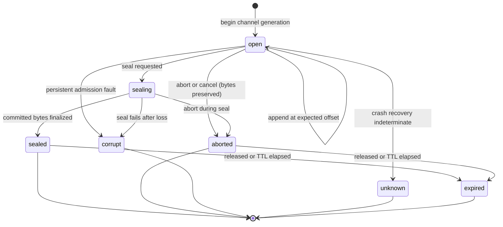
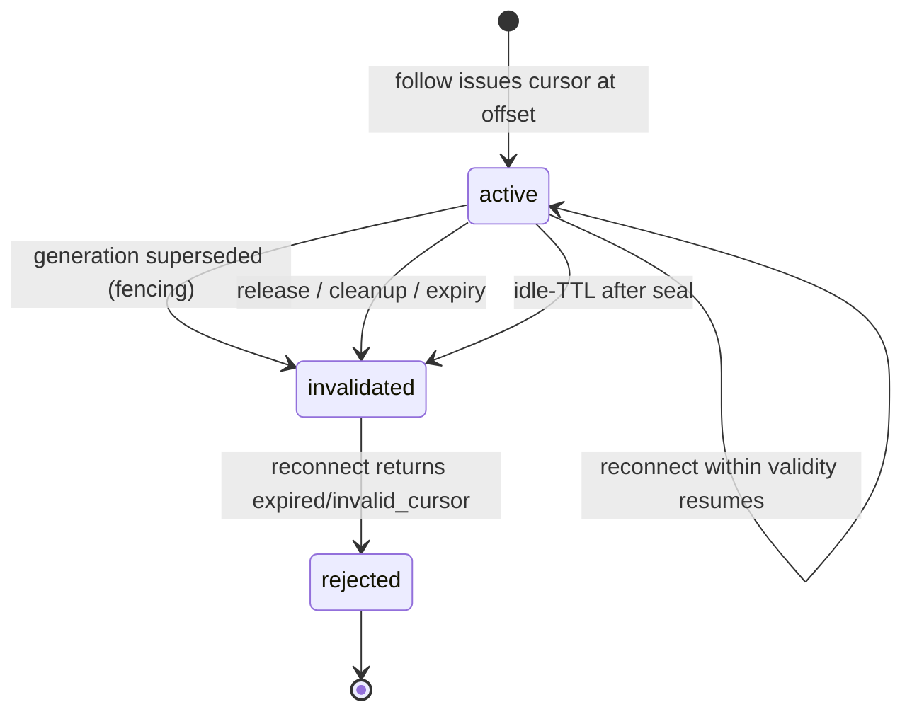

# Implementation Plan: OutputSpool and ArtifactStore (Feature 005)

Feature: 005-add-a-canonical-file-backed-outputspool-and-paged
Status target: planned (after this plan is complete)
Spec: [spec.md](spec.md) (status: planned; FR1–FR50, NFR1–NFR6, and clarification decisions C1–C23)
Research: [research.md](research.md)
Required ADR (now created): **[ADR-0006 OutputSpool Content Plane and Paged ArtifactStore](../../adr/0006-output-spool-content-plane-and-paged-artifact-store.md)** (proposed)
Dependencies:
[Feature 001 Smart Agent Routing and Telemetry](../001-define-one-cohesive-smart-agent-routing-and-opentelemetry/spec.md) (bounded context, telemetry cardinality patterns, content-free OTEL),
[Feature 002 Task Lifecycle Event Bus and Process Table](../002-build-an-event-driven-asynchronous-task-lifecycle-engine/spec.md) (execution authority, `Lifecycle.OutputRef`/`BoundedOutputRef`, `RowTelemetry.output_ref`, terminal-status settlement seam),
[Feature 003 Scheduled Jobs and Async Main-Context Notification](../003-add-persistent-bun-native-scheduled-jobs-with-event/spec.md) (occurrence owns its OutputGroup; NotificationEnvelope `output_ref`),
[Feature 004 Lang Lock](../004-add-lang-lock-to-enforce-a-configurable-artifact-language/spec.md) (language tag/provenance on textual channels; execution-envelope `output_ref`),
[Feature 007 Operator Control Plane](../007-add-a-unified-native-operator-control-plane-for-all-opencode/spec.md) (Config.Service, PermissionV2, SecretPort, reserved `output.*` catalog),
[ADR-0001 Telemetry Foundation](../../adr/0001-opentelemetry-telemetry-foundation.md) (proposed),
[ADR-0002 Core Smart Agent Routing](../../adr/0002-core-smart-agent-routing.md) (proposed),
[ADR-0003 Operator Control Plane](../../adr/0003-operator-control-plane-and-native-command-authority.md) (accepted, sole management authority),
[ADR-0006 OutputSpool Content Plane and Paged ArtifactStore](../../adr/0006-output-spool-content-plane-and-paged-artifact-store.md) (proposed, required decision record).

---

## Overview

Feature 005 delivers the canonical **content plane** for every observed output
produced by main context, agents, subagents, background jobs, tools, and
processes: a file-backed **OutputSpool** and a paged **ArtifactStore**. Every
observable output chunk is file-backed from the first observable chunk, and
process-local memory stays bounded independent of total committed bytes. It adds
no second executor, store authority, event system, or permission system: content
lives under a managed private spool tree, durable settlement events register
through `EventV2.define`, authorization rides Feature 007 principals and
PermissionV2 scopes, and management flows through the reserved `output.*` catalog
IDs owned by Feature 007. Every decision follows ADR-0006 and the C1–C23 clarify
resolutions.

The module name is **`outputspool`** across every package
(`packages/schema/src/outputspool/**`, `packages/protocol/src/outputspool/**`,
`packages/core/src/outputspool/**`, `packages/opencode/src/outputspool/**`,
`packages/opencode/src/operator/outputspool/**`, and the CUE mirrors under
`doc/arch/schemas/outputspool/*.cue`).

- **Phase 1 — Schema and protocol foundation.** Identity value objects
  (`OutputGroupRef`, `OutputRef`, opaque `Cursor` with integrity tag), the
  channel/state/scope/error enums, the page/stat/read-response shapes, quota and
  retention descriptors, the bounded redacted preview value object, the durable
  settlement event vocabulary (C20), and the typed operator/query/append/read
  payloads. Additive schema/protocol modules; no runtime behavior change.
- **Phase 2 — Domain spool engine (`packages/core/src/outputspool/**`).**
  Framework-free identity minting and generation fencing, the bounded queue and
  batched-writer state machine, the committed-length authority, byte-offset
  UTF-8-safe paging, cursor encoding/validation, the reference-graph retention
  evaluator, admission/fault classification, and crash reconciliation — all over
  injected filesystem, clock, and entropy ports, no I/O in hot logic.
- **Phase 3 — Application, adapters, and operator wiring
  (`packages/opencode/src/outputspool/**`).** The Bun `FileSink` batched writer
  adapter and positional-read pager, the managed spool-tree layout and private
  permissions, the SQLite/control metadata store, the durable-event projection on
  the EventV2 bridge, the streaming tool/process sink and the bounded
  plugin/MCP/legacy compatibility boundary, the BackgroundJob/ToolOutputStore
  migration behind the C16 flag, and the Feature 007 `output.*` operator domain
  port.
- **Phase 4 — CLI and TUI paging surfaces.** The CLI `opencode op output <op>`
  verbs and the TUI/App paged read/follow/tail panels over `output.stat`,
  `output.read`, `output.follow`, all thin adapters over the Feature 007 registry
  with registry-generated names and no path exposure.
- **Phase 5 — Tests.** Unit (pure domain), integration (writer/pager/retention
  against sandbox spool trees), contract (`output.*` IDs vs Feature 007 catalog;
  payloads vs `protocol/outputspool/**`), fault-injection (crash matrix per C12,
  quota/ENOSPC per C4), and e2e through the Feature 007 sandbox, covering AC1–AC22.

Management authority for every operator surface is Feature 007 (ADR-0003,
accepted). Feature 005 supplies typed domain query/command implementations,
durable settlement events, and content-free telemetry only; it never registers a
parallel command registry (C19).

---

## Non-goals

- Implementing code during the plan phase.
- A second executor, SessionRunner, EventV2 system, or parallel store authority
  beside Feature 002 lifecycle and the single EventV2 authority (FR2, FR3, C20,
  C21).
- Zero-RAM operation; the promise is bounded memory, not no memory (FR7, NFR1).
- Public filesystem path exposure to the LLM, UI chrome, HTTP API, tool results,
  EventV2 payloads, or transcripts (FR12, C18).
- Full output content in EventV2, OTEL, terminal events, or previews; a write or
  fsync per token/delta (FR4, FR5, FR8, C2, C8, C22).
- A parallel permission system beside Feature 007 principals/PermissionV2 (FR43,
  C7).
- Exactly-once dual commit across filesystem and SQLite (FR25, C12).
- Transparent compression or content dedup in V1 (FR20, C15).
- Raw arbitrary cross-project sharing or a public path share (FR44, C17).
- Owning Smart Agent Routing classification (Feature 001), Task lifecycle
  execution (Feature 002), or Job Definition scheduling (Feature 003).
- Fixing numeric quotas, the batched fsync interval, preview caps, adapter caps,
  cursor idle-TTL, or the reconciliation fence-record format — provisional plan
  constants with named acceptance hooks, finalized in the tasks phase (C2–C4, C8,
  C11, C12, C14).

---

## Technical Approach

### Architecture layers

```
Adapters (inbound)
  CLI  opencode op output stat|read|follow|release|delete|purge|export|share   (Feature 007 thin adapters)
  TUI/App  paged read / follow-tail panel over OutputRef + opaque cursor
  Operator palette / native slash /op.output.<op>
        |
        v
Application (Feature 005 — packages/opencode/src/outputspool/**)
  SpoolLayout        — managed private tree under Global data; 0700/0600 perms
  FileSinkWriter     — Bun FileSink batched async append; fsync per channel tier
  PageReader         — positional FileHandle.read(offset,limit); UTF-8-safe pages
  ControlStore       — SQLite/control metadata; committed-length authority
  Reconciler         — crash recovery FS extent vs control metadata (C12)
  RetentionSweeper   — ref-aware cleanup in bounded batches (C5)
  CompatBoundary     — streaming sink + bounded plugin/MCP/legacy spill (C11)
  MigrationBridge    — BackgroundJob/ToolOutputStore dual-read behind flag (C16)
  DurableEvents      — seal/abort/settlement projected on the EventV2 bridge (C20)
  Operator output domain — output.* typed command/query impls (via Feature 007)
        |
        v
Domain (Feature 005 core — packages/core/src/outputspool/**, zero framework deps)
  Identity           — OutputGroupRef / OutputRef minting; generation fencing (C18)
  Cursor             — opaque encode/decode; integrity tag; generation+offset (C14, C18)
  GroupStateMachine  — open->sealing->sealed/aborted/corrupt/expired/unknown (C20)
  WriterQueue        — bounded queue; backpressure; expected-offset idempotent append
  Paging             — byte-offset paging; UTF-8 boundary safety; eof-when-sealed
  Admission          — ENOSPC/fd/quota/permission/latency classification (C4)
  RetentionGraph     — TTL + lease + reference edges + legal hold evaluator (C5)
  ReconcilePolicy    — committed-length reconciliation decision (C12)
  SpoolInstruments   — output.* spans/metrics extending Feature 001 (content-free)
        |
        v
Reused canonical points (existing — NOT re-implemented)
  Global data dir            — packages/core/src/global.ts (Global-rooted data path)
  EventV2 + durable manifest  — packages/schema/src/durable-event-manifest.ts, event.ts
  EventV2Bridge               — packages/opencode/src/event-v2-bridge.ts (publish boundary)
  Reserved catalog            — output.* IDs (RESERVED_CATALOG_VERSION = 1.3.0)
  Config.Service              — quota/retention/flag config (Feature 007)
  PermissionV2 / principals    — output-action authorization + scopes (Feature 007)
  SecretPort / SecretRef       — redaction of preview secret material (Feature 007)
  Feature 002 OutputRef seam   — Lifecycle.OutputRef/BoundedOutputRef; RowTelemetry.output_ref
  Feature 001 TelemetryInstruments + OTLP exporter — bounded async content-free export
```

Dependency rule: adapters -> application -> domain. Domain MUST NOT import
TUI/CLI/HTTP frameworks, EventV2, Config.Service, SQLite, or the Bun filesystem
runtime directly; it takes a filesystem port, a clock/entropy port, a config-read
port, and a control-store port and returns decisions and byte ranges. The
application layer owns the Bun `FileSink`/`FileHandle` I/O, the SQLite control
store, and the durable-event projection; no consumer receives a filesystem path.

### Bun I/O substrate (verified empirically, Bun 1.3.14)

- **Batched append.** `Bun.file(path).writer()` returns a `FileSink` with
  `write(chunk)`, `flush()` (returns bytes flushed), `end()`, and `ref()`/
  `unref()` — the batched async writer backing every channel tier (FR8, C2). No
  per-token filesystem write is required; the queue drains into `write` and
  `flush` on the batched interval.
- **Positional paged read.** `node:fs/promises` `open(path,"r+")` yields a
  `FileHandle` with positional `read(buf, off, len, pos)` (verified: reads a
  4-byte window at an offset without loading the file), and `Bun.file(path)`
  exposes `size`, `slice(start,end)` (Blob-like), `bytes()`, and `stream()` for
  bounded page materialization (FR20, C15). The pager reads exactly the requested
  byte window and trims to a UTF-8 codepoint boundary.
- **Durability.** `node:fs` `fsyncSync`/`fdatasyncSync` and `FileHandle.sync()`/
  `FileHandle.datasync()` are all present (verified), backing the tiered
  fsync-at-seal/abort plus batched-interval policy (C2). `Bun.write` exists for
  one-shot artifact writes.

### Packages and modules (reuse first, no parallel authority)

| Concern | Existing location (reuse) | Feature 005 addition |
| ------- | ------------------------- | -------------------- |
| Managed data dir | `packages/core/src/global.ts:15-39` (Global-rooted data path hosting `tool-output`) | `outputspool` managed private tree keyed project/root-session/process-attempt/generation/channel; replaces flat `tool-output` (C1) |
| BackgroundJob strings | `packages/core/src/background-job.ts:9-32`, `:160-162`, `:173-187` | Store OutputRef/stat/status; dual-read legacy `output`/`error` behind the C16 flag (FR31) |
| ToolOutputStore | `packages/core/src/tool-output-store.ts:14-18`, `:138-188` | Replace post-materialization spill, path-in-preview, and mtime cleanup with first-chunk sink, bounded preview, ref-aware retention (FR37, C5, C11) |
| Tool/runner projection | `packages/core/src/session/runner/llm.ts:229-267`, `packages/core/src/tool/registry.ts:46-80`, `packages/core/src/session/message-updater.ts:309-337` | Replace `outputPaths` with OutputRef + bounded preview on parts (FR12, FR33) |
| Event authority | `packages/schema/src/durable-event-manifest.ts`, `packages/core/src/event.ts:63-108`, `:152-164` | `output.*` durable settlement `Definition`s via `EventV2.define`; droppable live signals; no new bus (C20) |
| Publish boundary | `packages/opencode/src/event-v2-bridge.ts` | `publishOutputEvent` on the same bridge (C20) |
| Reserved operator IDs | `packages/core/src/operator/catalog.ts` (`RESERVED_CATALOG_VERSION = 1.3.0`; `output.stat|read|follow|export|share|release|delete|purge|retention.set|quota.set` present, lines 131-140) | Register typed `output.*` domain impls via Feature 007 ports; **no catalog bump required** (C19) |
| Authorization | `packages/core/src/operator/principal.ts`, `scope.ts`, `scope-resolve.ts`, Feature 007 PermissionV2 | Re-evaluate per action over `self|child|tree|session|project|operator-global` (FR43, C7) |
| Secret redaction | `packages/core/src/operator/secret.ts`, Feature 007 SecretPort | Preview secret material as SecretRef, never inline (C8, C22) |
| Telemetry | `packages/core/src/observability/otlp.ts:7-71`, Feature 001 instruments | `output.*` spans/metrics reusing bounded-cardinality helpers; content-free (C22) |
| Feature 002 OutputRef | `Lifecycle.OutputRef`/`BoundedOutputRef`, `RowTelemetry.output_ref` | Content plane supplies pages on expand; settlement split (C13, C21) |
| Feature 003 occurrence | `jobs/occurrence-parts.cue output_ref`, NotificationEnvelope `output_ref` | Occurrence owns its OutputGroup; notification carries summary+ref (C21) |
| Feature 004 provenance | `langlock/correlation.cue #OutputRef`, execution-envelope `output_ref` | Textual channels carry Lang Lock tag/version/provenance metadata (FR40) |
| Schema / Protocol | `packages/schema`, `packages/protocol` | `outputspool` schema (novo), read/append/command payloads (novo) |
| CLI / TUI | `packages/cli`, `packages/opencode/src/cli/cmd/op.ts`, `packages/tui/src/**/operator/**` | `opencode op output <op>` verbs + TUI paging panel (C23) |

**New module tree target:**

```
packages/schema/src/outputspool/               # novo — schema authority
  ids.ts             # OutputGroupRef (project/root-session/process-attempt/generation),
                     #   OutputRef, GroupId, GenerationId, ChannelId value objects (FR14, FR17, C18)
  cursor.ts          # opaque Cursor VO: group id, generation, channel, byte offset, integrity tag (FR17, C14, C18)
  enums.ts           # Channel (assistant-text|reasoning|stdout|stderr|tool-result|error|artifact),
                     #   GroupState (open|sealing|sealed|aborted|corrupt|expired|unknown),
                     #   Scope, AdmissionFault, ErrorCode, DurabilityTier (FR15, FR19, C4, C20)
  page.ts            # ReadPage: page bytes range, next_offset, committed_bytes, caught_up, eof (FR21)
  stat.ts            # OutputStat read model: state, committed_bytes, channel, provenance (FR18)
  preview.ts         # BoundedPreview VO: byte/line-capped redacted head slice, SecretRef list (FR4, C8, C22)
  quota.ts           # QuotaDescriptor: global/root/session/process/channel scope caps (FR10, C3)
  retention.ts       # RetentionDescriptor: TTL, lease, reference-edge kinds, legal hold (FR28, C5)
  events.ts          # output.* durable settlement closed vocabulary, one Struct per event (C20)
  index.ts
packages/protocol/src/outputspool/             # novo — typed transport contracts
  ports.ts           # FilesystemPort, ClockPort, EntropyPort, ControlStorePort,
                     #   ConfigReadPort, SecretRedactPort (application/domain boundary)
  commands.ts        # native begin/append/read/follow/seal/abort/stat/release/cleanup +
                     #   output.* operator command/query payloads (FR18, C19)
  index.ts
packages/core/src/outputspool/                 # novo — framework-free domain engine
  identity.ts        # OutputGroupRef/OutputRef minting; generation fencing (FR14, FR27, C18)
  cursor-codec.ts    # opaque cursor encode/decode + integrity tag; generation+offset bind (FR22, C14, C18)
  group-state.ts     # open->sealing->sealed/aborted/corrupt/expired/unknown machine (FR19, C20)
  writer-queue.ts    # bounded queue; backpressure; expected-offset idempotent append (FR8, FR9)
  paging.ts          # byte-offset paging; UTF-8 boundary safety; eof-when-sealed (FR20, FR21, C15)
  admission.ts       # ENOSPC/fd/quota/permission/latency classification; degrade-then-fence (FR10, C4)
  retention-graph.ts # TTL + lease + reference edges + legal hold reclaim evaluator (FR28-FR30, C5)
  reconcile.ts       # committed-length reconciliation into recovery states (FR25, C12)
  spool-instruments.ts # output.* spans/metrics extending Feature 001; content-free (C22)
  index.ts
packages/opencode/src/outputspool/             # novo — application + adapters
  spool-layout.ts            # managed private tree; 0700/0600 perms; traversal/symlink/TOCTOU guard (FR11, FR45, FR46, C1, C6)
  file-sink-writer.ts        # Bun FileSink batched append; tiered fsync (FR8, C2)
  page-reader.ts             # positional FileHandle.read(offset,limit); bounded page (FR20, C15)
  control-store.ts           # SQLite/control metadata; committed-length authority (FR25, C12)
  reconciler.ts              # crash recovery FS extent vs control metadata (FR25, C12)
  retention-sweeper.ts       # ref-aware cleanup in bounded batches (FR28-FR30, C5)
  compat-boundary.ts         # streaming sink + bounded plugin/MCP/legacy spill (FR35-FR37, C11)
  migration-bridge.ts        # BackgroundJob/ToolOutputStore dual-read behind flag (FR31, C16)
  durable-events.ts          # seal/abort/settlement projected on the EventV2 bridge (C20)
  authorization.ts           # per-action re-evaluation over Feature 007 principals/scopes (FR43, FR47, FR48, C7)
  index.ts
packages/opencode/src/operator/outputspool/    # novo — Feature 007 output.* domain impls (C19)
packages/opencode/src/event-v2-bridge.ts       # existing — extend: publishOutputEvent (C20)
packages/core/src/background-job.ts            # existing — migrate to OutputRef behind flag (FR31, C16)
packages/core/src/tool-output-store.ts         # existing — replace with outputspool sink (FR37, C11, C16)
packages/cli/src/**/output/                     # novo — opencode op output ... commands
packages/tui/src/**/operator/output/            # novo — paged read/follow/tail panel (C23)
doc/arch/schemas/outputspool/*.cue              # novo — CUE mirrors (calisthenics-compliant)
```

CUE data-model companions mirror the schema modules under
`doc/arch/schemas/outputspool/*.cue` (ids, cursor, enums, page, stat, preview,
quota, retention, events), following the Feature 001/002/003/004 calisthenics
style: every entity field is a `#ValueObject` reference (bare string/bool entity
fields are wrapped), each file carries a `// DDD role:` header, snapshots and
enums are `ValueObject` not `Entity`, an `Entity`/`AggregateRoot` carries an id, a
`ValueObject` holds no identifiable, each entity keeps at most seven direct fields,
first-class collections replace bare arrays, and each file stays under the
ten-definition warning bound.

---

## Incremental slices

| Slice | Name | Delivers | Phase | Depends |
| ----- | ---- | -------- | ----- | ------- |
| S0 | Identity + cursor + enums | `ids.ts`, `cursor.ts`, `enums.ts`: OutputGroupRef/OutputRef/GroupId/GenerationId/ChannelId VOs, opaque Cursor VO, Channel/GroupState/Scope/AdmissionFault/ErrorCode/DurabilityTier enums (FR14, FR15, FR17, FR19, C18, C20) | 1 | — |
| S1 | Page + stat + preview | `page.ts` ReadPage (next_offset, committed_bytes, caught_up, eof), `stat.ts` OutputStat, `preview.ts` BoundedPreview + SecretRef (FR4, FR18, FR21, C8, C22) | 1 | S0 |
| S2 | Quota + retention descriptors | `quota.ts` scope caps, `retention.ts` TTL/lease/reference-edge/legal-hold descriptor (FR10, FR28, C3, C5) | 1 | S0 |
| S3 | Durable event vocabulary | `events.ts` `output.*` seal/abort/settlement/reconciliation closed vocabulary, one Struct per event (FR4, C20) | 1 | S1 |
| S4 | Protocol ports + payloads | `protocol/outputspool/ports.ts`, `commands.ts`: filesystem/clock/entropy/control-store/config-read/secret-redact ports and native + `output.*` payloads (FR18, C19) | 1 | S1, S2, S3 |
| S5 | Identity minting + fencing | `identity.ts` OutputGroupRef/OutputRef minting; stale-generation fencing rejects superseded append/seal (FR14, FR27, C18, AC11) | 2 | S0 |
| S6 | Cursor codec | `cursor-codec.ts` opaque encode/decode + integrity tag; generation+offset bind; expired/invalid_cursor on stale (FR22, C14, C18, AC4) | 2 | S0 |
| S7 | Group state machine | `group-state.ts` open->sealing->sealed/aborted/corrupt/expired/unknown transitions; seal commits finality; abort preserves committed bytes (FR19, FR24, C20, AC8, AC10) | 2 | S5 |
| S8 | Writer queue | `writer-queue.ts` bounded queue; backpressure signal; expected-offset idempotent append; short/partial write handling (FR8, FR9, C3, AC5) | 2 | S7 |
| S9 | Byte-offset paging | `paging.ts` server-capped read(offset,limit); UTF-8 codepoint-boundary safety; eof only when sealed and consumed; caught_up for open streams (FR20, FR21, C15, AC2, AC3) | 2 | S1, S7 |
| S10 | Admission + fault classification | `admission.ts` ENOSPC/fd/quota/permission/latency observable states; degrade-then-fence to aborted/corrupt preserving committed bytes (FR10, C4, AC6, AC7) | 2 | S2, S7 |
| S11 | Retention graph evaluator | `retention-graph.ts` reclaim only when TTL elapsed AND no lease/reader/writer/reference-edge/legal-hold; bounded batch selection (FR28-FR30, C5, AC16, AC17) | 2 | S2 |
| S12 | Crash reconciliation policy | `reconcile.ts` committed-length authority reconciles FS extent vs control into sealed/open/aborted/corrupt/unknown; never silent empty-success (FR25, C12, AC8, AC9) | 2 | S7 |
| S13 | Spool layout + private perms | `spool-layout.ts` managed private tree keyed project/root-session/process-attempt/generation/channel; 0700/0600 perms; traversal/symlink/TOCTOU guard (FR11, FR12, FR45, FR46, C1, C6, AC14) | 3 | S5 |
| S14 | FileSink writer + tiered fsync | `file-sink-writer.ts` Bun FileSink batched append; fsync at seal/abort + batched interval for durable tiers, seal-only for console, none for disposable (FR8, C2, AC1) | 3 | S8, S13 |
| S15 | Positional page reader | `page-reader.ts` positional FileHandle.read(offset,limit); Bun.file.slice bounded page; concurrent read during append (FR9, FR20, C15, AC2) | 3 | S9, S13 |
| S16 | Control store + committed-length | `control-store.ts` SQLite/control metadata; committed-length authority; generation records; atomic commit ordering (FR25, C12, AC8) | 3 | S12, S14 |
| S17 | Reconciler | `reconciler.ts` startup recovery over open groups; applies C12 policy; marks corrupt/unknown/recovered (FR25, C12, AC8, AC9) | 3 | S16 |
| S18 | Retention sweeper | `retention-sweeper.ts` bounded-batch ref-aware cleanup; release drops one edge; never deletes referenced output (FR28-FR30, C5, AC16, AC17) | 3 | S11, S16 |
| S19 | Durable event projection | `durable-events.ts` `output.*` seal/abort/settlement `EventV2.define` Definitions; `publishOutputEvent` on the bridge; droppable live append/progress signals; content-free (FR4, C20, C22, AC18) | 3 | S3, S7 |
| S20 | Authorization | `authorization.ts` per-action re-evaluation over Feature 007 principals/scopes; raw OutputRef never a saved resource; interim consume-by-owner, admin deny-by-default (FR43, FR47, FR48, C7, AC15) | 3 | S13 |
| S21 | Streaming sink + compat boundary | `compat-boundary.ts` native tool/process streaming sink; bounded plugin/MCP/legacy spill under size/time/memory caps; no path in result (FR35-FR37, C11, AC13) | 3 | S14, S20 |
| S22 | Migration bridge | `migration-bridge.ts` BackgroundJob OutputRef write + legacy string dual-read; ToolOutputStore replacement; runner/registry/message-part OutputRef+preview behind the C16 flag (FR31-FR34, FR37, C16, AC1, AC12) | 3 | S14, S21 |
| S23 | Context slice materialization | budgeted `read(offset,limit)` over sealed channels; record ranges used into the transcript reference set; no automatic full-file injection (FR33, C10, AC19) | 3 | S15, S20 |
| S24 | Operator output domain | `operator/outputspool/**` typed `output.stat|read|follow|release|delete|purge|export|share|retention.set|quota.set` command/query impls + audit via Feature 007; reserved-ID collision rejection; consume re-auth per call, admin operator-only (FR41-FR44, C17, C19, AC13, AC15) | 3 | S19, S20 |
| S25 | Spool telemetry | `spool-instruments.ts` `output.append|read|seal|reconcile|cleanup` spans; bounded-label metrics (bytes, queue depth, latency, state counts, spill, quota/disk faults, cleanup batches); no id labels (Observability, C22, AC18) | 2–3 | S10, S19 |
| S26 | CLI + TUI paging surfaces | `cli/**/output/**` `opencode op output <op>`; `tui/**/operator/output/**` paged read/follow/tail panel; cursor-resumed reconnect; direct-children-only; registry-generated names; no path exposure (FR41, C23, AC20) | 4 | S24 |
| S27 | Tests + validation | Unit (identity/cursor/state/paging/admission/retention/reconcile), integration (writer/pager/control-store/retention against sandbox trees), contract (`output.*` vs Feature 007 catalog; payloads vs protocol), fault-injection (crash matrix C12, quota/ENOSPC C4), e2e through the Feature 007 sandbox (all AC1–AC22) | 5 | all |

---

## Data model and persistence strategy

Entity definitions are finalized in the `data-model.md` companion and the
`doc/arch/schemas/outputspool/*.cue` schemas. Durability is single-authority: the
**managed spool tree** holds the content bytes and is the recovery authority, the
**control store** (SQLite/control metadata) holds the committed-length authority
and generation records, and **durable settlement records** are EventV2
projections. No shape is a second store of record beside these authorities, and
no consumer receives a filesystem path.

### Managed spool tree (FR11, C1)

The private tree lives under the OpenCode `Global`-rooted data directory
(`packages/core/src/global.ts:15-39`), replacing the flat `tool-output`
directory. Segments key by project, root session, process/attempt, generation,
and channel so one `OutputGroupRef` maps to exactly one generation subtree and a
stale generation never shares a file with its successor. Directories are `0700`
and files `0600` on Unix, owner-only ACL on Windows/macOS (FR45, C6). OS-tmp
holds only channels marked disposable (FR11). The directory-segment grammar,
opaque segment naming, and shard fan-out are provisional plan constants with
acceptance hooks AC1/AC14.

### Committed-length authority and control store (FR25, C12)

The control store records, per channel generation, the committed length, the
durability tier, the seal/abort fence record, and the reference edges. The
committed length is the recovery authority: recovery treats the filesystem data
extent against this length. When the extent is at least the committed length the
group recovers as sealed/open; when it is shorter or the seal record is absent
after committed appends the group recovers as `corrupt` or `unknown` with bounded
recovery, never silent empty-success. Exactly-once FS+DB commit is out of scope.
The fence-record format and bounded recovery-scan limit are provisional plan/ADR
constants with acceptance hooks AC8/AC9.

### Identity, OutputRef, and cursor (FR14, FR17, C18)

`OutputGroupRef` is scoped to process/attempt/generation; `OutputRef` identifies a
sealed or open channel/artifact within a group and is a bounded opaque token,
never a path and never a saved permission resource. The opaque `cursor` encodes
group id, generation, channel, and byte offset plus an integrity tag. New
attempts/generations never overwrite prior committed content (fencing, FR27). The
token codec and integrity-tag algorithm are provisional plan constants with
acceptance hooks AC4/AC11/AC14.

### Reference-aware retention (FR28–FR30, C5)

A group is reclaimable only when its TTL has elapsed AND it holds no live lease,
no active reader/writer, and no inbound reference edge (transcript ref, Todo
evidence, handoff envelope, NotificationEnvelope `output_ref`, Feature 002
`RowTelemetry.output_ref`) AND no legal/privacy hold applies. `release` drops one
holder edge; `cleanup` reclaims only fully unreferenced expired groups in bounded
batches. Per-channel TTL defaults (reasoning stricter per C9) are provisional plan
constants with acceptance hooks AC16/AC17.

### Bounded preview and provenance (FR4, FR40, C8, C22)

A preview is a byte-and-line-capped, redacted head slice with secret material
represented as a Feature 007 SecretRef, attached to EventV2 payloads, UI cards,
and NotificationEnvelope summaries alongside the opaque OutputRef only. Textual
channels carry the Feature 004 Lang Lock tag/version/provenance read from the
trusted execution envelope, not recomputed by the content plane. Exact preview
caps and the redaction ruleset are provisional plan constants with acceptance
hooks AC12/AC19.

---

## API and command contracts

### Native content-plane ports (C18, C20)

The domain exposes typed ports; the application layer owns the Bun I/O and the
control store. Offsets are bytes, `limit` is mandatory and server-capped, and no
consumer receives a path.

| Port operation | Signature intent | Scope |
| -------------- | ---------------- | ----- |
| `begin(groupRef, channel)` | Open a channel generation; return OutputRef | producer |
| `append(ref, expected_offset, chunk)` | Idempotent bounded-queue append at the expected byte offset | producer |
| `read(ref, offset, limit)` | UTF-8-safe page: bytes, next_offset, committed_bytes, caught_up, eof | consume |
| `follow(cursor)` | Resume from an opaque cursor; expired/invalid_cursor on stale | consume |
| `seal(ref)` | Commit finality of committed bytes for a generation | producer |
| `abort(ref)` | Stop append, preserve committed bytes for authorized read | producer |
| `stat(ref)` | Read model: state, committed_bytes, channel, provenance | consume |
| `release(ref)` | Drop one holder reference edge | admin |
| `cleanup(scope)` | Reclaim unreferenced expired groups in bounded batches | admin |

### Operator command surface (C19, registered via Feature 007)

Canonical dotted IDs under the reserved `output.*` domain, owned by Feature 007
per ADR-0003; Feature 005 supplies typed domain implementations, durable
settlement events, and content-free telemetry only. Native slash is intercepted
before prompt admission; zero provider/model calls, tokens, or cost by default;
output not added to Message/Part/context by default. The registry generates
palette labels, slash aliases (`/op.output.<op>`), and CLI verbs
(`opencode op output <op>`). Reserved IDs are never registered by
plugin/MCP/custom registries.

| Palette/slash ID | CLI | Plane | Mutates | Scopes |
| ---------------- | --- | ----- | ------- | ------ |
| `output.stat` | `opencode op output stat` | consume | no | session, project |
| `output.read` | `opencode op output read` | consume | no | session, project |
| `output.follow` | `opencode op output follow` | consume | no | session, project |
| `output.release` | `opencode op output release` | admin | yes | project |
| `output.delete` | `opencode op output delete` | admin | yes | project |
| `output.purge` | `opencode op output purge` | admin | yes | project |
| `output.export` | `opencode op output export` | admin | yes | project |
| `output.share` | `opencode op output share` | admin | yes | project |
| `output.retention.set` | `opencode op output retention set` | admin | yes | global, project |
| `output.quota.set` | `opencode op output quota set` | admin | yes | global, project |

Consume actions re-evaluate authorization per call; admin actions require an
operator principal, explicit scope, version/CAS, idempotency, and audit. Export
and share are deny-by-default across projects; an in-project export is
content-bounded and never a raw path (FR44, C17).

**Reserved-catalog finding.** `packages/core/src/operator/catalog.ts` is at
`RESERVED_CATALOG_VERSION = "1.3.0"` and already declares all ten `output.*` IDs
(lines 131-140): `output.stat|read|follow` (`mutates:false`, `scopesAllowed`
session+project, offline-capable), `output.export|share` (`mutates:true`, project
scope), `output.release|delete|purge` (`mutates:true`, project scope,
offline-capable), and `output.retention.set|quota.set` (`mutates:true`,
global+project). No additive `1.3.0 -> 1.4.0` bump task is required; Feature 005
reuses the existing catalog surface and registers only typed domain impls, durable
events, and telemetry (C19).

---

## State machines

### OutputGroup channel lifecycle (C20)

A channel opens on `begin`, absorbs bounded-queue appends while `open`, moves to
`sealing` on a seal request, and settles to `sealed`. `abort` preserves committed
bytes; a persistent admission fault or a failed reconciliation reaches `corrupt`;
recovery of an indeterminate extent reaches `unknown`; a released/expired group
reaches `expired`. `sealed`, `aborted`, `corrupt`, `expired`, and `unknown` are
terminal for the generation.



### Cursor lifecycle (C14, C18)

A cursor is `active` while bound to the live generation and byte offset. Generation
supersession, group release/cleanup/expiry, and the absolute idle-TTL after seal
move it to `invalidated`; a reconnect then returns a stable expired/invalid_cursor
code. A reconnect within validity resumes without a full re-read.



### Settlement flow with Feature 002 (C13)

Feature 002 owns lifecycle terminal status; Feature 005 owns content-plane
settlement. A terminal status never precedes settlement without an intermediate
`settling` reconciliation state; the parent observes sealed/aborted refs or an
explicit settling/unknown/corrupt condition.

```mermaid
stateDiagram-v2
    [*] --> running: producer appends to its OutputGroup
    running --> settling: producer requests terminal (seal/abort begins)
    settling --> settled_sealed: channels sealed or aborted; OutputRef committed
    settling --> settled_unknown: crash reconciliation indeterminate
    settling --> settled_corrupt: committed-length reconciliation fails
    settled_sealed --> terminal: Feature 002 records terminal status
    settled_unknown --> terminal: parent observes unknown condition
    settled_corrupt --> terminal: parent observes corrupt condition
    terminal --> [*]
```



---

## Persistence and layout

| Concern | Authority | Rule |
| ------- | --------- | ---- |
| Content bytes | Managed spool tree under Global data dir (C1) | Private `0700`/`0600`; keyed project/root-session/process-attempt/generation/channel; one OutputGroupRef → one generation subtree; disposable only in OS-tmp |
| Committed length | Control store (SQLite/control metadata) (C12) | Recovery authority; per generation; drives sealed/open/aborted/corrupt/unknown reconciliation; never silent empty-success |
| Generation fencing | Identity + control store (C18) | New attempt/generation never overwrites prior committed content; stale writers rejected |
| Durable settlement | EventV2 durable manifest (C20) | seal/abort/settlement/reconciliation via `EventV2.define`; content-free; no path |
| Live signals | EventV2 bounded live channel (C20) | append/progress/backpressure droppable under `allBounded` load without affecting durable seal/read |
| Quota + retention config | Feature 007 Config.Service (C3, C5) | Numeric caps and TTLs are Config.Service values; no parallel store |
| Reference edges | Control store reference graph (C5) | transcript/Todo/handoff/NotificationEnvelope/`RowTelemetry.output_ref` inbound edges gate cleanup |
| Path exposure | none (FR12, C18) | Consumers receive OutputRef, cursor, metadata, and authorized pages only |

---

## Security and threat boundaries

| Threat | Mitigation |
| ------ | ---------- |
| Path traversal / symlink escape on open/read/write/delete | Managed-tree layout validates every segment; symlink and TOCTOU guard on each operation; no path-like input opens a file outside the spool (FR46, C6, AC14) |
| Public filesystem path leak to LLM/UI/API/tool/event/transcript | Consumers receive only OutputRef, cursor, metadata, and authorized pages; previews and events carry no path (FR12, FR33, C8, C18, C22) |
| Raw OutputRef treated as a saved permission | Authorization re-evaluated per action over Feature 007 principals/scopes; a raw ref is never a saved resource (FR47, FR48, C7, AC15) |
| Unauthorized sibling read | Metadata authorization by principal and project/root/session/tree scope before any page; interim admin deny-by-default (FR43, FR47, C7, AC15) |
| Private-permission bypass | `0700`/`0600` or owner-only ACL on every platform; encryption optional and non-relaxing (FR45, FR49, C6) |
| Stale-generation overwrite | OutputGroupRef fencing rejects append/seal from superseded writers; one generation subtree per ref (FR14, FR27, C18, AC11) |
| Silent data loss reported as sealed | Committed-length authority; degrade-then-fence to aborted/corrupt; seal never lies (FR24, FR25, C4, C12, AC6, AC8) |
| Content leak in events/telemetry/audit/preview | Content-free per ADR-0001; bounded enums/buckets only; SecretRef for secret material; stable error codes; no id labels (FR5, C8, C22, AC18) |
| Unbounded materialization by plugin/MCP/legacy adapter | Bounded compatibility boundary spills before full materialization under size/time/memory caps; no path in result (FR36, FR37, C11, AC13) |
| Reasoning-channel exposure | Stricter TTL, no OTEL, no unauthorized preview, explicit authorized principal (FR16, Privacy 2, C9, AC22) |
| Cross-project share/export | Deny-by-default across projects; in-project export operator-gated, content-bounded, CAS/audit; never a raw path (FR44, C17) |
| Reserved namespace hijack | `output.*` reserved in the Feature 007 catalog; plugin/MCP/custom collisions rejected (C19) |

---

## Rollback strategy

| Layer | Rollback |
| ----- | -------- |
| outputspool schema/protocol | Additive modules; removal restores prior behavior; no runtime coupling until Phase 3 wiring |
| `output.*` EventV2 Definitions | Additive to the durable manifest; unregistering removes projection input without affecting routing/lifecycle/job events |
| Spool layout + control store | New managed tree beside the legacy `tool-output`; disabling the flag leaves legacy paths intact |
| FileSink writer / page reader | Pure Bun adapters; discarding them stops new spool writes without mutating committed content |
| Migration bridge | C16 feature flag; dual-read keeps BackgroundJob/ToolOutputStore legacy paths readable; cutover is reversible until legacy fields are retired |
| Operator commands | Feature 007 atomic CAS rollback per command; audit retained |
| Retention sweeper | Ref-aware and bounded; disabling stops reclamation without deleting referenced output |

---

## Isolation harness

Feature 005 operator surfaces and integration/e2e tests reuse the existing
Feature 007 isolation harness. Hot-path domain logic (identity, cursor, state
machine, paging, admission, retention, reconciliation) runs in-process with
deterministic filesystem/clock/entropy ports; no provider or network is required.
Fault-injection tests drive ENOSPC, fd exhaustion, quota, and crash points through
the injected filesystem port.

| Item | Value |
| ---- | ----- |
| Sandbox root | `.dev/opencode-operator/` (gitignored) |
| Env prefix | `OPENCODE_DEV_OPERATOR_=1`, `OPENCODE_CONFIG_DIR=.dev/opencode-operator/config` |
| Spool root | `.dev/opencode-operator/outputspool` (isolated managed tree) |
| Port | 14096 (loopback) |
| Wrapper | `scripts/dev/opencode-operator-sandbox` |
| Forbidden | `~/.config/opencode`, the real Global data dir, real provider calls, non-loopback bind |
| Proof tests | Default data paths and prod ports unchanged when the wrapper is unused; no path escapes the sandbox spool root |

---

## Testing matrix

| Layer | Scope | How |
| ----- | ----- | --- |
| Unit | Identity/fencing, cursor codec + integrity tag, group state machine, byte-offset paging + UTF-8 boundary, admission classification, retention-graph reclaim, reconciliation policy | Pure tests; deterministic ports; no I/O |
| Integration | FileSink batched writer + tiered fsync, positional page reader under concurrent append, control-store committed-length ordering, retention sweeper against sandbox trees, authorization re-evaluation | Sandbox spool trees under `.dev/`; injected clock/entropy; mock exporter |
| Contract | `output.*` IDs vs the Feature 007 reserved catalog (already at 1.3.0); reserved-ID collision rejection; native + `output.*` payloads vs `protocol/outputspool/**` | Spec-driven; specScopeGlobs enforced |
| Fault-injection (crash, C12) | Crash before seal (committed bytes or corrupt/unknown), crash after seal before event (settling yields sealed ref), reconciliation into sealed/open/aborted/corrupt/unknown | Injected filesystem port crash points; recovery assertion; AC8, AC9 |
| Fault-injection (quota/ENOSPC, C4) | ENOSPC on append, fd exhaustion, per-scope quota exceed, sustained latency degrade-then-fence, seal never reports lost bytes as success | Injected filesystem port fault states; AC6, AC7 |
| E2E | CLI `op output` human + JSON; TUI paged read/follow/tail + cursor reconnect; huge-output bounded memory; handoff refs; plugin oversized spill; path-traversal denial; unauthorized sibling denial | Feature 007 sandbox wrapper only; AC1, AC5, AC12, AC13, AC14, AC15, AC20 |
| Telemetry | `output.*` spans; bounded labels (bytes, queue depth, latency, state counts, spill, quota/disk faults, cleanup batches); no id labels; OTEL-down continuity | Cardinality audit; content-free assertion; AC18 |

Acceptance coverage maps every scenario AC1–AC22 to a slice. Provisional numeric
constants (page/queue/quota caps, fsync interval, preview caps, adapter caps,
cursor idle-TTL, reconciliation scan limit) carry named acceptance hooks (AC1,
AC4, AC6, AC7, AC12, AC13, AC19) and are fixed in the tasks phase.

---

## Observability alignment

- `output.*` spans `output.append`, `output.read`, `output.seal`,
  `output.reconcile`, and `output.cleanup` link to session execution, LLM, tool,
  and process spans (Observability, C22).
- Metric labels reuse the Feature 001 bounded enums and the cardinality allowlist;
  over-budget values map to `other`.
- Metrics: bytes appended/read (buckets); queue depth (buckets); writer/read
  latency (buckets); open/sealed/aborted/corrupt/expired counts (enums); spill
  count; quota faults; disk faults (ENOSPC/fd/permission); cleanup batches
  (Observability).
- Content, path, OutputRef, `session_id`, `process_id`, and `user_id` never appear
  as metric labels; opaque correlation IDs may correlate traces/logs only (C22,
  AC18).
- The `reasoning` channel is never emitted to OTEL and never surfaced in an
  unauthorized preview (C9, AC22).
- OTLP export is asynchronous and bounded through the Feature 001 exporter and
  never blocks seal/read; when OTEL export is unavailable the content plane
  continues and metrics loss does not block seal/read (AC18).
- Feature 005 adds no new exporter, SDK, or pipeline; it reuses
  ADR-0001/Feature 001 and the single EventV2 authority (C20, C22).

---

## Proposed specScopeGlobs (tasks/implement phase)

Narrow, file-exact globs to add to `doc/arch/speckit.toml` in the tasks phase —
**not applied by this plan**. Feature 001/002/003/004/007 TOML paths are preserved
unchanged; existing shared seams
(`packages/opencode/src/event-v2-bridge.ts`, `packages/core/src/event.ts`,
`packages/schema/src/durable-event-manifest.ts`,
`packages/core/src/operator/**`, `packages/opencode/src/operator/**`,
`packages/tui/src/**/operator/**`) already cover the reused points and are not
duplicated. The reserved-catalog file `packages/core/src/operator/catalog.ts`
already carries the `output.*` entries at version 1.3.0 and needs no bump. The
migration targets `packages/core/src/background-job.ts` and
`packages/core/src/tool-output-store.ts` are listed for traceability. The
plan-phase corpus lives under the always-derived `doc/arch/sdd/005-.../**` scope
and needs no glob addition.

```toml
specScopeGlobs = [
  # Feature 005 — OutputSpool and ArtifactStore (novo implement paths).
  "packages/schema/src/outputspool/**",
  "packages/protocol/src/outputspool/**",
  "packages/core/src/outputspool/**",
  "packages/opencode/src/outputspool/**",
  "packages/opencode/src/operator/outputspool/**",
  "packages/cli/src/**/output/**",
  "packages/tui/src/**/operator/output/**",
  "packages/schema/test/outputspool/**",
  "packages/protocol/test/outputspool/**",
  "packages/core/test/outputspool/**",
  "packages/opencode/test/outputspool/**",
  # Existing seams migrated behind the C16 flag (listed for traceability):
  # "packages/core/src/background-job.ts",           # store OutputRef; dual-read legacy strings
  # "packages/core/src/tool-output-store.ts",         # replace with outputspool sink
  # "packages/opencode/src/event-v2-bridge.ts",       # publishOutputEvent
]
```

---

## Companion artifacts

| File | Purpose |
| ---- | ------- |
| [research.md](research.md) | Evidence base: BackgroundJob strings, ToolOutputStore path/mtime, runner/registry projection, EventV2 durable/live, Global data dir, reserved-catalog finding |
| [spec.md](spec.md) | Feature specification (planned; FR1–FR50, NFR1–NFR6, C1–C23) |
| [ADR-0006](../../adr/0006-output-spool-content-plane-and-paged-artifact-store.md) | Required content-plane + paged-access decision record |
| `data-model.md` (novo) | Entity definitions: OutputGroup, OutputChannel, OutputRef, Cursor, ReadPage, OutputStat, BoundedPreview, QuotaDescriptor, RetentionDescriptor, enums |
| `contracts/` (novo) | TypeScript port contracts: FilesystemPort, ClockPort, EntropyPort, ControlStorePort, ConfigReadPort, SecretRedactPort, native begin/append/read/follow/seal/abort/stat/release/cleanup, `output.*` command payloads |
| `hierarchy-flow.md` (novo) | Diagram: producer → bounded queue → batched writer → managed tree → control store → settlement → OutputRef → paged read → EventV2/OTEL |
| `doc/arch/schemas/outputspool/*.cue` (novo) | CUE data-model mirrors, calisthenics-compliant per the routing/lifecycle/jobs/langlock exemplars |

---

## Implementation order (task groups preview)

Phase 1 (schema/protocol foundation, additive):

1. Identity, cursor, and enums (`ids.ts`, `cursor.ts`, `enums.ts`).
2. Page, stat, and bounded preview schemas (`page.ts`, `stat.ts`, `preview.ts`).
3. Quota and retention descriptors (`quota.ts`, `retention.ts`).
4. Durable `output.*` event vocabulary (`events.ts`).
5. Protocol ports and native + operator payloads (`protocol/outputspool/**`).

Phase 2 (domain spool engine):

6. Identity minting and generation fencing (`identity.ts`).
7. Opaque cursor codec and integrity tag (`cursor-codec.ts`).
8. Group state machine (`group-state.ts`).
9. Bounded writer queue and idempotent append (`writer-queue.ts`).
10. Byte-offset UTF-8-safe paging (`paging.ts`).
11. Admission and fault classification (`admission.ts`).
12. Reference-graph retention evaluator (`retention-graph.ts`).
13. Crash reconciliation policy (`reconcile.ts`).
14. `output.*` telemetry spans/metrics reusing Feature 001 instruments.

Phase 3 (application, adapters, operator wiring):

15. Managed spool layout and private permissions (`spool-layout.ts`).
16. Bun FileSink batched writer with tiered fsync (`file-sink-writer.ts`).
17. Positional page reader (`page-reader.ts`).
18. Control store and committed-length authority (`control-store.ts`).
19. Startup reconciler (`reconciler.ts`).
20. Ref-aware retention sweeper (`retention-sweeper.ts`).
21. Durable settlement projection on the EventV2 bridge (`durable-events.ts`).
22. Per-action authorization over Feature 007 principals/scopes (`authorization.ts`).
23. Streaming sink and bounded compatibility boundary (`compat-boundary.ts`).
24. BackgroundJob/ToolOutputStore migration behind the C16 flag (`migration-bridge.ts`).
25. Budgeted context slice materialization with range recording.
26. Feature 007 `output.*` operator domain commands and audit events.

Phase 4 (surfaces):

27. CLI `opencode op output <op>` verbs.
28. TUI/App paged read/follow/tail panel with cursor reconnect.

Phase 5 (tests):

29. Unit, integration, contract, fault-injection, and e2e across AC1–AC22.

---

## Feature cross-dependencies

| Feature | Dependency | Interaction |
| ------- | ---------- | ----------- |
| 001 Smart Routing | Bounded context (Workers write, Managers read offset/limit); content-free OTEL cardinality patterns | S25 (FR1, C22) |
| 002 Task Lifecycle | Execution authority; `Lifecycle.OutputRef`/`BoundedOutputRef`; `RowTelemetry.output_ref`; terminal-status settlement seam; direct-child hierarchy | S19, S22, S23 (FR2, FR23, FR38, C13, C21) |
| 003 Scheduled Jobs | Occurrence owns its OutputGroup; NotificationEnvelope carries bounded summary + `output_ref` | S21, S24 (FR39, C21) |
| 004 Lang Lock | Feature-005-owned language tag/version/provenance on textual channels; execution-envelope `output_ref` | S13, S23 (FR40, C8) |
| 006 Milvus Semantic | Context slices and index-job outputs materialize through the spool paged read | S23 (spec Related) |
| 007 Operator Control Plane | Sole management authority for `output.*` IDs; Config.Service quota/retention/flags; PermissionV2 principals/scopes; SecretPort; reserved catalog already at 1.3.0 | S20, S24 (C3, C5, C7, C17, C19) |
| 008 MCP Tools | Every MCP call/read creates an OutputGroup and crosses the compatibility boundary as preview + OutputRef, never a path | S21 (spec Related) |

---

## Validation checklist (plan complete when)

- [x] OutputSpool/ArtifactStore is the sole content plane; no second executor,
      SessionRunner, EventV2 system, or parallel store; V1 and V2 share one seam
      (FR1–FR3, C20, C21)
- [x] Every observed output is file-backed from the first observable chunk;
      producer → bounded queue → batched async writer; no per-token write/fsync
      (FR6–FR8, C2)
- [x] Process memory is O(queue + page), not O(total output), under sustained
      large streams (FR7, NFR1, AC1)
- [x] Managed private spool tree under the Global data dir replaces flat
      `tool-output`; keyed project/root-session/process-attempt/generation/channel;
      no public path exposure (FR11, FR12, C1, C18)
- [x] `0700`/`0600` or owner-only ACL; traversal/symlink/TOCTOU protection on
      every operation (FR45, FR46, C6, AC14)
- [x] OutputGroupRef fencing rejects stale-generation append/seal; opaque
      OutputRef and cursor with integrity tag; never a saved permission resource
      (FR14, FR17, FR27, FR48, C18, AC11)
- [x] Closed native contract begin/append/read/follow/seal/abort/stat/release/
      cleanup over open/sealing/sealed/aborted/corrupt/expired/unknown; byte
      offset; server-capped mandatory `limit`; UTF-8-safe pages; eof only when
      sealed and consumed (FR18–FR21, C20, AC2, AC3)
- [x] Cursor invalidated by fencing/release/cleanup/expiry/idle-TTL; stable
      expired/invalid_cursor; reconnect within validity resumes without full
      re-read (FR22, C14, AC4)
- [x] Tiered durability (durable channels fsync at seal/abort + interval; console
      at seal; disposable none); committed-length authority; never silent
      empty-success (FR8, FR24, FR25, C2, C12, AC6, AC8)
- [x] ENOSPC/fd/quota/permission/latency observable states; degrade-then-fence
      preserving committed bytes; seal never lies (FR10, C4, AC6, AC7)
- [x] Feature 002 owns terminal status; Feature 005 owns settlement; intermediate
      settling/unknown/corrupt state before terminal; cancel seals/aborts
      preserving bytes (FR23, FR26, C13, AC9, AC10)
- [x] Reference-aware retention (TTL + lease + reference edges + active
      readers/writers + legal hold); bounded cleanup batches; referenced output
      never deleted by mtime (FR28–FR30, C5, AC16, AC17)
- [x] BackgroundJob stores OutputRef/stat/status; ToolOutputStore path/mtime
      replaced; runner/registry/message-part carry OutputRef + bounded preview;
      migration behind the C16 flag with dual-read (FR31–FR34, FR37, C16, AC12)
- [x] Streaming sink for native tools/processes; bounded plugin/MCP/legacy
      compatibility boundary under size/time/memory caps; no path in results
      (FR35–FR37, C11, AC13)
- [x] Authorization through Feature 007 principals/PermissionV2 scopes
      (self/child/tree/session/project/operator-global), re-evaluated per action;
      interim consume-by-owner, admin deny-by-default (FR43, FR47, FR48, C7, AC15)
- [x] Bounded, redacted, path-free previews with SecretRef; reasoning channel
      stricter (no OTEL, no unauthorized preview, shorter TTL, authorized
      principal) (FR4, FR16, C8, C9, C22, AC19, AC22)
- [x] Context builders materialize only budgeted ranges of sealed channels and
      record ranges used; no automatic full-file injection (FR33, C10, AC19)
- [x] Export/share deny-by-default across projects; in-project admin ops
      operator-gated, content-bounded, CAS/audit; no raw path share (FR44, C17)
- [x] Single EventV2 authority; `output.*` durable settlement via `EventV2.define`
      into the durable manifest; droppable live signals; content-free per ADR-0001;
      no id labels (FR4, FR5, C20, C22, AC18)
- [x] Reserved catalog already at `RESERVED_CATALOG_VERSION = 1.3.0` with all ten
      `output.*` IDs present; **no catalog bump task required** (C19)
- [x] Compression/dedup out of scope for V1; uncompressed-byte offset unit;
      raw-byte paged read (FR20, C15, AC2, AC3)
- [x] Proposed specScopeGlobs listed for the tasks phase; Feature
      001/002/003/004/007 paths preserved; no catalog-file glob needed for a bump
- [x] Companion artifacts listed (`data-model.md`, `contracts/`,
      `hierarchy-flow.md`, `doc/arch/schemas/outputspool/*.cue`)
- [x] Provisional numeric constants carry named acceptance hooks; finalized in the
      tasks phase
