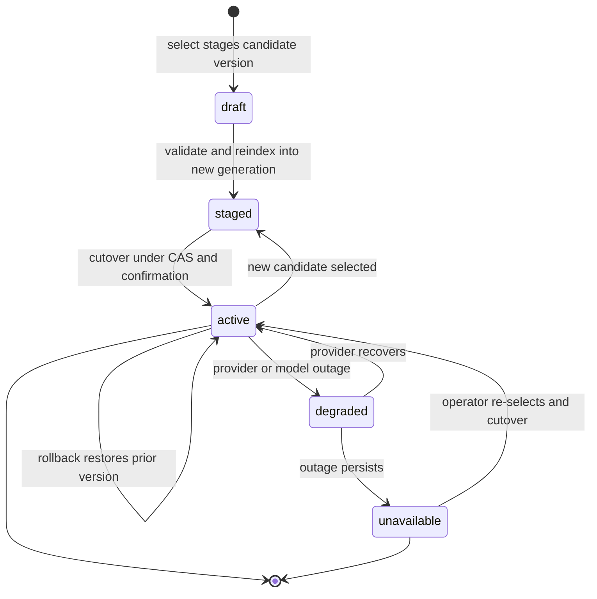
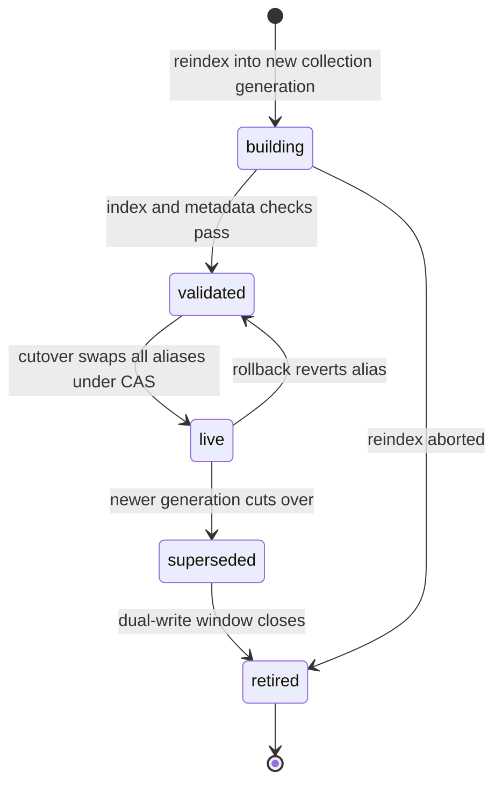
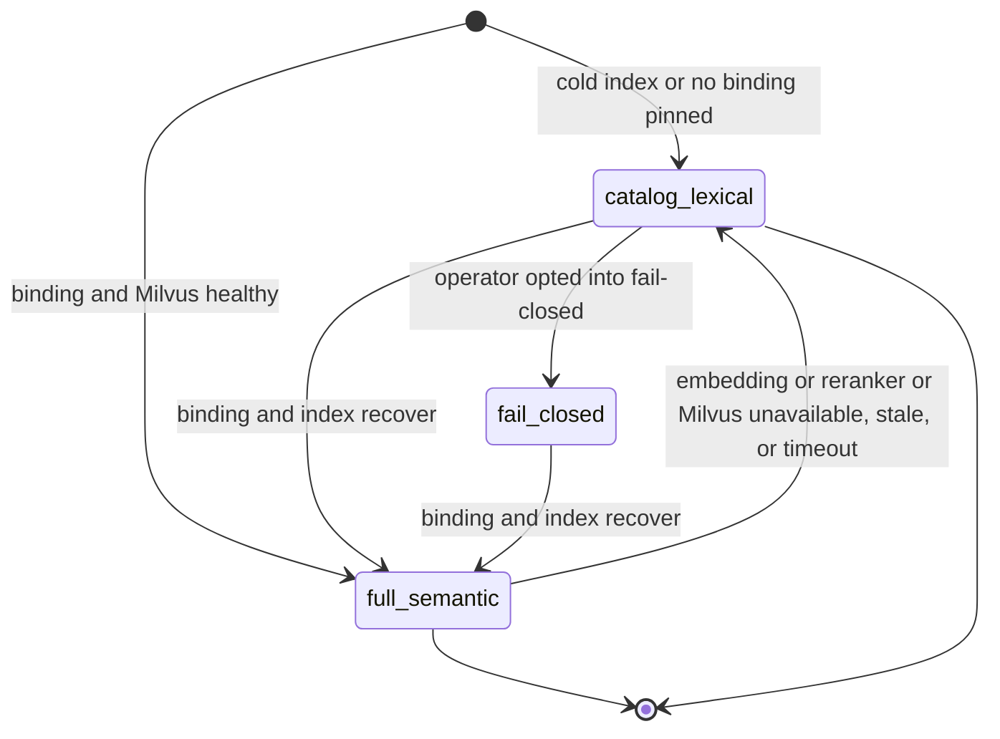

# Implementation Plan: Semantic Agent and Skill Retrieval (Feature 006)

Feature: 006-add-milvus-backed-multilingual-semantic-retrieval-and
Status target: planned (after this plan is complete)
Spec: [spec.md](spec.md) (status: planned; FR1–FR43, NFR1–NFR5, and clarification decisions C1–C22)
Research: [research.md](research.md)
Required ADR (now created): **[ADR-0008 Milvus-Backed Multilingual Semantic Retrieval and Reranking Stack](../../adr/0008-milvus-semantic-retrieval-stack.md)** (proposed)
Dependencies:
[Feature 001 Smart Agent Routing and Telemetry](../001-define-one-cohesive-smart-agent-routing-and-opentelemetry/spec.md) (hard-gate/ranking authority, Context/Turn/Delegation Budget, content-free OTEL cardinality),
[Feature 002 Task Lifecycle Event Bus and Process Table](../002-build-an-event-driven-asynchronous-task-lifecycle-engine/spec.md) (reindex/probe job lifecycle; binding-version metadata; Process Table observation),
[Feature 003 Scheduled Jobs and Async Main-Context Notification](../003-add-persistent-bun-native-scheduled-jobs-with-event/spec.md) (scheduled reconcile uses the current pinned binding; cannot change it),
[Feature 004 Lang Lock](../004-add-lang-lock-to-enforce-a-configurable-artifact-language/spec.md) (language metadata; multilingual query vs artifact language; human display labels),
[Feature 005 OutputSpool and ArtifactStore](../005-add-a-canonical-file-backed-outputspool-and-paged/spec.md) (index/probe job outputs and context slices as refs, never duplicated bodies),
[Feature 007 Operator Control Plane](../007-add-a-unified-native-operator-control-plane-for-all-opencode/spec.md) (Config.Service, PermissionV2, SecretPort, reserved `semantic.*` catalog),
[ADR-0001 Telemetry Foundation](../../adr/0001-opentelemetry-telemetry-foundation.md) (accepted),
[ADR-0002 Core Smart Agent Routing](../../adr/0002-core-smart-agent-routing.md) (accepted),
[ADR-0003 Operator Control Plane](../../adr/0003-operator-control-plane-and-native-command-authority.md) (accepted, sole management authority),
[ADR-0007 Semantic Tool Search](../../adr/0007-add-semantic-embedding-and-reranker-retrieval-to-all-tool.md) (proposed, tool-search consumer of this stack),
[ADR-0008 Milvus Semantic Retrieval Stack](../../adr/0008-milvus-semantic-retrieval-stack.md) (proposed, required decision record).

---

## Overview

Feature 006 delivers **Milvus-backed multilingual semantic retrieval and reranking**
for canonical OpenCode agents and skills. It is a derived projection that improves
candidate discovery for Feature 001 Smart Agent Routing and never becomes a second
registry, availability authority, permission authority, or route decider. Milvus is
the default/preferred backend behind one native adapter, never a hard runtime
dependency: an unreachable backend, an unpinned binding, or a down/stale/timeout
embedding or reranker degrades to a deterministic catalog + lexical/rules fallback with
an explicit typed reason and no silent model substitution. Every decision follows
ADR-0008 and the C1–C22 clarify resolutions.

The module name is **`semantic`** across every package
(`packages/schema/src/semantic/**`, `packages/protocol/src/semantic/**`,
`packages/core/src/semantic/**`, `packages/opencode/src/semantic/**`,
`packages/opencode/src/operator/semantic/**`, and the CUE mirrors under
`doc/arch/schemas/semantic/*.cue`).

- **Phase 1 — Schema and protocol semantic modules.** The SSOT value objects
  (`SemanticProviderProfile`, `SemanticModelDescriptor`, `SemanticModelBinding`), the
  binding-slot / compatibility-profile / capability / degradation-gap / consistency
  enums, the collection-document shapes (`agents`, `skills`, `skill_chunks`), the
  structured task profile and query fingerprint, the retrieval request/candidate/score
  value objects with provenance, the index-generation and alias descriptors, the
  content-free span/metric vocabulary, and the typed ports and `semantic.*` operator
  payloads. Additive schema/protocol modules; no runtime behavior change.
- **Phase 2 — Framework-free domain retrieval engine (`packages/core/src/semantic/**`).**
  The immutable nine-stage pipeline orchestrator, the deterministic
  rerank→dense→sparse→canonical-id tie-break, the hybrid dense+sparse fusion, the
  binding-lifecycle and index-generation state machines, the degradation ladder and
  capability-gap classifier, the query-embedding cache keyed by task fingerprint, the
  freshness/stale-confidence gate, the post-retrieval revalidation contract, and the
  document projection/content-hash logic — all over injected Milvus, embedding, rerank,
  clock, and core-state ports, no I/O in hot logic.
- **Phase 3 — Application, adapters, and operator wiring
  (`packages/opencode/src/semantic/**`).** The Milvus client adapter (standalone/Lite/
  Zilliz Cloud behind one port, fakes for tests), the embedding and rerank client
  adapters over the reused core OpenAI-compatible transport (`/v1/embeddings` probe;
  rerank profiles A/B/C), the SSRF-safe URL/DNS revalidation guard, the index
  upsert/tombstone/reconcile jobs on Feature 002 lifecycle with Feature 003 scheduled
  reconcile and Feature 005 OutputSpool for large outputs, the blue/green cutover
  executor under CAS, the SecretRef-only credential resolution over Feature 007
  SecretPort, and the Feature 007 `semantic.*` operator domain (30 reserved IDs, no
  catalog bump).
- **Phase 4 — CLI and TUI surfaces.** The CLI `opencode op semantic <op>` verbs and the
  TUI Semantic Search / Models panel over the `semantic.*` provider/model/binding/index
  commands, all thin adapters over the Feature 007 registry with registry-generated
  names, capability badges, current-binding state, and no secret exposure.
- **Phase 5 — Tests including the offline golden eval harness.** Unit (pure domain),
  integration (Milvus adapter against a standalone server; embedding/rerank probes
  against fakes), contract (`semantic.*` IDs vs the Feature 007 catalog; payloads vs
  `protocol/semantic/**`), fault-injection (degradation ladder, cutover CAS/rollback,
  SSRF/DNS-rebinding), and the offline golden eval harness (relevance, recall/ranking,
  multilingual pt/es/en, zero-leakage), covering AC1–AC41.

Management authority for every operator surface is Feature 007 (ADR-0003, accepted).
Feature 006 supplies typed domain query/command implementations, index-job lifecycle,
and content-free telemetry only; it never registers a parallel command registry (C15).

---

## Non-goals

- Implementing code during the plan phase.
- A second registry, availability authority, permission authority, or route decider
  beside AgentV2/SkillV2/Catalog/Permission and Feature 001 (FR1, FR2, C21).
- A hard runtime dependency on Milvus, the embedding provider, or the reranker (FR7,
  FR24, C1, C14, C20).
- Hardcoding an embedding/reranker/model product ID as the sole option, or letting an
  LLM/router/agent/plugin/MCP select or silently substitute a binding (FR6, FR31, C3,
  C20).
- Per-project collections or a collection per multi-root workspace (FR9, C6).
- An online self-optimizing or feedback-loop ranking policy in V1 (FR43, C13, C18).
- Inferring rerank capability from a `/v1/models` name (FR30, C16).
- Indexing secrets, full prompts, reasoning, or private filesystem paths (FR17, C4).
- A second embedding/rerank stack, Milvus adapter, or operator surface for Feature 009
  tools (ADR-0007, C21).
- Fixing topology constants, index parameters, `top_k`/latency budgets, chunk/cache
  constants, cutover alias grammar, SSRF denylist CIDRs, or eval thresholds —
  provisional plan constants with named acceptance hooks, finalized in the tasks phase
  (C1–C12, C16–C20, C22).

---

## Technical Approach

### Architecture layers

```
Adapters (inbound)
  CLI  opencode op semantic provider|model|embedding|reranker|binding|index <op>   (Feature 007 thin adapters)
  TUI/App  Semantic Search / Models panel: profiles, capability badges, current binding, degraded state
  Operator palette / native slash /op.semantic.<op>
        |
        v
Application (Feature 006 — packages/opencode/src/semantic/**)
  MilvusAdapter       — standalone/Lite/Zilliz behind one port; HNSW + native BM25 hybrid; fakes in tests (C1, C7)
  EmbeddingClient     — /v1/embeddings probe + query/doc embed over the reused OpenAI-compatible transport (C5)
  RerankClient        — profile A /v1/rerank | B structured chat | C embedding-similarity (distinct) (C16)
  UrlGuard            — SSRF-safe parse + post-resolution/post-redirect DNS revalidation; TLS default (C17)
  IndexJobs           — content-hash upsert / tombstone / reconcile on Feature 002 lifecycle + Feature 003 schedule (C22)
  CutoverExecutor     — blue/green collection-generation alias swap under CAS + operator confirmation (C12)
  CredentialResolver  — SecretRef-only via Feature 007 SecretPort; OS keychain; rotate-secret keeps identity (C19)
  Operator semantic domain — 30 reserved semantic.* typed command/query impls (via Feature 007) (C15)
        |
        v
Domain (Feature 006 core — packages/core/src/semantic/**, zero framework deps)
  Pipeline            — immutable nine-stage orchestrator; profile->filters->recall->rerank->score->revalidate (C2)
  TieBreak            — rerank->dense->sparse->canonical-id total order (C2)
  HybridFusion        — deterministic dense+sparse fusion (weighted / RRF) before tie-break (C7)
  BindingLifecycle    — validate/select/reindex/cutover/rollback; degraded/unavailable states (C12, C20)
  IndexGeneration     — blue/green generation lifecycle; one generation per binding; all collections together (C12)
  DegradationLadder   — full -> catalog+lexical/rules; typed capability-gap codes; no model substitution (C20)
  QueryCache          — query embedding by task fingerprint; invalidate by binding version + config hash (C10)
  FreshnessGate       — freshness/stale-confidence gate; always revalidate against live core (C11)
  Projection          — agent/skill/chunk document projection + content hash; sanitized fields only (C4, C9)
  SemanticInstruments — semantic.* spans/metrics extending Feature 001; content-free (C22)
        |
        v
Reused canonical points (existing — NOT re-implemented)
  AgentV2.Service / SkillV2.Service   — packages/core/src/agent.ts, skill.ts (identity/availability/permission authority)
  PermissionV2                         — packages/core/src/permission.ts (available(skills, agent); revalidation)
  OpenAI-compatible transport          — @ai-sdk/openai-compatible@2.0.41; packages/core/src/plugin/provider/openai-compatible.ts
  Context/Turn/Delegation Budget       — Feature 001 budget (retrieval_top_k / rerank_top_k / max_skill_chunks / token budgets)
  Reserved catalog                     — 30 semantic.* IDs (RESERVED_CATALOG_VERSION = 1.3.0), no bump
  Config.Service / PermissionV2 / SecretPort — Feature 007 config/authorization/secret backend
  Feature 002 lifecycle + Feature 003 schedule — reindex/probe/reconcile jobs; no LLM by default
  Feature 005 OutputSpool               — index/probe job outputs and context slices as refs
  Feature 001 TelemetryInstruments + OTLP exporter — bounded async content-free export
```

Dependency rule: adapters -> application -> domain. Domain MUST NOT import the Milvus
SDK, the HTTP/embedding/rerank transport, TUI/CLI/HTTP frameworks, Config.Service, or
the Bun runtime directly; it takes a Milvus port, an embedding port, a rerank port, a
core-state (AgentV2/SkillV2/Permission) read port, a clock/entropy port, and a
config-read port, and returns ranked candidates, projection documents, and decisions.
The application layer owns the `@zilliz/milvus2-sdk-node` gRPC client, the OpenAI-
compatible HTTP calls, the SSRF guard, and the durable index-job wiring; no consumer
receives a secret, a raw endpoint credential, or an unsanitized document body.

### Milvus and transport substrate (verified empirically)

- **Milvus TS SDK.** `@zilliz/milvus2-sdk-node` latest is **3.0.3**; it is a gRPC client
  (`@grpc/grpc-js ^1.14.3`, `@grpc/proto-loader`, `protobufjs`, `generic-pool`) and is
  **not currently a workspace dependency** (absent from `bun.lock` and every
  `package.json`). Adding it introduces a gRPC transitive stack; its behavior under the
  Bun runtime is a plan/tasks validation prerequisite (`research.md`).
- **No Milvus Lite for TS/Bun.** Milvus Lite is Python-only; there is **no `milvus-lite`
  npm package**. The typed consequence: the dev/test integration path is a **standalone
  Milvus server (container)**, and the unit-test path is **injected fakes/in-memory
  adapters** behind the Milvus port — the C1 "Lite for dev/test" allowance maps to
  standalone-server-plus-fakes in this ecosystem, recorded as an honest gap.
- **OpenAI-compatible transport reuse.** `@ai-sdk/openai-compatible@2.0.41` is already a
  workspace dependency in both `packages/core` and `packages/opencode`, and
  `packages/core/src/plugin/provider/openai-compatible.ts` already wires base URL,
  headers, and secret ref. The embedding probe calls `/v1/embeddings` over this transport;
  the reranker uses profile A (`/v1/rerank` adapter), B (structured chat/completions), or
  C (embedding-similarity, distinct). The AI SDK's embedding-model surface is verified in
  the tasks phase against the pinned version (`research.md`).
- **Reserved catalog present.** `packages/core/src/operator/catalog.ts` declares exactly
  30 `semantic.*` IDs at `RESERVED_CATALOG_VERSION = "1.3.0"`; **no additive bump is
  required** for Feature 006 (C15).

### Packages and modules (reuse first, no parallel authority)

| Concern | Existing location (reuse) | Feature 006 addition |
| ------- | ------------------------- | -------------------- |
| Agent authority | `packages/core/src/agent.ts:1-27` (AgentV2 registry/selection) | Project agent documents; revalidate candidates against live AgentV2 (FR1, FR20) |
| Skill authority | `packages/core/src/skill.ts:1-60`, `:121-132` (SkillV2 sources; `available(skills, agent)`) | Project skill summary + chunk documents; revalidate against SkillV2/Permission (FR1, FR20) |
| Permission | `packages/core/src/permission.ts` (PermissionV2 evaluate) | Mandatory scalar filters before search; post-retrieval permission revalidation (FR34) |
| OpenAI-compatible transport | `@ai-sdk/openai-compatible@2.0.41`; `packages/core/src/plugin/provider/openai-compatible.ts` | Embedding `/v1/embeddings` probe + rerank profiles over the same base-url/secret-ref transport (FR29, FR30, C5) |
| Budget policy | Feature 001 Context/Turn/Delegation Budget (`packages/schema/src/routing/budget.ts` `retrieval_top_k`/`rerank_top_k`) | Consume top_k / chunk / token budgets; fail-closed or degrade on excess (FR38, C8) |
| Reserved operator IDs | `packages/core/src/operator/catalog.ts` (`RESERVED_CATALOG_VERSION = 1.3.0`; 30 `semantic.*` IDs) | Register typed `semantic.*` domain impls via Feature 007 ports; **no catalog bump** (C15) |
| Authorization | `packages/core/src/operator/principal.ts`, `scope.ts`, Feature 007 PermissionV2 | Operator-only mutations; project/global scope; confirmation matrix (FR35, C15) |
| Secret backend | `packages/core/src/operator/secret.ts`, Feature 007 SecretPort | SecretRef-only provider/Milvus credentials; OS keychain; rotate-secret keeps identity (FR35, C19) |
| Lifecycle | Feature 002 lifecycle (`packages/core/src/lifecycle/**`) | Reindex/probe/reconcile jobs; binding-version metadata; Process Table observation (FR13, C22) |
| Schedule | Feature 003 scheduler (`packages/core/src/jobs/**`) | Scheduled reconcile with the current pinned binding; coalesced triggers (FR13, C22) |
| Content plane | Feature 005 OutputSpool (`packages/*/src/outputspool/**`) | Index/probe job outputs and skill chunk injection as refs, never duplicated bodies (FR40, C9) |
| Telemetry | `packages/core/src/observability/otlp.ts`, Feature 001 instruments | `semantic.*` spans/metrics reusing bounded-cardinality helpers; content-free (FR41, FR42, C22) |
| Schema / Protocol | `packages/schema`, `packages/protocol` | `semantic` schema (new), retrieval/document/command payloads (new) |
| CLI / TUI | `packages/cli`, `packages/opencode/src/cli/cmd/op.ts`, `packages/tui/src/**/operator/**` | `opencode op semantic <op>` verbs + TUI Semantic Search / Models panel (FR29) |
| Milvus backend | none today (`@zilliz/milvus2-sdk-node` absent from `bun.lock`) | New Milvus client adapter behind one port; standalone default, fakes in tests (FR7, C1) |

**New module tree target:**

```
packages/schema/src/semantic/                  # new — schema authority (SSOT for C28 records)
  provider-profile.ts  # SemanticProviderProfile VO: id, version, base_url, compat profile, TLS policy, secret_ref, residency, enabled (FR28, C4)
  model-descriptor.ts  # SemanticModelDescriptor VO: model ref, provider ref, source, capability kinds, endpoint mode, dims/limits, validation provenance (FR28, C16)
  binding.ts           # SemanticModelBinding VO: slot, immutable version, provider/model refs, compat mode, capability contract, selected_by/at, config hash, index generation/alias refs (FR28, C12)
  enums.ts             # Slot (embedding|reranker), CompatProfile (A|B|C), Consistency (bounded|strong), CapabilityKind, Metric, BindingState (active|degraded|unavailable), DegradationGap (FR30, C6, C16, C20)
  documents.ts         # AgentDoc / SkillDoc / SkillChunkDoc projections: canonical id/version/hash, sanitized fields, language tags, scalar project key (FR10, FR11, C4, C9)
  profile.ts           # structured TaskProfile + QueryFingerprint value objects (FR18, C10)
  retrieval.ts         # RetrievalRequest (top_k caps), Candidate, SemanticScore (provenance/components/confidence) (FR19, FR22)
  index-generation.ts  # IndexGeneration + CollectionAlias descriptors; blue/green generation (FR12, C12)
  events.ts            # semantic.* durable index/cutover event closed vocabulary, one Struct per event (C22)
  index.ts
packages/protocol/src/semantic/                # new — typed transport contracts / ports
  ports.ts             # MilvusPort, EmbeddingPort, RerankPort, CoreStatePort, ClockPort, EntropyPort, ConfigReadPort, SecretResolvePort (application/domain boundary)
  commands.ts          # retrieval request/response + 30 semantic.* operator command/query payloads (FR3, C15)
  index.ts
packages/core/src/semantic/                    # new — framework-free domain engine
  pipeline.ts          # immutable nine-stage orchestrator (FR3, C2)
  tie-break.ts         # rerank->dense->sparse->canonical-id total order (FR19, C2)
  hybrid-fusion.ts     # deterministic dense+sparse fusion before tie-break (FR19, C7)
  binding-lifecycle.ts # validate/select/reindex/cutover/rollback; degraded/unavailable transitions (FR31, FR32, C12, C20)
  index-generation.ts  # blue/green generation lifecycle; all collections cut over together (FR12, C12)
  degradation.ts       # typed capability-gap ladder; full -> catalog+lexical/rules; no substitution (FR24, C20)
  query-cache.ts       # query embedding by task fingerprint; invalidate by binding version + config hash (FR18, FR25, C10)
  freshness-gate.ts    # freshness/stale-confidence gate; always revalidate against live core (FR20, FR27, C11)
  projection.ts        # agent/skill/chunk projection + content hash; sanitized-field enforcement (FR10, FR11, FR17, C4, C9)
  semantic-instruments.ts # semantic.* spans/metrics extending Feature 001; content-free (FR41, FR42, C22)
  index.ts
packages/opencode/src/semantic/                # new — application + adapters
  milvus-adapter.ts          # standalone/Lite/Zilliz behind one port; HNSW + native BM25 hybrid; fake in tests (FR7, C1, C7)
  embedding-client.ts        # /v1/embeddings probe + query/doc embed over the reused transport (FR30, C5)
  rerank-client.ts           # profile A /v1/rerank | B structured chat | C embedding-similarity (FR30, C16)
  url-guard.ts               # SSRF-safe parse + post-resolution/post-redirect DNS revalidation; TLS default (FR33, C17)
  index-jobs.ts              # content-hash upsert / tombstone / reconcile on Feature 002 + Feature 003 (FR13, C22)
  cutover-executor.ts        # blue/green alias swap under CAS + operator confirmation; rollback (FR32, C12)
  credential-resolver.ts     # SecretRef-only via Feature 007 SecretPort; rotate-secret keeps identity (FR35, C19)
  eval-harness.ts            # offline golden eval driver; relevance/recall/ranking/multilingual/leakage; never mutates bindings (FR43, C18)
  index.ts
packages/opencode/src/operator/semantic/       # new — Feature 007 semantic.* domain impls (30 IDs, no bump) (C15)
packages/cli/src/**/semantic/                   # new — opencode op semantic ... commands
packages/tui/src/**/operator/semantic/          # new — Semantic Search / Models panel (FR29)
doc/arch/schemas/semantic/*.cue                 # new — CUE mirrors (calisthenics-compliant)
```

CUE data-model companions mirror the schema modules under
`doc/arch/schemas/semantic/*.cue`, following the Feature 001/002/003/004/005
calisthenics style: every entity field is a `#ValueObject` reference (bare string/bool
entity fields are wrapped), each file carries a `// DDD role:` header, snapshots and
enums are `ValueObject` not `Entity`, an `Entity`/`AggregateRoot` carries an id, a
`ValueObject` holds no identifiable, each entity keeps at most seven direct fields,
first-class collections replace bare arrays, and each file stays under the
ten-definition warning bound.

---

## Incremental slices

| Slice | Name | Delivers | Phase | Depends |
| ----- | ---- | -------- | ----- | ------- |
| S0 | Provider/model/binding SSOT | `provider-profile.ts`, `model-descriptor.ts`, `binding.ts`: the three SSOT records with immutable binding version, provider/model refs, compat mode, index generation/alias refs, no embedded secrets (FR28, C3, C12) | 1 | — |
| S1 | Enums | `enums.ts`: Slot, CompatProfile A/B/C, Consistency, CapabilityKind, Metric, BindingState, DegradationGap (FR30, C6, C16, C20) | 1 | — |
| S2 | Collection documents | `documents.ts`: AgentDoc / SkillDoc / SkillChunkDoc projections; canonical id/version/hash; sanitized fields; scalar project key; language tags; `parent_skill_id`/`chunk_id` (FR10, FR11, C4, C9) | 1 | S1 |
| S3 | Profile + retrieval shapes | `profile.ts` TaskProfile/QueryFingerprint, `retrieval.ts` RetrievalRequest/Candidate/SemanticScore with provenance/components/confidence (FR18, FR19, FR22) | 1 | S1 |
| S4 | Index generation + events | `index-generation.ts` IndexGeneration/CollectionAlias, `events.ts` semantic.* index/cutover closed vocabulary (FR12, C12, C22) | 1 | S0 |
| S5 | Protocol ports + payloads | `protocol/semantic/ports.ts` (Milvus/embedding/rerank/core-state/clock/entropy/config/secret ports), `commands.ts` retrieval + 30 `semantic.*` payloads (FR3, C15) | 1 | S0, S1, S2, S3, S4 |
| S6 | Pipeline orchestrator | `pipeline.ts` immutable nine-stage order: profile->filters->recall->candidate set->rerank->score->agent->skill->revalidate (FR3, C2, AC2, AC3) | 2 | S3 |
| S7 | Tie-break + hybrid fusion | `tie-break.ts` rerank->dense->sparse->canonical-id; `hybrid-fusion.ts` deterministic dense+sparse fusion (FR19, C2, C7, AC1, AC17) | 2 | S6 |
| S8 | Binding lifecycle | `binding-lifecycle.ts` validate/select/reindex/cutover/rollback; degraded/unavailable; in-flight version pinning; no mid-task switch (FR31, FR32, C12, C20, AC27, AC31, AC33) | 2 | S0 |
| S9 | Index generation lifecycle | `index-generation.ts` blue/green generation; select/reindex never activate alias; all collections cut over together (FR12, C12, AC9, AC31, AC41) | 2 | S4, S8 |
| S10 | Degradation ladder | `degradation.ts` typed capability-gap codes; full -> catalog+lexical/rules; never auto-substitute; fail-closed opt-in (FR24, C14, C20, AC7, AC8, AC29) | 2 | S1 |
| S11 | Query-embedding cache | `query-cache.ts` embed once per task fingerprint; reuse across agent/skill passes; invalidate by binding version + config hash (FR18, FR25, C10, AC16) | 2 | S3 |
| S12 | Freshness gate + revalidation | `freshness-gate.ts` freshness/stale-confidence gate; always revalidate candidates against live AgentV2/SkillV2/Permission (FR20, FR27, C11, AC4, AC5) | 2 | S3 |
| S13 | Projection + content hash | `projection.ts` agent/skill/chunk projection; content-hash incremental upsert; sanitized-field enforcement strips secrets/prompts/reasoning/paths (FR10, FR11, FR17, C4, C9, AC10) | 2 | S2 |
| S14 | Semantic telemetry | `semantic-instruments.ts` `semantic.profile|embed.query|retrieve.agents|rerank.agents|retrieve.skills|rerank.skills|semantic.fallback|index.upsert|index.reconcile` spans; bounded-label metrics; no id/query/vector labels (FR41, FR42, C22, AC15) | 2 | S6, S10 |
| S15 | Milvus adapter | `milvus-adapter.ts` standalone/Lite/Zilliz behind one port; HNSW + cosine/IP; Milvus-native sparse/BM25 hybrid; mandatory scalar filters; `milvus_unavailable` typed gap; fake adapter (FR7, FR9, C1, C6, C7, AC6, AC7) | 3 | S5, S7 |
| S16 | Embedding client | `embedding-client.ts` `/v1/embeddings` deterministic probe (dimension/normalization/limits); query/doc embed over the reused transport; batch caps (FR30, C5, C8, AC19, AC23) | 3 | S5 |
| S17 | Rerank client | `rerank-client.ts` profile A `/v1/rerank` adapter; B structured chat deterministic schema/temperature/tool-free; C embedding-similarity distinct, never reranker-eligible (FR30, C16, AC24, AC25, AC26, AC34) | 3 | S5 |
| S18 | SSRF URL guard | `url-guard.ts` SSRF-safe parse; scheme/host/port policy; post-resolution + post-redirect DNS revalidation; TLS default; local-profile insecure allowance (FR33, C17, AC36, AC38) | 3 | S16, S17 |
| S19 | Index jobs | `index-jobs.ts` content-hash upsert / tombstone / reconcile on Feature 002 lifecycle; Feature 003 scheduled reconcile with the current pinned binding; Feature 005 OutputSpool for outputs (FR13, C22, AC10, AC13) | 3 | S13, S15 |
| S20 | Cutover executor | `cutover-executor.ts` blue/green alias swap under CAS + operator confirmation; all collections together; rollback; caches invalidated by binding/version (FR12, FR32, C12, AC31, AC32, AC33) | 3 | S9, S15 |
| S21 | Credential resolver | `credential-resolver.ts` SecretRef-only via Feature 007 SecretPort; OS keychain; env-ref CI-only; rotate-secret keeps endpoint/model/binding identity (FR35, C19, AC20, AC30, AC35) | 3 | S18 |
| S22 | Operator semantic domain | `operator/semantic/**` typed impls for the 30 `semantic.*` IDs; provider/model/embedding/reranker/binding/index; confirmation matrix; reserved-ID collision rejection; operator-only, zero-LLM management (FR35, C15, AC14, AC28, AC37, AC39) | 3 | S8, S20, S21 |
| S23 | Offline golden eval harness | `eval-harness.ts` golden task->agent/skill relevance; recall@k / nDCG / MRR; multilingual pt/es/en; permission-leakage; drift/migration; never mutates bindings; zero-leakage tolerance (FR43, C18, AC40) | 3 | S6, S12, S22 |
| S24 | CLI + TUI surfaces | `cli/**/semantic/**` `opencode op semantic <op>`; `tui/**/operator/semantic/**` Semantic Search / Models panel; capability badges; current-binding state; degraded status; no secret exposure (FR29, AC19, AC21, AC22) | 4 | S22 |
| S25 | Tests + validation | Unit (pipeline/tie-break/fusion/binding/degradation/cache/freshness/projection), integration (Milvus adapter vs standalone server; embedding/rerank probes vs fakes), contract (`semantic.*` vs catalog; payloads vs protocol), fault-injection (degradation, cutover CAS/rollback, SSRF/DNS-rebinding), offline golden eval (all AC1–AC41) | 5 | all |

---

## Data model and persistence strategy

Entity definitions are finalized in the `data-model.md` companion and the
`doc/arch/schemas/semantic/*.cue` schemas. Authority is single-sourced: AgentV2/SkillV2/
Catalog/Permission/Config remain the sources of truth, and Milvus is a **derived,
rebuildable projection** — no shape is a second store of record beside them, and no
consumer receives a secret or an unsanitized body.

### Milvus collections and partitioning (FR9, C6)

Three separate conceptual collections — `agents`, `skills`, `skill_chunks` — under one
binding generation, with the namespace extensible for the Feature 009 `tools` collection
(C21). Tenant/project/scope/visibility/role are scalar metadata with **mandatory filters
on every search**; per-project isolation uses a **scalar project partition key**, never
per-project collections, so multi-root workspaces never trigger collection explosion.
Dense vectors use an HNSW index with the binding's stored metric (cosine / inner-product
on normalized vectors); sparse recall uses Milvus-native sparse/BM25. Consistency is
Bounded staleness by default, Strong for admin verification reads. Partition grammar, the
scalar field set, HNSW/BM25 parameters, and the bounded-staleness window are provisional
plan constants with acceptance hooks AC1, AC5, AC6, AC17, AC41.

### Binding-with-collection metadata (FR12, C12)

Embedding binding version, model ID, dimension, normalization, and distance metric are
stored **with the collection generation**. Incompatible vectors are never mixed in one
search space. Embedding binding/model/dimension changes use blue/green collection
generations and the explicit `semantic.embedding.cutover` under CAS/confirmation, never
implicit activation on select or reindex. All collections in a binding generation cut
over together under one CAS. The alias grammar, dual-write window, and in-flight
retention horizon are provisional plan constants with acceptance hooks AC9, AC31, AC32,
AC33, AC41.

### Documents and sanitization (FR10, FR11, FR17, C4, C9)

Agent documents carry canonical ID/version/hash, role/mode, description, domains,
capabilities/tools, permission profile/ref, scope/project, language tags, and
enabled/available metadata; volatile health/cost are never authority fields in the
vector document. Skill summary documents and chunks carry canonical skill
ID/version/hash/source, name, description, triggers, domains, capabilities, compatible
roles/agents, permissions, token/context cost estimate, language, and
`parent_skill_id`/`chunk_id`. Full-body chunking is bounded, sanitized (secrets,
prompts, reasoning, and paths stripped), and injected only after selection under the C8
budget via Feature 005 refs. Chunk size, overlap, the sanitization allowlist, and the
residency-enforcement point are provisional plan constants with acceptance hooks AC12,
AC15, AC19, AC20.

### SSOT records (FR28)

Feature 006 owns the field definitions of `SemanticProviderProfile`,
`SemanticModelDescriptor`, and `SemanticModelBinding`; Feature 007 references these
schemas and exposes operator commands without redefining or diverging field sets.
Records never embed secrets on descriptors or bindings; credentials are SecretRefs only
(C19).

---

## API and command contracts

### Native retrieval ports (C2, C20)

The domain exposes typed ports; the application layer owns the Milvus gRPC client and the
OpenAI-compatible HTTP calls. `retrieval_top_k`/`rerank_top_k` are server-capped from the
Feature 001 budget, and no consumer receives a secret or an unsanitized body.

| Port operation | Signature intent | Stage |
| -------------- | ---------------- | ----- |
| `profile(task)` | Build the structured TaskProfile + QueryFingerprint | 1 |
| `filter(profile, scope)` | Mandatory scalar predicates before search | 2 |
| `recall(profile, top_k)` | Hybrid dense+sparse recall over the current generation | 3 |
| `rerank(candidates, top_k)` | Reduce to `rerank_top_k` via the pinned reranker profile | 5 |
| `score(candidates)` | Deterministic routing score + tie-break; provenance/components | 6 |
| `revalidate(candidates)` | Post-retrieval check against live AgentV2/SkillV2/Permission | 9 |
| `embedQuery(profile)` | Cached query embedding by task fingerprint | 1 |
| `upsert(doc)` / `tombstone(id)` | Content-hash incremental index maintenance | — |

### Operator command surface (C15, registered via Feature 007)

Canonical dotted IDs under the reserved `semantic.*` domain, owned by Feature 007 per
ADR-0003; Feature 006 supplies typed domain implementations, index-job lifecycle, and
content-free telemetry only. Native slash is intercepted before prompt admission; ordinary
status/show/select/config invoke no model; explicit validate/test call the candidate
endpoint via a fixed native probe only (no conversation/transcript/tools) with cost/data
disclosure. The registry generates palette labels, slash aliases (`/op.semantic.<op>`),
and CLI verbs (`opencode op semantic <op>`). Reserved IDs are never registered by
plugin/MCP/custom registries.

| Group | IDs | Mutates | Default scope |
| ----- | --- | ------- | ------------- |
| `semantic.provider.*` | `list`, `add`, `update`, `test`, `disable`, `delete`, `rotate-secret` | list/test no; others yes | project (list global-or-project) |
| `semantic.model.*` | `list`, `discover`, `register`, `validate`, `disable` | list/discover/validate no; register/disable yes | project (list global-or-project) |
| `semantic.embedding.*` | `show`, `select`, `validate`, `reindex`, `cutover`, `rollback` | show/validate no; select/reindex/cutover/rollback yes | project |
| `semantic.reranker.*` | `show`, `select`, `validate`, `cutover`, `rollback` | show/validate no; others yes | project |
| `semantic.binding.*` | `status`, `history` | no (read-only) | global-or-project |
| `semantic.index.*` | `status`, `test`, `reindex`, `reconcile`, `show-collections` | status/test/show no; reindex/reconcile yes | global-or-project |

`cutover`, `rollback`, `delete`/`disable`-when-bound, and `rotate-secret` require
interactive confirmation. Binding mutation happens only via `embedding.select`/`cutover`
and `reranker.select`/`cutover`; the `semantic.binding.*` pair is read-only.

**Reserved-catalog finding.** `packages/core/src/operator/catalog.ts` is at
`RESERVED_CATALOG_VERSION = "1.3.0"` and already declares all **30** `semantic.*` IDs. No
additive bump task is required; Feature 006 reuses the existing catalog surface and
registers only typed domain impls, index-job lifecycle, and telemetry (C15).

---

## State machines

### Binding lifecycle with blue/green cutover (C12, C20)

A binding is `draft` after `select` stages a candidate version; `validate` and — for an
embedding dimension change — `reindex` into a new collection generation move it to
`staged` without activating the live alias; `cutover` under CAS + confirmation activates
it to `active`; a provider/model outage moves an active binding to `degraded` and then
`unavailable`; `rollback` returns a superseded version to `active`.



### Index generation lifecycle (C12)

A generation is `building` during blue/green reindex, `validated` once index checks pass,
`live` after the atomic alias swap (all collections together), `superseded` when a newer
generation cuts over, and `retired` after the dual-write window closes.



### Degradation ladder (C14, C20)

Retrieval runs at `full_semantic` when the binding and Milvus are healthy. A pinned
embedding/reranker outage, a Milvus/index outage, staleness, or a timeout drops to
`catalog_lexical` with a typed capability-gap code; an empty/cold index or no pinned
binding starts at `catalog_lexical`. The system never auto-selects another model; recovery
returns to `full_semantic`. Fail-closed is operator opt-in.



---

## Security and threat boundaries

| Threat | Mitigation |
| ------ | ---------- |
| SSRF / DNS rebinding to metadata, link-local, or private ranges | SSRF-safe URL parse; scheme/host/port policy; post-resolution + post-redirect DNS revalidation; blocked ranges unless an explicit local-profile allowance; TLS default (FR33, C17, AC36, AC38) |
| Secret leak in config, history, output, or audit | SecretRef-only provider/Milvus credentials via Feature 007 SecretPort; OS keychain mandatory; env-ref CI-only; rotate-secret changes secret_ref/version only; redacted audit (FR35, C19, AC20, AC30, AC35) |
| Cross-project or over-permission retrieval leakage | Mandatory scalar filters before search; scalar project partition key; post-retrieval revalidation against live core; zero-leakage eval tolerance (FR34, C6, C11, C18, AC4, AC6, AC11) |
| Stale-index authority (disabled agent / removed skill still indexed) | Bounded-staleness projection; freshness gate; every candidate revalidated against live AgentV2/SkillV2/Permission before injection (FR20, FR27, C11, AC5) |
| Malicious skill/agent description claiming elevated permissions | Descriptions are ranking signal only; Permission/Policy and hard gates ignore the claim; revalidation authoritative (FR36, AC11) |
| Secrets/prompts/reasoning/paths in the index | Projection sanitizes to an allowlist; secrets/prompts/reasoning/paths stripped from documents and chunks (FR17, C4, C9) |
| LLM/router/agent/plugin/MCP altering bindings or profiles | Bindings mutate only via Feature 007 operator commands; runtime never mutates from telemetry; plugin/MCP/custom cannot register reserved IDs (FR31, FR36, C15) |
| Silent model substitution on outage | Typed degradation ladder; binding state degraded/unavailable; never auto-select another embedding/reranker; no fallback pool in V1 (FR24, FR31, C20, AC29) |
| Rerank capability spoofed by model name | Rerank never inferred from `/v1/models` name; explicit profile A/B/C + passing native probe/eval; profile C never reranker-eligible (FR30, C16, AC24, AC34) |
| Unbounded recall / candidate memory | `retrieval_top_k`/`rerank_top_k`/chunk budgets from the Feature 001 budget; fail-closed or degrade on excess; bounded candidate memory (FR38, NFR3, C8, AC17) |
| Content leak in telemetry/audit | Content-free spans/metrics; labels never carry query text, vectors, entity IDs, session IDs, or paths (FR42, ADR-0001, C22, AC15) |
| Reserved namespace hijack | 30 `semantic.*` IDs reserved in the Feature 007 catalog at 1.3.0; plugin/MCP/custom collisions rejected (C15, AC39) |

---

## Testing matrix

| Layer | Scope | How |
| ----- | ----- | --- |
| Unit | Pipeline order, tie-break total order, hybrid fusion determinism, binding lifecycle, degradation ladder, query-cache invalidation, freshness gate, projection/content hash + sanitization | Pure tests; deterministic Milvus/embedding/rerank/core-state/clock ports; no I/O |
| Integration (Milvus) | HNSW + cosine/IP dense recall, Milvus-native sparse/BM25 hybrid, mandatory scalar filters, `milvus_unavailable` typed gap, upsert/tombstone/reconcile | Standalone Milvus server (container); fake adapter for the pure path; AC6, AC7, AC10 |
| Probe / eval | `/v1/embeddings` deterministic probe (dimension/normalization/limits); rerank profile A/B/C probe; manual-declaration untrusted until validated; profile C never reranker-eligible; offline golden relevance/recall/nDCG/MRR; multilingual pt/es/en | Fakes + fixtures; offline golden harness; AC19, AC22, AC23, AC24, AC25, AC26, AC34, AC40 |
| Degradation | Milvus down, reranker timeout, embedding down, cold index, no binding pinned; typed gap code; catalog + lexical/rules floor; no model substitution; fail-closed opt-in | Injected outage on each port; AC7, AC8, AC18, AC29 |
| Cutover fault matrix | select/reindex do not activate alias; cutover CAS success/contention; all collections together; rollback; in-flight version pinning; no mid-task switch; no vector mixing | Injected CAS contention + generation state; AC9, AC31, AC32, AC33, AC41 |
| SSRF / DNS | Metadata/link-local/private target blocked; non-TLS remote rejected; local-profile insecure allowance with warning; post-resolution + post-redirect revalidation (DNS rebinding) | Injected resolver + redirect; AC36, AC38 |
| Contract | 30 `semantic.*` IDs vs the Feature 007 reserved catalog (already 1.3.0); reserved-ID collision rejection; retrieval + `semantic.*` payloads vs `protocol/semantic/**` | Spec-driven; specScopeGlobs enforced; AC14, AC39 |
| Security / privacy | Cross-project isolation; over-permission drop; sanitized-field enforcement; SecretRef-only; content-free telemetry; leakage tolerance zero | Isolation harness; cardinality + content-free assertions; AC4, AC6, AC11, AC15, AC20 |
| Surface parity | Same binding select/validate from Settings, palette, slash, or CLI yields the same effective binding/version/audit with zero admin transcript injection and zero management-path LLM tokens | Feature 007 sandbox; AC39 |

Acceptance coverage maps every scenario AC1–AC41 to a slice. Provisional numeric
constants (Milvus/pool sizing, HNSW/BM25 params, score-fusion weights, `top_k`/latency
budgets, chunk/cache constants, cutover alias grammar, SSRF denylist CIDRs, eval
thresholds) carry named acceptance hooks and are fixed in the tasks phase.

---

## Observability alignment

- `semantic.*` spans `semantic.profile`, `embed.query`, `retrieve.agents`,
  `rerank.agents`, `retrieve.skills`, `rerank.skills`, `semantic.fallback`,
  `index.upsert`, and `index.reconcile` link to session, routing, LLM, and job spans
  (FR41, C22).
- Metric labels reuse the Feature 001 bounded enums and the cardinality allowlist;
  over-budget values map to `other`.
- Metrics: retrieval latency buckets; candidates before/after; cache hit; fallback/stale
  counts; rerank delta buckets; selected semantic rank buckets; index freshness buckets;
  failures (FR42).
- Query text, vectors, entity IDs, session IDs, and paths never appear as metric labels;
  opaque correlation IDs may correlate traces/logs only (FR42, ADR-0001, C22, AC15).
- The route/retrieval decision records the effective binding versions and the Feature 004
  language tag without content (FR16, spec Audit table).
- OTLP export is asynchronous and bounded through the Feature 001 exporter and never
  blocks the hot path; when export is unavailable retrieval continues and metric loss does
  not block routing.
- Feature 006 adds no new exporter, SDK, or pipeline; it reuses ADR-0001/Feature 001 and
  the single telemetry authority (C22).

---

## Proposed specScopeGlobs (tasks/implement phase)

Narrow, file-exact globs to add to `doc/arch/speckit.toml` in the tasks phase — **not
applied by this plan**. Feature 001/002/003/004/005/007 TOML paths are preserved
unchanged; existing shared seams (`packages/core/src/operator/**`,
`packages/opencode/src/operator/**`, `packages/tui/src/**/operator/**`,
`packages/schema/src/index.ts`, `packages/schema/test/**`, `packages/protocol/test/**`)
already cover the reused operator/schema points and are not duplicated. The reserved-
catalog file `packages/core/src/operator/catalog.ts` already carries the 30 `semantic.*`
entries at version 1.3.0 and needs no bump. The plan-phase corpus lives under the
always-derived `doc/arch/sdd/006-.../**` scope and needs no glob addition; adding
`@zilliz/milvus2-sdk-node` to `bun.lock`/`package.json` is a dependency task noted for
traceability.

```toml
specScopeGlobs = [
  # Feature 006 — Semantic Agent and Skill Retrieval (new implement paths).
  "packages/schema/src/semantic/**",
  "packages/protocol/src/semantic/**",
  "packages/core/src/semantic/**",
  "packages/opencode/src/semantic/**",
  "packages/opencode/src/operator/semantic/**",
  "packages/cli/src/**/semantic/**",
  "packages/tui/src/**/operator/semantic/**",
  "packages/schema/test/semantic/**",
  "packages/protocol/test/semantic/**",
  "packages/core/test/semantic/**",
  "packages/opencode/test/semantic/**",
  # Dependency task (listed for traceability; adds the Milvus gRPC SDK):
  # "package.json",                                   # add @zilliz/milvus2-sdk-node
  # "bun.lock",                                       # lock the Milvus SDK + gRPC transitive stack
]
```

---

## Feature cross-dependencies

| Feature | Dependency | Interaction |
| ------- | ---------- | ----------- |
| 001 Smart Routing | Hard-gate/ranking authority; Context/Turn/Delegation Budget (`retrieval_top_k`/`rerank_top_k`/`max_skill_chunks`/token budgets); content-free OTEL | S6, S11, S14 (FR3, FR38, C2, C8, C22) |
| 002 Task Lifecycle | Reindex/probe/reconcile job lifecycle; binding-version metadata; Process Table observation without raw queries | S19 (FR13, C22) |
| 003 Scheduled Jobs | Scheduled reconcile with the current pinned binding; coalesced triggers; no LLM by default | S19 (FR13, C22) |
| 004 Lang Lock | Language metadata; multilingual query vs artifact language; effective tag on the decision without content | S3, S13, S23 (FR14, FR16, C4) |
| 005 OutputSpool | Index/probe job outputs and skill-chunk injection as refs; never duplicate full bodies into context | S13, S19 (FR40, C9) |
| 007 Operator Control Plane | Sole management authority for the 30 `semantic.*` IDs; Config.Service; PermissionV2; SecretPort; reserved catalog already at 1.3.0 | S21, S22 (FR28, FR35, C15, C19) |
| 008 MCP Tools/Resources | Optional MCP resource semantic-index opt-in with classification; Feature 006 stack ownership unchanged | spec Related (C21) |
| 009 Semantic Tool Search | Reuses this stack, the pinned bindings, the C20 ladder, the multilingual posture, and telemetry; owns only the `tools` collection | spec Related, ADR-0007 (C21) |

---

## Validation checklist (plan complete when)

- [x] Milvus is a derived projection, never a second registry/availability/permission/
      route authority; AgentV2/SkillV2/Catalog/Permission/Config remain sources of truth
      (FR1, FR2, C21)
- [x] Milvus is the default/preferred backend behind one adapter, never a hard runtime
      dependency; `milvus_unavailable` typed gap; standalone default, Lite/fakes for
      dev/test (FR7, C1, C14)
- [x] The nine-stage pipeline is immutable with a deterministic
      rerank->dense->sparse->canonical-id tie-break (FR3, FR19, C2)
- [x] No hardcoded models; effective embedding/reranker are operator-pinned
      `SemanticModelBinding` slots; no LLM/router/agent/plugin/MCP selects or substitutes
      them (FR6, FR28, FR31, C3, C20)
- [x] Three separate collections with a scalar project partition key and mandatory
      filters on every search; no per-project collection explosion; bounded-staleness
      consistency (FR9, FR34, C6)
- [x] HNSW + cosine/IP on normalized vectors; Milvus-native sparse/BM25 fused
      deterministically before tie-break (FR19, C7)
- [x] `retrieval_top_k`/`rerank_top_k`/`max_skill_chunks`/token budgets consumed from the
      Feature 001 budget; fail-closed or degrade on excess (FR38, C8)
- [x] Skills lazy; summary first; bounded sanitized chunks injected post-selection via
      Feature 005 refs; secrets/prompts/reasoning/paths stripped (FR11, FR17, FR39, FR40,
      C4, C9)
- [x] Query embedding cached by task fingerprint; reused across passes; invalidated by
      binding version + config hash; no per-token/turn remote loop (FR18, FR25, NFR4, C10)
- [x] Freshness/stale-confidence gate; every candidate revalidated against live
      AgentV2/SkillV2/Permission before injection (FR20, FR27, C11)
- [x] Blue/green collection generations; select/reindex never activate the alias; atomic
      `semantic.embedding.cutover` under CAS; all collections together; rollback;
      in-flight version pinning; no vector mixing (FR12, FR32, C12)
- [x] No feedback loop / online self-optimizing policy in V1; strict two-pass (FR21, FR43,
      C13, C18)
- [x] Typed degradation ladder full -> catalog+lexical/rules with a stable gap code;
      never auto-substitute a model; no fallback pool; fail-closed opt-in (FR24, FR31,
      C14, C20)
- [x] Rerank profiles A/B/C explicit; profile C never reranker-eligible; rerank never
      inferred from a model name; manual declarations untrusted until probe/eval (FR30,
      C16)
- [x] SSRF-safe URLs; post-resolution + post-redirect DNS revalidation; TLS default;
      local-profile insecure allowance with warning (FR33, C17)
- [x] SecretRef-only provider/Milvus credentials via Feature 007 SecretPort; OS keychain;
      env-ref CI-only; rotate-secret keeps identity; no plaintext anywhere (FR35, C19)
- [x] Offline golden eval harness (relevance/recall/nDCG/MRR/multilingual/leakage); never
      mutates bindings; zero cross-project/over-permission leakage tolerance (FR43, C18)
- [x] Content-free `semantic.*` spans/metrics; bounded labels with no query/vector/id/
      path; bounded candidate memory; breaker on the same pinned binding (FR41, FR42,
      NFR3, C22)
- [x] All management through the 30 reserved `semantic.*` IDs at
      `RESERVED_CATALOG_VERSION = 1.3.0`; operator-only; confirmation matrix; **no catalog
      bump**; plugin/MCP/custom collisions rejected (FR35, C15)
- [x] Module name `semantic` used across schema/protocol/core/opencode/operator and the
      CUE mirrors
- [x] Proposed specScopeGlobs listed for the tasks phase; Feature
      001/002/003/004/005/007 paths preserved; Milvus SDK dependency task noted
- [x] Companion artifacts listed (`data-model.md`, `contracts/`,
      `doc/arch/schemas/semantic/*.cue`)
- [x] Provisional numeric constants carry named acceptance hooks; finalized in the tasks
      phase

---

## Companion artifacts

| File | Purpose |
| ---- | ------- |
| [research.md](research.md) | Evidence base: Milvus TS SDK + gRPC/Bun implications, no Milvus Lite for TS, OpenAI-compatible transport reuse, potion-multilingual precedent, agent/skill registry shapes, reserved-catalog finding |
| [spec.md](spec.md) | Feature specification (planned; FR1–FR43, NFR1–NFR5, C1–C22) |
| [ADR-0008](../../adr/0008-milvus-semantic-retrieval-stack.md) | Required Milvus semantic retrieval + reranking decision record |
| `data-model.md` (new) | Entity definitions: SemanticProviderProfile, SemanticModelDescriptor, SemanticModelBinding, AgentDoc, SkillDoc, SkillChunkDoc, TaskProfile, RetrievalRequest, Candidate, SemanticScore, IndexGeneration, enums |
| `contracts/` (new) | TypeScript port contracts: MilvusPort, EmbeddingPort, RerankPort, CoreStatePort, ClockPort, EntropyPort, ConfigReadPort, SecretResolvePort, retrieval + `semantic.*` command payloads |
| `doc/arch/schemas/semantic/*.cue` (new) | CUE data-model mirrors, calisthenics-compliant per the routing/lifecycle/jobs/langlock/outputspool exemplars |
</content>
