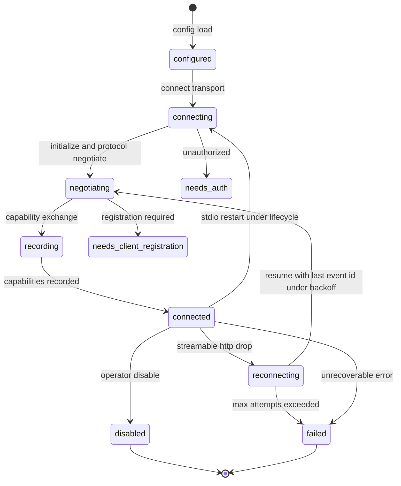
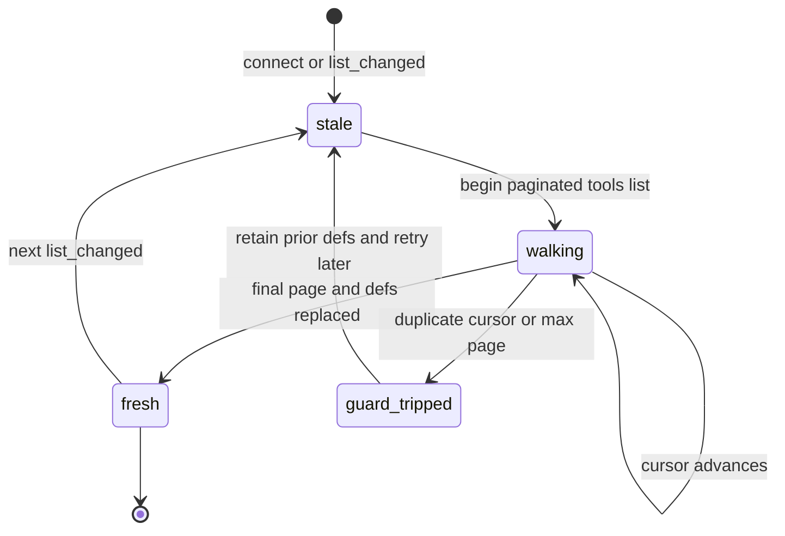
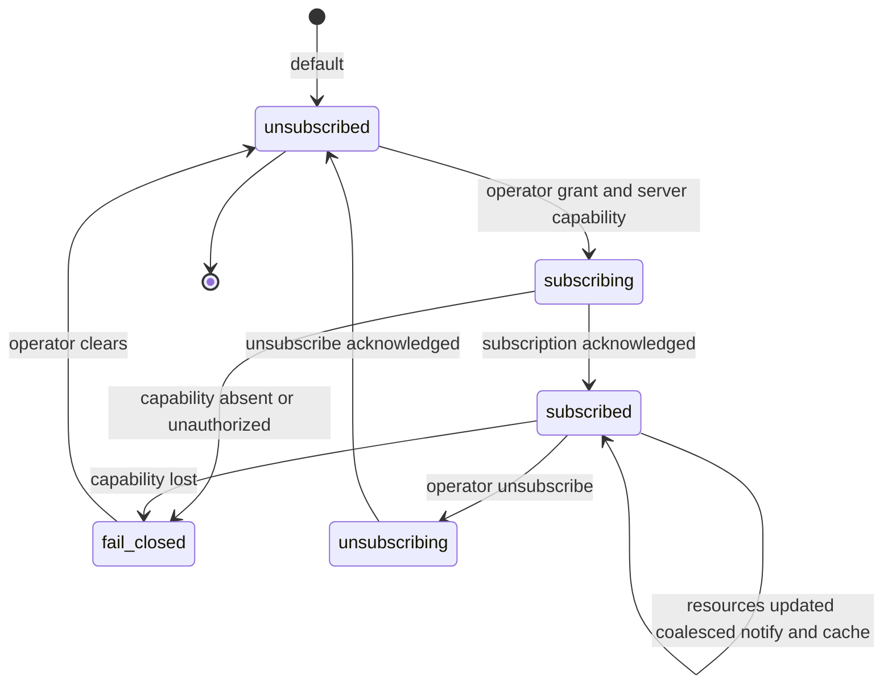

# Implementation Plan: Complete MCP Client Tools and Resources Lifecycle (Feature 008)

Feature: 008-add-complete-mcp-client-tools-and-resources-lifecycle-with
Status target: planned (after this plan is complete)
Spec: [spec.md](spec.md) (status: planned; FR1–FR57, NFRs, and clarification decisions C1–C27)
Research: [research.md](research.md)
Required ADR (now created): **[ADR-0009 Complete MCP Client Lifecycle and Content Plane](../../adr/0009-mcp-client-lifecycle-and-content-plane.md)** (proposed)
Dependencies:
[Feature 001 Smart Agent Routing and Telemetry](../001-define-one-cohesive-smart-agent-routing-and-opentelemetry/spec.md) (Smart routing, Context/Turn/Delegation Budget, content-free OTEL cardinality; sampling never bypasses),
[Feature 002 Task Lifecycle Event Bus and Process Table](../002-build-an-event-driven-asynchronous-task-lifecycle-engine/spec.md) (Process Table child, cancel root tree, EventBus, progress UI projection),
[Feature 003 Scheduled Jobs and Async Main-Context Notification](../003-add-persistent-bun-native-scheduled-jobs-with-event/spec.md) (optional scheduled/wake under resource policy; admission),
[Feature 004 Lang Lock](../004-add-lang-lock-to-enforce-a-configurable-artifact-language/spec.md) (MCP external content exemption; model artifacts still locked),
[Feature 005 OutputSpool and ArtifactStore](../005-add-a-canonical-file-backed-outputspool-and-paged/spec.md) (OutputGroup/OutputRef; bounded preview; offset/limit),
[Feature 006 Semantic Agent and Skill Retrieval](../006-add-milvus-backed-multilingual-semantic-retrieval-and/spec.md) (opt-in resource semantic index; stack owned by 006),
[Feature 007 Operator Control Plane](../007-add-a-unified-native-operator-control-plane-for-all-opencode/spec.md) (Config.Service, PermissionV2, SecretPort, reserved `mcp.*` catalog registry/auth/audit/adapters),
[ADR-0001 Telemetry Foundation](../../adr/0001-opentelemetry-telemetry-foundation.md) (accepted),
[ADR-0002 Core Smart Agent Routing](../../adr/0002-core-smart-agent-routing.md) (accepted),
[ADR-0003 Operator Control Plane](../../adr/0003-operator-control-plane-and-native-command-authority.md) (accepted, sole management authority),
[ADR-0005 Lang Lock](../../adr/0005-lang-lock-artifact-language-policy-and-progressive-enforcement.md) (proposed),
[ADR-0006 OutputSpool Content Plane](../../adr/0006-output-spool-content-plane-and-paged-artifact-store.md) (proposed),
[ADR-0009 MCP Client Lifecycle and Content Plane](../../adr/0009-mcp-client-lifecycle-and-content-plane.md) (proposed, required decision record).

---

## Overview

Feature 008 delivers a **complete MCP client** for OpenCode: capability negotiation with a
recorded per-server capability set, cursor-paginated tools with list-changed refresh, real
progress plumbing to native UI, resource subscriptions under policy, transport/session/
reconnect with resume, OAuth via Feature 007 secure references, experimental Tasks/sampling/
elicitation behind per-server flags, and every `tools/call` and `resources/read` routed
through the Feature 005 OutputSpool with a bounded preview and an OutputRef. It never
becomes a second management authority beside Feature 007, a second content-plane identity
beside Feature 005, a second lifecycle/Process Table beside Feature 002, or a Smart-routing
decider beside Feature 001. Every decision follows ADR-0009 and the C1–C27 clarify
resolutions.

The module name is **`mcp`** across every package (`packages/schema/src/mcp/**`,
`packages/protocol/src/mcp/**`, `packages/core/src/mcp/**`, the reworked
`packages/opencode/src/mcp/**`, `packages/opencode/src/operator/mcp/**`, and the CUE
mirrors under `doc/arch/schemas/mcp/*.cue`).

**Coexistence and migration of `packages/opencode/src/mcp/` (explicit).** The legacy MCP
service already lives at `packages/opencode/src/mcp/` (the `MCP.Service`: remote
StreamableHTTP→SSE fallback and stdio spawn, OAuth flow, `Status` union, ToolListChanged
refresh, stdio SIGTERM finalizer, one-shot prompts/resources/read, and a 10MB blob cap).
Feature 008 introduces a **new framework-free domain lifecycle engine at
`packages/core/src/mcp/**`** and **reworks the existing `packages/opencode/src/mcp/**` in
place** as the application/adapter host. They coexist by layer, not by duplication:

- `packages/core/src/mcp/**` (new) is the pure domain: connection lifecycle state machine,
  tool-catalog pagination/refresh policy, resource-update and subscription policy, the
  cancellation wire-path selector, the degradation-gap classifier, and the reconnect-backoff
  planner — all over injected transport, clock, entropy, spool, permission, and event ports,
  with zero SDK, HTTP, TUI, or Bun imports.
- `packages/opencode/src/mcp/**` (reworked) keeps the `MCP.Service` seams (`tools()`,
  `resources()`, `readResource()`, the `Status` union, OAuth) and hosts the SDK client, the
  transports, the OutputSpool wiring, and the operator adapters, delegating every lifecycle
  decision to the core engine through ports. No parallel `packages/opencode/src/mcp2/` is
  created; the migration is in place behind the existing seams (C27).

- **Phase 1 — Schema and protocol MCP modules.** The value objects and enums (recorded
  server capability set, connection-state and terminal-branch enums, the durable/live event
  vocabulary with the single canonical `mcp.tools_changed`, resource-update policy and
  subscription-state enums, the URI-allowlist and MIME-allowlist descriptors, the
  outputSchema-validation and annotation-trust modes, the experimental-flag and capability-
  string descriptors, the OutputSpool call/read descriptors, and the sampling/elicitation
  permission grammar), plus the typed ports and the 30 `mcp.*` operator payloads. Additive
  schema/protocol modules; the `packages/schema/src/mcp-event.ts` literal is renamed to
  `mcp.tools_changed` here (C3). No runtime behavior change beyond the rename.
- **Phase 2 — Framework-free domain lifecycle engine (`packages/core/src/mcp/**`).** The
  connection-lifecycle state machine with negotiation/record and additive terminal branches,
  the reconnect-backoff planner (bounded exponential + jitter + cap, resume/`Last-Event-ID`),
  the tool-catalog paginated-walk policy with duplicate-cursor guard and max-page bound, the
  resource-update coalesce/dedupe/debounce policy and subscription-lifecycle machine, the
  cancellation wire-path selector (standard vs task), the degradation-gap classifier
  (`mcp_unavailable` and peers), the annotation-trust gate, and the outputSchema-validation
  decision — all over injected ports, no I/O in hot logic.
- **Phase 3 — Application, adapters, and operator wiring (`packages/opencode/src/mcp/**`).**
  The reworked `MCP.Service`: the SDK client and transport adapters (prefer Streamable HTTP,
  SSE deprecation-labeled, stdio restart), the real progress sink replacing the `convertTool`
  no-op, the paginated `tools/list` walk, the resource subscribe/unsubscribe adapter, the
  OutputSpool cutover for every call/read (bounded preview + OutputRef, base64/data-URL
  decode-to-spool under MIME/size caps), the OAuth→SecretRef migration over Feature 007
  SecretPort, the experimental Tasks/sampling/elicitation adapters behind per-server flags,
  and the Feature 007 `mcp.*` operator domain (30 reserved IDs, no bump).
- **Phase 4 — CLI and TUI surfaces.** The CLI `opencode op mcp <op>` verbs and the TUI
  server/capabilities/resource-admin/experimental panels over the `mcp.server.*` /
  `mcp.auth.*` / `mcp.resource.admin.*` / `mcp.logging.level.*` / `mcp.experimental.*` /
  `mcp.extension.*` commands, all thin adapters over the Feature 007 registry with
  registry-generated names, capability badges, connection/subscription state, deprecation
  labels, and no secret exposure.
- **Phase 5 — Tests.** Unit (pure domain), integration (SDK client against a fake MCP
  server over each transport), contract (30 `mcp.*` IDs vs the Feature 007 catalog; payloads
  vs `protocol/mcp/**`), fault-injection (lifecycle faults, pagination edge cases,
  notification storms, reconnect/resume, cancel wire paths), and spool-integration tests,
  covering AC1–AC32.

Management authority for every operator surface is Feature 007 (ADR-0003, accepted).
Feature 008 supplies the domain schemas, the framework-free lifecycle engine, the reworked
application/adapters, and content-free telemetry only; it never registers a parallel
command registry (C25).

---

## Non-goals

- Implementing code during the plan phase.
- A second management authority, content-plane identity, lifecycle/Process Table, or
  Smart-routing decider beside Features 007/005/002/001 (C13, C16, C25, C27).
- Forking `@modelcontextprotocol/sdk` wire logic; the resolution is a forward patch/minor on
  the same major line (C1).
- A dual event spelling; `mcp.tools.changed` is renamed to the single `mcp.tools_changed`
  (C3).
- Auto-subscribe, auto-re-read, auto-reindex, or auto-wake on resource updates; the default
  is notify + cache only with separate opt-ins (C9, C10, C21, C22).
- LLM-reachable management, an LLM subscribe path, or sampling that bypasses
  Smart/budget/LangLock (C10, C19, C25).
- Inlining full `CallToolResult`/`resources/read` bodies, data URLs, or filesystem paths
  into model context, or promising zero-RAM MCP parsing (C16, C17).
- Enabling experimental Tasks/sampling/elicitation by default, or removing legacy SSE in this
  feature (C14, C18).
- A catalog bump; the reserved 30 `mcp.*` IDs stay at `RESERVED_CATALOG_VERSION = 1.3.0`
  (C25).
- Fixing SDK version, struct fields, page/queue/backoff bounds, preview/spill/MIME caps, the
  content-stream capability string, permission grammar, redaction rules, or metric buckets —
  provisional plan constants with named acceptance hooks, finalized in the tasks phase
  (C1–C27).

---

## Technical Approach

### Architecture layers

```
Adapters (inbound)
  CLI  opencode op mcp server|auth|resource|logging|experimental|extension <op>   (Feature 007 thin adapters)
  TUI/App  MCP servers / capabilities / resource-admin / experimental panels: state, badges, deprecation labels
  Operator palette / native slash /op.mcp.<op>
  Runtime data plane  canonical adapter tools (tools/call, list_mcp_resources, read_mcp_resource) under mcp:server:* Permission
        |
        v
Application (Feature 008 — packages/opencode/src/mcp/** reworked in place)
  ClientHost          — SDK Client + transport adapters; prefer Streamable HTTP; SSE deprecation-labeled; stdio restart (C14)
  ProgressSink        — real onprogress sink replacing the convertTool no-op; Process Table + OTEL; preserve resetTimeoutOnProgress (C7)
  CatalogWalker       — cursor-paginated tools/list with duplicate-cursor guard + max-page bound; list_changed full refresh (C4)
  ResourceAdapter     — list/templates/read under Permission; subscribe/unsubscribe under capability + operator grant (C10, C12)
  SpoolBridge         — OutputGroup per call/read; bounded preview + OutputRef; base64/data-URL decode-to-spool under MIME/size caps (C16, C17)
  SecretBridge        — OAuth tokens/headers/secrets as Feature 007 SecretRefs; one-time McpAuth migration (C15)
  ExperimentalAdapters— tasks | sampling | elicitation behind per-server flags; content-stream extension namespaced (C18, C19, C20)
  Operator mcp domain — 30 reserved mcp.* typed command/query impls (via Feature 007) (C25)
        |
        v
Domain (Feature 008 core — packages/core/src/mcp/**, zero framework deps)
  ConnectionLifecycle — configure->connect->negotiate->record->connected; disabled|failed|needs_auth|needs_client_registration (C2)
  ReconnectPlanner    — bounded exponential backoff + jitter + cap; resume / Last-Event-ID; stdio restart, no backoff (C14)
  CatalogPolicy       — paginated-walk decision; duplicate-cursor guard; max-page fail-closed; defs[server] shape preserved (C4)
  ResourcePolicy      — notify+cache default; coalesce/dedupe/debounce; re-read/reindex/wake opt-in gates (C9, C21, C22)
  SubscriptionMachine — idle->subscribing->subscribed->unsubscribing; capability + operator authority; fail-closed (C10)
  CancelSelector      — standard notifications/cancelled vs task tasks/cancel; root-tree per child (C8)
  DegradationClassifier — typed capability-gap codes (mcp_unavailable and peers); session continues (C1, C2)
  TrustGate           — annotation-trust profile; outputSchema tolerant/strict decision; untrusted-content labels (C5, C6, C24)
  EventVocabulary     — durable/live split; single mcp.tools_changed; content-free payloads (C3, C26)
        |
        v
Reused canonical points (existing — NOT re-implemented)
  MCP.Service seams                    — packages/opencode/src/mcp/index.ts (tools(), resources(), readResource(), Status union, OAuth)
  McpCatalog / reserved-name guard     — packages/opencode/src/mcp/catalog.ts; checkReservedRegistrationName / toolNameIfAllowed
  ConfigV2.MCP                         — packages/core/src/config/mcp.ts (Timeout/Local/OAuth/Remote); backward-compatible
  Reserved catalog                     — 30 mcp.* IDs (RESERVED_CATALOG_VERSION = 1.3.0), no bump; packages/core/src/operator/catalog.ts
  Config.Service / PermissionV2 / SecretPort — Feature 007 config/authorization/secret backend
  Feature 002 Process Table + cancel tree + EventBus — call/task child; progress UI; cancel root tree
  Feature 003 scheduler + admission    — optional wake under resource policy; coalesced triggers
  Feature 005 OutputSpool              — OutputGroup / OutputRef / bounded preview for every call/read
  Feature 006 semantic stack           — opt-in resource reindex trigger consumed under 006 admission
  Feature 001 TelemetryInstruments + OTLP exporter — bounded async content-free export
```

Dependency rule: adapters → application → domain. The domain MUST NOT import the MCP SDK,
the HTTP/transport stack, the TUI/CLI frameworks, Config.Service, or the Bun runtime
directly; it takes a transport port, a clock/entropy port, a spool port, a permission-read
port, an event-publish port, and a config-read port, and returns lifecycle transitions,
pagination/refresh decisions, policy verdicts, wire-path selections, and typed gaps. The
application layer owns the `@modelcontextprotocol/sdk` client, the transports, the OAuth and
SecretRef wiring, and the durable event publication; no consumer receives a secret, a raw
token, a filesystem path, or an unsanitized body.

### SDK and transport substrate (verified empirically)

- **SDK baseline present and already forward-patched.** `@modelcontextprotocol/sdk@1.29.0`
  is pinned in `packages/opencode/package.json` and locked in `bun.lock`, matching the C1
  baseline exactly — **no version delta**. A workspace patch
  (`patches/@modelcontextprotocol%2Fsdk@1.29.0.patch`, 629 lines) already applies, adding
  typed `callTool` result overloads and transport `onsessionexpired` re-initialization; this
  is the C1 forward-patch-not-fork substrate. A major SDK jump is an explicit plan/ADR
  migration, never a silent bump (C1).
- **Client surface present.** The installed client exposes `subscribeResource` /
  `unsubscribeResource` (C10), `setLoggingLevel` (C23), `ProgressCallback` / `onprogress` /
  `resetTimeoutOnProgress` (C7), the `CancelledNotification`, `ResourceUpdatedNotification`,
  `SubscribeRequest`, `ResourceListChangedNotification`, and `ProgressNotification` schemas
  (C3, C8, C9), and an `experimental/tasks/**` module for task-augmented calls (C8, C18).
  The final `tools/call` result is parsed in RAM, so OutputSpool integration is a post-parse
  spill with no zero-RAM promise (C16).
- **Reserved catalog present.** `packages/core/src/operator/catalog.ts` declares exactly 30
  `mcp.*` IDs at `RESERVED_CATALOG_VERSION = "1.3.0"` — `mcp.server.*` (11), `mcp.auth.*`
  (4), `mcp.resource.admin.*` (7), `mcp.logging.level.*` (2), `mcp.experimental.*` (3),
  `mcp.extension.*` (3); **no additive bump is required** for Feature 008 (C25).
- **Rename blast radius.** The `mcp.tools.changed` literal appears in
  `packages/schema/src/mcp-event.ts` (source of truth), is re-exported and published in
  `packages/opencode/src/mcp/index.ts`, and is emitted three times in the generated
  `packages/sdk/js/src/v2/gen/types.gen.ts`; the rename to `mcp.tools_changed` updates the
  schema literal and regenerates the SDK types in one migration (C3).

### Packages and modules (reuse first, no parallel authority)

| Concern | Existing location (reuse) | Feature 008 addition |
| ------- | ------------------------- | -------------------- |
| MCP service seams | `packages/opencode/src/mcp/index.ts` (`MCP.Service`: `tools()`, `resources()`, `readResource()`, `Status` union, OAuth) | Rework in place; delegate lifecycle to the core engine; keep the seams additive (FR7, C27) |
| Tool catalog + reserved-name guard | `packages/opencode/src/mcp/catalog.ts` (`McpCatalog.defs`, `toolNameIfAllowed`, `checkReservedRegistrationName`) | Paginated walk superseding the single-shot path; preserve `defs[server]` shape; collision fails closed (FR10, C4, C25) |
| Event schema | `packages/schema/src/mcp-event.ts` (`ToolsChanged` literal `mcp.tools.changed`) | Rename to `mcp.tools_changed`; add the durable/live event vocabulary (FR38, C3) |
| Config | `packages/core/src/config/mcp.ts` (`ConfigV2.MCP.Timeout/Local/OAuth/Remote`) | Backward-compatible config; per-server policy/flags/trust-profile fields (FR29, C14, C27) |
| Reserved operator IDs | `packages/core/src/operator/catalog.ts` (`RESERVED_CATALOG_VERSION = 1.3.0`; 30 `mcp.*` IDs) | Register typed `mcp.*` domain impls via Feature 007 ports; **no catalog bump** (C25) |
| Permission | Feature 007 PermissionV2; `mcp:server:*` grammar | `mcp:<server>:sampling` per-agent gate; subscribe operator authority; runtime read/call under permission (FR46, C10, C19) |
| Secret backend | `packages/opencode/src/mcp/auth.ts` (`McpAuth`); Feature 007 SecretPort | OAuth tokens/headers/secrets as SecretRefs; one-time migration; no plaintext (FR32, C15) |
| Content plane | Feature 005 OutputSpool (`packages/*/src/outputspool/**`) | OutputGroup per call/read; bounded preview + OutputRef; base64 decode-to-spool (FR33–FR36, C16, C17) |
| Lifecycle / cancel | Feature 002 Process Table + cancel root tree + EventBus | Call/task child; progress UI projection; cancel wire path per child (FR14, FR17, FR18, C7, C8) |
| Schedule / wake | Feature 003 scheduler + admission | Optional wake under resource policy; at most one per qualifying event (FR24, C22) |
| Semantic index | Feature 006 stack (opt-in) | Single opt-in reindex trigger on qualifying update; no vectors in 008 (FR53, C21) |
| Telemetry | `packages/core/src/observability/otlp.ts`, Feature 001 instruments | `mcp.*` spans/metrics reusing bounded-cardinality helpers; content-free (FR54–FR56, C26) |
| Schema / Protocol | `packages/schema`, `packages/protocol` | `mcp` schema modules (new), lifecycle/policy/command payloads (new) |
| CLI / TUI | `packages/opencode/src/cli/cmd/mcp.ts`, `packages/tui/src/**/operator/**` | `opencode op mcp <op>` verbs + TUI server/capabilities/resource-admin/experimental panels (FR48) |

**New and reworked module tree target:**

```
packages/schema/src/mcp/                       # new — schema authority (SSOT for 008 records)
  capability.ts        # RecordedCapabilitySet VO: negotiated protocol version, per-server capability flags, recorded-at (FR7, FR8, C2)
  connection.ts        # ConnectionState + TerminalBranch enums; Status-union extension (additive) (FR7, C2)
  events.ts            # durable/live event vocabulary; single canonical mcp.tools_changed; content-free payloads (FR38, C3, C26)
  policy.ts            # ResourceUpdatePolicy, SubscriptionState, outputSchema-validation mode, annotation-trust mode (FR13a, FR23, C5, C6, C9)
  uri-allowlist.ts     # UriAllowlist + MimeAllowlist descriptors; scheme/root scope; size caps (FR25, FR36, C12, C17)
  experimental.ts      # ExperimentalFlag set (tasks|sampling|elicitation|content-stream); capability string descriptor (FR41, FR45, C18)
  spool-descriptor.ts  # McpCallOutput / McpReadOutput OutputGroup descriptors; bounded preview + OutputRef (FR33, C16)
  index.ts
packages/protocol/src/mcp/                      # new — typed transport contracts / ports
  ports.ts             # TransportPort, ClockPort, EntropyPort, SpoolPort, PermissionReadPort, EventPublishPort, ConfigReadPort, SecretResolvePort
  commands.ts          # 30 mcp.* operator command/query payloads across server/auth/resource.admin/logging/experimental/extension (FR48–FR50, C25)
  index.ts
packages/core/src/mcp/                          # new — framework-free domain lifecycle engine
  connection-lifecycle.ts # negotiate/record state machine; additive terminal branches (FR7, C2)
  reconnect-planner.ts    # bounded exponential backoff + jitter + cap; resume / Last-Event-ID; stdio restart (FR30, C14)
  catalog-policy.ts       # paginated-walk decision; duplicate-cursor guard; max-page fail-closed (FR10, FR11, C4)
  resource-policy.ts      # notify+cache default; coalesce/dedupe/debounce; re-read/reindex/wake opt-in gates (FR23, FR24, C9, C21, C22)
  subscription-machine.ts # subscribe/unsubscribe lifecycle; capability + operator authority; fail-closed (FR21, C10)
  cancel-selector.ts      # standard notifications/cancelled vs task tasks/cancel per child (FR17, FR18, C8)
  degradation.ts          # typed capability-gap classifier (mcp_unavailable and peers); session continues (FR7, C1, C2)
  trust-gate.ts           # annotation-trust profile; outputSchema tolerant/strict; untrusted-content labels (FR13a, FR27, C5, C6, C24)
  mcp-instruments.ts      # mcp.* spans/metrics extending Feature 001; content-free (FR54, FR56, C26)
  index.ts
packages/opencode/src/mcp/                      # reworked in place — application + adapters (legacy MCP.Service host)
  index.ts                   # MCP.Service reworked: delegate lifecycle to core/mcp ports; keep tools()/resources()/readResource()/Status/OAuth seams (FR7, C27)
  catalog.ts                 # paginated tools/list walk; preserve defs[server]; reserved-collision fail-closed (FR10, C4, C25)
  progress-sink.ts           # real onprogress sink replacing the no-op; Process Table + OTEL; preserve resetTimeoutOnProgress (FR14, C7)
  resource-adapter.ts        # list/templates/read under Permission; subscribe/unsubscribe under capability + operator grant (FR21, C10)
  spool-bridge.ts            # OutputGroup per call/read; bounded preview + OutputRef; base64/data-URL decode-to-spool under MIME/size caps (FR33, FR36, C16, C17)
  secret-bridge.ts           # OAuth tokens/headers/secrets as Feature 007 SecretRefs; one-time McpAuth migration (FR32, C15)
  experimental/tasks.ts      # task-augmented calls; tasks/cancel; input_required to operator (FR41, C8, C18, C20)
  experimental/sampling.ts   # server-initiated sampling under mcp:<server>:sampling; Smart/budget/LangLock unchanged (FR46, C19)
  experimental/elicitation.ts# elicitation always operator-surfaced; no silent model answer (FR47, C20)
  auth.ts                    # McpAuth reworked to SecretRef resolution (FR32, C15)
packages/opencode/src/operator/mcp/             # new — Feature 007 mcp.* domain impls (30 IDs, no bump) (C25)
packages/opencode/src/cli/cmd/mcp.ts            # reworked — opencode op mcp <op> verbs (FR48)
packages/tui/src/**/operator/mcp/               # new — MCP servers / capabilities / resource-admin / experimental panels (FR48)
doc/arch/schemas/mcp/*.cue                       # new — CUE mirrors (calisthenics-compliant)
```

CUE data-model companions mirror the schema modules under `doc/arch/schemas/mcp/*.cue`,
following the Feature 001/002/003/004/005/006 calisthenics style: every entity field is a
`#ValueObject` reference (bare string/bool entity fields are wrapped), each file carries a
`// DDD role:` header on every struct, snapshots and enums are `ValueObject` not `Entity`, an
`Entity`/`AggregateRoot` carries an id and lives alone with its sub-objects in `-parts`
files, a `ValueObject` holds no identifiable, each entity keeps at most seven direct fields,
first-class collections replace bare arrays, and each file stays under the ten-definition
warning bound.

---

## Incremental slices

| Slice | Name | Delivers | Phase | Depends |
| ----- | ---- | -------- | ----- | ------- |
| S0 | Capability + connection schema | `capability.ts`, `connection.ts`: RecordedCapabilitySet, ConnectionState/TerminalBranch enums; additive `Status`-union extension (FR7, FR8, C2) | 1 | — |
| S1 | Event vocabulary + rename | `events.ts` durable/live split; rename `mcp.tools.changed` → `mcp.tools_changed` in `mcp-event.ts`; content-free payloads (FR38, C3, C26) | 1 | — |
| S2 | Policy + trust enums | `policy.ts` ResourceUpdatePolicy, SubscriptionState, outputSchema-validation mode, annotation-trust mode (FR13a, FR23, C5, C6, C9) | 1 | — |
| S3 | URI + MIME allowlists | `uri-allowlist.ts` UriAllowlist/MimeAllowlist; scheme/root scope; size caps (FR25, FR36, C12, C17) | 1 | — |
| S4 | Experimental + spool descriptors | `experimental.ts` flag set + `experimental/opencode.contentStream` string; `spool-descriptor.ts` call/read OutputGroup descriptors (FR33, FR41, FR45, C16, C18) | 1 | S2 |
| S5 | Protocol ports + payloads | `protocol/mcp/ports.ts` (transport/clock/entropy/spool/permission/event/config/secret ports), `commands.ts` 30 `mcp.*` payloads (FR48–FR50, C25) | 1 | S0, S1, S2, S3, S4 |
| S6 | Connection lifecycle machine | `connection-lifecycle.ts` configure→connect→negotiate→record→connected; disabled/failed/needs_auth/needs_client_registration (FR7, C2, AC1, AC16) | 2 | S0 |
| S7 | Reconnect planner | `reconnect-planner.ts` bounded exponential backoff + jitter + cap; resume / `Last-Event-ID`; stdio restart, no backoff (FR30, C14, AC2, AC3, AC12) | 2 | S6 |
| S8 | Catalog pagination policy | `catalog-policy.ts` paginated-walk decision; duplicate-cursor guard; max-page fail-closed; `defs[server]` shape preserved (FR10, FR11, C4, AC4) | 2 | S1 |
| S9 | Resource-update policy | `resource-policy.ts` notify+cache default; coalesce/dedupe/debounce bounded queue; re-read/reindex/wake opt-in gates (FR23, FR24, C9, C21, C22, AC9, AC10, AC11) | 2 | S2 |
| S10 | Subscription machine | `subscription-machine.ts` idle→subscribing→subscribed→unsubscribing; capability + operator authority; fail-closed (FR21, C10, AC21, AC29) | 2 | S2 |
| S11 | Cancel selector | `cancel-selector.ts` standard `notifications/cancelled` vs task `tasks/cancel` per child; root-tree coverage (FR17, FR18, C8, AC7, AC31) | 2 | S0 |
| S12 | Degradation classifier | `degradation.ts` typed capability-gap codes (`mcp_unavailable` and peers); session continues; no hard fail on missing feature (FR7, C1, C2, AC12) | 2 | S0 |
| S13 | Trust gate | `trust-gate.ts` annotation-trust profile; outputSchema tolerant/strict; untrusted-content labels; decompression-bomb limit decision (FR13a, FR27, C5, C6, C24, AC23, AC26) | 2 | S2, S3 |
| S14 | MCP telemetry | `mcp-instruments.ts` connect/negotiate/list/call/progress/read/subscribe/reconnect/cancel/task spans; bounded-enum metrics; no URI/content/call/session labels (FR54–FR56, C26, AC22) | 2 | S6, S12 |
| S15 | Client host + transports | rework `index.ts`: SDK client + transport adapters; prefer Streamable HTTP; SSE deprecation label; stdio restart with `pgrep -P` finalizer; delegate to core ports (FR29–FR31, C14, C27, AC2, AC12) | 3 | S5, S7 |
| S16 | Progress sink | `progress-sink.ts` real `onprogress` replacing the `convertTool` no-op; monotonic enforcement; Process Table + OTEL; preserve `resetTimeoutOnProgress`; never LLM turns (FR14–FR16a, C7, AC5) | 3 | S15 |
| S17 | Catalog walker | `catalog.ts` paginated `tools/list` walk under the S8 policy; `list_changed` full refresh emits `mcp.tools_changed`; reserved-collision fail-closed (FR10, FR11, C4, C25, AC4) | 3 | S8, S15 |
| S18 | Spool bridge | `spool-bridge.ts` OutputGroup per call/read; bounded preview + OutputRef, never a path; base64/data-URL decode-to-spool under MIME/size caps; post-parse spill (FR33–FR36, C16, C17, AC6, AC8, AC20) | 3 | S4, S15 |
| S19 | Resource adapter + subscribe | `resource-adapter.ts` list/templates/read under `mcp:server:*`; subscribe/unsubscribe under capability + operator grant; URI allowlist enforced; fail-closed (FR21, FR25, C10, C12, AC20, AC21, AC25, AC29) | 3 | S9, S10, S18 |
| S20 | Secret bridge + OAuth cutover | `secret-bridge.ts`/`auth.ts` OAuth tokens/headers/secrets as Feature 007 SecretRefs; one-time `McpAuth` migration; no plaintext in preview/audit (FR32, C15, AC13) | 3 | S15 |
| S21 | Experimental adapters | `experimental/tasks.ts` (`tasks/cancel`, `input_required` to operator), `sampling.ts` (`mcp:<server>:sampling`, Smart/budget/LangLock unchanged), `elicitation.ts` (always operator-surfaced); per-server flags off by default; content-stream namespaced (FR41–FR47, C18, C19, C20, AC16–AC19, AC32) | 3 | S11, S13, S18 |
| S22 | Operator mcp domain | `operator/mcp/**` typed impls for the 30 `mcp.*` IDs across server/auth/resource.admin/logging/experimental/extension; confirmation matrix; reserved-collision rejection; operator-only, zero-LLM management (FR48–FR50, C25, AC15, AC29) | 3 | S19, S20, S21 |
| S23 | Semantic-index opt-in seam | opt-in trigger on a qualifying `resources/updated`; single reindex trigger consumed by Feature 006 under its admission ladder; no vectors in 008 (FR53, C21, AC28) | 3 | S9, S22 |
| S24 | Logging integration | MCP `notifications/message` into native logging under redaction + rate limits; native retention; `mcp.logging.level.set` via Feature 007 (FR28, C23, AC24) | 3 | S22 |
| S25 | CLI + TUI surfaces | `cli/cmd/mcp.ts` `opencode op mcp <op>`; `tui/**/operator/mcp/**` servers/capabilities/resource-admin/experimental panels; badges; connection/subscription state; deprecation labels; no secret exposure (FR48, AC15, AC21) | 4 | S22 |
| S26 | Tests + validation | Unit (lifecycle/reconnect/catalog/resource/subscription/cancel/degradation/trust), integration (SDK client vs fake server per transport), contract (`mcp.*` vs catalog; payloads vs protocol), fault-injection (lifecycle faults, pagination edges, notification storms, reconnect/resume, cancel paths), spool-integration (all AC1–AC32) | 5 | all |

---

## State machines

### Connection lifecycle with reconnect, backoff, and resume (C2, C14)

A connection is `configured` after config load; `connecting` while the transport attaches;
`negotiating` during initialize/protocol-version negotiation; `recording` while the server
capability set is captured; `connected` once recorded. Terminal branches are `disabled`
(operator), `failed` (unrecoverable), `needs_auth`, and `needs_client_registration`. A
Streamable HTTP drop enters `reconnecting` under bounded backoff with jitter, honoring
session resume and `Last-Event-ID`; recovery re-runs negotiation and emits
`mcp.server.capabilities_changed` on a diff. A stdio connection restarts under lifecycle
control with child cleanup instead of backoff.



### Tool-catalog refresh flow (C4)

A catalog is `stale` on connect or on `notifications/tools/list_changed`; `walking` during
the cursor-paginated `tools/list` walk under the duplicate-cursor guard; `fresh` once the
walk completes and `defs[server]` is replaced and `mcp.tools_changed` is emitted; a repeated
or non-advancing cursor or a max-page breach enters `guard_tripped`, which fails closed with
a typed error and retains the prior `defs[server]`.



### Resource subscription lifecycle (C9, C10)

A resource is `unsubscribed` by default; an operator grant with the server
`resources.subscribe` capability moves it to `subscribing`, then `subscribed`; while
subscribed, `resources/updated` coalesces/dedupes/debounces into a bounded queue and updates
UI and cache (notify + cache only) without a re-read/reindex/wake unless the per-server
opt-in is set; an operator unsubscribe moves it to `unsubscribing` and back to
`unsubscribed`; an unauthorized subscribe or a lost capability fails closed.



---

## Migration

Each migration is behind an honest sequencing note; none breaks the existing `MCP.Service`
seams or operator configs (C27).

- **`mcp.tools.changed` → `mcp.tools_changed` rename (C3).** Sequence: (1) rename the schema
  literal in `packages/schema/src/mcp-event.ts` (`ToolsChanged.type`); (2) regenerate the SDK
  types so the three occurrences in `packages/sdk/js/src/v2/gen/types.gen.ts` follow; (3)
  update the publisher and re-export in `packages/opencode/src/mcp/index.ts`; (4) update the
  Feature 009 reindex-trigger consumer to the single spelling. No dual spelling survives; the
  wire id, FR38, and the Feature 009 contract agree. Verified by contract test S26.
- **OutputSpool content cutover (C16, C17).** Sequence: (1) route every `tools/call` and
  `resources/read` through the `spool-bridge` OutputGroup; (2) replace the current
  path-in-preview truncation and the 10MB inline blob path with a bounded preview + OutputRef
  (no filesystem path in preview); (3) decode base64/data-URL content to spool under the MIME
  allowlist and size caps. The SDK parses the final result in RAM, so this is a post-parse
  spill now with a bounded transport/parser deferred; zero-RAM is never promised. Verified by
  spool-integration test S26.
- **OAuth → SecretRef cutover (C15).** Sequence: (1) add the `secret-bridge` over the Feature
  007 SecretPort; (2) run a one-time migration reading existing `McpAuth` token entries into
  secure refs; (3) resolve tokens/headers/secrets through refs at connect; (4) keep config
  surfaces backward-compatible. No plaintext secret enters args, history, output, config
  JSON, plain audit, or a spool preview. Verified by security test S26.

---

## Security and threat boundaries

| Threat | Mitigation |
| ------ | ---------- |
| SSRF / resource fetch to metadata, link-local, or private ranges | URI allowlist scoped to `https` + server-declared URIs within negotiated roots; `file` only within authorized project/session roots; every other scheme deny-by-default; SSRF-safe fetch (FR25, C12, AC20, AC21, AC25) |
| Cross-session / cross-project resource leakage | Scheme and root scoping; `file` confined to authorized roots; runtime read/subscribe under `mcp:server:*` Permission; unauthorized paths fail closed (FR25, C10, C12, AC29) |
| LLM subscribing or reaching admin | Subscribe/unsubscribe require the server capability plus operator `mcp.resource.admin.subscribe`/`unsubscribe`; the LLM never subscribes; the data plane never reaches the 30 `mcp.*` IDs (FR21, C10, C25) |
| Sampling bypassing Smart/budget/LangLock | Server-initiated sampling requires per-agent `mcp:<server>:sampling` Permission and passes through Feature 001 Smart routing, budgets, LangLock, and privacy unchanged; approval path audited (FR46, C19, AC17) |
| Silent model answer to elicitation / `input_required` | Every elicitation and `input_required` surfaces to the operator UI; the model never auto-answers; sensitive-mode blocks model-mediated answers; treated as a lifecycle prompt, never partial content (FR47, C20, AC18, AC32) |
| Decompression bomb / oversized payload | Size and decompression-bomb limits reject oversized prompt/resource payloads before delivery; base64/data-URL content is MIME- and size-capped before spooling (FR36, C17, C24, AC20, AC23) |
| Prompt-injection via untrusted MCP content | Provenance and untrusted-content labels in UI and at the context boundary; injection text never treated as trusted system instruction; prompts stay runtime content under Permission (FR27, C24, AC23) |
| Untrusted tool annotations used as safety guarantees | Annotations untrusted by default; only an operator-elevated trust profile informs hints/policy; an unelevated profile ignores them for gating (FR13a, C6, AC26) |
| Secret leak in args, history, output, config, audit, or preview | OAuth tokens/headers/secrets as Feature 007 SecretRefs; one-time migration; no plaintext anywhere, including spool previews (FR32, C15, AC13) |
| Filesystem path leak in previews | Every call/read delivers a bounded preview + OutputRef; no filesystem path in the preview shown to UI or LLM (FR33, C16, AC6) |
| Unbounded pagination / notification storm | Cursor-paginated `tools/list` with duplicate-cursor guard and max-page fail-closed; `resources/updated` coalesced/deduped/debounced into a bounded queue; no automatic turn per update (FR10, FR24, C4, C9, AC4, AC9) |
| Unbounded wake from resource updates | At most one wake per qualifying semantic-policy event under Feature 001/002/003 admission; audited; no per-update wake (FR24, C22, AC10, AC11) |
| Reserved namespace hijack | 30 `mcp.*` IDs reserved at 1.3.0; runtime registration collision fails closed via `checkReservedRegistrationName` / `toolNameIfAllowed`; no silent rename (FR48, C25, AC15, AC29) |
| Content leak in telemetry/audit | Content-free spans/metrics; labels never carry URIs, content, call IDs, or session IDs; child IDs correlate on traces (FR56, ADR-0001, C26, AC22) |

---

## Testing matrix

| Layer | Scope | How |
| ----- | ----- | --- |
| Unit | Connection lifecycle transitions, reconnect-backoff curve, catalog paginated-walk + duplicate-cursor guard, resource-update coalesce/dedupe/debounce, subscription machine, cancel wire-path selection, degradation classification, trust gate | Pure tests; deterministic transport/clock/entropy/spool/permission/event ports; no I/O |
| Integration (SDK client) | initialize/negotiate/record over Streamable HTTP, SSE (deprecation-labeled), and stdio; `tools/list` pagination; `resources/read`; subscribe/updated; progress; cancel | SDK client against a fake MCP server per transport; AC1, AC4, AC12 |
| Lifecycle faults | connect timeout, `needs_auth`, `needs_client_registration`, mid-call disconnect, `mcp_unavailable` typed gap, capability lost on reconnect | Injected transport faults; session continues; AC1, AC12, AC16 |
| Pagination edges | duplicate/non-advancing cursor, max-page breach fail-closed, empty catalog, `list_changed` mid-walk, `defs[server]` shape preserved | Fake server cursor scripts; AC4 |
| Notification storms | high-rate `resources/updated` and `tools/list_changed`; bounded queue; coalesce/dedupe/debounce; no automatic turn or unbounded wake | Injected burst source; AC9, AC10, AC11 |
| Reconnect / resume | Streamable HTTP drop, bounded backoff + jitter + cap, session resume with `Last-Event-ID`, `capabilities_changed` on diff; stdio restart with child cleanup | Injected drop + resume; AC2, AC3, AC12 |
| Cancel wire paths | standard `notifications/cancelled` for a non-task call; task `tasks/cancel`; Feature 002 root tree cancels both; spool sealed; unacknowledged remote recorded | Injected in-flight call + task; AC7, AC31 |
| Spool integration | OutputGroup per call/read; bounded preview + OutputRef, never a path; base64/data-URL decode-to-spool under MIME/size caps; post-parse spill; 10MB migration baseline | Feature 005 sandbox; AC6, AC8, AC20 |
| Experimental | per-server flags off by default; tasks → sampling → elicitation → content-stream order; `mcp:<server>:sampling` gate; elicitation/`input_required` operator-surfaced; content-stream namespaced with fallback | Fake server + Permission sandbox; AC16, AC17, AC18, AC19, AC32 |
| Security / privacy | URI allowlist + SSRF; decompression-bomb reject; untrusted-content labels; SecretRef-only, no plaintext in preview/audit; content-free telemetry | Injected malicious URIs/payloads; cardinality + content-free assertions; AC13, AC20, AC22, AC23, AC25 |
| Contract | 30 `mcp.*` IDs vs the Feature 007 reserved catalog (already 1.3.0); reserved-collision rejection; single `mcp.tools_changed` spelling; payloads vs `protocol/mcp/**` | Spec-driven; specScopeGlobs enforced; AC15, AC29 |
| Consumer compatibility | `tools()`, code-mode `describeCatalog`, `list_mcp_resources` / `read_mcp_resource` keep shape; `defs[server]`/`Status`/`mcp:server:*` extend additively | Seam tests over the reworked service; AC14, AC29 |

Acceptance coverage maps every scenario AC1–AC32 to a slice. Provisional numeric constants
(SDK version, recorded-capability fields, page/queue/backoff bounds, preview/spill/MIME caps,
content-stream string, permission grammar, redaction rules, metric buckets) carry named
acceptance hooks and are fixed in the tasks phase.

---

## Observability alignment

- `mcp.*` spans cover connect, capability negotiation, list, call, progress, read,
  subscribe, reconnect, cancel, and task status/result, linking to session, routing, LLM, and
  Process Table job spans (FR54, C26).
- Metrics are bounded-enum only: latency histograms, progress count, bytes spooled, reconnect
  count, update-coalesce count, and failures; over-budget values map to `other` per the
  Feature 001 cardinality allowlist (FR55, C26).
- URIs, content, call IDs, and session IDs never appear as metric labels; Process Table child
  IDs correlate on traces, not labels; opaque correlation IDs may correlate traces and logs
  only (FR56, ADR-0001, C26, AC22).
- Progress updates the Process Table child and OTEL counters and never enters LLM
  context/turns or is persisted as tool output by default (FR14, C7).
- OTLP export is asynchronous and bounded through the Feature 001 exporter and never blocks
  the hot path; when export is unavailable the client continues and metric loss does not block
  calls (ADR-0001).
- Feature 008 adds no new exporter, SDK, or pipeline; it reuses ADR-0001/Feature 001 and the
  single telemetry authority (C26).

---

## Proposed specScopeGlobs (tasks/implement phase)

Narrow, file-exact globs to add to `doc/arch/speckit.toml` in the tasks phase — **not
applied by this plan**. Feature 001/002/003/004/005/006/007 TOML paths are preserved
unchanged. The **existing migration seams** — `packages/opencode/src/mcp/**` (the legacy
`MCP.Service` reworked in place) and `packages/schema/src/mcp-event.ts` (the renamed event
literal) — are listed explicitly because Feature 008 edits them; shared operator/schema seams
(`packages/core/src/operator/**`, `packages/opencode/src/operator/**`,
`packages/tui/src/**/operator/**`, `packages/schema/src/index.ts`) already cover the reused
points and are not duplicated. The reserved-catalog file
`packages/core/src/operator/catalog.ts` already carries the 30 `mcp.*` entries at 1.3.0 and
needs no bump. Regenerating `packages/sdk/js/src/v2/gen/types.gen.ts` for the event rename is
a generated-artifact task noted for traceability. The plan-phase corpus lives under the
always-derived `doc/arch/sdd/008-.../**` scope and needs no glob addition.

```toml
specScopeGlobs = [
  # Feature 008 — Complete MCP Client Tools and Resources Lifecycle (new implement paths).
  "packages/schema/src/mcp/**",
  "packages/protocol/src/mcp/**",
  "packages/core/src/mcp/**",
  "packages/opencode/src/operator/mcp/**",
  "packages/tui/src/**/operator/mcp/**",
  "packages/schema/test/mcp/**",
  "packages/protocol/test/mcp/**",
  "packages/core/test/mcp/**",
  "packages/opencode/test/mcp/**",
  # Migration seams (existing files reworked in place by Feature 008):
  "packages/opencode/src/mcp/**",             # legacy MCP.Service reworked behind its seams (C27)
  "packages/schema/src/mcp-event.ts",         # mcp.tools.changed -> mcp.tools_changed rename (C3)
  "packages/opencode/src/cli/cmd/mcp.ts",     # opencode op mcp <op> verbs (FR48)
  # Generated-artifact task (listed for traceability; follows the event rename):
  # "packages/sdk/js/src/v2/gen/types.gen.ts", # regenerate for mcp.tools_changed
]
```

---

## Feature cross-dependencies

| Feature | Dependency | Interaction |
| ------- | ---------- | ----------- |
| 001 Smart Routing | Smart routing, Context/Turn/Delegation Budget, content-free OTEL; sampling never bypasses | S16, S21, S14 (FR46, FR54, C19, C22, C26) |
| 002 Task Lifecycle | Process Table child; cancel root tree; EventBus; progress UI projection | S11, S16, S21 (FR14, FR17, FR18, C7, C8) |
| 003 Scheduled Jobs | Optional wake under resource policy; admission; at most one per qualifying event | S9, S23 (FR24, C22) |
| 004 Lang Lock | MCP external content exemption; model artifacts still locked | S13, S18 (FR52, C24) |
| 005 OutputSpool | OutputGroup / OutputRef; bounded preview; offset/limit; base64 decode-to-spool | S18 (FR33–FR36, C16, C17) |
| 006 Semantic Retrieval | Opt-in resource reindex trigger consumed under 006 admission; stack owned by 006 | S23 (FR53, C21) |
| 007 Operator Control Plane | Sole management authority for the 30 `mcp.*` IDs; Config.Service; PermissionV2; SecretPort; reserved catalog already at 1.3.0 | S20, S22, S24 (FR48–FR50, FR32, C15, C23, C25) |
| 009 Semantic Tool Search | Subscribes to the durable `mcp.tools_changed` (single spelling) as its incremental tool-reindex trigger | S1, S17 (FR38, C3) |

---

## Validation checklist (plan complete when)

- [x] The MCP client completes the 2025-11-25 lifecycle behind the existing `MCP.Service`
      seams; no second management, content, lifecycle, or routing authority (C13, C16, C25,
      C27)
- [x] The pinned SDK `@modelcontextprotocol/sdk@1.29.0` is forward-patched on its major line,
      no fork; a major jump is an explicit migration; missing features degrade to a typed gap
      (FR7, C1)
- [x] The connection lifecycle records negotiated capabilities per server; unadvertised
      capabilities are never exercised; `mcp_unavailable` is a typed gap and the session
      continues (FR7, FR8, C2)
- [x] The event vocabulary splits durable/live with the single canonical `mcp.tools_changed`;
      the `mcp.tools.changed` literal is renamed with all consumers updated; no dual spelling
      (FR38, C3)
- [x] `tools/list` is cursor-paginated with a duplicate-cursor guard and max-page fail-closed;
      `list_changed` refreshes the catalog; `defs[server]` shape preserved (FR10, FR11, C4)
- [x] outputSchema validation is tolerant by default with a strict per-server opt-in; protocol
      errors stay distinct from tool-execution `isError` (FR12, C5)
- [x] Tool annotations are untrusted unless an operator-elevated trust profile applies (FR13a,
      C6)
- [x] The real progress sink replaces the `convertTool` no-op; wire progress is monotonic; UI
      coalesces without rewriting; Process Table + OTEL only, never LLM turns;
      `resetTimeoutOnProgress` preserved (FR14–FR16a, C7)
- [x] Cancellation splits standard `notifications/cancelled` from task `tasks/cancel`; the
      Feature 002 root tree covers both; spool sealed; unacknowledged remote recorded (FR17,
      FR18, C8)
- [x] Resource updates are notify + cache only by default; re-read/reindex/wake are separate
      opt-ins; no automatic turn per update (FR23, FR24, C9)
- [x] Subscribe/unsubscribe require the server capability plus an operator grant; the LLM never
      subscribes; unauthorized paths fail closed (FR21, C10)
- [x] `resource_link` stays lazy; auto-fetch only under policy/Permission/budget; routes
      through OutputSpool (FR26, C11)
- [x] The URI allowlist is `https` + roots-scoped server URIs; `file` only within authorized
      roots; every other scheme deny-by-default; SSRF-safe (FR25, C12)
- [x] Top-level tools and code-mode share one canonical adapter; only presentation differs
      (FR13, C13)
- [x] New connections prefer Streamable HTTP; SSE is deprecation-labeled and kept for a window;
      reconnect uses bounded backoff + jitter + cap with resume/`Last-Event-ID`; stdio restarts
      (FR29–FR31, C14)
- [x] OAuth tokens/headers/secrets move to Feature 007 SecretRefs via a one-time migration; no
      plaintext anywhere including previews (FR32, C15)
- [x] Every call/read creates a Feature 005 OutputGroup with a bounded preview + OutputRef,
      never a path; post-parse spill; zero-RAM never promised (FR33–FR35, C16)
- [x] Base64/data-URL content is decoded to spool under a MIME allowlist and size caps; data
      URLs never enter context; 10MB migration baseline (FR36, C17)
- [x] Experimental Tasks/sampling/elicitation and content-stream are per-server flags off by
      default in the order tasks → sampling → elicitation → content-stream; content-stream is
      namespaced with a final-result fallback (FR41, FR45, C18)
- [x] Sampling requires per-agent `mcp:<server>:sampling` Permission and passes through
      Smart/budget/LangLock unchanged (FR46, C19)
- [x] Elicitation and `input_required` always surface to the operator; no silent model answer;
      sensitive-mode blocks model-mediated answers (FR47, C20)
- [x] The MCP resource semantic-index opt-in trigger is owned by Feature 008; the stack is
      owned by Feature 006; one reindex trigger per qualifying update; no vectors in 008 (FR53,
      C21)
- [x] Conditional wake is admission-controlled at most once per qualifying event under Feature
      001/002/003 (FR24, C22)
- [x] MCP logging integrates with native logging under redaction + rate limits; native
      retention; `mcp.logging.level.set` via Feature 007 (FR28, C23)
- [x] Untrusted prompt/resource content carries provenance/untrusted labels; decompression-bomb
      and size limits reject oversized payloads (FR27, C24)
- [x] Management is exclusively the 30 reserved `mcp.*` IDs at 1.3.0; schemas 008 / registry
      007; collisions fail closed; **no catalog bump** (FR48–FR50, C25)
- [x] Content-free `mcp.*` spans/metrics; no URI/content/call/session labels; child IDs
      correlate on traces (FR54–FR56, C26)
- [x] Existing `MCP.Service` consumers keep their interface shape; `defs[server]`/`Status`/
      `mcp:server:*` extend additively; operator surfaces rename to `mcp.resource.admin.*`
      (C27)
- [x] Module name `mcp` used across schema/protocol/core/opencode/operator and the CUE mirrors;
      coexistence of the new `packages/core/src/mcp/**` engine and the reworked
      `packages/opencode/src/mcp/**` host is explicit
- [x] Proposed specScopeGlobs listed for the tasks phase, including the existing migration seams
      `packages/opencode/src/mcp/**` and `packages/schema/src/mcp-event.ts`; Feature
      001–007 paths preserved
- [x] Provisional numeric constants carry named acceptance hooks; finalized in the tasks phase

---

## Companion artifacts

| File | Purpose |
| ---- | ------- |
| [research.md](research.md) | Evidence base: SDK 1.29.0 installed vs the C1 baseline (no delta) and the applied forward patch, SDK client APIs for subscriptions/progress/cancellation/tasks, current `MCP.Service` consumer inventory, `mcp-event.ts` schema shape, reserved-catalog finding |
| [spec.md](spec.md) | Feature specification (planned; FR1–FR57, NFRs, C1–C27) |
| [ADR-0009](../../adr/0009-mcp-client-lifecycle-and-content-plane.md) | Required MCP client lifecycle and content-plane decision record |
| `data-model.md` (new) | Entity definitions: RecordedCapabilitySet, ConnectionState/TerminalBranch, event vocabulary, ResourceUpdatePolicy, SubscriptionState, UriAllowlist/MimeAllowlist, ExperimentalFlag, McpCallOutput/McpReadOutput, enums |
| `contracts/` (new) | TypeScript port contracts: TransportPort, ClockPort, EntropyPort, SpoolPort, PermissionReadPort, EventPublishPort, ConfigReadPort, SecretResolvePort, and the 30 `mcp.*` command payloads |
| `doc/arch/schemas/mcp/*.cue` (new) | CUE data-model mirrors, calisthenics-compliant per the routing/lifecycle/jobs/langlock/outputspool/semantic exemplars |
