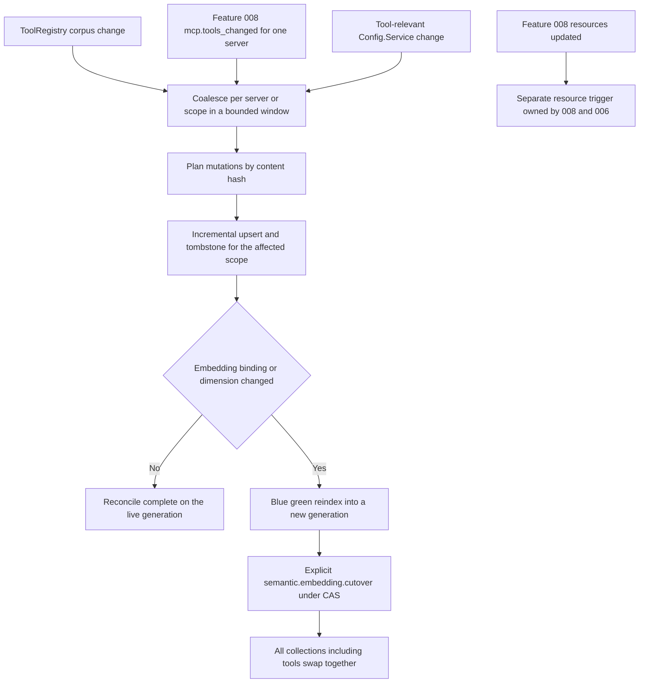

# Implementation Plan: Semantic Tool Search (Feature 009)

Feature: 009-add-semantic-embedding-and-reranker-retrieval-to-all-tool
Status target: planned (after this plan is complete)
Spec: [spec.md](spec.md) (status: planned; FR1–FR25, NFR1–NFR5, clarifications C1–C16)
Research: [research.md](research.md)
Decision record: [ADR-0007 Semantic Tool Search](../../adr/0007-add-semantic-embedding-and-reranker-retrieval-to-all-tool.md) (proposed; Option A — extend the Feature 006 stack with a `tools` collection)
Dependencies:
[Feature 006 Semantic Agent and Skill Retrieval (Milvus)](../006-add-milvus-backed-multilingual-semantic-retrieval-and/spec.md) (the single embedding/reranker stack, Milvus adapter, pinned bindings, nine-stage pipeline, tie-break, query-embedding cache, degradation ladder, multilingual posture, content-free telemetry, blue/green cutover, offline eval harness — all reused, never rebuilt),
[Feature 008 Complete MCP Client Tools and Resources Lifecycle](../008-add-complete-mcp-client-tools-and-resources-lifecycle-with/spec.md) (MCP catalog/lifecycle authority; the `mcp.tools_changed` event consumed as a tool reindex trigger; the resource-index opt-in stays with 008/006),
[Feature 007 Unified Native Operator Control Plane](../007-add-a-unified-native-operator-control-plane-for-all-opencode/spec.md) (Config.Service; the reserved `semantic.*` catalog reused with no new IDs),
[Feature 004 Lang Lock](../004-add-lang-lock-to-enforce-a-configurable-artifact-language/spec.md) (English tool descriptions vs multilingual query; language metadata),
[Feature 005 OutputSpool](../005-add-a-canonical-file-backed-outputspool-and-paged/spec.md) (large reindex job outputs as refs),
[Feature 001 Smart Agent Routing](../001-define-one-cohesive-smart-agent-routing-and-opentelemetry/spec.md) (top_k / result bounds; ranking authority separation),
[ADR-0001 Telemetry Foundation](../../adr/0001-opentelemetry-telemetry-foundation.md) (accepted),
[ADR-0003 Operator Control Plane](../../adr/0003-operator-control-plane-and-native-command-authority.md) (accepted).

---

## Overview

Feature 009 adds a **relevance layer over the existing tool-exposure surfaces** —
the native ToolRegistry, the MCP tool catalog, and the code-mode catalog — by
indexing one canonical tool corpus into a Milvus `tools` collection alongside the
implemented Feature 006 `agents` / `skills` / `skill_chunks` collections and
answering a task-scoped query with a bounded, deterministically ranked candidate
set. It is a **derived projection**: the Milvus `tools` collection never grants
tool availability, never overrides Permission/Policy visibility, and never decides
execution. ToolRegistry, the Feature 008 MCP catalog, Permission/Policy, and
Config.Service remain the sources of truth.

**Feature 009 extends the Feature 006 stack; it does not build a second one.** The
embedding model, reranker model, Milvus adapter, pinned `SemanticModelBinding`
slots, nine-stage pipeline stages 1–6+9, deterministic tie-break, shared
query-embedding cache, blue/green cutover executor, degradation ladder, multilingual
posture, content-free telemetry, and offline eval harness are all reused verbatim.
Feature 009 adds only: the `ToolDoc` corpus shape, the tool-scoped retrieval pass
(pipeline stages 1–6+9, omitting the agent-only 7–8), the tool document projection
with a sanitized parameter-schema projection, the three coalesced reindex triggers,
the per-surface Config.Service flags, and the ToolRegistry / MCP / code-mode
consumption seams. Every decision follows ADR-0007 and the C1–C16 clarify
resolutions.

The module name is **`semantic`** across every package, reusing the Feature 006
tree (`packages/{schema,protocol,core,opencode}/src/semantic/**` and the CUE mirrors
under `doc/arch/schemas/semantic/*.cue`); the tool integration touches
`packages/opencode/src/tool/**`, `.../session/tools.ts`, `.../mcp/**`, and the
Config.Service experimental schema.

- **Phase 1 — Schema and protocol tool shapes.** The `ToolDoc` projection and its
  tool-specific parts (source enum, MCP server ref, sanitized parameter-schema
  projection, content hash), the `ToolDocId`, the protocol tool-retrieval request /
  port extension, and the tool-scoped index payloads. Additive; no runtime behavior
  change. Reuses `DocIdentity` / `DocScope` / `DocAvailability` and the `"tools"`
  member of `Collection` / `CollectionKind` that already exist.
- **Phase 2 — Core tool-retrieval pass (`packages/core/src/semantic/tool-pass.ts`).**
  A framework-free runner that executes pipeline stages 1 profile → 2 filter →
  3 recall → 4 reduce → 5 rerank → 6 score then 9 revalidate, reusing
  `hybrid-fusion.ts` and `tie-break.ts` verbatim and omitting the agent-only
  stages 7 `select_agent` / 8 `skill_pass`. Produces a bounded ranked tool list over
  injected ports, no I/O in hot logic.
- **Phase 3 — Application, projection, triggers, and consumption seams
  (`packages/opencode/src/semantic/**`, `.../tool/**`, `.../mcp/**`).** The tool
  document projection with sanitized parameter-schema projection and content hash,
  the retrieval-facade extension (`retrieveTools` + the honest
  `FEATURE_009_TOOL_SELECTION_SEAM`), the three coalesced reindex triggers (registry
  change, `mcp.tools_changed`, config change), the `tools` collection joining the
  existing generic multi-collection cutover/reindex/reconcile, and the documented
  native / MCP / code-mode consumption seams gated by the per-surface flags.
- **Phase 4 — Configuration.** Per-surface enable flags (native / MCP / code-mode),
  `retrieval_top_k`, `rerank_top_k`, result bound, retrieval latency budget, cache
  TTL, and the optional per-surface fail-closed switch on the Config.Service
  experimental schema; defaults keep tool exposure at the full-set passthrough floor.
- **Phase 5 — Tests including the tool golden eval extension.** Unit (tool pass,
  projection/sanitization, trigger coalescing, seam), integration (the `tools`
  collection against the Milvus adapter; the shared-embedding cache reuse), the
  extended offline golden harness (query→tool relevance, multilingual pt/es/en,
  permission-leakage), and parity across the three surfaces, covering AC1–AC20.

Management authority for every operator surface remains Feature 007; Feature 009
registers no new command IDs and reuses the reserved `semantic.index.*` operators
for `tools` reindex/reconcile/status.

---

## Non-goals

- Implementing code during the plan phase.
- A second embedding/rerank service, Milvus adapter, or model-selection surface
  (Feature 006 owns the single stack — FR2, ADR-0007).
- Any new operator command IDs for embedding/reranker/binding/index management
  (the reserved `semantic.*` catalog is reused with no bump — FR22, C22 of 006).
- Widening tool visibility beyond Permission/Policy, or the semantic layer deciding
  tool execution (FR3, C10, C15).
- MCP connection/capability/lifecycle management or the MCP resource semantic index
  (Feature 008 — FR-relationship, C11).
- Agent/skill retrieval (`agents` / `skills` / `skill_chunks` — Feature 006).
- A default narrowing of the live LLM tool list: the V1 default keeps all three
  surfaces at the full-set passthrough floor (FR18, C9, C15).
- Indexing secrets, prompts, reasoning, private payloads, or filesystem paths
  (FR7, C6).
- Fixing numeric `retrieval_top_k` / `rerank_top_k` / result bounds / latency
  budgets / cache TTLs / parameter-schema size caps — provisional plan constants
  with named acceptance hooks, finalized in the tasks phase (C5, C6, C8).
- Online self-optimizing or feedback-loop ranking policy in V1 (FR25, C16).

---

## Technical Approach

### Architecture layers

```
Tool-exposure surfaces (existing — the consumption seams)
  registry.ts tools()            — native tool list (session/tools.ts resolve loop 1)
  mcp/index.ts tools()           — MCP tool catalog (session/tools.ts resolve loop 2)
  registry.ts describeCodeMode   — code-mode catalog (tool/code-mode.ts describeCatalog)
        |  (per-surface enable flag gates consumption; default OFF = full-set floor)
        v
Application + adapters (Feature 009 — packages/opencode/src/semantic/**, tool/**, mcp/**)
  ToolProjection        — ToolDoc projection + sanitized parameter-schema projection + content hash (C6)
  RetrievalFacade(+)    — retrieveTools over the injected runTools; FEATURE_009_TOOL_SELECTION_SEAM (C2, C15)
  ToolReindexTrigger    — registry-change + mcp.tools_changed + config coalesced triggers (C11)
  tools-collection wiring — joins CutoverExecutor / IndexJobs generic multi-collection lifecycle (C7)
        |
        v
Domain (Feature 009 core — packages/core/src/semantic/tool-pass.ts, zero framework deps)
  ToolPass              — stages 1 profile -> 2 filter -> 3 recall -> 4 reduce -> 5 rerank -> 6 score -> 9 revalidate (C2)
  (reuses HybridFusion.fuseRank + TieBreak.order verbatim; omits stages 7/8)
        |
        v
Reused Feature 006 substrate (existing — NOT re-implemented)
  Pipeline reduce/fusion/tie-break — packages/core/src/semantic/{hybrid-fusion,tie-break}.ts
  QueryCache                        — packages/core/src/semantic/query-cache.ts (shared key: fingerprint+binding_version+config_hash)
  MilvusPort / EmbeddingPort / RerankPort — packages/opencode/src/semantic/{milvus-adapter,embedding-client,rerank-client}.ts
  CutoverExecutor / IndexJobs       — packages/opencode/src/semantic/{cutover-executor,index-jobs}.ts (multi-collection generic)
  DegradationLadder                 — packages/core/src/semantic/degradation.ts (three rungs; no model substitution)
  EvalPort / eval-harness           — packages/opencode/src/semantic/eval-harness.ts (id-generic golden set)
  SemanticInstruments               — packages/core/src/semantic/semantic-instruments.ts (content-free spans/metrics)
  Reserved semantic.* catalog       — packages/core/src/operator/catalog.ts (1.3.0; no bump)
        |
        v
Sources of truth (existing — authority, never the projection)
  ToolRegistry.Service              — packages/opencode/src/tool/registry.ts (tool identity/availability)
  MCP.Service                       — packages/opencode/src/mcp/index.ts (MCP tool identity/lifecycle; mcp.tools_changed)
  Permission / Permission.visibleTools — permission visibility (hard filter + revalidation authority)
  Config.Service                    — packages/core/src/config/** (per-surface flags/bounds)
```

Dependency rule: surfaces → application → domain. The `tool-pass.ts` domain runner
imports no Milvus SDK, no HTTP transport, and no Config.Service; it takes the same
injected ports the agent pass uses and returns a bounded ranked tool list. The
application layer owns the projection, the triggers, the flag gate, and the
consumption seams; no consumer receives a secret or an unsanitized parameter schema.

### Reuse mandate (reused verbatim vs added)

| Concern | Feature 006/008 source (REUSED) | Feature 009 addition |
| ------- | -------------------------------- | -------------------- |
| Embedding / reranker models, pinned bindings | Feature 006 `SemanticModelBinding` slots | none — reused as-is (FR2) |
| Milvus adapter, HNSW + sparse hybrid | `packages/opencode/src/semantic/milvus-adapter.ts` | none — the `tools` collection uses the same port (FR2, C7) |
| Pipeline reduce + fusion + tie-break | `hybrid-fusion.ts`, `tie-break.ts` | reused verbatim inside `tool-pass.ts` (C2, C3) |
| Tie-break total order | `tie-break.ts` (rerank→dense→sparse→canonical id→version) | reused; canonical id = composed tool id, version = content hash (C3) |
| Query-embedding cache | `query-cache.ts` `keyOf` (fingerprint+binding_version+config_hash) | reused verbatim across native/MCP/code-mode (C8) |
| Blue/green cutover, multi-collection CAS | `cutover-executor.ts` `CutoverInput.collections` | `tools` joins the collection set; no new machinery (C7) |
| Index upsert/tombstone/reconcile, coalescing | `index-jobs.ts` `runReconcile` / `coalesceTriggers` | reused per-collection for `tools` (C7, C11) |
| Degradation ladder, no model substitution | `degradation.ts` (full → lexical) | add the third `tools` floor: full-set passthrough (C14) |
| Offline golden eval | `eval-harness.ts` `runGolden` / `GoldenCase` | add a tool golden fixture set; reuse the zero-leakage gate (C16) |
| Content-free telemetry | `semantic-instruments.ts` | add `retrieve.tools` / `rerank.tools` spans + bounded rank buckets (C16) |
| Structured query | Feature 006 `TaskProfile` / `QueryFingerprint` | reused; drives the tool pass (C1) |
| Sparse/lexical signal | `Permission.visibleTools` wildcard/name matching | reused/extended as the tool sparse component (C4) |
| Shared document parts | `documents.ts` `DocIdentity` / `DocScope` / `DocAvailability` | reused by the new `ToolDoc` (C6, C13) |
| Collection namespace | `Collection` / `CollectionKind` include `"tools"` | reused; no enum change needed (C7) |
| Reserved operator catalog | 30 `semantic.*` IDs at 1.3.0 | reused; `semantic.index.*` drives `tools` reindex; no bump (FR22) |
| Retrieval facade + seam precedent | `retrieval-facade.ts` `createRetrievalFacade` / `FEATURE_001_SELECTION_SEAM` | extend with `retrieveTools` + `FEATURE_009_TOOL_SELECTION_SEAM` (C2, C15) |
| Tool identity + schema at the boundary | `registry.ts` `tools()`, `mcp/catalog.ts` `convertTool` | projected into `ToolDoc`; no new registry (FR1, FR6) |
| MCP change event | Feature 008 `mcp.tools_changed` | consumed as the C11(b) trigger; never re-specified (C11) |
| Per-surface config | Config.Service `Experimental` schema | add tool-search flags/bounds (C9, C12, C21) |

### Module tree — files to TOUCH vs files to ADD

**Files to TOUCH (extend existing, in-scope today unless noted):**

```
packages/schema/src/semantic/enums-state.ts   # add ToolSource (native|mcp|custom|plugin); Collection already has "tools"
packages/schema/src/semantic/ids.ts           # add ToolDocId (branded)
packages/schema/src/semantic/index.ts          # barrel-export the new tool-doc module
packages/protocol/src/semantic/commands.ts    # add ToolRetrievalRequest / collection discriminator + tool index payloads
packages/protocol/src/semantic/ports.ts       # extend RetrievalPort with retrieveTools (or sibling ToolRetrievalPort)
packages/opencode/src/semantic/retrieval-facade.ts  # retrieveTools + runTools on PipelineRunnerPort + FEATURE_009_TOOL_SELECTION_SEAM
packages/opencode/src/semantic/index-jobs.ts  # tool LiveDoc projection input for runReconcile (already collection-generic)
packages/opencode/src/semantic/eval-harness.ts # tool golden fixtures (GoldenCase is id-generic)
packages/core/src/semantic/semantic-instruments.ts # retrieve.tools/rerank.tools spans + bounded rank buckets
packages/core/src/config/experimental.ts      # per-surface enable/fail-closed flags + top_k/budget/TTL (in scope: Feature 007)
packages/core/src/v1/config/config.ts          # thread the tool-search config (in scope: Feature 007)
packages/opencode/src/tool/registry.ts        # describeCodeMode + tools() consumption seam (in scope: Feature 007)
packages/opencode/src/mcp/index.ts             # mcp.tools_changed -> tool reindex trigger wiring (in scope: Feature 008)
packages/opencode/src/session/tools.ts        # native + MCP live-consumption seam (NEW GLOB required)
packages/opencode/src/tool/code-mode.ts       # describeCatalog ranked-subset parameter (NEW GLOB required)
```

**Files to ADD (new):**

```
packages/schema/src/semantic/tool-doc.ts              # ToolDoc entity + tool-specific parts (kept out of documents.ts for the calisthenics bound)
packages/core/src/semantic/tool-pass.ts               # stages 1-6+9 tool runner; reuses hybrid-fusion + tie-break
packages/opencode/src/semantic/tool-projection.ts     # ToolDoc projection + sanitized parameter-schema projection + content hash
packages/opencode/src/semantic/tool-reindex-trigger.ts # three coalesced triggers (registry, mcp.tools_changed, config); parallel to mcp/reindex-trigger.ts
packages/opencode/src/semantic/tool-retrieval.ts      # composition: per-surface flag gate + ranked-subset application after Permission.visibleTools
doc/arch/schemas/semantic/tool-doc.cue                # CUE mirror of the ToolDoc entity (DDD role header; <=7 fields)
doc/arch/schemas/semantic/tool-doc-parts.cue          # CUE mirror of the tool sub-objects (source, server ref, param projection)
doc/arch/schemas/semantic/enums-tool.cue              # CUE mirror of ToolSource (if split from enums-state.cue)
packages/schema/test/semantic/tool-doc.test.ts        # (in scope: Feature 006 test glob)
packages/core/test/semantic/tool-pass.test.ts         # (in scope)
packages/opencode/test/semantic/tool-*.test.ts        # projection/trigger/seam/eval (in scope)
```

Test suites land under the existing `packages/*/test/semantic/**` globs from
Feature 006 and need no new glob. The CUE mirrors live under the always-derived
`doc/arch/**` scope and need no glob. The `ToolDoc` entity goes in its own
`tool-doc.ts` module (not `documents.ts`) because `documents.ts` already carries
14 exported structs — near the ≤10-definitions warning bound — and mixing a new
id-bearing entity into a shared-parts file violates the DDD-role split; the CUE
`tool-doc.cue` / `tool-doc-parts.cue` split mirrors the existing `-doc` / `-parts`
precedent.

### Tool corpus and the sanitized parameter-schema projection (C6, FR6, FR7)

The `ToolDoc` projection carries: the composed tool id, display name, `ToolSource`
(`native` | `mcp` | `custom` | `plugin`), the MCP server id when applicable, a
sanitized description, a **bounded parameter-schema projection** (parameter names,
JSON-Schema types, and descriptions only), permission pattern/visibility metadata,
the Feature 004 language tag, and a content hash. It reuses `DocIdentity`,
`DocScope`, and `DocAvailability`. The projection strips `default` / `example` /
`const` values, `format`, paths, and any free-form string that could carry a
secret; only parameter names, types, and descriptions survive, bounded by a size
cap. Descriptions and schemas are read from the boundary already exposed:
`registry.ts` `tools()` → `tool.description` + `tool.jsonSchema`; `mcp/catalog.ts`
`convertTool` → `description` + `inputSchema`. No secret, credential, prompt,
reasoning, payload, or filesystem path is ever indexed. The sanitization allowlist
and size cap are provisional plan constants with acceptance hook AC18.

---

## Incremental slices

| Slice | Name | Delivers | Phase | Depends |
| ----- | ---- | -------- | ----- | ------- |
| S0 | Tool source enum + ToolDocId | `enums-state.ts` `ToolSource` (native/mcp/custom/plugin); `ids.ts` `ToolDocId` branded (FR6, C6) | 1 | — |
| S1 | ToolDoc corpus shape | `tool-doc.ts` `ToolDoc` entity + tool parts (source, server ref, sanitized parameter-schema projection); reuses `DocIdentity`/`DocScope`/`DocAvailability`; CUE mirrors (FR6, FR7, C6, C13, AC18) | 1 | S0 |
| S2 | Protocol tool-retrieval contracts | `commands.ts` `ToolRetrievalRequest` / collection discriminator + tool index payloads; `ports.ts` `retrieveTools` on `RetrievalPort` (FR11, C2) | 1 | S1 |
| S3 | Core tool pass | `tool-pass.ts` stages 1 profile→2 filter→3 recall→4 reduce→5 rerank→6 score→9 revalidate; reuses `hybrid-fusion`+`tie-break`; omits 7/8; bounded ranked tool list (FR11, FR12, C2, AC1, AC8, AC13) | 2 | S2 |
| S4 | Tool projection + content hash | `tool-projection.ts` ToolDoc projection; sanitized parameter-schema projection strips secrets/paths/defaults; content-hash incremental upsert/tombstone (FR6, FR7, FR8, C6, AC10, AC18) | 3 | S1 |
| S5 | Facade extension + honest seam | `retrieval-facade.ts` `retrieveTools` + `runTools` on `PipelineRunnerPort` + `FEATURE_009_TOOL_SELECTION_SEAM`; budget guard reused (FR11, C2, C15, AC13) | 3 | S3 |
| S6 | tools collection lifecycle join | wire `tools` into the generic `cutover-executor` / `index-jobs` multi-collection reindex/reconcile/cutover; content-hash idempotent upsert/tombstone (FR8, FR9, C7, AC9, AC10) | 3 | S4 |
| S7 | Coalesced reindex triggers | `tool-reindex-trigger.ts` three triggers (registry change, `mcp.tools_changed` per affected server, config change) coalesced per server/scope; parallel to 008 resource trigger (FR8, C11, NFR2, AC9) | 3 | S6 |
| S8 | Per-surface Config.Service flags | `experimental.ts` + `config.ts` per-surface enable (native/mcp/code-mode), `retrieval_top_k`, `rerank_top_k`, result bound, latency budget, cache TTL, per-surface fail-closed; defaults = full-set floor (FR18, FR21, C5, C9, C12, AC14, AC19) | 4 | S5 |
| S9 | Native + MCP consumption seam | `tool-retrieval.ts` + `session/tools.ts` + `registry.ts` `tools()` ranked-subset applied AFTER `Permission.visibleTools`, gated by the flag; default off = full-set passthrough (FR3, FR5, C4, C9, C15, AC1, AC3, AC7) | 3 | S5, S8 |
| S10 | code-mode consumption seam | `code-mode.ts` `describeCatalog` bounded-subset parameter; `registry.ts` `describeCodeMode` feeds the ranked subset after `Permission.visibleTools` when the flag is on (FR5, C10, C15, AC1) | 3 | S9 |
| S11 | Degradation ladder third rung | reuse `degradation.ts`; add the tool-search full-set passthrough floor below lexical-only; typed capability gap; no model substitution; per-surface fail-closed honored (FR18, FR19, FR20, C14, AC5, AC6, AC7, AC14, AC19) | 3 | S5 |
| S12 | Telemetry + tool golden eval | `semantic-instruments.ts` `retrieve.tools`/`rerank.tools`/`semantic.fallback` spans + bounded rank buckets (tool ids never labels); `eval-harness.ts` tool golden set (query→tool, multilingual, leakage) reusing the zero-leakage gate (FR23, FR24, FR25, C16, AC15, AC20) | 5 | S3 |
| S13 | Tests + validation | Unit (tool pass, projection/sanitization, trigger coalescing, seam, tie-break tool id/version), integration (`tools` collection vs the Milvus adapter; shared-embedding cache reuse; cross-project isolation), degradation (Milvus/reranker/embedder down; fail-closed opt-in), parity across surfaces; covers AC1–AC20 | 5 | all |

---

## Data model and persistence strategy

Entity definitions are finalized in the `data-model.md` companion and the
`doc/arch/schemas/semantic/tool-doc*.cue` mirrors. Authority is single-sourced:
ToolRegistry, the Feature 008 MCP catalog, Permission/Policy, and Config.Service
remain the sources of truth; the Milvus `tools` collection is a derived, rebuildable
projection.

### The `tools` collection (FR9, FR10, C7, C13)

The `tools` collection joins the existing binding generation alongside `agents` /
`skills` / `skill_chunks` under **one embedding binding generation**; it is not an
independent generation. It carries the Feature 006 embedding binding version, model
id, dimension, normalization, and distance metric with the collection generation —
incompatible vectors are never mixed. Tenant/project/scope reuse the scalar
`DocScope` (`project_id` partition key, `scope`, `visibility`, `permission_ref`)
with mandatory scalar filters on every search and no per-project collections;
multi-root workspaces map each root to a scalar project key. Embedding
binding/dimension changes follow the existing `semantic.embedding.cutover` under
CAS; `select` / `reindex` alone never activate the live alias.

### ToolDoc (FR6, FR7, C6)

`ToolDoc` reuses `DocIdentity` / `DocScope` / `DocAvailability` and adds a tool
classification part (composed id, display name, `ToolSource`, MCP server ref), the
sanitized description, and the bounded parameter-schema projection (names / types /
descriptions only). The parameter-schema projection is the only Feature-009-novel
sub-object; its sanitization allowlist and size cap are provisional plan constants
with acceptance hook AC18. No volatile availability field is authority — every
candidate is revalidated against live ToolRegistry / MCP / Permission before it
reaches the model (FR3, AC4).

---

## API and command contracts

### Tool retrieval port (C2)

The domain `tool-pass.ts` runner is injected as `runTools` on the facade's
`PipelineRunnerPort`; the facade exposes `retrieveTools`, mirroring
`retrieveAgents` / `retrieveSkills`. The request rides `collection: "tools"` (the
schema `RetrievalRequest` already carries `collection`; the protocol layer gains a
tool discriminator). `retrieval_top_k` / `rerank_top_k` inherit the Feature 006
`Values.TopK` bound enforced by the reused `budgetError` guard; the result list is
bounded by config and never unbounded.

| Port operation | Signature intent | Stages |
| -------------- | ---------------- | ------ |
| `retrieveTools(request)` | Bounded ranked, revalidated tool candidate list over `collection: "tools"` | 1–6, 9 |
| `runTools(request)` | Injected pipeline runner: profile → filter → recall → reduce → rerank → score → revalidate | 1–6, 9 |
| `FEATURE_009_TOOL_SELECTION_SEAM(port)` | Documented, typed, test-covered wiring point; not invoked by any live route in V1 (default flags off) | — |

### Operator surface (reused; no new IDs — FR22)

Reindex / reconcile / status of the `tools` collection flow through the existing
reserved `semantic.index.reindex` / `semantic.index.reconcile` /
`semantic.index.status` / `semantic.index.show-collections` operator IDs
(`packages/core/src/operator/catalog.ts`, `RESERVED_CATALOG_VERSION = "1.3.0"`).
Feature 009 registers **no** new operator command IDs and requires **no** catalog
bump. Plugin / MCP / custom registries never register reserved IDs.

---

## Reindex trigger flow (C11)

Three triggers coalesce per affected server/scope within a bounded window and drive
one incremental content-hash reindex pass over the `tools` collection, never a full
rebuild. The tool trigger is independent from and parallel to the Feature 008
resource-index opt-in seam.



---

## Security and threat boundaries

| Threat | Mitigation |
| ------ | ---------- |
| Semantic layer widening the tool set beyond Permission/Policy | `Permission.visibleTools` applied as a hard filter BEFORE retrieval and the candidate set revalidated AFTER retrieval; the ranked subset is applied after visibility, never widening it (FR3, C10, C15, AC3) |
| Stale-index authority (removed tool still in Milvus) | Bounded-staleness projection; post-retrieval revalidation against live ToolRegistry / MCP / Permission drops it before the model (FR3, C11, AC4) |
| Secrets / paths in the parameter-schema projection | Projection sanitizes to a names/types/descriptions allowlist; `default` / `example` / `const` / `format` / paths stripped; size-capped (FR7, C6, AC18) |
| Cross-project tool retrieval leakage | Mandatory scalar `DocScope` filters on every search; scalar project partition key; zero-leakage eval tolerance (FR10, C13, AC11) |
| LLM / plugin / MCP / registry mutating bindings or corpus | Bindings mutate only via Feature 007 operator commands; the corpus is a derived projection; plugin/MCP/custom cannot register reserved IDs (FR4, FR22, AC16) |
| Silent model substitution on outage | The reused typed degradation ladder never auto-selects another embedding/reranker; binding state surfaces `degraded` / `unavailable`; the full-set passthrough floor keeps availability no worse than today (FR19, C14, AC6, AC7) |
| Unbounded recall / result memory | `retrieval_top_k` / `rerank_top_k` / result bound from Config.Service; the reused `budgetError` guard rejects overflow; bounded candidate memory (FR13, NFR3, AC13) |
| Content leak in telemetry | Content-free spans/metrics; tool ids, MCP server names, session ids, query text, vectors, and paths never appear as labels; selected rank is a bounded bucket (FR24, ADR-0001, C16, AC15) |
| Fail-closed misconfiguration | Fail-closed is per-surface and defaults off (degrade, never hard-fail); an opted-in surface returns a typed capability-gap error instead of degrading (FR18, C12, AC19) |

---

## Testing matrix

| Layer | Scope | How |
| ----- | ----- | --- |
| Unit | Tool pass stage order (1–6+9, no 7/8), tie-break with tool id/version, projection + parameter-schema sanitization, trigger coalescing, the honest seam | Pure tests; deterministic recall/rerank/revalidate/clock ports; no I/O; AC1, AC8, AC13, AC18 |
| Integration (Milvus) | The `tools` collection over the shared adapter; mandatory scalar filters; content-hash upsert/tombstone; cross-project isolation | Standalone Milvus server (container) + injected fake behind the shared port; AC9, AC10, AC11 |
| Cache reuse | Native then MCP surface querying the same task fingerprint reuse the query embedding from the shared cache | Deterministic embed port + shared `QueryCache`; AC12 |
| Degradation | Milvus down → lexical-only; reranker down → dense/lexical order; embedder + Milvus down → full-set floor; no binding pinned → floor; per-surface fail-closed | Injected outage on each shared port; AC5, AC6, AC7, AC14, AC19 |
| Permission / stale | Wildcard-deny tool never in candidates; removed tool dropped at revalidation; ranked subset never widens `Permission.visibleTools` | Isolation harness; AC3, AC4 |
| Multilingual eval | pt-BR / es / en query→tool relevance against en-US Lang Lock descriptions; recall/nDCG/MRR; zero permission-leakage | Extended offline golden harness + fixtures; AC2, AC20 |
| Telemetry | Content-free spans/metrics; no tool id / server name / session id / query / vector / path label; bounded rank bucket | Cardinality + content-free assertions; AC15 |
| Operator reuse | `semantic.index.reindex` / `status` run for `tools` with zero model tokens and no new Feature 009 ID | Feature 007 sandbox; AC17 |
| Surface parity | Native, MCP, and code-mode consume one corpus and one ranking contract; identical inputs yield identical ordering | Deterministic pass across all three seams; AC1, AC8 |

Acceptance coverage maps every scenario AC1–AC20 to a slice. Provisional numeric
constants (`retrieval_top_k` / `rerank_top_k` / result bound / latency budget /
cache TTL / parameter-schema size cap) carry named acceptance hooks and are fixed
in the tasks phase.

---

## Observability alignment

- Reuse the Feature 006 / ADR-0001 content-free posture verbatim. Add stable enum
  spans `retrieve.tools`, `rerank.tools`, and `semantic.fallback`; the shared
  `embed.query` span is reused when the query embedding is shared across surfaces
  (FR23, C16).
- Metrics reuse the bounded enums: candidates before/after rerank, cache hit,
  fallback/stale counts, rerank delta buckets, selected tool rank buckets, and
  latency. Tool ids are NOT emitted as labels even though bounded; selected rank is
  a bounded bucket, never the id (FR24, C16, AC15).
- Labels never carry query text, vectors, tool ids, MCP server names, session ids,
  or paths (ADR-0001). Feature 009 adds no new exporter, SDK, or pipeline; it reuses
  the single telemetry authority.
- Feature 002 Process Table MAY show the tool reindex job lifecycle and degraded
  flags without raw queries; Feature 005 spool holds large reindex outputs as refs.

---

## Proposed specScopeGlobs (tasks/implement phase)

Narrow, file-exact globs to add to `doc/arch/speckit.toml` in the tasks phase —
**not applied by this plan**. Most semantic paths are ALREADY in scope from Feature
006, the MCP paths from Feature 008, and `tool/registry.ts` + `config/**` from
Feature 007; those overlaps are listed as comments, not re-added. Only two paths are
genuinely new — the C15 live-consumption seams on `session/tools.ts` and
`tool/code-mode.ts`.

```toml
specScopeGlobs = [
  # Feature 009 — Semantic Tool Search (genuinely new implement paths).
  "packages/opencode/src/session/tools.ts",   # native + MCP live-consumption seam (C15)
  "packages/opencode/src/tool/code-mode.ts",   # code-mode ranked-subset seam (C10, C15)

  # ALREADY IN SCOPE — listed for traceability only, NOT re-added:
  #   packages/schema/src/semantic/**          (Feature 006)  — ToolDoc, ToolSource, ToolDocId, tool-doc.ts
  #   packages/protocol/src/semantic/**         (Feature 006)  — retrieveTools port + tool payloads
  #   packages/core/src/semantic/**             (Feature 006)  — tool-pass.ts, instruments extension
  #   packages/opencode/src/semantic/**         (Feature 006)  — projection, facade, trigger, retrieval wiring
  #   packages/{schema,protocol,core,opencode}/test/semantic/**  (Feature 006)  — all tool test suites
  #   packages/opencode/src/tool/registry.ts    (Feature 007)  — describeCodeMode + tools() seam
  #   packages/core/src/config/experimental.ts  (Feature 007)  — per-surface flags
  #   packages/core/src/v1/config/config.ts      (Feature 007)  — config threading
  #   packages/opencode/src/mcp/**              (Feature 008)  — mcp.tools_changed trigger wiring
  #   doc/arch/schemas/semantic/*.cue           (always-derived doc/arch/**) — tool-doc CUE mirrors
]
```

---

## Feature cross-dependencies

| Feature | Dependency | Interaction |
| ------- | ---------- | ----------- |
| 006 Semantic Retrieval | The single embedding/rerank stack, Milvus adapter, pinned bindings, pipeline stages 1–6+9, tie-break, query cache, cutover, degradation ladder, eval harness, telemetry | S3, S5, S6, S11, S12 (FR2, C2–C8, C14, C16) |
| 008 MCP Tools/Resources | MCP catalog/lifecycle authority; `mcp.tools_changed` consumed as the tool trigger; resource-index opt-in stays with 008/006 | S7 (FR8, C11) |
| 007 Operator Control Plane | Config.Service per-surface flags; reserved `semantic.*` catalog reused with no new IDs | S8 (FR21, FR22, C9, C12) |
| 004 Lang Lock | English tool descriptions vs multilingual query; language tag on the ToolDoc and the decision without content | S1, S4, S12 (FR16, FR17, C1) |
| 005 OutputSpool | Large tool reindex job outputs as refs, never duplicated bodies | S6, S7 (Observability) |
| 001 Smart Routing | top_k / result bounds; ranking/selection authority separation | S2, S3, S8 (FR13, C5) |

---

## Validation checklist (plan complete when)

- [x] The Milvus `tools` collection is a derived projection, never a second tool
      registry / availability authority / permission authority; ToolRegistry, MCP,
      Permission, and Config.Service remain sources of truth (FR1, C15)
- [x] Feature 009 reuses the single Feature 006 embedding/reranker stack, Milvus
      adapter, and pinned bindings; no second stack, adapter, or model-selection
      surface (FR2, ADR-0007)
- [x] Semantic ranking never returns a tool that is not permission-visible;
      `Permission.visibleTools` is a hard pre-filter and the candidate set is
      revalidated after retrieval (FR3, C10, C15)
- [x] The tool pass runs pipeline stages 1–6 + 9, reusing `hybrid-fusion` and
      `tie-break` verbatim and omitting the agent-only 7/8 (FR11, C2)
- [x] The tie-break total order is reused verbatim; canonical id = composed tool id,
      version = content hash (FR13, C3)
- [x] The sparse signal reuses/extends `Permission.visibleTools` wildcard/name
      matching; dense recall uses the pinned query embedding; one hybrid recall
      bounded by `retrieval_top_k`, rerank only over the reduced set (FR12, C4)
- [x] `retrieval_top_k` / `rerank_top_k` inherit the Feature 006 `Values.TopK` bound
      via the reused `budgetError` guard; the result list is bounded (FR13, C5)
- [x] `ToolDoc` reuses `DocIdentity` / `DocScope` / `DocAvailability`; the parameter-
      schema projection strips secrets/paths/defaults to names/types/descriptions,
      size-capped (FR6, FR7, C6, AC18)
- [x] The `tools` collection shares the single binding generation and the generic
      multi-collection cutover; no new lifecycle machinery (FR9, C7)
- [x] The shared query embedding reuses the Feature 006 cache key verbatim across
      native / MCP / code-mode (FR14, C8)
- [x] Three coalesced triggers (registry change, `mcp.tools_changed`, config change)
      drive incremental content-hash upsert/tombstone; independent from the 008
      resource trigger (FR8, C11, NFR2)
- [x] Per-surface enable + fail-closed flags default to the full-set passthrough
      floor; tool exposure is never worse than today (FR18, FR21, C9, C12)
- [x] The degradation ladder reuses the Feature 006 posture with the tool full-set
      floor; no automatic model substitution (FR18, FR19, C14)
- [x] code-mode `describeCatalog` consumes the ranked subset after
      `Permission.visibleTools` when enabled; unchanged when off (FR5, C10)
- [x] The honest `FEATURE_009_TOOL_SELECTION_SEAM` mirrors the implemented
      `FEATURE_001_SELECTION_SEAM`; no default narrowing of the live tool list (C15)
- [x] Content-free `retrieve.tools` / `rerank.tools` / `semantic.fallback` spans and
      bounded metrics; tool ids never labels; selected rank as a bounded bucket
      (FR23, FR24, C16)
- [x] The offline golden harness is extended with a tool set (query→tool,
      multilingual, permission-leakage) reusing the same `EvalPort` and zero-leakage
      gate (FR25, C16)
- [x] All `tools` reindex/reconcile/status flow through the reserved `semantic.*`
      IDs at 1.3.0; no new Feature 009 operator ID; no catalog bump (FR22)
- [x] Proposed specScopeGlobs list only the two genuinely new seam paths; all other
      semantic/MCP/config paths noted as already in scope
- [x] Companion artifacts listed (`data-model.md`, `contracts/`, tool-doc CUE mirrors)
- [x] Provisional numeric constants carry named acceptance hooks; finalized in the
      tasks phase

---

## Companion artifacts

| File | Purpose |
| ---- | ------- |
| [research.md](research.md) | Empirical audit of the Feature 006 exports (pipeline, facade, cutover, cache, eval) and Feature 008 tool identity/change events for extension |
| [spec.md](spec.md) | Feature specification (planned; FR1–FR25, NFR1–NFR5, C1–C16) |
| [ADR-0007](../../adr/0007-add-semantic-embedding-and-reranker-retrieval-to-all-tool.md) | Semantic Tool Search decision record (Option A — extend the Feature 006 stack) |
| `data-model.md` (new) | Entity definitions: ToolDoc, tool parts, ToolSource, ToolDocId, tool-retrieval request/candidate reuse |
| `contracts/` (new) | TypeScript contracts: `retrieveTools` port extension, `runTools` runner, tool index payloads |
| `doc/arch/schemas/semantic/tool-doc*.cue` (new) | CUE mirrors of the ToolDoc entity + parts, calisthenics-compliant per the `-doc` / `-parts` precedent |
</content>
