# Implementation Plan: Native Rust FFI Tools and PTY Integration (Feature 010)

Feature: 010-add-native-rust-ffi-layer-for-built-in-tools-and-pty
Status target: planned (after this plan is complete)
Spec: [spec.md](spec.md) (status: planned; FR1–FR24, NFR1–NFR6, AC1–AC18, clarifications C1–C20)
Research: [research.md](research.md)
Decision record: [ADR-0010 Native Rust FFI Layer for Built-in Tools and PTY](../../adr/0010-add-native-rust-ffi-layer-for-built-in-tools-and-pty.md) (proposed; Rust `cdylib` via `bun:ffi` `dlopen`)
Dependencies:
[Feature 007 Unified Native Operator Control Plane](../007-add-a-unified-native-operator-control-plane-for-all-opencode/spec.md) (PermissionV2 authority; the permission gate that stays in TypeScript; the `experimental.*` Config flag precedent),
[Feature 005 OutputSpool and ArtifactStore](../005-add-a-canonical-file-backed-outputspool-and-paged/spec.md) (the output plane native and TypeScript tool outputs flow to as refs; not re-specified),
[Feature 006 Milvus Semantic Retrieval](../006-add-milvus-backed-multilingual-semantic-retrieval-and/spec.md) (the `milvus_unavailable` typed capability-gap precedent the `native_unavailable` fallback mirrors),
[Feature 001 Smart Agent Routing and Telemetry](../001-define-one-cohesive-smart-agent-routing-and-opentelemetry/spec.md) (content-free telemetry and bounded-label conventions),
[ADR-0001 Telemetry Foundation](../../adr/0001-opentelemetry-telemetry-foundation.md) (accepted).

---

## Overview

Feature 010 adds the **first Rust in the repository**: two `cdylib` crates and one
shared internal `rlib`, loaded through Bun's `bun:ffi` `dlopen` seam already proven in
`packages/tui/src/terminal-win32.ts` (kernel32) and
`packages/opencode/src/operator/adapters/outbound/keychain-darwin.ts` (Security.framework).
It reimplements six filesystem/text built-ins (`read`, `write`, `edit`, `apply_patch`,
`glob`, `grep`) with **byte-identical behavioral parity** to their TypeScript references,
and gives the shell tool an **opt-in** real PTY (`pty: true`) with a controlling terminal.

Native code is authoritative for **nothing**. It is a swappable execution backend behind
each tool's existing TypeScript boundary: tool identity/registration stays with
ToolRegistry, the permission/approval gate stays in TypeScript (Feature 007 PermissionV2)
and is evaluated **before** every native call and every PTY spawn, tool-output identity
stays with Feature 005 OutputSpool, and telemetry stays content-free (ADR-0001). When the
compiled library is absent, unloadable, ABI-mismatched, or the Config flag is off, every
affected surface falls back **silently and behavior-identically** to the current
TypeScript path and records a typed `native_unavailable` capability gap mirroring the
`milvus_unavailable` precedent.

The FFI boundary is **synchronous, panic-safe, and leak-free by contract**: every entry
point is `catch_unwind`-wrapped and returns the CUE-normative `#FfiResponse` JSON envelope
(`{ status: "ok", result }` / `{ status: "error", error: { code, message } }`); every
Rust-allocated response is freed exactly once through the exported `oc_free`. PTY async IO
stays entirely on Bun's event loop: `oc_pty_spawn` hands the master fd to Bun as the sole
owner, and Bun reads/writes it via `node:net.Socket({ fd })` with `O_NONBLOCK` — no FFI
call on the IO hot path. No Tokio or async runtime is introduced in phase 1.

Delivery follows the spec's implementation order (P3 user story, C-workspace, C6):

- **Phase 1 — Workspace bootstrap + ABI crate.** The root cargo workspace,
  `rust-toolchain.toml` pin, `.gitignore` for `target/` and the bundled native dir, and
  the shared `opencode-ffi-abi` `rlib` implementing the envelope, the `catch_unwind`
  wrapper, `oc_free`, the alloc/free counter, and the `oc_abi_version` / `oc_version`
  handshake — the panic-safe/leak-free boundary implemented once (C6, C7, C15, C18).
- **Phase 2 — PoC `read` + `grep` native + loader/wrapper seam + parity harness.** The
  `opencode-tools-ffi` crate skeleton with `oc_read` (all read caps + binary detection)
  and `oc_grep` (embedded ripgrep, no external `rg` spawn), the `loader.ts` discovery /
  lazy `dlopen` / ABI handshake / gap seam, the `read` + `grep` TS wrappers, and the
  shared-fixtures parity harness proving byte-identity on two tools end to end
  (FR1, FR6, C1, C5, C7, C8, C13, C16).
- **Phase 3 — Remaining filesystem tools.** `oc_write` (atomic write-and-rename),
  `oc_edit` (zero/one/many + replaceAll semantics), `oc_apply_patch` (multi-hunk +
  typed context-mismatch), and `oc_glob` (`ignore` + `globset`, mtime sort), plus their
  TS wrappers and parity-suite extension (FR2–FR5, FR7).
- **Phase 4 — PTY crate + `bash.ts` `pty: true` integration.** The `opencode-pty-ffi`
  crate (`oc_pty_spawn`/`resize`/`kill`/`wait`/`close` via `portable-pty` + `libc`), the
  TS session registry (`session_id → { pid, master_fd, pgid, stream }`), the Bun-side
  `node:net.Socket({ fd })` reader, and the opt-in `bash.ts` `pty: true` route with the
  permission gate first and the TS-driven 3 s SIGKILL escalation mirroring `forceKillAfter`
  (FR8–FR13, C9–C12, C19, C20).
- **Phase 5 — Stress/leak suite + telemetry + close-out.** The ≥100k-call leak stress
  test (matched `oc_alloc_stats` alloc/free counter + bounded RSS), the content-free
  backend-selection / `native_unavailable` telemetry, the `build:native` pipeline, the CI
  note, and the docs/close-out (FR17, FR20, FR24, C17, C18).

---

## Non-goals

- Implementing code during the plan phase.
- Reimplementing `bash` shell semantics, approval, or external-directory scan in Rust —
  the shell tool keeps its TypeScript command/approval logic and only gains an opt-in PTY
  spawn backend (Out of scope, FR12).
- The six non-filesystem/text built-ins: `question`, `todowrite`, `skill`, `webfetch`,
  `websearch`, and the `bash` reimplementation (Out of scope).
- Windows ConPTY — phase 2; the FFI contract MUST remain unchanged when it is added
  (FR22, C19).
- Any Tokio or other async runtime inside the FFI boundary; a phase-2 multi-session PTY
  manager or `mio` reader thread MUST NOT change the contract (FR11, C6).
- Moving the permission/approval gate, telemetry, or tool-output identity into native code
  (FR13, FR23, FR24, C20).
- A second tool registry, output plane, or event system (Out of scope, C20).
- Making native a hard dependency: absence never breaks the TypeScript build or runtime,
  and native is off by default behind two Config flags (FR19, FR21, NFR6, C2).
- Replacing `@lydell/node-pty` for any existing consumer — it stays untouched (C9).
- Fixing the exact bundled subpath layout, the `build:native` copy layout, the stress
  iteration count / RSS ceiling, or the pinned toolchain channel — provisional plan
  constants with named acceptance hooks (AC11, AC13, AC14, AC18), finalized in the tasks
  phase. Crate versions and FFI symbols are NOT provisional: they are pinned below.

---

## Technical Approach

### Architecture layers

```
Model-facing tool boundary (existing — UNCHANGED)
  builtins.ts / Tool.make          — tool identity, input/output schema, toModelOutput
  ToolRegistry                     — tool registration + model-facing names
  Permission.assert (Feature 007)  — permission/approval gate, evaluated FIRST, always TS
        |  (native is transparent; the model sees no interface change — FR18)
        v
TypeScript wrapper + fallback layer (Feature 010 — packages/core/src/tool/native/**)
  loader.ts        — discovery (C1) + lazy dlopen (cached) + ABI handshake (C7) + native_unavailable gap (C14)
  <tool>.native.ts — per-tool wrapper: marshals JSON in/out, calls oc_free, maps error code -> ToolFailure (C4, C8)
  pty-registry.ts  — session_id -> { pid, master_fd, pgid, stream }; Bun-side lifecycle owner (C10)
  pty-reader.ts    — node:net.Socket({ fd }) + O_NONBLOCK; async master-fd IO on the event loop (C9, FR10)
        |  (JSON request buffer in, *mut c_char envelope out; oc_free after copy)
        v
FFI boundary (Feature 010 — synchronous, panic-safe, leak-free — crates/**)
  opencode-ffi-abi (rlib)    — #FfiResponse envelope, catch_unwind wrapper, oc_free, alloc/free counter, handshake (C6, C7)
  opencode-tools-ffi (cdylib) — oc_read/oc_write/oc_edit/oc_apply_patch/oc_glob/oc_grep (C7)
  opencode-pty-ffi   (cdylib) — oc_pty_spawn/resize/kill/wait/close (C7)
        |
        v
Fallback path (existing — UNCHANGED, entered when native off/absent/unloadable)
  read-filesystem.ts / write.ts / edit.ts / apply-patch.ts   — direct TS references
  ripgrep.ts (external rg spawn via ChildProcess)             — the glob/grep fallback seam (C5)
  bash.ts ChildProcess.make + AppProcess.run (detached pgid)  — the non-PTY shell path (C19, C20)
```

Dependency rule: model boundary → wrapper/fallback layer → FFI boundary. The wrapper layer
owns discovery, the flag gate, `oc_free` discipline, the ABI handshake, error-code
translation, and the PTY registry; native code owns only the pure filesystem/text/PTY work.
The permission gate sits above the wrapper layer and is never crossed by native code
(FR13, C20).

### FFI envelope and symbol surface (C3, C4, C7 — normative)

Every tool entry point uses the fixed signature and returns the CUE `#FfiResponse` shape;
`ok` is read as `status == "ok"` (C3):

```
extern "C" fn oc_<name>(req_ptr: *const u8, req_len: usize) -> *mut c_char
  success: { "status": "ok",    "result": { … } }
  failure: { "status": "error", "error": { "code": <closed enum>, "message": <string> } }
```

- Tools crate symbols: `oc_read`, `oc_write`, `oc_edit`, `oc_apply_patch`, `oc_glob`,
  `oc_grep`.
- PTY crate symbols: `oc_pty_spawn`, `oc_pty_resize`, `oc_pty_kill`, `oc_pty_wait`,
  `oc_pty_close` (same JSON-in / JSON-out shape).
- Both crates: `oc_free(ptr: *mut c_char)` (the **only** dealloc path), `oc_abi_version()
  -> u32`, `oc_version() -> *mut c_char` (semver JSON, plus the C16 introspected caps), and
  the debug-gated `oc_alloc_stats() -> *mut c_char` (`{ allocated, freed }` for C18).
- `error.code` closed enum (C4): `invalid_request`, `not_found`, `not_a_file`,
  `binary_file`, `malformed_utf8`, `offset_out_of_range`, `media_limit`, `ambiguous_match`,
  `no_match`, `context_mismatch`, `invalid_pattern`, `io_error`, `internal_panic`. Each maps
  one-to-one to an existing TS `ToolFailure`; the wrapper re-emits the identical message so
  native and fallback are indistinguishable to the model. New codes require an ABI-minor
  bump.
- Panic path (C3, FR16): `catch_unwind` converts any unwind to
  `{ "status": "error", "error": { "code": "internal_panic", "message": <generic> } }` —
  no backtrace, pointer, or address ever crosses the boundary.

### Parity constants — mirrored in Rust, test-locked to TypeScript (C16, FR1)

The TypeScript constants remain the conceptual source of truth; Rust mirrors them as
`const`, and a parity test asserts the Rust-exported caps (surfaced through `oc_version`
introspection, C7) equal the TS values so duplication cannot drift.

| Constant | Value | TS anchor |
| -------- | ----- | --------- |
| `MAX_READ_LINES` | `2000` | `read-filesystem.ts:11` |
| `MAX_READ_BYTES` | `51200` (50 KiB) | `read-filesystem.ts:12` |
| `MAX_MEDIA_INGEST_BYTES` | `20971520` (20 MiB) | `read-filesystem.ts:13` |
| `MAX_LINE_LENGTH` | `2000` | `read-filesystem.ts:14` |
| line-truncation suffix | `... (line truncated to 2000 chars)` | `read-filesystem.ts:15` |
| binary detection | NUL byte, non-printable ratio `> 0.3`, known-extension set, PDF/PNG/JPEG/GIF/WEBP magic | FR1, C16 |
| `MAX_CAPTURE_BYTES` (PTY sink) | `1048576` (1 MiB) | `bash.ts:21` |
| `forceKillAfter` (PTY kill grace) | `Duration.seconds(3)` | `bash.ts:163` |

### Crate dependency versions (PINNED — exact, resolved from crates.io on 2026-07-19)

The pin validator requires exact versions; every dependency is pinned to `=x.y.z`.
`serde` carries `features = ["derive"]`. `libc` uses the stable `0.2.x` line, not the
`1.0.0-alpha` pre-release. Workspace `[workspace.dependencies]` single-sources every
version; the two `cdylib` crates and the `rlib` inherit via `workspace = true`.

| Crate | Pinned version | Crate(s) | Purpose |
| ----- | -------------- | -------- | ------- |
| `serde` | `=1.0.229` (`features = ["derive"]`) | abi, tools, pty | request/response (de)serialize |
| `serde_json` | `=1.0.150` | abi, tools, pty | JSON envelope |
| `ignore` | `=0.4.30` | tools | `.gitignore`-aware walk (glob + grep) |
| `globset` | `=0.4.19` | tools | glob pattern matching |
| `grep-searcher` | `=0.1.17` | tools | embedded line-oriented search |
| `grep-regex` | `=0.1.14` | tools | regex matcher for the searcher |
| `grep-matcher` | `=0.1.9` | tools | matcher trait shared by searcher/regex |
| `portable-pty` | `=0.9.0` | pty | cross-platform PTY allocation + spawn |
| `libc` | `=0.2.186` | pty | `setsid` / `killpg` / `waitpid` / `TIOCSWINSZ` |

Toolchain (C15): `rust-toolchain.toml` pins `channel = "1.83.0"` (V1 MSRV floor),
`profile = "minimal"`, components `rustfmt` + `clippy`, `edition = "2021"`. The channel is
a provisional plan constant (may be raised to a newer stable at tasks time, hook AC18); the
machine here runs `rustc 1.95.0` so the pin builds locally. The fixed requirement is a
checked-in pin + a CI gate, not a floating toolchain.

### Module tree — files to ADD vs TOUCH

**Files to ADD (new — Rust workspace):**

```
Cargo.toml                                   # workspace root: members + [workspace.dependencies] pinned versions
Cargo.lock                                   # committed lockfile (reproducible, pin-locked)
rust-toolchain.toml                          # channel 1.83.0, minimal, rustfmt+clippy, edition 2021 (C15)
crates/opencode-ffi-abi/Cargo.toml           # rlib (not shipped)
crates/opencode-ffi-abi/src/lib.rs           # #FfiResponse envelope, catch_unwind wrapper, oc_free, alloc counter, handshake (C6,C7,C18)
crates/opencode-tools-ffi/Cargo.toml         # cdylib
crates/opencode-tools-ffi/src/lib.rs         # oc_read/write/edit/apply_patch/glob/grep entry points (C7)
crates/opencode-tools-ffi/src/{read,write,edit,patch,glob,grep}.rs  # per-tool pure logic (parity)
crates/opencode-pty-ffi/Cargo.toml           # cdylib
crates/opencode-pty-ffi/src/lib.rs           # oc_pty_spawn/resize/kill/wait/close (C7,C9,C11,C12)
```

**Files to ADD (new — TypeScript wrapper + build + tests):**

```
packages/core/src/tool/native/loader.ts          # discovery (C1) + lazy dlopen + ABI handshake (C7) + native_unavailable gap (C14)
packages/core/src/tool/native/read.native.ts      # read wrapper (C8)
packages/core/src/tool/native/grep.native.ts       # grep wrapper (C5,C8)
packages/core/src/tool/native/write.native.ts       # write wrapper (C8)
packages/core/src/tool/native/edit.native.ts          # edit wrapper (C8)
packages/core/src/tool/native/apply-patch.native.ts    # apply_patch wrapper (C8)
packages/core/src/tool/native/glob.native.ts            # glob wrapper (C5,C8)
packages/core/src/tool/native/pty-registry.ts            # session_id -> { pid, master_fd, pgid, stream } (C10)
packages/core/src/tool/native/pty-reader.ts               # node:net.Socket({ fd }) + O_NONBLOCK reader (C9,FR10)
packages/core/native/<platform>-<arch>/                    # bundled artifacts landing dir (GITIGNORED, C1,C17)
script/build-native.ts                                      # cargo build --release + copy to bundled dir (C17)
packages/core/test/fixtures/native-parity/                  # shared parity fixtures (C13)
packages/core/test/tool/native/*.test.ts                    # per-tool parity, leak stress, fallback identity, PTY (FR20,C18)
```

**Files to TOUCH (extend existing):**

```
packages/core/src/tool/glob.ts               # native backend selection before the Ripgrep.Service call; TS rg is the fallback (C5)
packages/core/src/tool/grep.ts               # native backend selection before the Ripgrep.Service call; TS rg is the fallback (C5)
packages/core/src/tool/bash.ts               # opt-in pty:true route; permission.assert FIRST; TS-driven 3s SIGKILL escalation (C12,C20)
packages/core/src/config/experimental.ts     # experimental.nativeTools + experimental.nativePty booleans, default false (C2; Feature 007 scope)
.gitignore                                    # /target and packages/core/native/*/ bundled artifacts (C1,C6,C17)
package.json                                  # "build:native" script wiring script/build-native.ts (C17)
```

The four pure tools (`read`, `write`, `edit`, `apply_patch`) select the native backend
inside their own wrapper and fall back to their existing TS references directly; only
`glob`/`grep` route through the `Ripgrep.Service` fallback seam (C5). `read.ts` /
`read-filesystem.ts` / `write.ts` / `edit.ts` / `apply-patch.ts` are touched **only** if
the per-tool wrapper hooks into the tool's `Tool.make` — otherwise the wrapper composes
around the unchanged tool. The scope-glob block below lists the tool files defensively.

### Reuse mandate (reused verbatim vs added)

| Concern | Existing source (REUSED) | Feature 010 addition |
| ------- | ------------------------ | -------------------- |
| `bun:ffi` `dlopen` seam | `terminal-win32.ts` (kernel32), `keychain-darwin.ts` (Security.framework) | `loader.ts` reuses the same `dlopen` + `read.ptr` / `CString` pattern (C8) |
| Read caps + binary detection | `read-filesystem.ts` constants + logic | mirrored in Rust `const`, test-locked (C16) |
| Edit zero/one/many + replaceAll | `edit.ts` `countOccurrences` semantics | mirrored in Rust; identical error messages via C4 mapping |
| Atomic write | `write.ts` | Rust temp-file-in-dir + rename (FR2) |
| Multi-hunk patch + context mismatch | `apply-patch.ts` | Rust parity; `context_mismatch` code (C4) |
| glob/grep engine | `ripgrep.ts` external `rg` spawn | embedded `ignore`/`globset`/`grep-*`; the external `rg` spawn stays as the fallback (C5) |
| Permission gate | `bash.ts` `permission.assert`; Feature 007 PermissionV2 | reused verbatim, evaluated before every native call + PTY spawn (FR13, C20) |
| Shell timeout / capture / detached pgid | `bash.ts` `MAX_CAPTURE_BYTES`, `forceKillAfter`, `detached` | PTY sink reuses `MAX_CAPTURE_BYTES`; TS reuses the 3 s escalation (C12, C20) |
| Typed capability gap | Feature 006 `milvus_unavailable` | `native_unavailable` mirrors the posture/labels (C14) |
| Content-free telemetry | Feature 001 / ADR-0001 bounded labels | `tool`, `backend`, `gap_reason` enums; PTY lifecycle counters (FR24, C14) |
| Config experimental flags | Feature 007 `experimental.*` optional-boolean precedent | `nativeTools` / `nativePty`, default false (C2) |
| Output plane | Feature 005 OutputSpool | native + PTY outputs flow to the existing sink; no new plane (FR23, C20) |
| PTY primitive | `portable-pty`, `libc` | crate deps, not a homegrown PTY (FR8) |
| Async master-fd IO | Bun event loop + `node:net.Socket({ fd })` (verified) | reader lives on Bun; no FFI on the hot path (FR10, C9) |

---

## Incremental slices

| Slice | Name | Delivers | Phase | Depends |
| ----- | ---- | -------- | ----- | ------- |
| S0 | Cargo workspace + toolchain pin | root `Cargo.toml` (members + pinned `[workspace.dependencies]`), `Cargo.lock`, `rust-toolchain.toml` (1.83.0/minimal/edition 2021), `.gitignore` for `/target` + bundled dir (FR21, C6, C15) | 1 | — |
| S1 | `opencode-ffi-abi` shared rlib | `#FfiResponse` envelope, `catch_unwind` wrapper, `oc_free` (sole dealloc), alloc/free counter + `oc_alloc_stats`, `oc_abi_version` / `oc_version` handshake with introspected caps (FR14–FR17, C3, C6, C7, C16, C18) | 1 | S0 |
| S2 | `opencode-tools-ffi` skeleton + `oc_read` | cdylib crate wired to the abi rlib; `oc_read` — 1-based offset/limit windowing, `MAX_READ_LINES`/`MAX_READ_BYTES` caps, 2000-char truncation suffix, paged-vs-whole, `next`/`truncated`, binary detection, UTF-8 fatal decode, offset-out-of-range (FR1, C7, C16, AC2) | 2 | S1 |
| S3 | `oc_grep` embedded engine | `grep-searcher`/`grep-regex`/`grep-matcher`/`ignore` search; files-with-matches, content-with-line-numbers-and-context, count modes; `invalid_pattern` code; NO external `rg` spawn (FR6, C4, C5, AC7) | 2 | S2 |
| S4 | `loader.ts` discovery + ABI handshake + gap | discovery order env override -> bundled `packages/core/native/<platform>-<arch>/` -> typed `native_unavailable`; lazy `dlopen` cached; `oc_abi_version` assert; darwin/linux only, win32 never dlopen; the `oc_free`-after-copy marshalling helper (FR18, FR19, C1, C7, C8, C14, C19, AC13, AC14) | 2 | S1 |
| S5 | `read` + `grep` TS wrappers + selection | `read.native.ts` + `grep.native.ts` mirror input/output schema + `toModelOutput`; per-call native-vs-TS selection gated by `experimental.nativeTools`; error-code -> `ToolFailure` translation; `grep`/`glob` fall back to the `Ripgrep.Service` seam (FR5, FR18, C2, C4, C5, C8, AC1) | 2 | S3, S4 |
| S6 | Parity harness + fixtures (read + grep) | `native-parity/` fixtures (binary, CRLF/LF, >50 KiB paged, 2000-char lines, non-ASCII UTF-8); harness runs both backends and asserts byte-identity; repo-level `grep` equivalence ignoring the `(path,line,offset)` tie order; fallback byte-identity with dylib absent (FR7, FR20, NFR1, NFR6, C13, AC1, AC7, AC13) | 2 | S5 |
| S7 | `oc_write` atomic + wrapper | temp-file-in-destination-dir then rename-over-target so a partial write never truncates the destination; `write.native.ts`; parity + interrupted-write fixture (FR2, AC3) | 3 | S6 |
| S8 | `oc_edit` + wrapper | exact string replacement; error on zero (`no_match`) and on >1 without replaceAll (`ambiguous_match`); replaceAll substitutes every occurrence; oldString != newString; `edit.native.ts`; parity (FR3, C4, AC4) | 3 | S6 |
| S9 | `oc_apply_patch` + wrapper | multi-hunk parse + apply, context match per hunk, typed `context_mismatch` applying nothing on mismatch; `apply-patch.native.ts`; parity (FR4, C4, AC5) | 3 | S6 |
| S10 | `oc_glob` + wrapper | `ignore` + `globset` file-pattern search honoring `.gitignore`, mtime-desc sort; `glob.native.ts` falls back to `Ripgrep.Service`; repo-level equivalence ignoring the `(mtime desc, path)` tie order (FR5, C5, C13, AC6) | 3 | S6 |
| S11 | `opencode-pty-ffi` crate | `oc_pty_spawn` (`portable-pty` + `setsid`, controlling TTY, own pgid, returns `{ session_id, pid, master_fd }`); `oc_pty_resize` (`TIOCSWINSZ`); `oc_pty_kill` (`killpg` one signal); `oc_pty_wait` (`waitpid` `WNOHANG`); `oc_pty_close` (idempotent single-owner teardown) (FR8, FR9, FR11, C7, C9, C11, C12, AC8, AC9) | 4 | S1 |
| S12 | TS PTY registry + master-fd reader | `pty-registry.ts` (`session_id -> { pid, master_fd, pgid, stream }`, single-owner fd contract); `pty-reader.ts` `node:net.Socket({ fd })` + `O_NONBLOCK` async IO on the event loop; feeds the existing bash sink under `MAX_CAPTURE_BYTES` (FR10, NFR4, C9, C10, C20, AC10) | 4 | S11, S4 |
| S13 | `bash.ts` `pty: true` integration | opt-in `pty: true` routes spawn through `opencode-pty-ffi`; `permission.assert` evaluated FIRST (permission-first, spawn-second); TS-driven `SIGKILL` escalation after 3 s mirroring `forceKillAfter`; default path unchanged; win32 `pty:true` degrades to `ChildProcess` with an advisory `native_unavailable` (FR12, FR13, NFR5, C12, C19, C20, AC9, AC15, AC16) | 4 | S12 |
| S14 | Config flags + platform gate | `experimental.nativeTools` + `experimental.nativePty` booleans default false; presence never changes behavior when off; win32 always TS (FR19, C2, C19, AC13, AC16) | 4 | S5, S13 |
| S15 | Leak stress + panic containment | ≥100k `oc_*` calls freeing every response via `oc_free`; assert `oc_alloc_stats.allocated == freed` at rest + bounded RSS ceiling; panic-inject test asserts `internal_panic` envelope + no Bun crash (FR16, FR17, FR20, NFR2, NFR3, C18, AC11, AC12) | 5 | S6, S13 |
| S16 | Telemetry + build pipeline + close-out | content-free backend-selection + `native_unavailable` signals (labels: `tool`, `backend`, `gap_reason` enum); PTY spawn/kill/close counters; `script/build-native.ts` + `build:native`; CI note (macOS + Linux build + parity/stress); docs/close-out (FR21, FR24, C14, C17, AC17, AC18) | 5 | S14, S15 |

---

## State and flow diagrams

### Dylib load and fallback ladder (per tool, first use)

```mermaid
stateDiagram-v2
  [*] --> CheckPlatform
  CheckPlatform --> Fallback: win32 (never dlopen)
  CheckPlatform --> CheckFlag: darwin or linux
  CheckFlag --> Fallback: experimental flag off (default)
  CheckFlag --> Discover: flag on
  Discover --> Resolve: env override then bundled dir
  Resolve --> Fallback: no artifact (library_missing)
  Resolve --> Dlopen: artifact found
  Dlopen --> Fallback: dlopen fails (dlopen_failed)
  Dlopen --> Handshake: symbols loaded
  Handshake --> Fallback: oc_abi_version mismatch (abi_mismatch)
  Handshake --> NativeReady: abi major matches
  NativeReady --> [*]: cached; native serves this + later calls
  Fallback --> [*]: TypeScript path; native_unavailable gap recorded
```



### PTY session lifecycle (spawn -> streaming -> kill/wait -> close)

```mermaid
stateDiagram-v2
  [*] --> PermissionGate
  PermissionGate --> Denied: permission.assert rejects (TS, before spawn)
  PermissionGate --> Spawning: approved
  Spawning --> Streaming: oc_pty_spawn returns session_id pid master_fd
  Streaming --> Streaming: Bun node net Socket fd reads and writes on the event loop
  Streaming --> Resizing: oc_pty_resize TIOCSWINSZ
  Resizing --> Streaming: window size applied
  Streaming --> Terminating: oc_pty_kill SIGTERM to the process group
  Terminating --> Escalating: child still alive after 3s grace (TS timer)
  Escalating --> Reaping: oc_pty_kill SIGKILL to the process group
  Terminating --> Reaping: child exited within grace
  Streaming --> Reaping: child exits on its own
  Reaping --> Closed: oc_pty_wait WNOHANG then oc_pty_close single-owner teardown
  Closed --> [*]: master_fd closed exactly once by Bun; registry entry dropped
  Denied --> [*]
```



---

## Security and threat boundaries

| Threat | Mitigation |
| ------ | ---------- |
| Native code becoming a permission authority | `permission.assert` stays in TypeScript (Feature 007 PermissionV2), evaluated before every native tool call and before any PTY allocation/spawn; native code never evaluates, caches, or bypasses permissions (FR13, C20, AC15) |
| Rust panic unwinding into Bun | `catch_unwind` on every entry point converts any unwind to `{ status: "error", error: { code: "internal_panic" } }`; the Bun process never sees a foreign unwind (FR16, NFR2, C3, AC12) |
| Memory leak / double-free across the boundary | `oc_free` is the sole dealloc path; the wrapper copies then frees exactly once; a matched alloc/free counter + bounded RSS gate the stress suite (FR17, NFR3, C7, C18, AC11) |
| PTY master fd double-close / use-after-close | Single-owner fd contract: Rust does not retain/read/write/close the master fd after `oc_pty_spawn`; Bun is the sole owner and closes it exactly once; the TS registry guarantees one close per fd (C9, C10, AC10) |
| Orphaned child process tree on kill | `oc_pty_kill` signals the process group (`killpg`); the child is a session leader in its own pgid via `setsid`, so the full tree is terminated with no orphans (FR9, NFR5, C11, C12, AC9) |
| Path-traversal widening vs the TS impls | Native tools process the same bytes behind the same tool boundary; no new path resolution, no new persistence, no new exposure surface — identical inputs to the TS references (Security: data sensitivity) |
| Secrets / content in the FFI envelope or telemetry | The envelope carries only tool payloads the TS path already returns; telemetry labels are bounded enums (`tool`, `backend`, `gap_reason`) — no file contents, paths, patch bodies, command strings, or session ids (FR24, C14, ADR-0001, AC17) |
| Error payload leaking internals | `error` is a stable typed `{ code, message }`; a panic yields a generic message with no backtrace, pointer, or address (Security: error-handling exposure, C3) |
| Malformed / oversized FFI input | Every entry point parses with `serde` and returns `invalid_request` rather than panicking; `catch_unwind` is the backstop; patch/glob/regex inputs bounded by the same caps as the TS references (Security: input validation, FR14–FR16) |
| Native appearing merely because a `.dylib` exists | Native is off by default behind `experimental.nativeTools` / `experimental.nativePty`; presence changes nothing when the flag is off (FR19, NFR6, C2, AC13) |

---

## Testing matrix

| Layer | Scope | How |
| ----- | ----- | --- |
| Per-tool parity | `read`/`write`/`edit`/`apply_patch`/`glob`/`grep` byte-identity on shared fixtures | Both backends over `native-parity/` fixtures; byte-equal assertion after tie normalization; AC1–AC7 |
| Read windowing | >50 KiB paged read: line numbering, 2000-line/50 KiB caps, 2000-char suffix, `truncated`, `next` cursor | Fixture-driven; compare to `read-filesystem.ts`; AC2 |
| Atomic write | interrupted write leaves full-new or unchanged-prior, never truncated | Inject interruption; inspect destination; AC3 |
| Edit uniqueness | zero / one / many occurrences; replaceAll | `no_match` / `ambiguous_match` / success / substitute-all; AC4 |
| Multi-hunk patch | matching + non-matching context | all hunks apply vs `context_mismatch` applying nothing; AC5 |
| Repo-level glob/grep equivalence | opencode repo as the live corpus | `.gitignore` honored, mtime/`(path,line,offset)` tie order normalized; assert no external `rg` spawn for native; AC6, AC7 |
| PTY terminal fidelity | `isatty()` true + ANSI output | spawn a probe command via `oc_pty_spawn`; assert TTY + color; AC8 |
| Full-tree kill | child forks a subprocess tree | `oc_pty_kill` on the pgid terminates the whole tree, no orphans; AC9 |
| Non-blocking event loop | long-running streaming session | agent stays responsive; output streams via the Bun master-fd reader; no FFI on the hot path; AC10 |
| Leak stress | ≥100k `oc_*` calls | `oc_alloc_stats.allocated == freed` at rest + bounded RSS ceiling; AC11 |
| Panic containment | entry point panics internally | `internal_panic` envelope; Bun does not crash; AC12 |
| Fallback identity | dylib absent / unloadable / ABI-mismatch / flag off | TS path runs byte-identically; `native_unavailable` gap recorded; AC13, AC14 |
| Permission ordering | `bash` `pty: true` | `permission.assert` before any PTY allocation; no native permission decision; AC15 |
| Default bash unchanged | `pty` unset/false | current `ChildProcess`/`AppProcess` path; timeout/capture/output unchanged; AC16 |
| Content-free telemetry | backend selection + gap | no content/paths/patch bodies/command strings/session ids as labels; AC17 |
| Release build | `cargo build --release` on macOS + Linux | produces `.dylib`/`.so`; absence triggers fallback, not a build/runtime failure; AC18 |

Provisional numeric constants (bundled subpath layout, `build:native` copy layout, stress
iteration count, RSS ceiling, pinned channel) carry named acceptance hooks (AC11, AC13,
AC14, AC18) and are finalized in the tasks phase. Crate versions and FFI symbols are fixed
in this plan, not provisional.

---

## Build pipeline

- **Explicit, never install-time (C17).** A root `package.json` script `build:native`
  invokes `script/build-native.ts`, which runs `cargo build --release` at the workspace
  root and copies the resulting `libopencode_tools_ffi.{dylib,so}` /
  `libopencode_pty_ffi.{dylib,so}` into `packages/core/native/<platform>-<arch>/`
  (`<arch>` = `arm64` | `x64`). Bun `postinstall` does **not** build Rust: install stays
  fast and the native libraries stay absent until the operator opts in, so a fresh checkout
  runs the TypeScript path unchanged.
- **Discovery order (C1).** (1) env override — `OPENCODE_NATIVE_LIB_DIR` (directory) or
  per-crate `OPENCODE_TOOLS_FFI_PATH` / `OPENCODE_PTY_FFI_PATH` (exact file); (2) the
  bundled `packages/core/native/<platform>-<arch>/` path; (3) neither present or `dlopen`
  fails -> `native_unavailable` + silent TS fallback.
- **Gitignore (C1, C6, C17).** `/target` and `packages/core/native/*/` are gitignored —
  built, never committed. `Cargo.lock` IS committed for reproducibility and the pin gate.
- **Dev bootstrap.** `bun run build:native` after a Rust change; the local machine has
  `rustc 1.95.0` (≥ the 1.83.0 pin floor) so the workspace builds without a toolchain
  install. `rustup` resolves the pinned channel from `rust-toolchain.toml`.
- **CI note.** CI builds both crates on macOS and Linux runners, runs `cargo fmt --check`
  + `clippy`, enforces the toolchain pin (build fails on drift or on a resolved dependency
  raising MSRV above the floor), and runs the parity + stress suites. Absence of an
  artifact never breaks the TypeScript build or runtime (FR21, AC18).

---

## Observability alignment

- Reuse the ADR-0001 / Feature 001 content-free posture. Emit bounded backend-selection and
  `native_unavailable` signals with labels `tool` (the six names + `pty`), `backend`
  (`native` | `typescript`), and `gap_reason` (`library_missing` | `dlopen_failed` |
  `abi_mismatch` | `disabled`) — stable enums only (FR24, C14).
- PTY session lifecycle (spawn / kill / close counts) MAY surface as bounded counters; no
  raw command string, path, or session id is ever a label (Observability, C14).
- No file contents, paths, patch bodies, command strings, vectors, or session ids appear as
  labels (ADR-0001). Feature 010 adds no new exporter, SDK, or pipeline.
- Feature 005 OutputSpool remains the plane for large tool/process output as refs; the PTY
  master-fd reader feeds the same bash output sink under the unchanged `MAX_CAPTURE_BYTES`
  cap; Feature 010 emits no raw output as telemetry (FR23, C20).

---

## Proposed specScopeGlobs (tasks/implement phase)

Narrow, file-exact globs to add to `doc/arch/speckit.toml` in the tasks phase —
**not applied by this plan**. `doc/arch/**` (CUE mirrors, ADR, sdd artifacts) is already
in the always-derived scope. Every path below is genuinely new to the repository or a
narrow touch on an existing tool file.

```toml
specScopeGlobs = [
  # Feature 010 — Rust workspace (first Rust in the repo).
  "Cargo.toml",
  "Cargo.lock",
  "rust-toolchain.toml",
  ".gitignore",
  "crates/**",

  # Feature 010 — TypeScript wrapper + fallback seam.
  "packages/core/src/tool/native/**",

  # Feature 010 — tool files touched only if the wrapper hooks into Tool.make (listed defensively).
  "packages/core/src/tool/bash.ts",             # opt-in pty:true route + permission-first ordering (C12, C20)
  "packages/core/src/tool/glob.ts",             # native backend selection before the Ripgrep.Service call (C5)
  "packages/core/src/tool/grep.ts",             # native backend selection before the Ripgrep.Service call (C5)
  "packages/core/src/tool/read.ts",             # wrapper hook (defensive)
  "packages/core/src/tool/read-filesystem.ts",  # wrapper hook (defensive)
  "packages/core/src/tool/write.ts",            # wrapper hook (defensive)
  "packages/core/src/tool/edit.ts",             # wrapper hook (defensive)
  "packages/core/src/tool/apply-patch.ts",      # wrapper hook (defensive)

  # Feature 010 — tests + build pipeline.
  "packages/core/test/tool/native/**",
  "packages/core/test/fixtures/native-parity/**",
  "script/build-native.ts",
  "package.json",                               # "build:native" script (C17)

  # ALREADY IN SCOPE — listed for traceability only, NOT re-added:
  #   packages/core/src/config/experimental.ts   (Feature 007)  — experimental.nativeTools / nativePty (C2)
  #   doc/arch/schemas/**                         (always-derived doc/arch/**) — the ffi CUE corpus
]
```

---

## Feature cross-dependencies

| Feature | Dependency | Interaction |
| ------- | ---------- | ----------- |
| 007 Operator Control Plane | PermissionV2 permission gate stays in TS, evaluated before every native call + PTY spawn; the `experimental.*` Config flag precedent | S5, S13, S14 (FR13, C2, C20) |
| 005 OutputSpool | Native + PTY outputs flow to the existing output plane as refs; not re-specified; PTY sink reuses `MAX_CAPTURE_BYTES` | S12, S13, S16 (FR23, C20) |
| 006 Semantic Retrieval | The `milvus_unavailable` typed capability-gap precedent the `native_unavailable` fallback mirrors | S4, S16 (FR19, C14) |
| 001 Smart Routing / Telemetry | Content-free bounded-label telemetry conventions for backend selection + the gap | S16 (FR24, C14) |

---

## Validation checklist (plan complete when)

- [x] Native code is authoritative for nothing: tool identity/registration stays with
      ToolRegistry, the permission gate stays in TS (Feature 007), output identity with
      Feature 005, telemetry with ADR-0001 (FR13, FR23, FR24, C20)
- [x] The FFI envelope is the CUE-normative `#FfiResponse` (`status`/`result`/`error`), `ok`
      read as `status == "ok"`; a caught panic is `internal_panic` with no backtrace
      (FR14–FR16, C3, C4)
- [x] Every entry point is `catch_unwind`-wrapped and every response is freed exactly once
      through the sole `oc_free`; a matched alloc/free counter + bounded RSS gate the stress
      suite (FR16, FR17, NFR2, NFR3, C7, C18)
- [x] The six native tools are byte-identical to the TS references on shared fixtures,
      ignoring only undefined ordering ties (FR7, NFR1, C13)
- [x] Read caps + binary detection mirror `read-filesystem.ts` and are test-locked to the TS
      source of truth (FR1, C16)
- [x] glob/grep use the embedded `ignore`/`globset`/`grep-*` engine and never spawn external
      `rg`; the external `rg` spawn stays as the fallback seam (FR5, FR6, C5)
- [x] PTY spawn establishes a controlling TTY via `setsid`, own pgid; kill signals the
      process group with a TS-driven 3 s SIGKILL escalation; the master fd is single-owner
      and closed exactly once by Bun (FR8, FR9, NFR5, C9–C12)
- [x] Async master-fd IO stays on Bun's event loop via `node:net.Socket({ fd })` +
      `O_NONBLOCK` (verified); no FFI call on the hot path; no Tokio in phase 1 (FR10, FR11,
      NFR4, C9)
- [x] `bash.ts` gains opt-in `pty: true` with the permission gate evaluated first; the
      default path is unchanged; win32 `pty:true` degrades to `ChildProcess` (FR12, C12,
      C19, C20)
- [x] Native is off by default behind `experimental.nativeTools` / `experimental.nativePty`;
      absence/unloadable/ABI-mismatch/flag-off all fall back silently and byte-identically
      with a `native_unavailable` gap (FR18, FR19, NFR6, C2, C14, C19)
- [x] Crate versions are pinned exactly (`serde` 1.0.229, `serde_json` 1.0.150, `ignore`
      0.4.30, `globset` 0.4.19, `grep-searcher` 0.1.17, `grep-regex` 0.1.14, `grep-matcher`
      0.1.9, `portable-pty` 0.9.0, `libc` 0.2.186); toolchain pinned by `rust-toolchain.toml`
      (FR21, C15)
- [x] `build:native` is explicit, never install-time; artifacts land gitignored in
      `packages/core/native/<platform>-<arch>/`; absence never breaks the build or runtime
      (FR21, C17)
- [x] Telemetry is content-free with bounded enum labels; PTY lifecycle counters carry no
      content (FR24, C14, ADR-0001)
- [x] Proposed specScopeGlobs list only genuinely new or narrowly touched paths; the Config
      and CUE paths are noted as already in scope
- [x] Companion artifacts listed (`research.md`, the ffi CUE corpus, ADR-0010)
- [x] Provisional constants (bundled subpath, copy layout, stress count, RSS ceiling,
      channel) carry named acceptance hooks; finalized in the tasks phase

---

## Companion artifacts

| File | Purpose |
| ---- | ------- |
| [research.md](research.md) | Empirical audit: local Rust/Bun toolchain, the `bun:ffi` `dlopen` surface, the verified `node:net.Socket({ fd })` finding, `rg` binary resolution, and the exact TS parity constants with line citations |
| [spec.md](spec.md) | Feature specification (planned; FR1–FR24, NFR1–NFR6, AC1–AC18, C1–C20) |
| [ADR-0010](../../adr/0010-add-native-rust-ffi-layer-for-built-in-tools-and-pty.md) | Decision record: Rust `cdylib` via `bun:ffi` `dlopen`; workspace layout + ABI handshake |
| `doc/arch/schemas/ffi/` CUE corpus | Machine-validated `#FfiResponse` / `#PtySessionEntry` / `#PtySpawnResult` / per-tool request-result / enum mirrors across the `ffi.enums` / `ffi.shared` / `ffi.envelope` / `ffi.tools` / `ffi.pty` / `ffi.config` packages |
