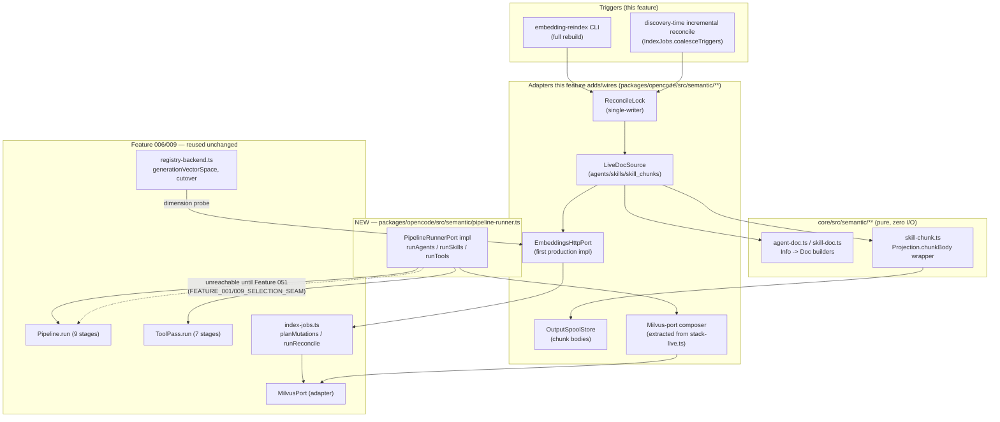

# Implementation Plan: Wire The Semantic Index Data Plane Production Pipeline

Feature: 050-wire-the-semantic-index-data-plane-production-pipeline
Spec: [spec.md](spec.md) (FR1–FR13, AC1–AC10)
Research: [research.md](research.md)
Data model: [data-model.md](data-model.md)
Contracts: [contracts/ports.ts](contracts/ports.ts)
CUE: [`wire-the-semantic-index-data-plane-production-pipeline.cue`](../../schemas/wire-the-semantic-index-data-plane-production-pipeline.cue)
Dependencies:
[Feature 006 Semantic Agent and Skill Retrieval](../006-add-milvus-backed-multilingual-semantic-retrieval-and/spec.md) (pipeline, documents, Milvus/embedding/rerank ports — this feature wires into production, never redefines),
[Feature 009 Semantic Tool Search](../009-add-semantic-embedding-and-reranker-retrieval-to-all-tool/spec.md) (`tools` collection, `ToolPass.run`),
[Feature 005 OutputSpool](../005-add-a-canonical-file-backed-outputspool-and-paged/spec.md) (the real chunk-body store),
[Feature 002](../002-build-an-event-driven-asynchronous-task-lifecycle-engine/spec.md)/[003](../003-add-persistent-bun-native-scheduled-jobs-with-event/spec.md) (reindex/reconcile job lifecycle and schedule),
[ADR-0007](../../adr/0007-add-semantic-embedding-and-reranker-retrieval-to-all-tool.md), [ADR-0008](../../adr/0008-milvus-semantic-retrieval-stack.md).

---

## Overview

Feature 006/009 shipped a complete semantic reranker stack — the nine-stage
`Pipeline.run`, the seven-stage `ToolPass.run`, the Milvus adapter, the
embedding/rerank clients, and the retrieval facade — but **nothing in
production binds them together**. `embedding-reindex` on a real profile
today either no-ops (no `LiveDocSource`/`context` wired into
`MilvusIndexBindingDeps`) or, if Milvus is configured, would build a
generation at the wrong hardcoded dimension (1024 instead of the bound
model's real 2560 for Qwen3-Embedding-4B). This is **Feature SR-A** of the
approved semantic-selection plan
(`~/.claude/plans/tingly-sprouting-spark.md`, "Feature SR-A — Semantic index
data plane"): it activates the DATA PLANE only — the production runner, the
document builders, the chunker, the chunk store, live-doc wiring, model-driven
dimension discovery, reconcile triggers, and the retry policy. It makes
`embedding-reindex` produce a real, queryable, correctly-dimensioned index on
`~/.opencodedev`. **It changes zero live-turn behavior** (FR13) — no session
code path calls the facade or the new runner; that wiring is Feature 051 (the
approved plan's Feature SR-B).

---

## Architecture overview (data plane only, zero live-turn change)

No arrow reaches `session/`, `prompt.ts`, or `tools.ts` — the entire
diagram terminates at CLI/scheduled triggers and the operator registry, which
is the FR13 zero-live-turn-change guarantee made structural rather than just
asserted.

---

## Component breakdown (exact file placements, per the approved plan)

| # | Component | Path | Layer | FR |
| - | --------- | ---- | ----- | -- |
| 1 | Production `PipelineRunnerPort` | `packages/opencode/src/semantic/pipeline-runner.ts` (NEW) | Application | FR1, FR2, FR3, FR4 |
| 2 | `Agent.Info → AgentDoc` builder | `packages/core/src/semantic/agent-doc.ts` (NEW) | Domain (pure) | FR7 |
| 3 | `Skill.Info → SkillDoc` builder | `packages/core/src/semantic/skill-doc.ts` (NEW) | Domain (pure) | FR7 |
| 4 | Skill chunker | `packages/core/src/semantic/skill-chunk.ts` (NEW) | Domain (pure) | FR8 |
| 5 | `LiveDocSource` implementation | `packages/opencode/src/semantic/live-doc-source.ts` (NEW) | Application | FR9 |
| 6 | Shared Milvus-port composition helper | `packages/opencode/src/semantic/milvus-composition.ts` (NEW) — extracted from `operator/stack-live.ts:588-610` | Application | FR4 |
| 7 | Credential-resolver reuse | no new file — `pipeline-runner.ts` and the new embeddings client call `semantic/credential-resolver.ts` (existing) exclusively | Application | FR4 |
| 8 | First production `EmbeddingsHttpPort` | `packages/opencode/src/semantic/embeddings-http-client.ts` (NEW) | Application | FR5 |
| 9 | Dimension/capability discovery ladder | `packages/opencode/src/semantic/dimension-probe.ts` (NEW), wired into `operator/semantic/registry-backend.ts:696-702` (EDIT) and the extended `rerank-probe.ts` (EDIT) | Application | FR6 |
| 10 | `OutputSpool` chunk-body store | `packages/opencode/src/semantic/output-spool-store.ts` (NEW), composing the existing Feature 005 `SpoolWriterPort`/`SpoolReaderPort` | Application | FR8 |
| 11 | Reconcile lock | `packages/opencode/src/semantic/reconcile-lock.ts` (NEW) | Application | FR10 |
| 12 | Retry helper extension | `packages/opencode/src/util/effect-http-client.ts` (EDIT — add a sibling `withDataPlaneRetry` over plain `Effect`, per `research.md`'s scoping note) | Application (shared util) | FR12 |
| 13 | `retry_count` activation | `packages/opencode/src/session/budget-consume.ts` (EDIT — new `incrementRetryCount` helper called from the data-plane retry sites) | Application | FR12 |
| 14 | Reindex/reconcile trigger wiring | `packages/opencode/src/operator/stack-live.ts:588-610` (EDIT — supply `source`/`context`/`spool` into `MilvusIndexBindingDeps`, use the composer from #6) | Application (composition root) | FR9, FR10 |
| 15 | Tool-id equality test | `packages/opencode/test/semantic/tool-id-equality.test.ts` (NEW) | Test | FR11 |

Every "EDIT" targets an existing, already-in-scope file; every "NEW" file
lands inside `packages/{core,opencode}/src/semantic/**`, the module tree
Feature 006 already established — no new package boundary is introduced.

### Reuse contract (binding — no duplication)

1. **Auth**: `pipeline-runner.ts` and `embeddings-http-client.ts` call
   `semantic/credential-resolver.ts` (`resolvePolicy`) exclusively. The
   existing ad hoc `resolveAuthHeader` closure at `stack-live.ts:560-575`
   is left in place for this feature's scope (touching it is optional
   cleanup, not required for FR4) but is NEVER copied into a third location.
2. **Milvus port composition**: `milvus-composition.ts` (#6) is the ONLY
   place `MilvusAdapter.createGrpcMilvusAdapter`/`createHttpMilvusClient` are
   constructed; `stack-live.ts` and `pipeline-runner.ts` both call it.
3. **Retry policy**: one new sibling helper next to `withTransientReadRetry`
   (#12), not a fork of the concept — see "Retry & backoff policy" below.
4. **Chunking/tokenization**: `Projection.chunkBody` +
   `core/util/token.ts` `Token.estimate` reused verbatim (zero new
   dependency, per the approved plan's reuse decision).
5. **Reconcile/rebuild lifecycle**: `IndexJobs.coalesceTriggers`,
   `IndexJobs.planMutations`, `IndexJobs.runReconcile`, and
   `IndexGeneration`'s pure state machine are all reused unchanged; this
   feature adds the missing `source`/`context`/`spool` deps and the new
   lock, never a parallel reconcile path.
6. **Tool-reindex trigger structure**: `tool-reindex-trigger.ts`'s
   corpus/mcp/config coalescing STRUCTURE is mirrored for agents/skills
   (CLI full build + discovery-time incremental reconcile over
   `coalesceTriggers`); the module itself is MCP-server-batch-specific and
   is never force-imported for agents/skills (`research.md`).

---

## Sequencing (pure core first → adapters → wiring → CLI verification)

1. **Pure core (`packages/core/src/semantic/**`, zero I/O, unit-testable
   without any fake beyond in-memory inputs)**
   - `agent-doc.ts`, `skill-doc.ts` — Info→Doc field mappings
     (`data-model.md`), reusing `Projection.scrubText`/`sanitizeFields`.
   - `skill-chunk.ts` — the chunker over `Projection.chunkBody` +
     `Token.estimate`.
   - `dimension-probe.ts`'s PURE decision ladder (which rung wins, what
     counts as a refusal) — the actual HTTP probe call stays in the
     application layer (`EmbeddingClient.probe`), only the ladder logic is
     pure.
2. **Adapters (`packages/opencode/src/semantic/**`, one seam at a time,
   each independently testable against a fake)**
   - `milvus-composition.ts` (extract from `stack-live.ts`, verify
     `stack-live.ts` still behaves identically after the extraction —
     regression-tested by the EXISTING operator stack tests, not new ones).
   - `embeddings-http-client.ts` (the `createFetchRerankHttpClient` shape +
     `credential-resolver.ts`).
   - `output-spool-store.ts` (compose Feature 005's `SpoolWriterPort`/
     `SpoolReaderPort`; replace `milvus-binding.ts:116-118`'s
     `boundedSpool` stub).
   - `reconcile-lock.ts` (CAS over a small profile-scoped document, mirroring
     `registry-backend.ts`'s `readDoc`/`guardedPlan` pattern).
   - `withDataPlaneRetry` in `util/effect-http-client.ts` + the
     `retry_count` increment in `budget-consume.ts`.
3. **Wiring (composition root — `pipeline-runner.ts`, `live-doc-source.ts`,
   `stack-live.ts` edits, `registry-backend.ts` edit)**
   - `pipeline-runner.ts` binds `Pipeline.run`/`ToolPass.run` over the
     adapters from step 2, adds the own-agent-revalidation pass (FR2), and
     wraps each surface in `Effect.timeout(latencyBudgetMs)` (FR3).
   - `live-doc-source.ts` implements the EXTENDED `LiveDocSource.collect`
     (`contracts/ports.ts`) over `AgentV2.Service`/`SkillV2.Service` + the
     step-1 builders + the step-2 embeddings client + spool store.
   - `registry-backend.ts:696-702`'s `generationVectorSpace` is edited to
     call `dimension-probe.ts` instead of `?? 1024`; `planReindexEmbedding`
     (`:729-768`) is edited to propagate a probe refusal as a failed effect
     rather than reaching `buildGeneration` with a guessed dimension.
   - `stack-live.ts:588-610` is edited to supply `source` (the new
     `LiveDocSource`), `context` (the P0 canonical `project_id` +
     current pinned binding version), and `spool` into
     `MilvusIndexBindingDeps`, and to route Milvus construction through
     `milvus-composition.ts`.
4. **CLI verification (no new code — exercising what steps 1–3 wired)**
   - `embedding-reindex` on `~/.opencodedev`
     (`OPENCODE_CONFIG_DIR=~/.opencodedev`) produces non-zero upserts across
     all four collections at the PROBED 2560-dimension generation (AC1, AC2).
   - Staleness scenarios (AC3–AC5) and the retry/probe-failure scenarios
     (AC7, AC8) are run against the live `~/.opencodedev` profile per the
     approved plan's "Verification" section.

This ordering keeps every step independently revertable: a regression in
step 3 never requires re-touching step 1/2 code, and step 4 requires no code
changes at all — it is purely operational verification.

---

## Test strategy

| Layer | Scope | How |
| ----- | ----- | --- |
| Unit — pure core | `agent-doc.ts`/`skill-doc.ts` field mapping (including the empty-`TagSet` defaults and the `permission_ref` hash derivation), `skill-chunk.ts` chunk windows + sanitization-before-hash ordering, `dimension-probe.ts`'s ladder decision (probe pass / probe fail + cache hit / probe fail + no cache → refusal) | Deterministic in-memory inputs, no fakes needed beyond plain objects |
| Unit — adapters | `pipeline-runner.ts`'s own agent-revalidation drop (a ranked agent id absent from a fake `AgentV2.Service` is dropped, never surfaces `revalidated:true`), the `Effect.timeout` surfacing `undefined` on a slow fake port, `ToolPass.run` binding (never `Pipeline.run` for tools), `embeddings-http-client.ts` against a fake HTTP transport (including `secretRef: null` → no header), `output-spool-store.ts` put/resolve/supersede round-trip against a fake `SpoolWriterPort`/`SpoolReaderPort`, `reconcile-lock.ts` mutual exclusion (a second `acquire` while held fails `{type:"held"}`) | Fake Milvus/embedding/rerank/spool ports, mirroring Feature 006's existing fake-adapter test style (`milvus-adapter.ts`'s in-memory adapter) |
| Golden — disabled path | Byte-identical snapshot of every live session/turn surface (tool list, skill listing, agent selection inputs) before and after this feature's changes land, with the new runner never invoked | Reuses the SAME snapshot harness pattern Feature 051 will extend; this feature's version only needs to prove FR13 (no live caller exists yet) |
| Contract | Tool-id equality: index-time `ToolDoc.id` (`ToolProjection`, `tool-projection.ts:155`) equals the runtime key — `registry.tools()` item id (`${namespace}_${id}`) for native/plugin, the `mcp.tools()` record key for MCP — asserted for all three classes (FR11, AC6) | One test file per the component table (#15) |
| Live smoke | `embedding-reindex` via `opencode-cli` with `OPENCODE_CONFIG_DIR=~/.opencodedev`: full reindex → 4 non-zero collection upserts at dimension 2560 (AC1, AC2); delete a seeded skill → reconcile → drift 0 (AC3); edit a seeded skill body → reconcile → supersede not duplicate (AC4); re-run reconcile with no changes → zero embedding calls, verified via a call-count instrumentation seam on the fake/real embeddings client (AC5); interrupt Milvus mid-reindex → bounded retries then typed failure, `ConsumptionResilience.retry_count` visibly non-zero (AC7); point the bound model at an unreachable endpoint → dimension probe retries twice then generation build refuses (AC8); provider-pluggability round-trip (register a second embed provider → select → reindex → validate → cutover → rollback) against the live profile (AC10) | Requires the real solaris endpoints (`vm.services`) and the deployed `/opt/opencodev2/opencode` binary per the approved plan's operating profile |

---

## Retry & backoff policy (FR12 — the concrete mechanism)

Extending `withTransientReadRetry`'s PATTERN, not its literal type
(`research.md` "Zero retry anywhere" scoping note): a new
`withDataPlaneRetry<A, E>(schedule, isTransient)` helper in
`util/effect-http-client.ts`, composed as
`effect.pipe(Effect.retry(Schedule.exponential(500).pipe(Schedule.jittered, Schedule.compose(Schedule.recurs(2)), Schedule.whileInput(isTransient))))`
— i.e. up to 3 total attempts (1 + 2 retries), 500ms base, ~5s cap, jittered,
composed over a plain `Effect.Effect<A, E>` (not an `HttpClient` pipeline).
Applied at: embed batches (per-batch, never restarting a whole reindex),
`MilvusPort.upsert`/`.tombstone`/`.enumerateIndexed`/`.buildGeneration`, and
each `IndexJobs.runReconcile` step. `isTransient` classifies
`milvus_unavailable`/transport-timeout/5xx as retryable and
`invalid_filters`/`dimension_mismatch`/`reranker_not_eligible`/schema
rejects as NEVER retryable. `cas_conflict` is re-read-and-replanned once,
never blind-retried (mirrors the existing `guardedPlan` CAS-retry shape in
`registry-backend.ts`). Probes (dimension probe, rerank validate) get exactly
2 bounded retries then fail closed. Cutover/alias-swap never blind-retries
after an ambiguous outcome — state is verified via `enumerateIndexed`/alias
read instead. Every retry attempt calls the new `budget-consume.ts` helper
to increment `ConsumptionResilience.retry_count` through the existing
`RoutingSessionStateStore` accumulation path (`accumulateConsumption`),
activating the previously-inert `resilience.retry_depth` knob.

---

## Risks and mitigations

| Risk | Evidence | Mitigation |
| ---- | -------- | ---------- |
| **Registry decode looseness** — the config-backed registry document is strict on STRUCTURE but loose on VALUES (`enumMode`/`compatibilityMode`/`validationStatus`/`state` are plain `Schema.String` cast downstream, per the approved plan's P0 finding); a probed dimension/metric written through a typo'd path could decode without error and only break later | `registry-backend.ts:107-118,409` casts strings to enums without a runtime enum check | Assert `ProbedVectorSpace.metric` against the literal `"cosine" \| "inner-product"` set at the `dimension-probe.ts` boundary BEFORE it is ever written to the registry document — never trust a bare string past that point |
| **Metric-vocabulary mismatch** — the pre-authored CUE (`#ProbedVectorSpace.metric`) uses `"ip"`, the shipped schema/protocol `Metric`/`MetricKind` use `"inner-product"` | Verified in `research.md` | `dimension-probe.ts` maps the probe's finding onto the SHIPPED two-member enum at its own boundary; `"ip"` never crosses into `RegistryGeneration`/`MilvusPort`. Flagged for the tasks phase to align the CUE literal in a follow-up, non-blocking commit |
| **Dimension probe availability** — the probe is a live network call to the bound provider; an unreachable solaris endpoint (or any future provider) blocks generation build entirely under the fail-closed rule (FR6 rung 3) | `EmbeddingClient.probe` (`embedding-client.ts:67-87`) throws on transport failure | Cache the last successfully probed `ProbedVectorSpace` per binding version (rung 2 fallback before the hard refusal) so a transient outage during an UNCHANGED-model reindex does not need a fresh probe; a genuinely new/changed model with no cache still refuses honestly (AC8) |
| **Reconcile/rebuild race** — no existing lock; a reconcile upsert into the live-alias generation during a concurrent blue/green alias-swap could orphan those upserts | Verified in `research.md` — no mutual-exclusion primitive exists today | The new `ReconcileLock` (per-profile, CAS-guarded) serializes reconcile against rebuild; documented single-writer assumption (one opencode instance per profile owns index maintenance), matching the approved plan's guardrail |
| **`Agent.Info`/`Skill.Info` field thinness** — the live sources lack `domains`/`capabilities`/`tools`/`triggers` fields the shipped `AgentDoc`/`SkillDoc` schema expects | Verified in `research.md` and `data-model.md` | Default to empty `TagSet`s explicitly (never invent ranking signal); documented as an honest V1 floor, revisited only if a later feature adds these fields to the live sources |
| **`permission_ref` has no existing producer for agents/skills** | Verified in `research.md` | Derive a stable content hash over the serialized ruleset (agents) or the skill name alone (skills), reusing the `ToolProjection.contentHash` pattern; query-time `PermissionV2`/`available()` stays the sole authority — the stored ref only supports the mandatory-filter/revalidation plumbing, never itself grants access |
| **Retry helper type mismatch** — `withTransientReadRetry` is typed over `HttpClient.HttpClient.With`, not a plain `Effect`, so it cannot literally wrap `MilvusPort` methods | Verified in `research.md` | New sibling helper (`withDataPlaneRetry`) over plain `Effect.Effect<A,E>`, sharing the schedule/classification PATTERN, never a second unrelated retry concept |

---

## Validation checklist (plan complete when)

- [x] `PipelineRunnerPort` production impl binds `Pipeline.run` for
      agents/skills and `ToolPass.run` (never `Pipeline.run`) for tools (FR1)
- [x] Own agent revalidation added at the runner, earning `revalidated:true`
      per surface instead of the facade's unconditional stamp (FR2)
- [x] Real `Effect.timeout(latencyBudgetMs)` per surface, replacing the
      post-hoc `catch → timeout` relabel (FR3)
- [x] Facade lifecycle as a `Context.Service<...>()` singleton; ONE shared
      Milvus-port composition helper; auth exclusively through
      `credential-resolver.ts` (FR4)
- [x] First production `EmbeddingsHttpPort`, following the
      `createFetchRerankHttpClient` shape + retry composition (FR5)
- [x] Model-driven dimension/capability discovery ladder replacing the
      hardcoded `?? 1024`; fail-closed on unknown (FR6)
- [x] `AgentDoc`/`SkillDoc` pure Info→Doc field mappings with honest empty
      defaults where the live source lacks a field (FR7)
- [x] Skill chunker + a REAL resolvable `OutputSpool` chunk-body store,
      replacing the non-resolvable stub (FR8)
- [x] `LiveDocSource` implemented for agents/skills/skill_chunks; `collect`
      extended with the indexed-hash map so an unchanged doc skips embedding,
      not just upsert; `source`/`context` wired into `stack-live.ts` (FR9)
- [x] Reindex/reconcile triggers over `IndexJobs.coalesceTriggers`; a new
      per-profile reconcile/rebuild lock (FR10)
- [x] Tool-id equality test across native/plugin/MCP classes (FR11)
- [x] Bounded jittered-exponential retry on the data plane only, typed
      transient-vs-domain classification, `retry_count` now real (FR12)
- [x] Zero live-turn behavior change — no session/turn code path calls the
      facade or the new runner; golden byte-identical snapshot proves it (FR13)
- [x] No new schema/protocol authority introduced; every reused interface
      cited by exact file:line in `research.md`

---

## Companion artifacts

| File | Purpose |
| ---- | ------- |
| [spec.md](spec.md) | FR1–FR13, AC1–AC10, security requirements, observability |
| [research.md](research.md) | Verified file:line evidence for every claim this plan makes |
| [data-model.md](data-model.md) | Info→Doc field mappings; the CUE-mirrored `ProbedVectorSpace`/`RerankCapabilities`/`DataPlaneRetryPolicy`/`ReconcileLock`/`SpoolEntry` shapes |
| [contracts/ports.ts](contracts/ports.ts) | TypeScript port sketches for the production `PipelineRunnerPort` impl, `EmbeddingsHttpPort`, the extended `LiveDocSource`, `OutputSpoolStore`, `DimensionProbe`, `ReconcileLock` |
| `doc/arch/schemas/wire-the-semantic-index-data-plane-production-pipeline.cue` | The pre-authored CUE corpus this data model mirrors |
| `~/.claude/plans/tingly-sprouting-spark.md` | The approved cross-feature plan (Feature SR-A / this feature) |
