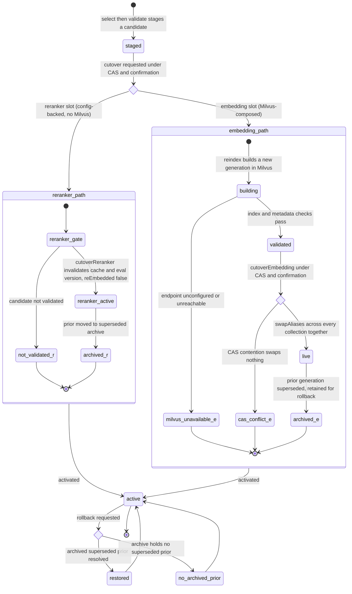

# Statechart: Semantic Binding Generation Lifecycle and Activation

This statechart models the **completion** of the semantic binding lifecycle
introduced by Feature 019, as decided in
`../sdd/019-complete-the-semantic-binding-lifecycle-and-the-remaining/spec.md`
(FR1-FR7, FR14-FR16) and
`../adr/0019-complete-the-semantic-binding-lifecycle-and-the-remaining.md`, with
the ValueObjects in `../schemas/semantic-lifecycle/enums.cue`. It is the
activation companion to `semantic-binding.md` (Feature 006): where that chart draws
the abstract `draft → staged → active` binding machine and the degradation ladder,
this chart draws how Feature 019 **physically activates** it — the config-backed
reranker path with its per-slot version archive, and the Milvus-composed embedding
path with a blue/green generation that is built and validated **before** the alias
swaps.

Feature 006 owns the lifecycle contract (FR32) and Feature 009 reuses it verbatim;
the pure engines already exist (`cutover-executor.ts` `cutoverReranker`/
`cutoverEmbedding`/`rollbackEmbedding`, `binding-lifecycle.ts` `TRANSITIONS`).
Feature 019 composes them behind the operator verbs: the reranker cutover/rollback
route through the config-backed registry with NO Milvus, over a per-slot archive
(current + superseded) that gives a rollback a real target; the embedding cutover
builds and validates a Milvus generation before an atomic, all-collections CAS alias
swap. The **cardinal honesty rule** holds — an embedding cutover is NEVER a
config-only alias flip; `select`/`reindex` alone never activate — and every
unreachable dependency degrades to the exact typed capability gap.

## Notes

- **Staging is unchanged (`[*] → staged`).** `select` stages a candidate and
  `validate` moves it to `staged`; neither activates the live alias — activation is
  `cutover` only (Feature 006 C12). Feature 019 changes activation, not staging.
- **Slot split (`slot_gate`).** A reranker cutover is config-backed and needs NO
  Milvus — it routes through the operator registry (`c.registry`, the `planSelect`
  precedent) as a mutation plan under `mutateAuthority`; an embedding cutover is
  Milvus-composed and requires a physically built generation (FR1, FR4, FR5).
- **Reranker path (`reranker_path`).** `cutoverReranker` (no `MilvusPort`)
  invalidates the rerank cache/eval version with `reEmbedded:false`; the prior moves
  to the per-slot superseded archive. An unvalidated candidate returns
  `not_validated` (FR1, FR3). Where the cache/eval-version invalidation is a
  non-versioned effect, the Feature 018 `effectOnly` mutation-plan pattern avoids CAS
  churn (FR16).
- **Embedding path (`embedding_path`).** A blue/green generation is **built and
  validated** in Milvus (`building → validated`) before `cutoverEmbedding` swaps the
  alias under one CAS across **every** collection together —
  `agents`/`skills`/`skill_chunks`/`tools` never split (Feature 006 C6/C12). An
  unconfigured or unreachable endpoint degrades to the exact typed
  `milvus_unavailable` floor; a CAS contention swaps nothing (FR4, FR5, FR16).
- **Per-slot archive gives rollback a real target (`rollback_gate`).** The operator
  `RegistryDocument` retains the current version plus its superseded predecessors, so
  a rollback resolves a real `#RollbackTarget`; a slot with no superseded prior
  returns a typed `no_archived_prior` rejection — never a fabricated swap (FR2, FR3).
- **Reconcile never re-pins.** `runReconcile` diffs the bound live-doc source against
  the enumerated indexed docs and reports content-free counts with the pinned binding
  version unchanged — a scheduled reconcile never re-pins (FR6, FR7, Feature 006
  FR13).
- **Parity invariant.** Every activation and observation rides the same command id
  through the same `OperatorClient` loopback; no new dispatch path, catalog id, or
  version is added, and every unreachable dependency returns a typed capability gap —
  never a fabricated generation, phantom write, or config-only cutover (FR14-FR16).
