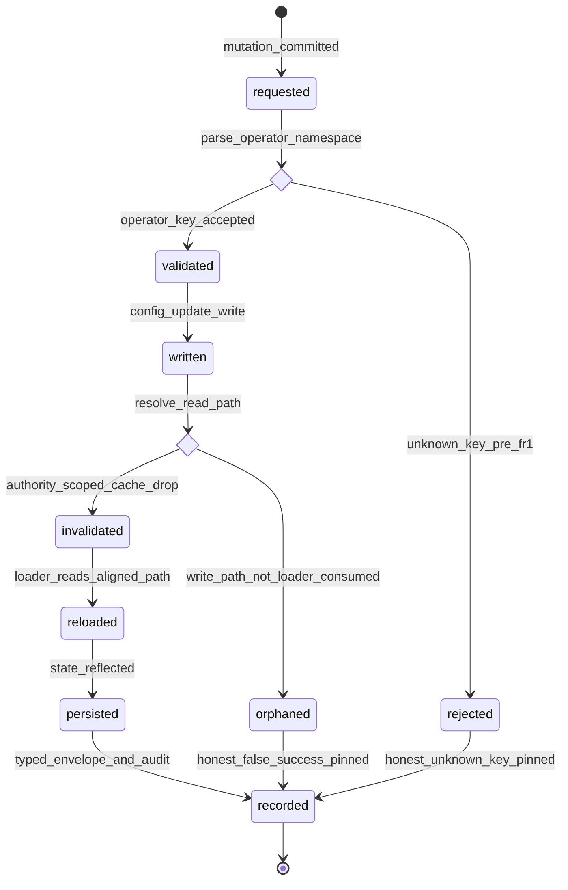

# Statechart: Operator Config Persistence Round-Trip

This statechart models the operator config persistence round-trip introduced by
Feature 014, as decided in
`../sdd/014-complete-the-operator-control-plane-persistence-and-service/spec.md`
(FR1-FR4) and
`../adr/0014-complete-the-operator-control-plane-persistence-and-service.md`, with
the ValueObjects in `../schemas/operator-persistence/roundtrip.cue`.

A committed operator mutation on a config-backed domain (`langlock`, `telemetry`,
`smart`, `budget`, `pools`, `jobs`) must **round-trip**: the persisted `operator`
namespace is a recognized schema key (FR1), the write lands on a file/authority
the instance loader actually reads (FR2), the authority-scoped config cache is
invalidated (FR3), and the state is read back — surviving a process restart (FR4).
The two honest negatives are preserved as terminal outcomes the acceptance test
pins: **`rejected`** (the pre-FR1 unknown-key `ConfigInvalidError`) and
**`orphaned`** (the pre-FR2 false success — a `cas_vN` written to a file the loader
never reads). It mirrors the projection style of `operator-result-projection.md`.



## Notes

- **Schema gate first (`requested` -> `rejected` | `validated`).** The persisted
  `operator` namespace is parsed against `ConfigV1.Info`. Before FR1 it is an
  unknown key and `ConfigParse.schema` (`config/parse.ts:40`) raises
  `ConfigInvalidError` — the `rejected` terminal. After FR1 the typed `operator`
  sub-schema validates it and the round-trip proceeds (FR1).
- **Path gate (`written` -> `orphaned` | `invalidated`).** `Config.update` writes a
  config file; the round-trip is real only when that write path is aligned with a
  path the instance loader reads. Before FR2 the write lands on the project
  `config.json` the loader ignores — the `orphaned` terminal, a false success
  (`configured:false` on re-read). After FR2 the write/read paths are aligned and
  the committed mutation flows to cache invalidation (FR2).
- **Cache invalidation (`written` -> `invalidated`).** The committed mutation drops
  the authority-scoped config cache so the subsequent load is fresh; unrelated
  cached config is preserved (FR3).
- **Reload and read (`invalidated` -> `reloaded` -> `persisted`).** The loader
  reads the aligned path and the effective state reflects the mutation; a re-read
  and a process restart both show it (FR4).
- **Honest negatives pinned (`orphaned`, `rejected` -> `recorded`).** Both terminal
  negatives are kept in the contract and asserted by the acceptance test: FR1
  without FR2 yields `orphaned` (false success) and must not be shipped; the
  pre-fix unknown key yields `rejected`. This is what makes the write/read
  alignment load-bearing rather than cosmetic (FR2, FR4).
- **Commit through the shared authority.** The write itself is the single
  `mutateAuthority` CAS commit via the `mutation_plan` path; the backend never
  self-commits, and the mutation emits the Feature 007 EventV2 audit correlation
  (FR5).
- **Parity invariant.** The round-trip rides the same command id through the same
  `OperatorClient` loopback as slash/CLI; it introduces no new dispatch path,
  registry, or divergent command name, and adds no catalog id or version (FR13).
```
</content>
