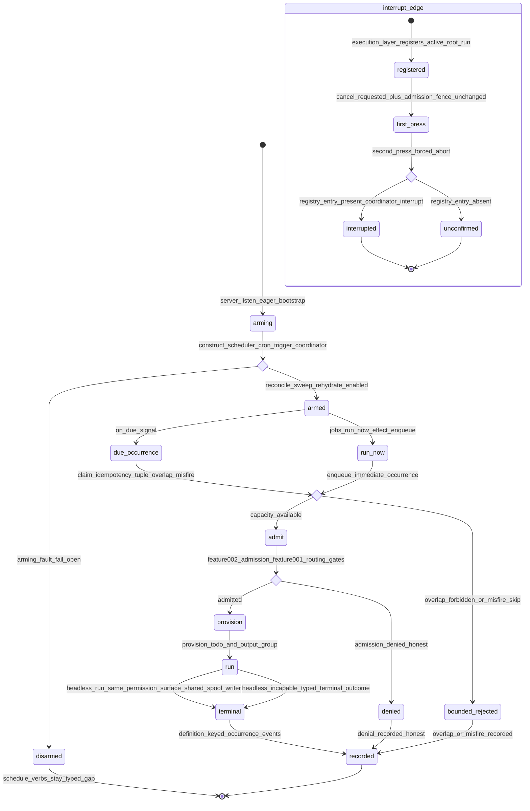

# Statechart: Scheduled Jobs Executor Composition

This statechart models the scheduled-jobs executor composition introduced by
Feature 018, as decided in
`../sdd/018-compose-the-scheduled-jobs-executor-runtime-into-the-live/spec.md`
(FR1-FR13) and
`../adr/0018-compose-the-scheduled-jobs-executor-runtime-into-the-live.md`, with
the ValueObjects in `../schemas/executor-composition/enums.cue`.

Features 002 and 003 shipped a complete but never-composed executor: the scheduler
engine + Bun cron adapter (`createBunCronAdapter`,
`packages/opencode/src/jobs/bun-cron-adapter.ts`), the trigger service with its
`TaskProcessCoordinator` seam (`trigger-service.ts:122-131`), and the
occurrence-claim state machine all exist, but nothing outside `jobs/` self-exports
and tests ever started the cron loop or wired the coordinator to the real
`TaskTool`/`SessionExecution`/`SessionRunCoordinator`. Feature 018 arms the executor
**eagerly** at server start (mirroring the Feature 017
`ensureProcessSpoolWriter` eager seam), implements the coordinator over the real
seams, converts `jobs.run-now` to an effectful mutation plan, emits
**definition-keyed** occurrence events so history reflects real executions, and
exposes the live `SessionRunCoordinator` through a **narrow** interrupt registry so
the second-press forced abort actually interrupts. The arming is fail-open (a fault
leaves it disarmed, never a crash), concurrency is bounded by the existing
overlap/misfire policies, and a scheduled session runs under the SAME
permission/config surface as a normal session (no privilege bypass). It mirrors the
projection style of `job-occurrence.md` and `output-spool-writer.md`.



## Notes

- **Eager fail-open arming (`arming` -> `armed` | `disarmed`).** A process-singleton
  arms the scheduler engine + `createBunCronAdapter` + trigger service +
  `TaskProcessCoordinator` at `server.ts` `listen()`, independent of the operator
  stack (the Feature 017 `ensureProcessSpoolWriter` precedent). Any construction or
  arming fault is caught (`disarmed`, fail-open) so it never breaks server startup;
  the bootstrap is idempotent (a second call reuses the armed instance, never a
  second cron loop). The reconcile sweep re-registers enabled definitions without
  claiming past execution (FR1, FR2).
- **Bounded concurrency (`overlap_gate`).** A claimed due occurrence and a
  `run-now` enqueue both pass the existing overlap/misfire policies
  (`forbid`/`allow`/`queue`/`replace`; `fire`/`skip`/`coalesce`), so concurrency is
  bounded — a `forbid` overlap or a `skip` misfire resolves to an explicit
  `bounded_rejected` outcome, never an unbounded fan-out of headless sessions (FR3,
  FR7).
- **Honest admission (`admit_gate` -> `denied` | `provision`).** The coordinator
  runs the Feature 002 admission + Feature 001 routing hard gates; a denial is
  reported honestly (`denied`), never turned into a fake `admitted` (FR4).
- **Provision then run (`provision` -> `run` -> `terminal`).** An admitted
  occurrence creates the Feature 002 Task Process (`owner_kind: "scheduled-job"`),
  provisions the occurrence-owned Todo + OutputGroup, and runs headless under the
  SAME permission/config surface as a normal session — no privilege bypass; output
  is captured through the SHARED Feature 017 spool writer, never a second writer. A
  capability a headless session cannot satisfy degrades to a typed terminal outcome
  (FR4, FR5, FR6).
- **Definition-keyed events (`terminal` -> `recorded`).** The executor emits its
  `job.*` occurrence events through the `EventV2Bridge` under a definition-keyed
  durable aggregate so the Feature 017 occurrence projection resolves them by
  `jobDefinitionId`; `jobs.history`/`show-occurrences`/`watch` then reflect real
  executions instead of an honest-empty list (FR8).
- **Run-now immediate path (`run_now`).** `jobs.run-now` dispatches an
  `OperatorMutationPlan` whose `effect` runs exactly once — after `mutateAuthority`
  validates contract + idempotency + CAS and before the committed write — enqueuing
  an immediate occurrence; an overlap rejection or a disarmed executor returns the
  typed outcome, and an idempotent replay returns the stored result without
  re-enqueuing (FR7).
- **Interrupt edge (`interrupt_edge`).** The execution layer
  (`packages/core/src/session/execution/local.ts`) registers the active root run
  into a process-singleton interrupt registry — the smallest edge, not a broad
  operator→SessionExecution dependency. The first-press cancel (cancel_requested +
  admission fence) is unchanged; the second-press forced abort consults the registry
  and drives `SessionRunCoordinator.interrupt` when an entry is present
  (`interrupted`), else degrades to the honest `unconfirmed` outcome — never a
  fabricated stop (FR9, FR10).
- **Parity invariant.** Every mutation and observation rides the same command id
  through the same `OperatorClient` loopback; it introduces no new dispatch path,
  registry, or divergent command name, and adds no catalog id or version. Every
  disarmed/denied/absent path returns a typed capability gap — never a fabricated
  occurrence, phantom write, or privilege bypass (FR11, FR12, FR13).
```
