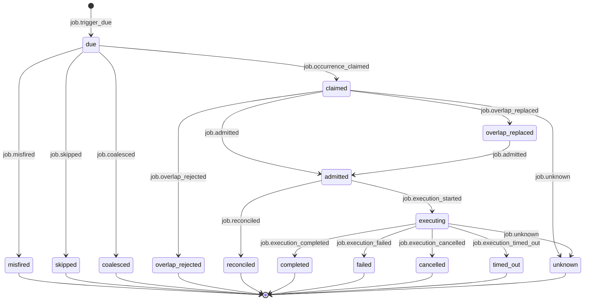

# Statechart: Scheduled Job Occurrence

This statechart models the occurrence claim state machine for one scheduled-job
trigger, as decided in
`../sdd/003-add-persistent-bun-native-scheduled-jobs-with-event/spec.md`
clarifications **C6** (occurrence claim state machine, idempotency, and order
authority) and **C7** (single-instance ownership; distributed deferral), and
specified by FR10 (idempotency identity and correlation), FR11 (event
vocabulary), and the trigger flow in
`../sdd/003-add-persistent-bun-native-scheduled-jobs-with-event/plan.md`
(section "State machines" → "Occurrence lifecycle").

`due` is the initial trigger observation published when the in-process
`Bun.cron` callback fires (no polling). The idempotency identity is the tuple
`(job_definition_id, schedule_id, nominal_due_time, generation)`; duplicate
delivery for one occurrence resolves to a single execution with an observable
duplicate outcome rather than a second admitted path (FR10, AC6). Sequence,
attempt, and generation authority belongs to the canonical Feature 002
executor (`SessionRunCoordinator`/`SessionRunner`), never to the scheduler or
a projection (C6). `completed`, `failed`, `cancelled`, `timed_out`,
`misfired`, `skipped`, `coalesced`, `overlap_rejected`, and `reconciled` are
absorbing terminal states; any non-terminal state may transition to `unknown`
on crash or owner loss, matching the Feature 002 `unknown`/`reconciled`
reconciliation posture (C5, C7, AC19, AC23).

## Notes

- **Trigger observation (`[*]` → `due`).** `job.trigger_due` is published
  before admission and is a live (non-durable) event; it is distinct from
  notification delivery and executor start/completion, which are separate
  lifecycle observations projected on the same EventV2 authority (FR13, C16).
- **Claim branches (`due` → ...).** `job.occurrence_claimed` advances to
  `claimed`; a due trigger may instead resolve directly to `misfired`,
  `skipped`, or `coalesced` per the configured misfire policy (skip |
  fire-once | bounded catch-up | coalesce), never an infinite catch-up (FR15,
  C3, C19, AC3, AC24).
- **Overlap evaluation (`claimed` → ...).** A claimed occurrence that races a
  running sibling occurrence resolves per overlap policy: `overlap_rejected`
  (default `forbid`), `overlap_replaced` (mutation-safe `replace`, which
  routes back to `admitted` and never silently stops or kills a mutating
  handler/process), or `unknown` on an ambiguous claim-to-dispatch crash
  (FR16, C3, C17, AC5, AC19, AC25).
- **Admission gate (`claimed`/`overlap_replaced` → `admitted`).** `admitted`
  means the occurrence has entered Feature 002 admission/routing and either
  creates or associates a canonical Task Process; `admitted` may instead
  resolve to `reconciled` when startup reconciliation confirms a claimed-but-
  undispatched occurrence without replaying it (FR8, FR9, C5, C16, AC13,
  AC23).
- **Execution terminals (`executing` → ...).** `completed`, `failed`,
  `cancelled`, and `timed_out` are the Feature 002 executor's terminal
  outcomes for the associated Task Process; `unknown` covers a crash between
  claim and dispatch or between admission and a confirmed terminal, and never
  triggers a blind auto-retry of an ambiguous mutating effect (FR14, C11,
  AC19, AC20).
- **`reconciled` does not regress a terminal state.** Like the Feature 002
  Process Table posture, `reconciled` is an explicit versioned outcome
  confirming — never regressing or reinventing — an occurrence already
  resolved to `admitted`-pending or an absorbing terminal (C5, C7, C13 in
  Feature 002).
- **Single-instance ownership (C7).** This machine assumes single-instance
  scheduling; multi-worker claim fencing, leader election, and distributed
  placement are out of scope for V1 and deferred to a future distributed ADR.
  Restart safety is expressed entirely through `unknown`/`reconciled` and
  startup reconciliation, not through cross-instance coordination.
