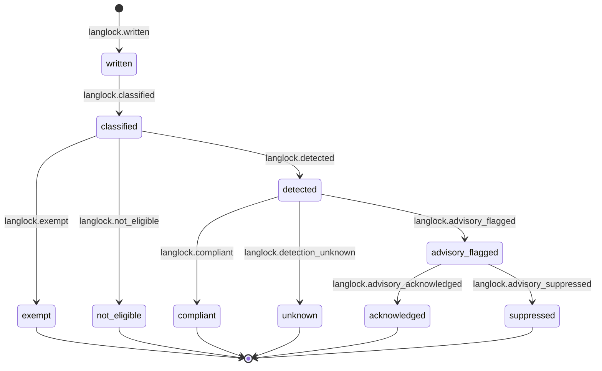

# Statechart: Lang Lock Advisory Validation Lifecycle

This statechart models the post-write advisory validation lifecycle for one
model-authored artifact under Feature 004 Lang Lock, as decided in
`../sdd/004-add-lang-lock-to-enforce-a-configurable-artifact-language/spec.md`
clarifications **C5** (progressive hybrid, advisory-only detection in V1) and
**C6** (violation handling: advisory record, never block or autotranslate),
and specified by FR16 (progressive hybrid enforcement), FR20-FR21 (advisory
eligibility and content-free detection record), and the lifecycle in
`../sdd/004-add-lang-lock-to-enforce-a-configurable-artifact-language/plan.md`
(section "State machines" → "Advisory validation lifecycle").

`written` is the initial observation raised when a model-authored artifact
write crosses an OpenCode-observable boundary (FR23, C4); it is never a
gate — the underlying write, prompt, and execution proceed unconditionally
regardless of the classification or detection outcome that follows (C6).
`exempt`, `not_eligible`, `compliant`, and `unknown` are absorbing terminal
states; `advisory_flagged` is followed by an operator- or authorized-target-
driven `acknowledged` or `suppressed` outcome (C5, C6). Generic source code
is never routed to `detected`/`advisory_flagged` in V1 — it resolves to
`not_eligible` (FR20, C5, C14, Out of Scope).

## Notes

- **Write observation (`[*]` → `written`).** `langlock.written` is a live
  (non-durable) event published when a model-authored write, edit,
  apply_patch, shell-commit, Task/subagent prompt or internal return, or Todo
  text crosses an OpenCode-observable boundary (FR9, FR18-FR19, FR23, C4).
  The native immutable-metadata outcome (tag/version/source/mode stamping) is
  unconditional and independent of this lifecycle; advisory detection never
  gates the write itself (C6).
- **Path-kind classification (`written` → `classified`).** `langlock.classified`
  routes the artifact through the path-kind classifier (prose vs generic-code
  vs exempt). Classification alone never blocks or delays the write (FR20,
  C5).
- **Classification branches (`classified` → ...).** An exception-manifest
  match resolves to `exempt` (`langlock.exempt`, FR14, C16); generic code or
  a low-confidence path resolves to `not_eligible` (`langlock.not_eligible`,
  FR20, C5, C14); an advisory-eligible confidently classified prose kind
  (Markdown, docs, instruction files, generated commit text) resolves to
  `detected` (`langlock.detected`, FR16, FR20).
- **Detection outcome (`detected` → ...).** A language match resolves to
  `compliant` (`langlock.compliant`); a bucketed mismatch resolves to
  `advisory_flagged` (`langlock.advisory_flagged`, FR21) recording only
  detector provenance, confidence bucket, path kind, policy version, and
  remediation status — content-free; a detector failure or unknown outcome
  resolves to `unknown` (`langlock.detection_unknown`) and never blocks the
  prompt, execution, or tool hot path (FR21, NFR Availability).
- **Remediation follow-up (`advisory_flagged` → ...).** An authorized
  operator or target acknowledges (`langlock.advisory_acknowledged`,
  `acknowledged`) or repeat-warning-suppresses (`langlock.advisory_suppressed`,
  `suppressed`) a flagged advisory. Both are durable, auditable operator-
  driven follow-ups; neither retroactively blocks or reverts the original
  write (C5, C6). The precise TUI/App/CLI surfacing, acknowledgement, and
  repeat-warning-suppression UX is a plan-owned bounded contract with
  acceptance hook AC8.
- **Never a gate.** Every absorbing state in this machine — including
  `advisory_flagged` before remediation — is reached only after the
  underlying artifact write has already completed. Strict blocking, path
  coverage, rollback, and false-positive thresholds are deferred to a
  separately approved policy and a future ADR revision (FR22, C14, Out of
  Scope).
