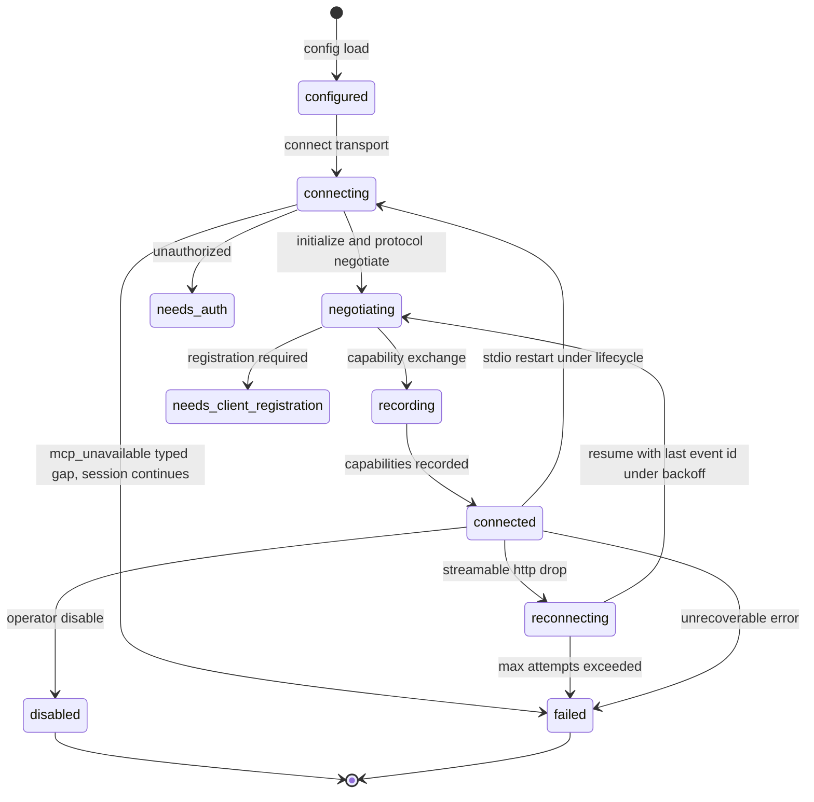
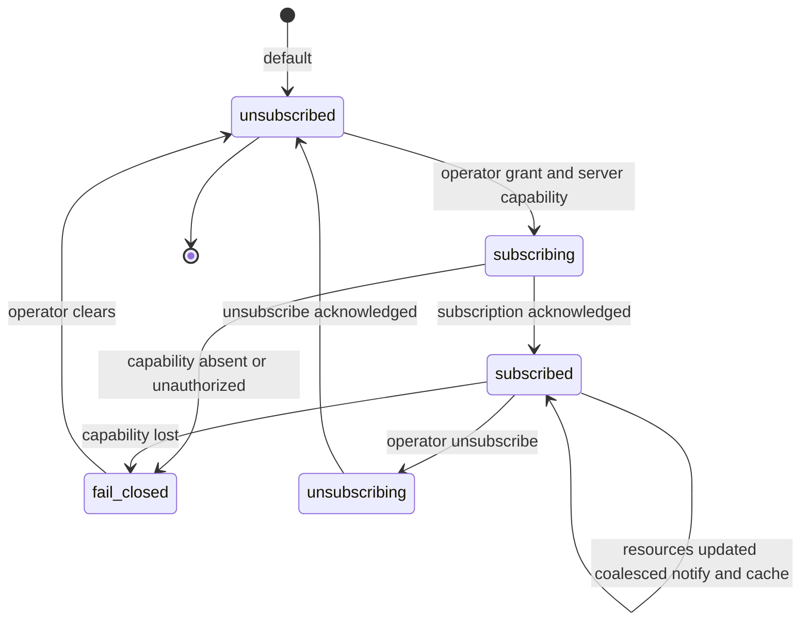

# Statechart: MCP Connection Lifecycle and Resource Subscription

This statechart models the MCP client **connection lifecycle** with reconnect,
backoff, and resume, and the paired **resource subscription lifecycle**, as
decided in
`../sdd/008-add-complete-mcp-client-tools-and-resources-lifecycle-with/spec.md`
clarifications **C2** (connection lifecycle state machine and recorded
capabilities), **C14** (transport defaults, SSE deprecation, and reconnect
curve), **C9**/**C10** (default resource-update policy and subscribe
authority), and specified by FR7-FR9 (capability negotiation), FR21
(subscribe/unsubscribe authority), FR23-FR26 (resource update handling), and
FR29-FR31 (transports and session), and the state machines in
`../sdd/008-add-complete-mcp-client-tools-and-resources-lifecycle-with/plan.md`
(section "State machines").

## Connection lifecycle (C2, C14)

A connection is `configured` after config load; `connecting` while the
transport attaches; `negotiating` during `initialize`/protocol-version
negotiation; `recording` while the negotiated server capability set is
captured; `connected` once capabilities are recorded (FR7, FR8). Terminal
branches are `disabled` (operator), `failed` (unrecoverable), `needs_auth`,
and `needs_client_registration` — the existing `Status` union is
authoritative and these branches extend it only additively (C2, C27). A
Streamable HTTP drop enters `reconnecting` under bounded exponential backoff
with jitter and a capped max delay, honoring session resume and
`Last-Event-ID` where the SDK and spec support them; recovery re-runs
negotiation and emits `mcp.server.capabilities_changed` only when the
recorded capability set differs from before (C2, C14). A server that cannot
be reached records the typed `mcp_unavailable` capability gap rather than a
hard failure, and the session continues (C1, C2). A stdio connection restarts
under lifecycle control with `pgrep -P` child cleanup instead of a backoff
curve.

### Notes

- **Fixed negotiate/record sequence (`configured` -> `connected`).** The
  sequence never skips a step; `connected` is reached only once the
  negotiated protocol version and the full server capability set are
  recorded for `mcp.server.capabilities` query and runtime gating. A
  capability the server did not advertise is never exercised afterward
  (FR7, FR8, C2).
- **Additive terminal branches.** `disabled`, `failed`, `needs_auth`, and
  `needs_client_registration` extend the existing `Status` union
  additively; no consumer of the coarse union observes a breaking change
  (C2, C27).
- **`mcp_unavailable` is a typed gap, not a hard failure.** A server that
  cannot be reached at `connecting` records the typed `mcp_unavailable`
  capability gap and the session continues; the operator can retry connect
  or reconnect without restarting the whole client (C1, C2, FR7).
- **Reconnect re-negotiates and diffs.** `reconnecting` re-runs the
  `negotiating`/`recording` steps under bounded exponential backoff with
  jitter and a capped max delay, honoring session resume and
  `Last-Event-ID` where supported; `mcp.server.capabilities_changed` fires
  only on an actual diff against the previously recorded set, never on
  every reconnect (C14, C2).
- **Stdio has no backoff.** A stdio drop restarts through `connecting`
  again under lifecycle control with the existing SIGTERM child-cleanup
  finalizer; it never enters `reconnecting`, which is reserved for
  Streamable HTTP (C14, FR30).
- **Legacy SSE stays deprecation-labeled.** New connections prefer
  Streamable HTTP; a server that only supports legacy SSE still reaches
  `connected` through the same sequence with an operator-visible
  deprecation label, and is removed no earlier than the ADR-defined
  deprecation window (C14).

## Resource subscription lifecycle (C9, C10)

A resource is `unsubscribed` by default. An operator grant under
`mcp.resource.admin.subscribe` combined with the server `resources.subscribe`
capability moves it to `subscribing`, then `subscribed`; the LLM never calls
subscribe (C10). While `subscribed`, `notifications/resources/updated`
coalesces, dedupes, and debounces into a bounded queue and applies the fixed
`notify + cache only` default policy — no re-read, reindex, or main/agent
wake unless a separate per-server opt-in is set (C9, C21, C22). An operator
unsubscribe moves the resource to `unsubscribing` and back to `unsubscribed`;
an unauthorized subscribe attempt or a capability the server later withdraws
fails closed rather than silently downgrading.

### Notes

- **Subscribe requires both the capability and the grant.** `subscribing` is
  reachable only when the server has declared `resources.subscribe` **and**
  an operator holds `mcp.resource.admin.subscribe`; the LLM has no subscribe
  path in either plane, runtime or operator (C10, FR21).
- **Notify + cache only is the fixed default.** The `subscribed` self-loop
  on a coalesced `resources/updated` batch never advances past updating UI
  and cache by default; conditional re-read, semantic reindex, and wake are
  separate per-server operator opt-ins layered on top, never implied by the
  default (C9, C21, C22, FR23, FR24).
- **Unauthorized and lost-capability paths both fail closed.** An
  unauthorized subscribe attempt and a server that later withdraws
  `resources.subscribe` both reach `fail_closed` with a typed error rather
  than silently reverting to `unsubscribed` or delivering content anyway
  (C10, FR21).
- **Unsubscribe is explicit and acknowledged.** Only an operator
  `mcp.resource.admin.unsubscribe` moves a `subscribed` resource to
  `unsubscribing`; the transition back to `unsubscribed` waits for
  acknowledgment rather than assuming success (C10).
