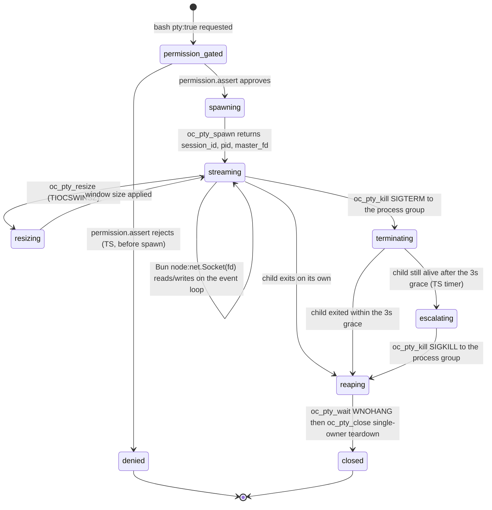

# Statechart: Native PTY Session Lifecycle and Dylib Load Ladder

This statechart models two lifecycles Feature 010 adds, as decided in
`../sdd/010-add-native-rust-ffi-layer-for-built-in-tools-and-pty/spec.md`
clarifications **C9-C12** (master-fd single-owner transfer, the TS-owned
session registry, controlling-terminal `setsid`, and the SIGTERM->3s->SIGKILL
escalation) and **C1-C2, C7, C14, C19** (discovery order, the opt-in Config
gate, the ABI handshake, the `native_unavailable` typed gap, and the win32
platform gate), and specified by FR8-FR13 (PTY spawn/lifecycle and the
TypeScript permission gate) and FR18-FR22 (transparent wrappers, silent
fallback, and platform support), matching `plan.md` "State and flow diagrams".

The PTY session lifecycle is never entered until the TypeScript permission
gate approves the spawn (FR13, C20); native code never evaluates, caches, or
bypasses that decision. The dylib load ladder runs once per crate per
process (cached) and is the shared discovery/handshake path both the six
filesystem/text tools and the PTY crate use before any call is native-served
(C1, C7, C8).

## PTY session lifecycle (FR8-FR13, C9-C12, C20)

### Notes

- **Permission gate first, spawn second (`[*]` -> `permission_gated`).**
  `bash.ts` calls `permission.assert` in TypeScript before any PTY
  allocation; a `pty: true` request never reaches `oc_pty_spawn` until the
  gate approves it, and native code holds no permission authority of its own
  (FR13, C20, AC15). A denial resolves directly to `denied`, an absorbing
  terminal state — no session, no fd, no registry entry is ever created.
- **Spawn establishes a real controlling terminal (`spawning` ->
  `streaming`).** `oc_pty_spawn` allocates the PTY through `portable-pty`,
  calls `setsid` so the child is a session leader with its own process group
  (`pgid == pid`), and makes the slave the controlling terminal, so the
  child observes `isatty() == true` on stdin/stdout/stderr and emits ANSI
  output (FR8, C11, AC8). `master_fd` transfers wholly to Bun on return —
  Rust does not retain, read, write, or close it afterward (C9).
- **Streaming stays off the FFI boundary (`streaming` -> `streaming`).**
  Async IO on `master_fd` runs entirely on Bun's event loop via
  `node:net.Socket({ fd })` with `O_NONBLOCK`; there is no FFI call on the
  IO hot path, so a long-running session streams while the agent stays
  responsive (FR10, NFR4, C9, AC10). `oc_pty_resize` applies `TIOCSWINSZ`
  without leaving `streaming`.
- **Kill signals the process group, TS drives the escalation (`streaming`
  -> `terminating` -> `escalating` -> `reaping`).** `oc_pty_kill` delivers
  exactly one signal to the child's process group (`killpg`) per call —
  never a loop inside Rust. The default flow sends `SIGTERM`; the
  **TypeScript side** schedules a `SIGKILL` escalation after a 3-second
  grace period mirroring `bash.ts` `forceKillAfter`, because phase 1 forbids
  an async runtime inside the FFI boundary (FR9, FR11, NFR5, C12, AC9). Both
  branches converge on `reaping` with no orphaned children.
- **Close is idempotent, single-owner (`reaping` -> `closed`).**
  `oc_pty_wait` performs a non-blocking `waitpid(WNOHANG)`; `oc_pty_close`
  then tears down the child/slave side and reaps, closing the master fd
  exactly once, by Bun, its sole owner — the TS registry
  (`session_id -> { pid, master_fd, pgid, stream }`) guarantees one close
  per fd, no double-free, no use-after-close (C9, C10, AC10). `closed` is
  absorbing; the registry entry is dropped on entry.

## Dylib load and fallback ladder (per crate, first use — C1, C2, C7, C14, C19)

```mermaid
stateDiagram-v2
    [*] --> check_platform

    check_platform --> fallback: win32 (loader never attempts dlopen)
    check_platform --> check_flag: darwin or linux

    check_flag --> fallback: experimental flag off (default)
    check_flag --> discover: experimental.nativeTools or experimental.nativePty is on

    discover --> resolve: env override then bundled packages/core/native/<platform>-<arch>/
    resolve --> fallback: no artifact found (library_missing)
    resolve --> dlopen: artifact found

    dlopen --> fallback: dlopen fails (dlopen_failed)
    dlopen --> handshake: symbols loaded

    handshake --> fallback: oc_abi_version mismatch (abi_mismatch)
    handshake --> native_ready: abi major matches

    native_ready --> [*]: cached; native serves this call and every later call
    fallback --> [*]: TypeScript path; native_unavailable gap recorded
```

### Notes

- **Platform gate first (`[*]` -> `check_platform`).** On `win32` the loader
  never attempts `dlopen`; native is treated as unavailable outright and
  every affected tool (and a `pty: true` bash invocation) runs through
  TypeScript, with `pty: true` degrading to the default
  `ChildProcess`/`AppProcess` path plus an advisory `native_unavailable` gap
  — never a hard failure (FR22, C19, AC13, AC16).
- **Config gate second (`check_platform` -> `check_flag`).** Native
  execution is off by default behind two Config booleans,
  `experimental.nativeTools` and `experimental.nativePty`; when a flag is
  `false`, presence of a compiled library changes nothing (FR19, C2, AC13).
- **Discovery order (`check_flag` -> `discover` -> `resolve`).** (1) an
  environment override — `OPENCODE_NATIVE_LIB_DIR` for the directory, or a
  per-crate `OPENCODE_TOOLS_FFI_PATH` / `OPENCODE_PTY_FFI_PATH` for an exact
  file; (2) the bundled `packages/core/native/<platform>-<arch>/` path;
  (3) neither present resolves to `fallback` with reason `library_missing`
  (FR21, C1).
- **Load and handshake (`resolve` -> `dlopen` -> `handshake`).** A found
  artifact is loaded via `dlopen`; a load failure resolves to `fallback`
  with reason `dlopen_failed` (FR21, AC14). A successful load calls
  `oc_abi_version()` / `oc_version()`; a major-version mismatch is treated
  as unloadable and resolves to `fallback` with reason `abi_mismatch` — a
  forward-compatible handshake for the phase-2 multi-session/ConPTY work
  without changing this contract (C7).
- **Terminal states are cached (`native_ready` / `fallback` -> `[*]`).**
  Backend selection is resolved once per crate per process (lazy `dlopen`,
  cached); every later call on that crate reuses the cached outcome without
  re-running the ladder. Every `fallback` terminal records a typed
  `native_unavailable` capability gap with a bounded reason label, mirroring
  the Feature 006 `milvus_unavailable` precedent — never a silent empty
  result and never a hard failure (FR18, FR19, C14, AC13, AC14, AC18).
