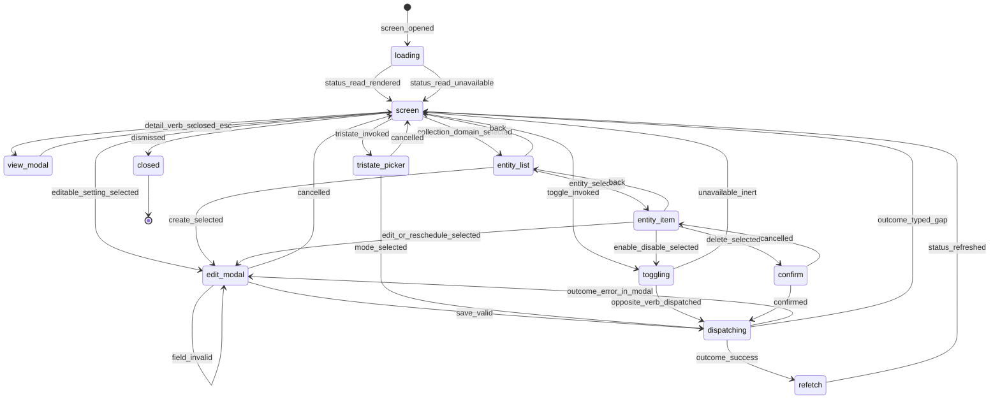

# Statechart: Operator CRUD Domain Screen

This statechart models the TUI screen lifecycle for the Feature 015 operator CRUD
redesign, as decided in
`../sdd/015-redesign-the-operator-tui-domain-screens-into-true-crud/spec.md`
(FR1-FR18) and
`../adr/0015-redesign-the-operator-tui-domain-screens-into-true-crud.md`, with the
composition/control ValueObjects in `../schemas/operator-crud-screens/`.

The screen runs on the existing Dialog push/back-stack. It is reached from the
**single** `Operator` palette entry — the flat suggested-row spread is removed and
the `suggest` machinery retired (FR1, FR2). On `screen_opened`, the screen issues
a **silent** status read through the same `executeOperatorCommand`/`OperatorClient`
loopback as slash/CLI and renders the result **inline** as a status section
(`key_value` for plain domains, the reused rich panel for
jobs/output/langlock/semantic/mcp) — never a toast (FR4, FR5). From the composed
screen, five interaction leaves are reachable: a **view modal** for a detail verb
(FR11), an **edit modal** pre-filled from the current value (FR9, FR10), a
**toggle** or **tri-state picker** control (FR7, FR8), and an **entity list** for
the collection domains (FR12-FR14). Every mutating leaf dispatches the SAME
canonical command id (FR17); on return, the screen **refetches** its status
section so the rendered state reflects the commit (FR6). An unavailable verb
(the Feature 014 per-verb `Partial` truth) renders marked + inert and surfaces the
typed envelope, never a fabricated success (FR15). A toast fires only for a
user-invoked mutation's final outcome (FR18). `back` unwinds the push/back-stack;
`closed` is the absorbing terminal state.



## Notes

- **Single entry (`[*]` -> `loading`).** `screen_opened` follows the one top-level
  `Operator` palette entry; the flat `View: Status …` suggested rows are removed
  and the `suggest` field/`listOperatorSuggestedEntries`/`operatorSuggestedEntries`
  path is retired (FR1, FR2). Row titles are unique and centralised in `palette.ts`
  (FR3).
- **Inline status, never a toast (`loading` -> `screen`).** The silent status read
  renders as a `StatusSection` on screen; `status_read_unavailable` renders the
  honest empty/typed-gap state inline, still not a toast (FR4, FR5, FR15). A silent
  read never flashes a toast (FR18).
- **View modal (`view_modal`).** A detail verb renders the effective payload as a
  structural `ViewTree`, read-only, closed on Esc — inside the interface, never a
  toast (FR5, FR11).
- **Edit modal funnel (`edit_modal`).** The modal pre-fills each field from a
  current-value read (no empty inputs), validates in place (`field_invalid` loops),
  and `save_valid` dispatches; a typed failure returns `outcome_error_in_modal` and
  surfaces the reason in the modal, not a toast (FR9, FR10, FR16, FR18).
- **Toggle and tri-state (`toggling`, `tristate_picker`).** A toggle dispatches the
  opposite verb of the current state; an unavailable backend is `unavailable_inert`
  and never dispatches (FR7, FR15). A tri-state control opens a picker pre-selected
  to the current mode and dispatches the selected mode's verb — never a binary
  toggle (FR8).
- **Entity CRUD (`entity_list`, `entity_item`, `confirm`).** The collection domains
  (jobs, semantic providers/models, mcp servers) list rows that drill into per-entity
  actions — edit/reschedule (edit modal), enable/disable (toggle), delete (confirm),
  create (edit modal from the list) (FR12-FR14). `run-now`, Milvus index ops, and
  unreachable ops render as marked typed gaps (FR15).
- **Refetch after mutation (`dispatching` -> `refetch` -> `screen`).** Every
  successful mutation refreshes the status section so the screen reflects the
  commit; a `version_conflict` or typed gap keeps the prior state and surfaces the
  typed reason (FR6, FR15).
- **Parity invariant.** Every dispatch leaf invokes the same command id through the
  same `executeOperatorCommand`/`OperatorClient` loopback as slash/CLI, producing
  the same result, version, and audit (FR17). No transition introduces a new
  dispatch path, catalog id, or catalog version bump.
- **Stack unwind.** `back`, `cancelled`, and `closed_esc` mirror the Dialog
  push/back-stack; they never mutate state. `dismissed` closes the dialog from the
  screen.
```
