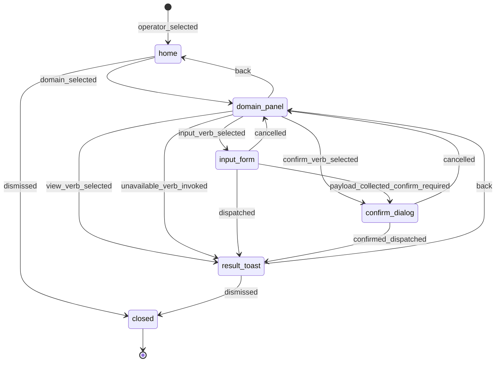

# Statechart: Grouped Operator Menu Navigation

This statechart models the TUI navigation for the Feature 011 grouped operator
control plane, as decided in
`../sdd/011-restructure-the-operator-control-plane-tui-from-a-flat/spec.md`
(FR1-FR8) and `../adr/0011-restructure-the-operator-control-plane-tui-from-a-flat.md`,
with the node/verb ValueObjects in `../schemas/operator-menu/navigation.cue`.

The navigation runs on the existing Dialog push/replace stack. `home` is the
initial group list of all 12 reserved domains (FR2), reached from the single
`Operator` palette entry (FR1). Selecting a domain pushes `domain_panel` — the
View section (read-only queries) plus the Configure section (mutations) (FR3).
From a panel, three leaf surfaces are reachable: `result_toast` (a query result
or the typed `unavailable` envelope, FR6, FR7), `confirm_dialog` (a
confirm-required mutation, FR3), and `input_form` (a mutation that collects a
typed payload, FR5). Every dispatch leaf invokes the SAME canonical command id
through the SAME `OperatorClient` loopback as slash/CLI (FR8) — no new dispatch
path. `back` transitions unwind the push/replace stack; `closed` is the absorbing
terminal state when the dialog is dismissed.



## Notes

- **Single entry (`[*]` -> `home`).** The `operator_selected` transition is the
  one top-level `Operator` palette entry; the flat per-verb rows are removed from
  the top level (FR1). A curated read-only `suggest` set may still surface as quick
  access but is not modeled as a navigation node.
- **View vs Configure split.** `view_verb_selected` targets a read-only query
  (`mutates=false`); `confirm_verb_selected` and `input_verb_selected` target
  mutations (`mutates=true`). Confirm-required (`requiresConfirmation`) and
  secret-bearing (`isOperatorSecretMutationId`) verbs are marked in the row (FR3).
- **Editable form funnel.** `input_form` collects a `value_picker` or `text_input`
  payload (FR5). If the verb is also confirm-required, `payload_collected_confirm_required`
  routes through `confirm_dialog` before dispatch; otherwise `dispatched` fires the
  command with the payload directly.
- **Honest availability.** `unavailable_verb_invoked` routes straight to
  `result_toast`, which surfaces the typed `unavailable`/`not_implemented` envelope
  and never implies persistence (FR7). Only `langlock`, `jobs`, `routing`,
  `process`, and `task` verbs reach a persisting dispatch today.
- **Parity invariant.** Both dispatch leaves (`dispatched`, `confirmed_dispatched`)
  invoke the same command id through the same `OperatorClient` loopback as slash and
  CLI, producing the same result, version, and audit record (FR8). No transition
  introduces a new dispatch path.
- **Stack unwind.** `back` transitions mirror the Dialog push/replace stack; they
  never mutate state. `dismissed` closes the dialog from `home` or `result_toast`.
```
