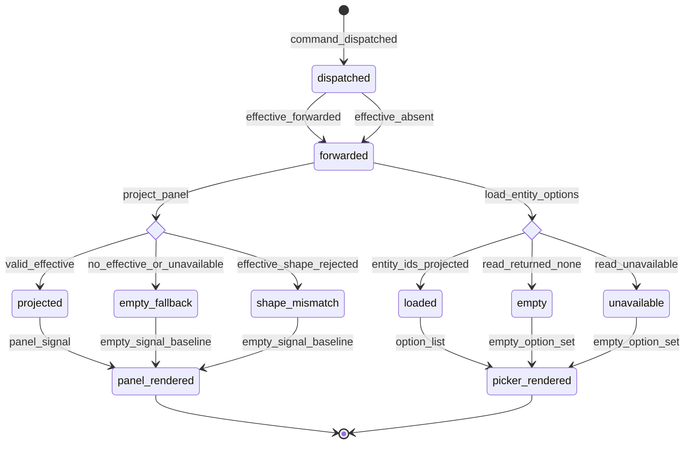

# Statechart: Operator Structured-Result Projection

This statechart models how the Feature 012 TUI consumes the Feature 007 typed
`CommandResult.effective` payload, as decided in
`../sdd/012-expose-the-structured-operator-command-result-through-the/spec.md`
(FR1-FR9) and `../adr/0012-expose-the-structured-operator-command-result-through-the.md`,
with the ValueObjects in `../schemas/operator-result-signal/`.

The structured result rides the SAME `OperatorSlashPort.tryHandle` return on the
SAME `OperatorClient` loopback as slash/CLI (FR9) — no new dispatch path. It is
forwarded at the inbound adapter seam (FR1), carried on `OperatorSlashHandled`
(FR2), and returned by `executeOperatorCommand` (FR3). From there a pure per-domain
projection resolves the payload into a panel signal, and a picker loader resolves a
read query into entity options. Every projection is total: an absent `effective`,
a typed unavailable envelope, or a mismatched shape all degrade to the honest empty
signal — the projection never throws and never fabricates rows (FR4, FR6, FR8). It
mirrors the projection style of `operator-menu-navigation.md`.



## Notes

- **Forward at the seam (`dispatched` -> `forwarded`).** The inbound adapter widens
  the SAME `tryHandle` return with the typed `outcome`, the optional `effective`,
  and the `version` (FR1); `OperatorSlashHandled` and `executeOperatorCommand`
  carry them downstream (FR2, FR3). `effective_absent` is a normal transition, not
  an error (FR2).
- **Panel projection is total.** `project_panel` resolves to exactly one
  `#ProjectionOutcome`: `projected` (a valid effective payload → the domain
  `*PanelSignal`), `empty_fallback` (no payload or a typed unavailable envelope), or
  `shape_mismatch` (effective present but not the expected shape). Both non-`projected`
  outcomes render the domain `EMPTY_*_SIGNAL` baseline; the projection never throws
  (FR4, FR5, FR8).
- **Picker projection is total.** `load_entity_options` issues the domain read
  (`jobs.list`, `process.tree`, `task.tree`) on the SAME dispatch path (FR6). It
  resolves to `loaded` (entity ids projected into `#PickerOption` values), `empty`
  (the read returned no entities), or `unavailable` (a typed unavailable envelope /
  no effective). `empty` and `unavailable` both render the honest empty option set;
  no candidate is fabricated (FR6, FR8).
- **Honest availability.** `langlock` reads and `jobs.list`/`jobs.status` reach
  `projected`/`loaded` today; `output`, `semantic`, and `mcp` reads reach
  `empty_fallback`/`unavailable` until their backends land (a later backend feature). The UI
  never implies a fetch that did not occur (FR8).
- **Parity invariant.** Both projections consume a result produced by the same
  command id through the same `OperatorClient` loopback as slash/CLI (FR9). No
  transition introduces a new dispatch path, registry, or divergent command name.
- **Redaction preserved.** The `effective` payload is already the bounded, redacted,
  versioned operator-surface projection; the projections reshape it into the panel
  signal without widening or de-redacting it (Security).
```
