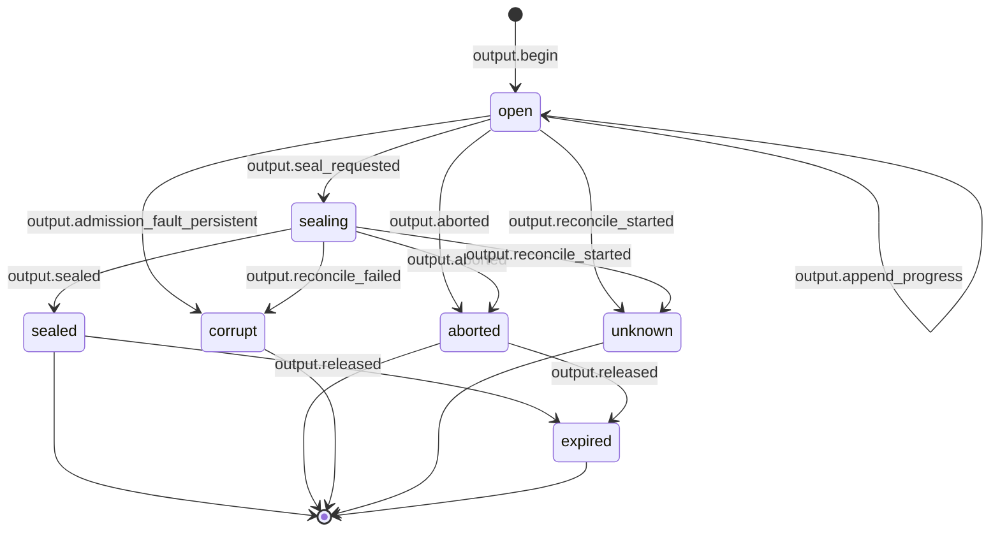

# Statechart: OutputGroup Channel Lifecycle and Settlement

This statechart models the OutputGroup channel lifecycle and its settlement
seam to Feature 002, as decided in
`../sdd/005-add-a-canonical-file-backed-outputspool-and-paged/spec.md`
clarifications **C12** (FS<->SQLite crash reconciliation), **C13** (terminal
settlement ordering with Feature 002), and **C20** (native contract state
machine and event vocabulary durable/live split), and specified by FR18-FR27
(native contract, state machine, lifecycle settlement) and the lifecycle in
`../sdd/005-add-a-canonical-file-backed-outputspool-and-paged/plan.md`
(section "State machines").

A channel opens on `begin`, absorbs bounded-queue appends while `open`, and
moves to `sealing` on a seal request before settling to `sealed`. `abort`
preserves committed bytes; a persistent admission fault (C4) or a failed
reconciliation reaches `corrupt`; recovery of an indeterminate extent reaches
`unknown`; a released or TTL-elapsed group reaches `expired`. `sealed`,
`aborted`, `corrupt`, `expired`, and `unknown` are terminal for the
generation (FR19, C20). The committed-length authority in the control store
never reports a silent empty-success: when the filesystem data extent is at
least the committed length the group recovers as `sealed`/`open`; when it is
shorter, or the seal record is absent after committed appends, the group
recovers as `corrupt` or `unknown` (FR25, C12, AC8, AC9).

## Notes

- **Open (`[*]` -> `open`).** `output.begin` mints the `OutputRef` for a
  channel generation scoped to process/attempt/generation; the producer that
  owns the Feature 002 process is the sole writer (FR2, FR14, FR38, C21). A
  new attempt/generation never overwrites a prior generation's committed
  content (stale-generation fencing, FR14, FR27, C18, AC11).
- **Bounded append (`open` -> `open`).** Appends flow producer -> bounded
  queue -> batched async writer at the expected byte offset; there is no
  filesystem write per token/delta (FR6-FR9, C2). `output.append_progress` is
  a live (non-durable) signal that MAY be dropped under `allBounded` load
  without affecting durable seal/read (C20).
- **Seal commits finality (`open`/`sealing` -> `sealed`).** `output.seal_requested`
  moves the generation to `sealing`; `output.sealed` commits finality of
  committed bytes once the control-store committed-length authority and the
  filesystem extent agree (FR24, C12). `output.sealed` is durable and
  registers via `EventV2.define` into the durable manifest (C20).
- **Abort preserves bytes (`open`/`sealing` -> `aborted`).** `output.aborted`
  stops further append while preserving already-committed bytes for
  authorized read, including root-tree Ctrl+C cancel (FR24, FR26, C20).
- **Persistent admission fault or failed reconciliation (-> `corrupt`).** A
  degrade-then-fence admission fault (ENOSPC, fd exhaustion, quota,
  permission, sustained latency) that persists past the bounded window, or a
  seal that fails after data loss, reaches `corrupt` while never reporting
  lost bytes as sealed success (FR10, FR24, C4, AC6, AC7).
- **Indeterminate recovery (-> `unknown`).** `output.reconcile_started`
  begins committed-length reconciliation; when the filesystem extent cannot
  be conclusively matched against the control-store committed length the
  group resolves to `unknown` with bounded recovery, never silent
  empty-success (FR25, C12, AC8, AC9).
- **Expiry (`sealed`/`aborted` -> `expired`).** `output.released` reflects
  either an explicit `release`/`cleanup` reclaim or TTL elapse once the
  reference-graph evaluator finds no live lease, no active reader/writer, no
  inbound reference edge, and no legal/privacy hold (FR28-FR30, C5, AC16,
  AC17).
- **Never silent empty-success.** Every terminal state other than `sealed`
  makes the fault or indeterminate condition observable rather than reporting
  success; the committed-length authority is the single source of truth for
  recovery (FR25, C12).

## Settlement flow with Feature 002 (C13)

Feature 002 owns lifecycle terminal status; Feature 005 owns content-plane
settlement. A terminal status never precedes settlement without an
intermediate `settling` reconciliation state; the parent observes
sealed/aborted refs or an explicit settling/unknown/corrupt condition (FR23,
AC9).

```mermaid
stateDiagram-v2
    [*] --> running: producer appends to its OutputGroup
    running --> settling: producer requests terminal (seal/abort begins)
    settling --> settled_sealed: channels sealed or aborted; OutputRef committed
    settling --> settled_unknown: crash reconciliation indeterminate
    settling --> settled_corrupt: committed-length reconciliation fails
    settled_sealed --> terminal: Feature 002 records terminal status
    settled_unknown --> terminal: parent observes unknown condition
    settled_corrupt --> terminal: parent observes corrupt condition
    terminal --> [*]
```

- **Ownership boundary preserved.** This settlement flow fixes only ordering
  and crash reconciliation; it does not move Feature 002's terminal-status
  ownership or Feature 005's content-plane settlement ownership (FR23, C13).
- **No terminal-before-settlement.** Feature 002 records `terminal` only
  after observing `settled_sealed`, `settled_unknown`, or `settled_corrupt`
  — never before an intermediate `settling` state (FR23, AC9).
