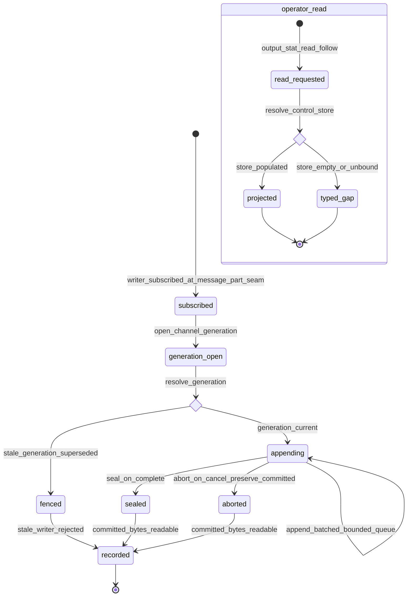

# Statechart: OutputSpool Production Writer and Operator Read

This statechart models the OutputSpool production writer lifecycle introduced by
Feature 017, as decided in
`../sdd/017-close-the-implementable-operator-capability-gaps-so-the/spec.md`
(FR6-FR10) and
`../adr/0017-close-the-implementable-operator-capability-gaps-so-the.md`, with the
ValueObjects in `../schemas/operator-capability-gaps/spoolwriter.cue`.

Feature 005 shipped the full `outputspool/` machinery
(`createChannelWriter`, `file-sink-writer.ts:139`) but a grep confirms **no
production caller** ever populated the spool, so the operator reads an empty
`operator-control.db` (`stack-live.ts:413-428`). Feature 017 subscribes a
**production writer** at the session message-part seam
(`session/message-v2.ts` `PartUpdated`/`PartDelta`), drives `createChannelWriter`
per channel generation, and writes to the SAME control store the operator reads —
so `output.stat`/`read`/`follow` reflect real session output. The writer honors
the Feature 005 producer ownership (C21), content-free events (C22), bounded
memory, and stale-generation fencing (the `fenced` reject), and seals or aborts on
cancel preserving committed bytes. The `release`/`delete`/`purge` admin edge
commits through a store-scoped authority — the settled token is the control-store
generation, never a fabricated config CAS version (FR9). It mirrors the projection
style of `config-roundtrip.md`.



## Notes

- **Subscribe at the message-part seam (`subscribed`).** The production writer
  subscribes to the session `PartUpdated`/`PartDelta` bus
  (`session/message-v2.ts`); the producer that owns a Feature 002 Process owns its
  OutputGroup (Feature 005 C21). No content byte is ever carried on an event —
  events stay content-free and secret-free (C22); content leaves the content plane
  only as an authorized paged `output.read` (FR6, FR10).
- **Fence gate (`generation_open` -> `fenced` | `appending`).** Each append/seal is
  fenced by the channel generation; a superseded (stale) generation is rejected —
  the `fenced` terminal — so a stale writer cannot corrupt a live generation
  (Feature 005 stale-generation fencing, FR10).
- **Bounded appending (`appending`).** Appends flow through the Feature 005
  bounded per-writer queue and batched async writer; memory growth is O(queue +
  page), not O(total output). A slow follower sees backpressure/`eof`, never
  blocking the writer (FR8, FR10).
- **Seal / abort on cancel (`sealed` | `aborted`).** A completed generation seals;
  a cancel aborts while preserving committed bytes so a reader still reads through
  committed end (Feature 005, FR10).
- **Operator read (`operator_read`).** With the store populated, `output.stat`/
  `read`/`follow` project real output over `control-store.ts` + `page-reader.ts`;
  an empty or unbound store degrades to the typed `unavailable` gap — never a
  fabricated read (FR7, FR8, FR18).
- **Admin edge (out of the main flow).** `output.release`/`delete`/`purge` commit
  through a store-scoped authority via the `mutation_plan` contract; the `apply`
  performs the control-store op and the mutation emits the Feature 007 EventV2
  audit correlation, but the settled version is the control-store generation, NOT
  a config CAS version — preserving the audit and no-phantom-write invariants
  (FR9, FR18).
- **Parity invariant.** Every read and admin op rides the same command id through
  the same `OperatorClient` loopback; it introduces no new dispatch path,
  registry, or divergent command name, and adds no catalog id or version (FR17).
```
