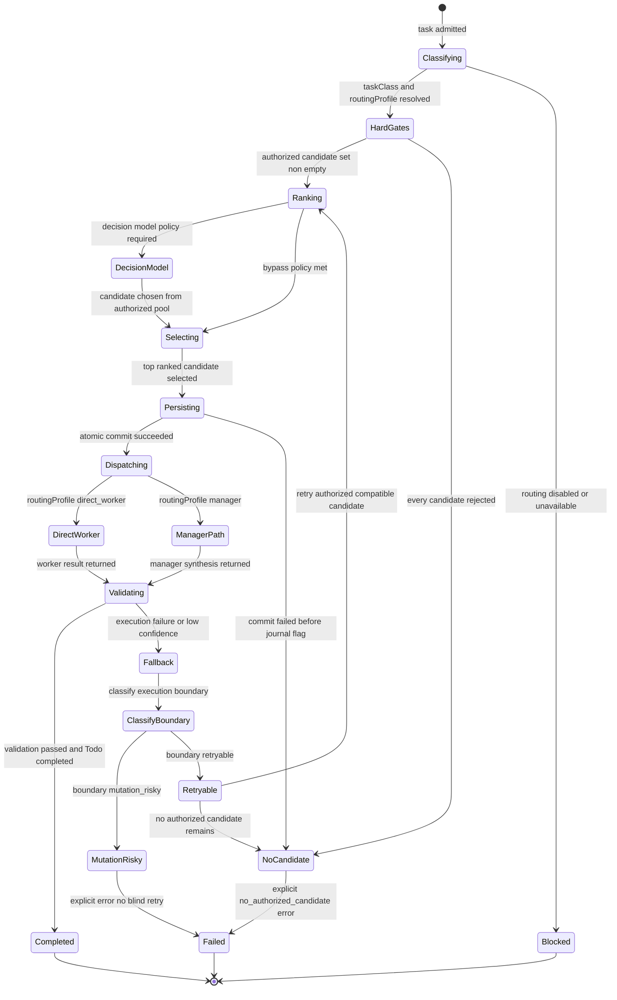

# Statechart: Smart Routing Decision Lifecycle

This statechart models the lifecycle of a single smart-routing decision, from
task admission through classification, hard gates, ranking, persistence,
hierarchical dispatch, and fallback. It is the state-machine view of the
pipeline in `../sdd/001-define-one-cohesive-smart-agent-routing-and-opentelemetry/plan.md`
(section "State machines") and the flow diagrams in
`../sdd/001-define-one-cohesive-smart-agent-routing-and-opentelemetry/hierarchy-flow.md`.

Hard gates are authoritative over any decision-model recommendation. Ranking
selects only from the authorized candidate set. A decision commits atomically
before dispatch, and fallback classifies the execution boundary so a
mutation-risky candidate is never blindly retried.

