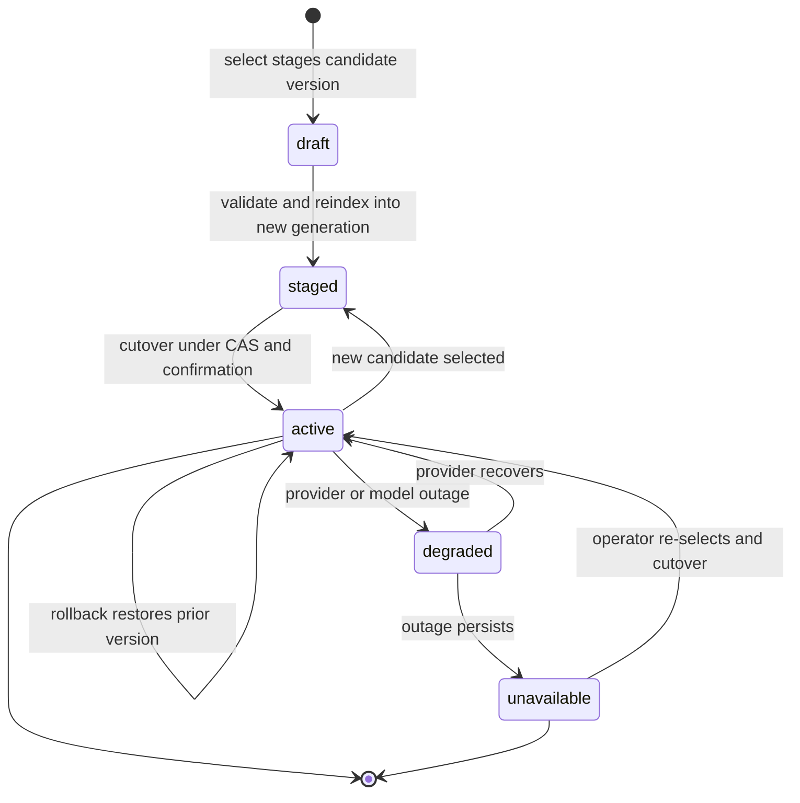
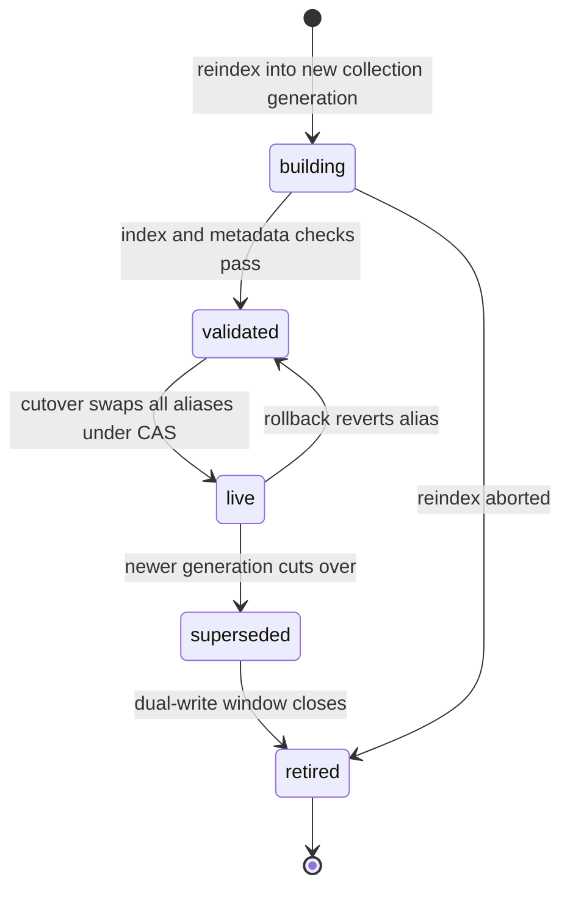
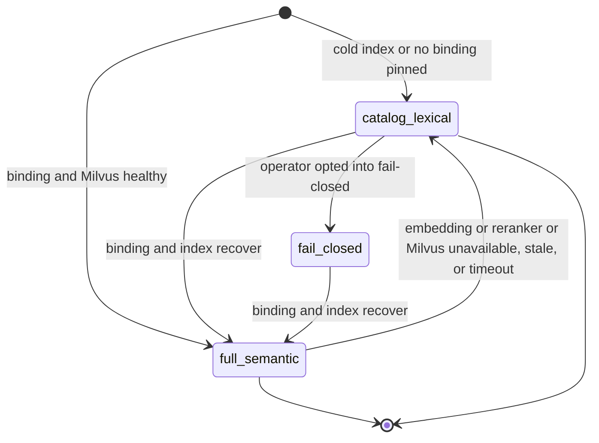

# Statechart: Semantic Model Binding and Index Generation Lifecycle

This statechart models the `SemanticModelBinding` lifecycle with blue/green
cutover, the paired index-generation lifecycle, and the degradation ladder
that overlays both, as decided in
`../sdd/006-add-milvus-backed-multilingual-semantic-retrieval-and/spec.md`
clarifications **C12** (blue/green alias naming, cutover UX, and in-flight
retention) and **C14**/**C20** (cold-start policy and the typed degradation
ladder with no silent substitution), and specified by FR12 (binding-with-
collection metadata), FR24-FR27 (V1 default degradation), FR31-FR32 (binding
immutability, select/reindex/cutover/rollback semantics), and the lifecycle
in
`../sdd/006-add-milvus-backed-multilingual-semantic-retrieval-and/plan.md`
(section "State machines").

`select` stages a candidate `draft` binding version without activating the
live alias; `validate` and — for an embedding dimension or vector-space
change — `reindex` into a new collection generation move it to `staged`;
only the explicit `cutover` under CAS and operator confirmation activates it
to `active` (FR32, C12). A provider or model outage degrades an `active`
binding to `degraded` and then `unavailable`; the system NEVER auto-selects
another embedding or reranker model on outage (FR24, FR31). `rollback`
restores a superseded version to `active`. Reranker cutover follows the
same `draft -> staged -> active` shape without a reindex step, since no
re-embedding runs by default (FR32).

## Notes

- **Select stages a draft (`[*]` -> `draft`).** `select` stages a candidate
  binding version for the `embedding` or `reranker` slot without activating
  the live alias; model/router/LLM/agent/plugin/MCP MUST NOT call `select`
  or any other binding mutation (FR6, FR28, FR31).
- **Validate and reindex (`draft` -> `staged`).** `validate` runs the native
  deterministic probe/eval for the candidate; an embedding dimension or
  vector-space change additionally requires a full blue/green `reindex` into
  a new Milvus collection generation before the binding is `staged` — the
  old alias remains active throughout (FR12, FR32, C12).
- **Cutover activates (`staged` -> `active`).** `semantic.embedding.cutover`
  or `semantic.reranker.cutover` is the explicit native operation that
  atomically switches the live alias under CAS and interactive operator
  confirmation; `select`, `validate`, and `reindex` alone NEVER activate the
  live alias (FR32, C12, C15).
- **Outage degrades, never substitutes (`active` -> `degraded` -> `unavailable`).**
  A provider or model outage moves an active binding to `degraded` and, if
  the outage persists, to `unavailable`; retrieval falls back to the
  degradation ladder below with an explicit degraded reason. The system has
  no automatic fallback pool for the embedding or reranker slot in V1 and
  never auto-selects another model (FR24, FR31, C20).
- **Recovery and rollback.** A recovered provider returns `degraded` to
  `active` without re-selection; an operator re-select plus cutover restores
  an `unavailable` binding to `active`; `rollback` under policy restores a
  superseded version to `active` without re-embedding by default for the
  reranker slot (FR32).
- **In-flight version pinning.** An in-flight Task captures the binding
  versions effective at Task start and keeps them for its duration; a
  cutover or rollback that runs mid-task never changes the version already
  captured, and only Tasks started after the swap observe the new version —
  there is no mid-task switch (FR32).

## Index generation lifecycle (C12)

An index generation is `building` during blue/green reindex, `validated`
once index and metadata checks pass, `live` after the atomic alias swap
that moves every collection in the binding generation together
(`agents`, `skills`, `skill_chunks`, and the Feature 009 `tools` extension
point never split across generations), `superseded` when a newer generation
cuts over, and `retired` after the dual-write window closes (FR12, C12,
C21).

- **One CAS, every collection together.** Cutover swaps the aliases of
  every collection in the binding generation under one compare-and-swap, so
  the `tools` collection reserved for Feature 009 never splits from
  `agents`/`skills`/`skill_chunks` on the same generation (FR12, C6, C12,
  C21).
- **Retirement is bounded.** A `superseded` generation retires only after
  the dual-write window closes; an aborted `building` reindex retires
  directly without ever reaching `live`, so a failed reindex never leaves a
  half-built generation reachable by search (FR12, C12).

## Degradation ladder overlay (C14, C20)

Retrieval runs at `full_semantic` only while the pinned binding is `active`
and Milvus is healthy. A pinned embedding or reranker outage (the binding
lifecycle's `degraded`/`unavailable` states above), a Milvus or index
outage, staleness, or a timeout drops retrieval to `catalog_lexical` with a
typed capability-gap code (for example `milvus_unavailable`,
`embedding_unavailable`, `no_binding_pinned`); an empty or cold index, or no
pinned binding at all, starts at `catalog_lexical` rather than forcing
configuration (FR24, C14). The system never auto-selects another embedding
or reranker model; recovery of the binding lifecycle above returns
retrieval to `full_semantic`. `fail_closed` is reachable only when the
operator has explicitly opted into fail-closed semantic retrieval.

- **The floor is catalog plus lexical, not "full tool set".** The routing
  floor for agent/skill retrieval is the deterministic catalog plus
  lexical/rules path; a wider "full tool set" floor is Feature 009's
  tool-search concern, not this binding's (C20).
- **Degradation is always explicit.** Every transition into
  `catalog_lexical` or `fail_closed` carries a stable capability-gap code
  and an explicit degraded reason; there is no silent empty result and no
  automatic substitution of a different embedding or reranker model (FR24,
  C1, C20).
