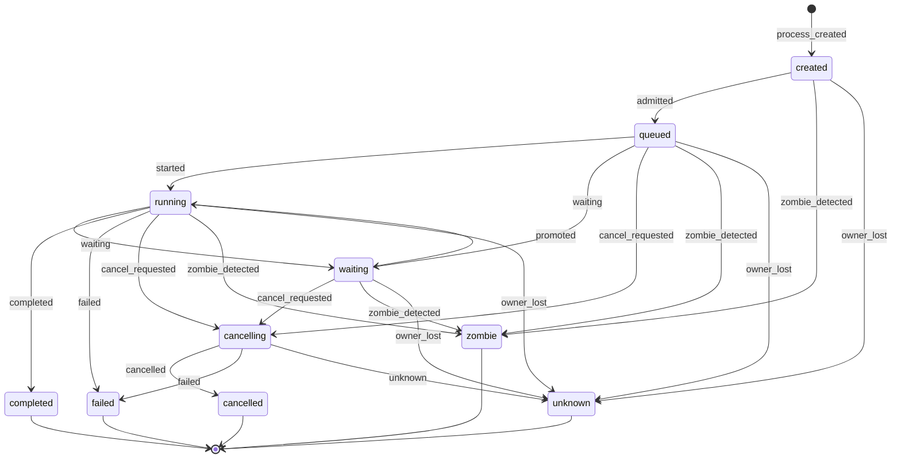

# Statechart: Task Process Lifecycle

This statechart models the ten permitted Process Table states and their legal
transitions for one observable process attempt (`task_id` + `process_id`), as
decided in `../sdd/002-build-an-event-driven-asynchronous-task-lifecycle-engine/spec.md`
clarification **C7** and specified by FR20 (event vocabulary), FR25 (Process
Table state set), and the admission/cancellation flows in
`../sdd/002-build-an-event-driven-asynchronous-task-lifecycle-engine/plan.md`
(section "State machines").

`handoff` is a lifecycle event, never a Process Table state: a handoff is
projected onto the current state without altering it. `completed`, `failed`,
`cancelled`, `zombie`, and `unknown` are absorbing terminal states, except for
bounded retention cleanup (FR27). Every transition below is labeled by the
lifecycle event from the 26-member vocabulary (FR20) that triggers it;
`zombie_detected` and `owner_lost` are published by the shared bucketed
watchdog (C12) without claiming that a provider or external tool has stopped,
and `reconciled` is an explicit versioned outcome (C13) that confirms — but
never regresses — an absorbing terminal state.

## Notes

- **Admission gate (`created` → `queued`).** The `admitted` event carries
  requested-versus-granted fanout under the per-scope token-bucket admission
  controller (C11); partial admission still emits `admitted` and the row still
  reaches `queued`.
- **Waiting/running oscillation.** `waiting` ↔ `running` reflects backpressure
  or dependency blocking during execution, not cancellation; the `waiting` and
  `promoted` events are live (non-durable) per C4.
- **Cancellation funnel.** Every non-terminal state routes through
  `cancelling` on `cancel_requested` before reaching an outcome
  (`cancelled`, `failed`, or `unknown`), matching the cancel-outcome semantics
  in C17: `requested`, `accepted`, `rejected`, `unknown`, and `unconfirmed`.
- **Zombie and owner-loss detection.** Any non-terminal state may transition to
  `zombie` (lease expiry with an absent heartbeat) or `unknown` (owner
  disconnected without a claim of provider termination) per C12; no automatic
  retry or re-execution of the process's effects follows (FR40).
- **`reconciled` does not appear as an edge.** It is a durable audit event
  (C4) published when explicit versioned reconciliation confirms a row already
  in an absorbing terminal state (`zombie`/`unknown`/`completed`/`failed`/
  `cancelled`); it never regresses a state or invents a new one (FR29, C13).
- **Bounded retention only.** The `[*]` exits from `completed`, `failed`,
  `cancelled`, `zombie`, and `unknown` represent bounded, auditably counted
  retention cleanup (FR27, AC15), not an application transition.
