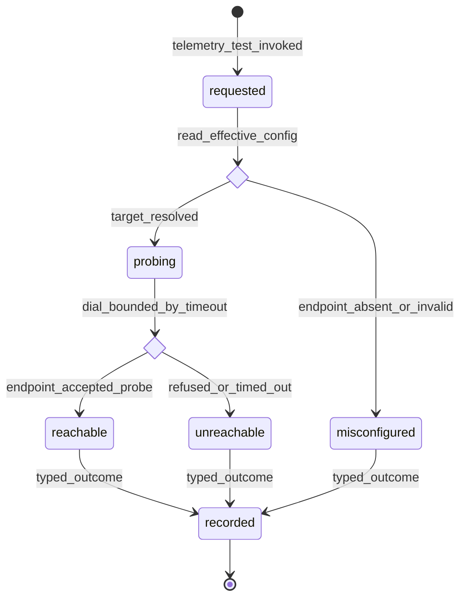

# Statechart: Telemetry Export Reachability Probe

This statechart models the `telemetry.test` OTLP reachability probe introduced by
Feature 013, as decided in
`../sdd/013-wire-the-four-remaining-config-backed-operator-domains-so/spec.md`
(FR6, FR10) and
`../adr/0013-wire-the-four-remaining-config-backed-operator-domains-so.md`, with
the ValueObjects in `../schemas/operator-config-domains/probe.cue`.

The probe is a real, environment-agnostic connectivity check against the
configured OTLP export endpoint — `http/protobuf` posts a minimal payload to
`<endpoint>/v1/metrics`; `grpc` dials the endpoint over TCP — bounded by a
timeout, returning a typed `#ProbeOutcome` (`reachable` | `unreachable` |
`misconfigured`). It is **test-signal only** (Feature 007 FR30): it sends no
telemetry signal content beyond the probe, it never mutates the effective config,
and it never blocks the operator loop — a timeout resolves to `unreachable`
rather than hanging. The user's real Alloy stack (OTLP `4317` gRPC / `4318` http,
no auth/TLS) is one valid target; an integration test MAY substitute a local mock
collector. It mirrors the projection style of `operator-result-projection.md`.



## Notes

- **Config gate first (`requested` -> `misconfigured` | `probing`).** The probe
  reads the effective telemetry config over the SAME Config.Service authority the
  domain port binds. When no endpoint is configured, or the configured endpoint
  is malformed, the probe resolves `misconfigured` without dialing anything — no
  network I/O on an unconfigured domain (FR6).
- **Bounded dial (`probing` -> `reachable` | `unreachable`).** The dial is bounded
  by an explicit timeout. `http/protobuf` posts a minimal/empty payload to
  `<endpoint>/v1/metrics` (or a reachability HEAD/TCP check); `grpc` dials the
  endpoint over TCP. A 2xx / accepted handshake resolves `reachable`; a refused
  connection, TLS failure, or timeout resolves `unreachable` — the probe never
  hangs the loop (FR6, FR10).
- **Test-signal only, content-free (all outcomes -> `recorded`).** The probe
  sends no telemetry signal content beyond the minimal reachability payload,
  mutates nothing, and records a typed `#ProbeResult` (outcome, target, optional
  bounded reason). It carries no endpoint credentials, header value, or payload
  fragment in its result (Feature 007 FR30, Security).
- **Honest availability.** `telemetry.test` is a real mutation-catalog verb but a
  read-only probe; it degrades to `misconfigured`/`unreachable` rather than
  implying a healthy export that did not occur (FR8).
- **Parity invariant.** The probe rides the same command id through the same
  `OperatorClient` loopback as slash/CLI; it introduces no new dispatch path,
  registry, or divergent command name (FR11).
```
